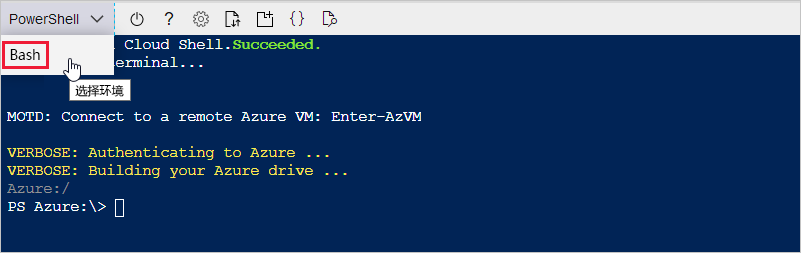
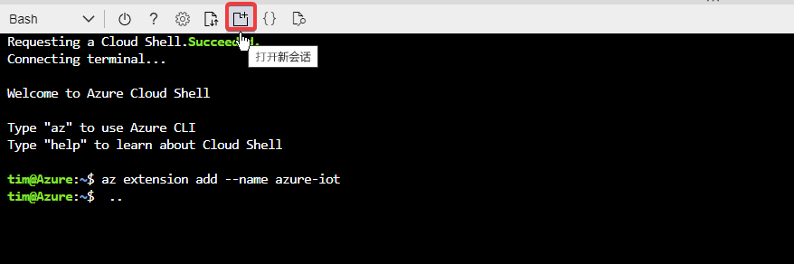
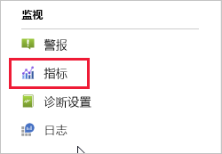
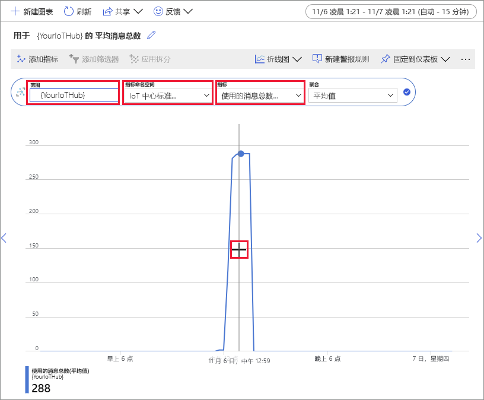

# <a name="quickstart-send-telemetry-from-a-device-to-an-iot-hub-and-monitor-it-with-the-azure-cli"></a>快速入门：将遥测数据从设备发送到 IoT 中心并使用 Azure CLI 监视该数据

[!INCLUDE [iot-hub-quickstarts-1-selector](../../includes/iot-hub-quickstarts-1-selector.md)]

IoT 中心是一项 Azure 服务，用于将大量遥测数据从 IoT 设备引入云中进行存储或处理。 在本快速入门中，你将使用 Azure CLI 创建 IoT 中心和模拟设备、将设备遥测数据发送到中心，以及发送云到设备的消息。 还将使用 Azure 门户可视化设备指标。 这是一个基本工作流，适用于使用 CLI 与 IoT 中心应用程序交互的开发人员。

## <a name="prerequisites"></a>先决条件
- 如果还没有 Azure 订阅，可以在开始前[创建一个免费帐户](https://azure.microsoft.com/free/?WT.mc_id=A261C142F)。
- Azure CLI。 可以使用 Azure Cloud Shell（即在浏览器中运行的交互式 CLI Shell）运行本快速入门中的所有命令。 如果使用 Cloud Shell，则无需安装任何内容。 如果希望在本地使用 CLI，则本快速入门需要 Azure CLI 2.0.76 版或更高版本。 若要查找版本，请运行 az --version。 若要安装或升级，请参阅[安装 Azure CLI]( /cli/azure/install-azure-cli)。

## <a name="sign-in-to-the-azure-portal"></a>登录到 Azure 门户
通过 https://portal.azure.com 登录到 Azure 门户。

无论是在本地还是在 Cloud Shell 中运行 CLI，请让门户在浏览器中保持打开状态。  本快速入门后面会用到它。

## <a name="launch-the-cloud-shell"></a>启动 Cloud Shell
在本部分中，启动 Azure Cloud Shell 的实例。 如果在本地使用 CLI，请跳到[准备两个 CLI 会话](#prepare-two-cli-sessions)部分。

若要启动 Cloud Shell，请执行以下操作：

1. 选择 Azure 门户右上方菜单栏中的“Cloud Shell”  按钮。 

    

    > [!NOTE]
    > 如果这是你第一次使用 Cloud Shell，系统会提示你创建使用 Cloud Shell 所需的存储。  选择用于创建存储帐户和 Microsoft Azure 文件共享的订阅。 

2. 在“选择环境”下拉列表中选择首选 CLI 环境  。 本快速入门使用 Bash 环境  。 以下所有 CLI 命令也在 Powershell 环境中工作。 

    

## <a name="prepare-two-cli-sessions"></a>准备两个 CLI 会话

在本部分中，准备两个 Azure CLI 会话。 如果使用 Cloud Shell，将在单独的浏览器选项卡中运行这两个会话。 如果使用本地 CLI 客户端，将运行两个单独的 CLI 实例。 使用第一个会话作为模拟设备，并使用第二个会话来监视和发送消息。 若要运行命令，请选择“复制”以复制本快速入门中的代码块，将其粘贴到 shell 会话中，然后运行它  。

Azure CLI 要求你登录到 Azure 帐户。 Azure CLI Shell 会话与 IoT 中心之间的所有通信都经过身份验证和加密。 因此，本快速入门不需要将用于实际设备的额外身份验证（如连接字符串）。

*  运行 [az extension add](https://docs.microsoft.com/cli/azure/extension?view=azure-cli-latest#az-extension-add) 命令将用于 Azure CLI 的 Microsoft Azure IoT 扩展添加到 Cloud Shell。 IoT 扩展会将 IoT 中心、IoT Edge 和 IoT 设备预配服务 (DPS) 特定的命令添加到 Azure CLI。

   ```azurecli
   az extension add --name azure-iot
   ```
   
   安装 Azure IOT 扩展后，无需在任何 Cloud Shell 会话中再次安装。 

   [!INCLUDE [iot-hub-cli-version-info](../../includes/iot-hub-cli-version-info.md)]

*  打开第二个 CLI 会话。  如果使用 Cloud Shell，请选择“打开新会话”  。 如果在本地使用 CLI，请打开第二个实例。 

    >[!div class="mx-imgBorder"]
    >

## <a name="create-an-iot-hub"></a>创建 IoT 中心
在本部分中，使用 Azure CLI 创建资源组和 IoT 中心。  Azure 资源组是在其中部署和管理 Azure 资源的逻辑容器。 IoT 中心充当中央消息中心，用于 IoT 应用程序与设备之间的双向通信。 

> [!TIP]
> （可选）可以通过使用 [Azure 门户](iot-hub-create-through-portal.md)、[Visual Studio Code](iot-hub-create-use-iot-toolkit.md) 或其他编程方法来创建 Azure 资源组、IoT 中心和其他资源。  

1. 运行 [az group create](https://docs.microsoft.com/cli/azure/group?view=azure-cli-latest#az-group-create) 命令创建资源组。 以下命令在“eastus”  位置创建名为“MyResourceGroup”的资源组  。 

    ```azurecli
    az group create --name MyResourceGroup --location eastus
    ```

1. 运行 [az iot hub create](https://docs.microsoft.com/cli/azure/iot/hub?view=azure-cli-latest#az-iot-hub-create) 命令创建 IoT 中心。 创建 IoT 中心可能需要数分钟的时间。 

    *YourIotHubName*。 将下面的占位符替换为你为 IoT 中心选择的名称。 IoT 中心名称必须在 Azure 中全局唯一。 此占位符在本快速入门的其余部分中用于表示 IoT 中心名称。

    ```azurecli
    az iot hub create --resource-group MyResourceGroup --name {YourIoTHubName}
    ```

## <a name="create-and-monitor-a-device"></a>创建和监视设备
在本部分中，将在第一个 CLI 会话中创建模拟设备。 模拟设备将设备遥测数据发送到 IoT 中心。 在第二个 CLI 会话中，将监视事件和遥测数据，并将云到设备的消息发送到模拟设备。

若要创建和启动模拟设备，请执行以下操作：
1. 在第一个 CLI 会话中运行 [az iot hub device-identity create](https://docs.microsoft.com/cli/azure/ext/azure-iot/iot/hub/device-identity?view=azure-cli-latest#ext-azure-iot-az-iot-hub-device-identity-create) 命令。 这会创建模拟设备标识。 

    *YourIotHubName*。 将下面的占位符替换为你为 IoT 中心选择的名称。 

    *simDevice*: 在本快速入门的其余部分中，可以直接将此名称用于模拟设备。 或者，也可使用其他名称。 

    ```azurecli
    az iot hub device-identity create --device-id simDevice --hub-name {YourIoTHubName} 
    ```

1. 在第一个 CLI 会话中运行 [az iot device simulate](https://docs.microsoft.com/cli/azure/ext/azure-iot/iot/device?view=azure-cli-latest#ext-azure-iot-az-iot-device-simulate) 命令。  这会启动模拟设备。 设备将遥测数据发送到 IoT 中心，并从其中接收消息。  

    *YourIotHubName*。 将下面的占位符替换为你为 IoT 中心选择的名称。 

    ```azurecli
    az iot device simulate -d simDevice -n {YourIoTHubName}
    ```

若要监视设备，请执行以下操作：
1. 在第二个 CLI 会话中，运行 [az iot hub monitor-events](https://docs.microsoft.com/cli/azure/ext/azure-iot/iot/hub?view=azure-cli-latest#ext-azure-iot-az-iot-hub-monitor-events) 命令。 这会开始监视模拟设备。 输出显示模拟设备发送到 IoT 中心的遥测数据。

    *YourIotHubName*。 将下面的占位符替换为你为 IoT 中心选择的名称。 

    ```azurecli
    az iot hub monitor-events --output table --hub-name {YourIoTHubName}
    ```

    

1. 在第二个 CLI 会话中监视模拟设备后，按 Ctrl+C 以停止监视。 

## <a name="use-the-cli-to-send-a-message"></a>使用 CLI 发送消息
在本部分中，将使用第二个 CLI 会话将消息发送到模拟设备。

1. 在第一个 CLI 会话中，确认模拟设备是否正在运行。 如果设备已停止，请运行以下命令来启动它：

    *YourIotHubName*。 将下面的占位符替换为你为 IoT 中心选择的名称。 

    ```azurecli
    az iot device simulate -d simDevice -n {YourIoTHubName}
    ```

1. 在第二个 CLI 会话中，运行 [az iot device c2d-message send](https://docs.microsoft.com/cli/azure/ext/azure-iot/iot/device/c2d-message?view=azure-cli-latest#ext-azure-iot-az-iot-device-c2d-message-send) 命令。 这会将云到设备的消息从 IoT 中心发送到模拟设备。 该消息包含一个字符串和两个键值对。  

    *YourIotHubName*。 将下面的占位符替换为你为 IoT 中心选择的名称。 

    ```azurecli
    az iot device c2d-message send -d simDevice --data "Hello World" --props "key0=value0;key1=value1" -n {YourIoTHubName}
    ```
    （可选）可以使用 Azure 门户发送云到设备的消息。 为此，请浏览到 IoT 中心的概述页，依次选择“IoT 设备”、模拟设备和“发送到设备的消息”   。 

1. 在第一个 CLI 会话中，确认模拟设备是否已收到消息。 

    

1. 查看消息后，关闭第二个 CLI 会话。 使第一个 CLI 会话保持打开状态。 在稍后的步骤中会使用它来清理资源。

## <a name="view-messaging-metrics-in-the-portal"></a>在门户中查看消息传递指标
使用 Azure 门户可以管理 IoT 中心和设备的所有方面。 在引入来自设备的遥测数据的典型 IoT 中心应用程序中，你可能想要监视设备或查看设备遥测数据中的指标。 

若要在 Azure 门户中可视化消息传递指标，请执行以下操作：
1. 在门户的左侧导航菜单中选择“所有资源”  。 这会列出订阅中的所有资源，包括你创建的 IoT 中心。 

1. 选择你创建的 IoT 中心上的链接。 门户将显示中心的概述页。

1. 在 IoT 中心的左窗格中选择“指标”  。 

    

1. 在“范围”中输入 IoT 中心名称  。

2. 在“指标命名空间”中选择“IoT 中心标准指标”   。

3. 在“指标”中选择“已使用的消息总数”。   

4. 将鼠标指针悬停在设备发送消息的时间线区域上。 某个时间点的消息总数显示在时间线的左下角。

    

5. （可选）使用“指标”下拉列表显示模拟设备上的其他指标  。 例如，“C2D 消息传递已完成”或“设备总数（预览）”   。 

## <a name="clean-up-resources"></a>清理资源
如果不再需要本快速入门中创建的 Azure 资源，可以使用 Azure CLI 将其删除。

如果你继续学习下一篇建议的文章，可以保留并重复使用已创建的资源。 

> [!IMPORTANT]
> 删除资源组的操作不可逆。 资源组以及包含在其中的所有资源将被永久删除。 请确保不会意外删除错误的资源组或资源。 

若要按名称删除资源组，请执行以下操作：
1. 运行 [az group delete](https://docs.microsoft.com/cli/azure/group?view=azure-cli-latest#az-group-delete) 命令。 这会删除你创建的资源组、IoT 中心和设备注册。

    ```azurecli
    az group delete --name MyResourceGroup
    ```
1. 运行 [az group list](https://docs.microsoft.com/cli/azure/group?view=azure-cli-latest#az-group-list) 命令，确认资源组是否已删除。  

    ```azurecli
    az group list
    ```

## <a name="next-steps"></a>后续步骤
在本快速入门中，你使用 Azure CLI 创建了 IoT 中心和模拟设备、发送了遥测数据、监视了遥测数据、发送了云到设备的消息，并清理了资源。 使用 Azure 门户可视化了设备上的消息传递指标。

如果你是设备开发人员，建议执行的下一步骤是查看使用适用于 C 的 Azure IoT 设备 SDK 的遥测快速入门。（可选）使用首选语言或 SDK 查看可用的 Azure IoT 中心遥测快速入门文章之一。

> [!div class="nextstepaction"]
> [快速入门：将遥测数据从设备发送到 IoT 中心 (C)](quickstart-send-telemetry-c.md)
