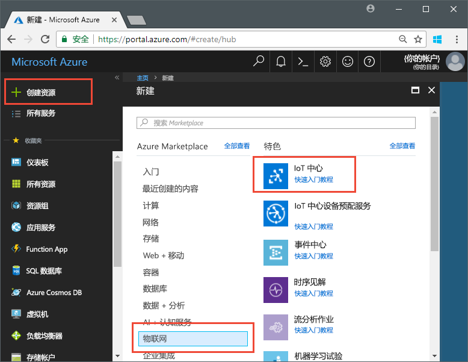
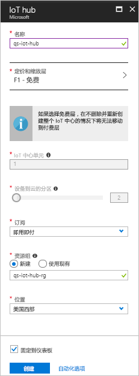
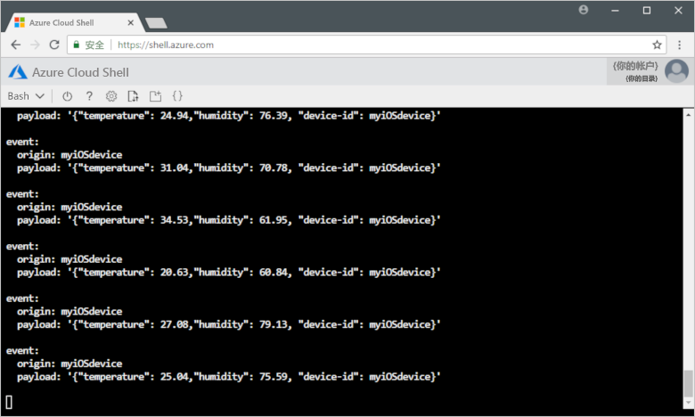

# <a name="send-telemetry-from-a-device-to-an-iot-hub-swift"></a>将遥测数据从设备发送到 IoT 中心 (Swift)

IoT 中心是一项 Azure 服务，用于将大量遥测数据从 IoT 设备引入云中进行存储或处理。 在本文中，请将遥测数据从模拟设备应用程序发送到 IoT 中心， 然后即可从后端应用程序查看数据。 

本文使用预先编写的 Swift 应用程序来发送遥测数据，使用 CLI 实用程序从 IoT 中心读取遥测数据。 

[!INCLUDE [cloud-shell-try-it.md](../../includes/cloud-shell-try-it.md)]

如果还没有 Azure 订阅，可以在开始前创建一个[免费帐户](https://azure.microsoft.com/free/?WT.mc_id=A261C142F)。

## <a name="prerequisites"></a>先决条件

- 从 [Azure 示例](https://github.com/Azure-Samples/azure-iot-samples-ios/archive/master.zip)下载代码示例 
- 最新版本的 [XCode](https://developer.apple.com/xcode/)，运行最新版本的 iOS SDK。 本快速入门已使用 XCode 9.3 和 iOS 11.3 测试过。
- 最新版 [CocoaPods](https://guides.cocoapods.org/using/getting-started.html)。
- iothub-explorer CLI 实用程序，用于从 IoT 中心读取遥测数据。 若要进行安装，请先安装 [Node.js](https://nodejs.org) v4.x.x 或更高版本，然后运行以下命令： 

   ```sh
   sudo npm install -g iothub-explorer
   ```

## <a name="create-an-iot-hub"></a>创建 IoT 中心

第一步是使用 Azure 门户在订阅中创建 IoT 中心。 IoT 中心用于将大量遥测数据从许多设备引入到云中。 然后，该中心会允许一个或多个在云中运行的后端服务读取和处理该遥测数据。

1. 登录到 [Azure 门户](http://portal.azure.com)。

1. 选择“创建资源” > “物联网” > “IoT 中心”。 

   

1. 若要创建 IoT 中心，请使用以下表中的值：

    | 设置 | 值 |
    | ------- | ----- |
    | 名称 | 中心的唯一名称 |
    | 定价和缩放层 | F1 免费 |
    | IoT 中心单位 | 1 |
    | 设备到云的分区 | 2 个分区 |
    | 订阅 | Azure 订阅。 |
    | 资源组 | 新建。 输入资源组名称。 |
    | Location | 最靠近你的位置。 |
    | 固定到仪表板 | 是 |

1. 单击“创建”。  

   

1. 记下IoT 中心和资源组的名称。 本快速入门后面会用到这些值。

## <a name="register-a-device"></a>注册设备

必须先将设备注册到 IoT 中心，然后该设备才能进行连接。 在本快速入门中，请使用 Azure CLI 来注册模拟设备。

1. 添加 IoT 中心 CLI 扩展并创建设备标识。 将 `{YourIoTHubName}` 替换为 IoT 中心的名称：

   ```azurecli-interactive
   az extension add --name azure-cli-iot-ext
   az iot hub device-identity create --hub-name {YourIoTHubName} --device-id myiOSdevice
   ```

    如果为设备选择不同名称，则在运行示例应用程序之前，请在其中更新设备名称。

1. 运行以下命令，获取刚注册设备的设备连接字符串：

   ```azurecli-interactive
   az iot hub device-identity show-connection-string --hub-name {YourIoTHubName} --device-id myiOSdevice --output table
   ```

   记下看起来类似于 `Hostname=...=` 的设备连接字符串。 本文稍后会用到此值。

1. 还需一个服务连接字符串，以便后端应用程序能够连接到 IoT 中心并检索设备到云的消息。 以下命令检索 IoT 中心的服务连接字符串：

   ```azurecli-interactive
   az iot hub show-connection-string --hub-name {YourIoTHubName} --output table
   ```

   记下看起来类似于 `Hostname=...=` 的服务连接字符串。 本文稍后会用到此值。

## <a name="send-simulated-telemetry"></a>发送模拟遥测数据

示例应用程序在 iOS 设备上运行，该设备连接到 IoT 中心的特定于设备的终结点，并发送模拟的温度和湿度遥测数据。 

### <a name="install-cocoapods"></a>安装 CocoaPods

CocoaPods 管理那些使用第三方库的 iOS 项目的依赖项。

在终端窗口中，导航到在先决条件部分下载的 Azure-IoT-Samples-iOS 文件夹。 然后，导航到示例项目：

```sh
cd quickstart/sample-device
```

确保 XCode 已关闭，运行以下命令，以便安装在 **podfile** 文件中声明的 CocoaPods：

```sh
pod install
```

除了为项目安装所需的 Pod，安装命令还创建了一个 XCode 工作区文件，该文件已配置为对依赖项使用 Pod。 

### <a name="run-the-sample-application"></a>运行示例应用程序 

1. 在 XCode 中打开示例工作区。

   ```sh
   open "MQTT Client Sample.xcworkspace"
   ```

2. 展开“MQTT 客户端示例”项目，然后展开同一名称的文件夹。  
3. 打开 **ViewController.swift**，以便在 XCode 中进行编辑。 
4. 搜索 **connectionString** 变量，并使用以前记下的设备连接字符串更新其值。
5. 保存所做更改。 
6. 使用“生成并运行”按钮或“Command + R”组合键在设备模拟器中运行项目。 

   

7. 当模拟器打开后，在示例应用中选择“启动”。

以下屏幕截图显示了在应用程序将模拟遥测数据发送到 IoT 中心后的一些示例输出：

   

## <a name="read-the-telemetry-from-your-hub"></a>从中心读取遥测数据

在 XCode 模拟器上运行过的示例应用显示从设备发送的消息的相关数据。 也可通过 IoT 中心查看接收的数据。 `iothub-explorer` CLI 实用程序连接到 IoT 中心的服务端“事件”终结点。 

打开新的终端窗口。 运行以下命令，将 {your hub service connection string} 替换为在本文开头检索到的服务连接字符串：

```sh
iothub-explorer monitor-events myiOSdevice --login "{your hub service connection string}"
```

以下屏幕截图显示在终端窗口中看到的遥测数据的类型：



如果在运行 iothub-explorer 命令时遇到错误，请仔细检查，确保使用的是 IoT 中心的服务连接字符串，而不是 IoT 设备的设备连接字符串。 两种连接字符串都以 **Hostname={iothubname}** 开头，但服务连接字符串包含 **SharedAccessKeyName** 属性，而设备连接字符串包含 **DeviceID**。 

## <a name="clean-up-resources"></a>清理资源

如果打算继续在其他文章中测试 IoT 中心，请保留资源组和 IoT 中心，在以后重用它们。

如果不再需要 IoT 中心，请在门户中删除该中心与资源组。 为此，请选择包含 IoT 中心的资源组，然后单击“删除”。

## <a name="next-steps"></a>后续步骤

在本文中，你设置了 IoT 中心、注册了设备、将模拟遥测数据从 iOS 设备发送到了中心，并从中心读取了遥测数据。 

若要继续了解如何将 iOS 设备与 IoT 中心配合使用，请参阅[通过 iOS 发送云到设备的消息 (Swift)](iot-hub-ios-swift-c2d.md)

<!-- Links -->
[lnk-process-d2c-tutorial]: iot-hub-csharp-csharp-process-d2c.md
[lnk-device-management]: iot-hub-node-node-device-management-get-started.md
[lnk-iot-edge]: ../iot-edge/tutorial-simulate-device-linux.md
[lnk-connect-device]: https://azure.microsoft.com/develop/iot/
