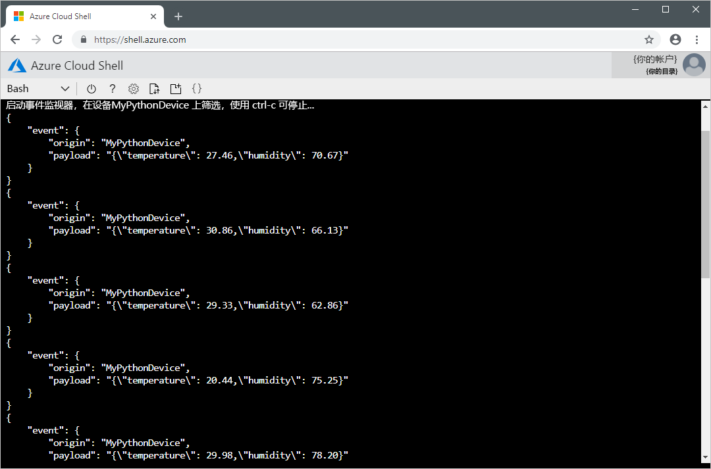

# <a name="quickstart-send-telemetry-from-a-device-to-an-iot-hub-and-read-the-telemetry-from-the-hub-with-a-back-end-application-python"></a>快速入门：将遥测数据从设备发送到 IoT 中心并使用后端应用程序从中心读取遥测数据 (Python)

[!INCLUDE [iot-hub-quickstarts-1-selector](../../includes/iot-hub-quickstarts-1-selector.md)]

IoT 中心是一项 Azure 服务，用于将大量遥测数据从 IoT 设备引入云中进行存储或处理。 本快速入门会将模拟设备应用程序的遥测数据通过 IoT 中心发送到后端应用程序进行处理。

此快速入门使用预先编写的 Python 应用程序来发送遥测数据，使用 CLI 实用程序从中心读取遥测数据。 运行这两个应用程序前，请先创建 IoT 中心并在中心注册设备。

[!INCLUDE [cloud-shell-try-it.md](../../includes/cloud-shell-try-it.md)]

如果还没有 Azure 订阅，可以在开始前创建一个[免费帐户](https://azure.microsoft.com/free/?WT.mc_id=A261C142F)。

## <a name="prerequisites"></a>先决条件

本快速入门中运行的两个示例应用程序是使用 Python 编写的。 在开发计算机上需要 Python 2.7.x 或 3.5.x。

可以从 [Python.org](https://www.python.org/downloads/) 为多个平台下载 Python。

可以使用以下命令之一验证开发计算机上 Python 的当前版本：

```python
python --version
```

```python
python3 --version
```

从 https://github.com/Azure-Samples/azure-iot-samples-python/archive/master.zip 下载示例 Python 项目并提取 ZIP 存档。

若要安装可从 IoT 中心读取遥测数据的 CLI 实用工具，首先需要在开发计算机上安装 Node.js v4.x.x 或更高版本。 可从 [nodejs.org](https://nodejs.org) 为下载适用于多个平台的 Node.js。

可以使用以下命令验证开发计算机上 Node.js 当前的版本：

```cmd/sh
node --version
```

若要安装 `iothub-explorer` CLI 实用工具，请运行以下命令：

```cmd/sh
npm install -g iothub-explorer
```

## <a name="create-an-iot-hub"></a>创建 IoT 中心

[!INCLUDE [iot-hub-quickstarts-create-hub](../../includes/iot-hub-quickstarts-create-hub.md)]

## <a name="register-a-device"></a>注册设备

必须先将设备注册到 IoT 中心，然后该设备才能进行连接。 在本快速入门中，请使用 Azure CLI 来注册模拟设备。

1. 添加 IoT 中心 CLI 扩展并创建设备标识。 将 `{YourIoTHubName}` 替换为 IoT 中心选择的名称：

    ```azurecli-interactive
    az extension add --name azure-cli-iot-ext
    az iot hub device-identity create --hub-name {YourIoTHubName} --device-id MyPythonDevice
    ```

    如果为设备选择不同名称，则在运行示例应用程序之前，请在其中更新设备名称。

1. 运行以下命令，获取刚注册设备的设备连接字符串：

    ```azurecli-interactive
    az iot hub device-identity show-connection-string --hub-name {YourIoTHubName} --device-id MyPythonDevice --output table
    ```

    记下看起来类似于 `Hostname=...=` 的设备连接字符串。 稍后会在快速入门中用到此值。

1. 还需一个服务连接字符串，以便 `iothub-explorer` CLI 实用工具能够连接到 IoT 中心并检索消息。 以下命令检索 IoT 中心的服务连接字符串：

    ```azurecli-interactive
    az iot hub show-connection-string --hub-name {YourIoTHubName} --output table
    ```

    记下看起来类似于 `Hostname=...=` 的服务连接字符串。 稍后会在快速入门中用到此值。 服务连接字符串与设备连接字符串不同。

## <a name="send-simulated-telemetry"></a>发送模拟遥测数据

模拟设备应用程序会连接到 IoT 中心上特定于设备的终结点，并发送模拟的温度和湿度遥测数据。

1. 在终端窗口中，导航到示例 Python 项目的根文件夹。 然后导航到 Quickstarts\simulated-device 文件夹。

1. 在所选文本编辑器中打开 SimulatedDevice.py 文件。

    将 `CONNECTION_STRING` 变量的值替换为之前记下的设备连接字符串。 然后将更改保存到 SimulatedDevice.py 文件。

1. 在终端窗口中，运行以下命令，为模拟设备应用程序安装所需的库：

    ```cmd/sh
    pip install azure-iothub-device-client
    ```

1. 在终端窗口中，运行以下命令，运行模拟设备应用程序：

    ```cmd/sh
    python SimulatedDevice.py
    ```

    以下屏幕截图显示了模拟设备应用程序将遥测数据发送到 IoT 中心后的输出：

    

## <a name="read-the-telemetry-from-your-hub"></a>从中心读取遥测数据

`iothub-explorer` CLI 实用程序连接到 IoT 中心的服务端“事件”终结点。 实用工具会接收从模拟设备发送的设备到云的消息。 IoT 中心后端应用程序通常在云中运行，接收和处理设备到云的消息。

在另一个终端窗口中，运行以下命令，将 `{your hub service connection string}` 替换为之前记下的设备连接字符串：

```cmd/sh
iothub-explorer monitor-events MyPythonDevice --login {your hub service connection string}
```

以下屏幕截图显示了在实用工具接收模拟设备发送到 IoT 中心的遥测数据后的输出：



## <a name="clean-up-resources"></a>清理资源

如果打算完成下一快速入门教程，请保留资源组和 IoT 中心，稍后再进行使用。

如果不再需要 IoT 中心，请在门户中删除该中心与资源组。 为此，请选择包含 IoT 中心的 qs-iot-hub-rg 资源组，然后单击“删除”。

## <a name="next-steps"></a>后续步骤

在本快速入门中，已设置 IoT 中心、注册设备、使用 Python 应用程序发送模拟遥测数据到中心并使用简单的后端应用程序读取中心的遥测数据。

若要了解如何从后端应用程序控制模拟设备，请继续阅读下一快速入门教程。

> [!div class="nextstepaction"]
> [快速入门：控制连接到 IoT 中心的设备](quickstart-control-device-python.md)