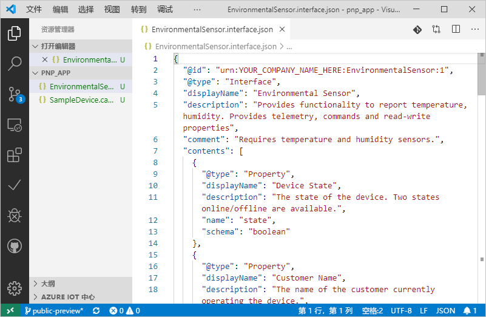
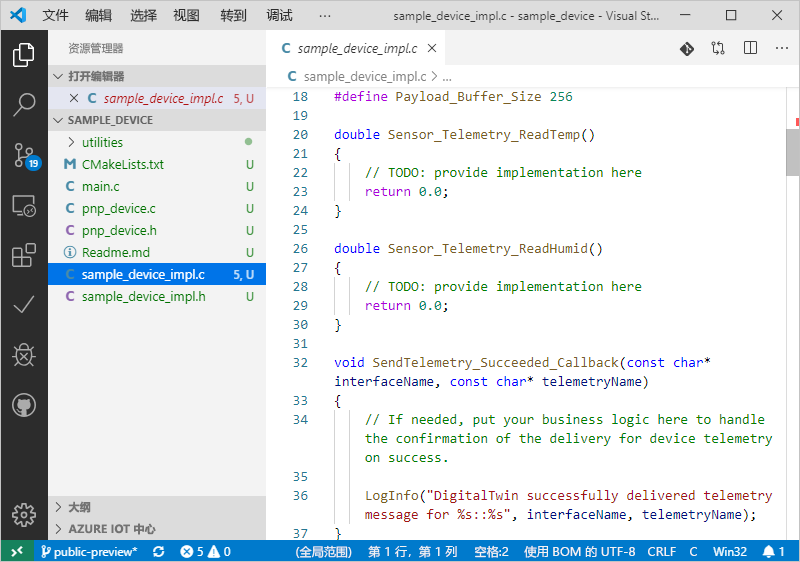

# <a name="quickstart-use-a-device-capability-model-to-create-an-iot-plug-and-play-preview-device-linux"></a>快速入门：使用设备功能模型创建 IoT 即插即用预览设备 (Linux)

[!INCLUDE [iot-pnp-quickstarts-1-selector.md](../../includes/iot-pnp-quickstarts-1-selector.md)]

_设备功能模型_ (DCM) 描述 IoT 即插即用设备的功能。 DCM 通常与产品 SKU 相关联。 DCM 中定义的功能组织成可重复使用的接口。 可以基于 DCM 生成主干设备代码。 本快速入门介绍如何通过 DCM 在 Ubuntu Linux 上使用 VS Code 创建 IoT 即插即用设备。

## <a name="prerequisites"></a>必备条件

本快速入门假设你在桌面环境中使用 Ubuntu Linux。 本教程中的步骤已使用 Ubuntu 18.04 进行了测试。

要完成本快速入门，需在本地 Linux 计算机上安装以下软件：

* 使用 `apt-get` 命令安装“GCC”、“Git”、“cmake”和所有依赖项    ：

    ```sh
    sudo apt-get update
    sudo apt-get install -y git cmake build-essential curl libcurl4-openssl-dev libssl-dev uuid-dev
    ```

    验证 `cmake` 的版本是否高于 2.8.12，GCC 的版本是否高于 4.4.7    。

    ```sh
    cmake --version
    gcc --version
    ```

* [Visual Studio Code](https://code.visualstudio.com/)。

### <a name="install-azure-iot-tools"></a>安装 Azure IoT Tools

使用以下步骤安装[适用于 VS Code 的 Azure IoT Tools](https://marketplace.visualstudio.com/items?itemName=vsciot-vscode.azure-iot-tools) 扩展包：

1. 在 VS Code 中选择“扩展”选项卡。 
1. 搜索“Azure IoT Tools”  。
1. 选择“安装”  。

### <a name="get-the-connection-string-for-your-company-model-repository"></a>获取公司模型存储库的连接字符串

使用 Microsoft 工作或学校帐户（或者 Microsoft 合作伙伴 ID，如果有）登录后，可以在 [Azure IoT 认证门户](https://preview.catalog.azureiotsolutions.com)中找到你的公司模型存储库连接字符串。  登录后，依次选择“公司存储库”、“连接字符串”。  

[!INCLUDE [cloud-shell-try-it.md](../../includes/cloud-shell-try-it.md)]

[!INCLUDE [iot-pnp-prepare-iot-hub.md](../../includes/iot-pnp-prepare-iot-hub.md)]

## <a name="prepare-the-development-environment"></a>准备开发环境

本快速入门将使用 [Vcpkg](https://github.com/microsoft/vcpkg) 库管理器在开发环境中安装 Azure IoT C 设备 SDK。

打开 shell。 执行以下命令以安装 Vcpkg：

```bash
cd ~
git clone https://github.com/microsoft/vcpkg
cd vcpkg
./bootstrap-vcpkg.sh
./vcpkg install azure-iot-sdk-c[public-preview,use_prov_client]
```

应该预料到此操作需要几分钟才能完成。

## <a name="author-your-model"></a>创作模型

在本快速入门中，你将使用现有的示例设备功能模型和关联的接口。

1. 在本地驱动器上创建 `pnp_app` 目录。 使用此文件夹来存储设备模型文件和设备代码存根。

    ```bash
    cd ~
    mkdir pnp_app
    ```

1. 将设备功能模型和接口示例文件下载到 `pnp_app` 文件夹中。

    ```bash
    cd pnp_app
    curl -O -L https://raw.githubusercontent.com/Azure/IoTPlugandPlay/master/samples/SampleDevice.capabilitymodel.json
    curl -O -L https://raw.githubusercontent.com/Azure/IoTPlugandPlay/master/samples/EnvironmentalSensor.interface.json
    ```

1. 使用 VS Code 打开 `pnp_app` 文件夹。 可以使用 IntelliSense 查看文件：

    

1. 在下载的文件中，将 `@id` 和 `schema` 字段中的 `<YOUR_COMPANY_NAME_HERE>` 替换为唯一值。 请仅使用字符 a-z、A-Z、0-9 和下划线。 有关详细信息，请参阅[数字孪生标识符格式](https://github.com/Azure/IoTPlugandPlay/tree/master/DTDL#digital-twin-identifier-format)。

## <a name="generate-the-c-code-stub"></a>生成 C 代码存根

现已获得一个 DCM 及其关联的接口，接下来可以生成用于实现该模型的设备代码。 若要在 VS Code 中生成 C 代码存根：

1. 在 VS 代码中打开 `pnp_app` 文件夹后，按 Ctrl+Shift+P 打开命令面板，输入“IoT 即插即用”，然后选择“生成设备代码存根”    。

    > [!NOTE]
    > 首次使用 IoT 即插即用代码生成器实用工具时，需要花费几秒钟时间来自动下载并安装。

1. 选择用于生成设备代码存根的 SampleDevice.capabilitymodel.json 文件  。

1. 输入项目名称 sample_device  。 这将是设备应用程序的名称。

1. 选择“ANSI C”作为语言。 

1. 选择“通过 IoT 中心设备连接字符串”作为连接方法。 

1. 选择“Linux 上的 CMake 项目”作为项目模板  。

1. 选择“通过 Vcpkg”作为包括设备 SDK 的方式  。

1. 会在与 DCM 文件相同的位置创建名为“sample_device”的新文件夹，其中包含生成的设备代码存根文件  。 VS Code 会打开新窗口以显示这些内容。
    

## <a name="build-and-run-the-code"></a>生成并运行代码

使用设备 SDK 源代码来生成生成的设备代码存根。 生成的应用程序将模拟连接到 IoT 中心的设备。 应用程序将发送遥测数据和属性，并接收命令。

1. 为 sample_device 应用程序创建 CMake 生成文件夹   ：

    ```bash
    cd ~/pnp_app/sample_device
    mkdir cmake
    cd cmake
    ```

1. 通过 SDK 运行 CMake，以生成应用。 以下命令假设你已在主文件夹中安装 vcpkg  ：

    ```bash
    cmake .. -DCMAKE_TOOLCHAIN_FILE=~/vcpkg/scripts/buildsystems/vcpkg.cmake -Duse_prov_client=ON -Dhsm_type_symm_key:BOOL=ON
    cmake --build .
    ```

1. 成功完成生成后，运行应用程序并传递 IoT 中心设备连接字符串作为参数。

    ```sh
    cd ~/pnp_app/sample_device/cmake
    ./sample_device "<YourDeviceConnectionString>"
    ```

1. 设备应用程序将开始向 IoT 中心发送数据。

    

## <a name="validate-the-code"></a>验证代码

### <a name="publish-device-model-files-to-model-repository"></a>将设备模型文件发布到模型存储库

要使用“az”CLI 验证设备代码，需将文件发布到模型存储库  。

1. 在 VS Code 中打开 `pnp_app` 文件夹后，按“Ctrl+Shift+P”打开命令面板，然后键入并选择“IoT 即插即用:   将文件提交到模型存储库”。

1. 选择 `SampleDevice.capabilitymodel.json` 和 `EnvironmentalSensor.interface.json` 文件。

1. 输入公司模型存储库连接字符串。

    > [!NOTE]
    > 仅当首次连接到存储库时，才需要输入连接字符串。

1. 在 VS Code 输出窗口和通知中，可以检查文件是否已成功发布。

    > [!NOTE]
    > 如果在发布设备模型文件时遇到错误，可尝试使用命令“IoT 即插即用:  注销模型存储库”注销，然后再次执行这些步骤。

### <a name="use-the-azure-iot-cli-to-validate-the-code"></a>使用 Azure IoT CLI 验证代码

设备客户端示例启动后，可以检查其是否可与 Azure CLI 一起使用。

使用以下命令查看示例设备正在发送的遥测。 可能需要等待一两分钟，然后才能在输出中看到遥测：

```azurecli-interactive
az iot dt monitor-events --hub-name <YourIoTHubNme> --device-id <YourDeviceID>
```

使用以下命令查看设备发送的所有属性：

```azurecli-interactive
az iot dt list-properties --device-id <YourDeviceID> --hub-name <YourIoTHubNme> --source private --repo-login "<YourCompanyModelRepositoryConnectionString>"
```

[!INCLUDE [iot-pnp-clean-resources.md](../../includes/iot-pnp-clean-resources.md)]

## <a name="next-steps"></a>后续步骤

本快速入门已介绍如何使用 DCM 创建 IoT 即插即用设备。

若要详细了解 DCM 以及如何创建自己的模型，请继续学习教程：

> [!div class="nextstepaction"]
> [教程：使用 Visual Studio Code 创建和测试设备功能模型](tutorial-pnp-visual-studio-code.md)
