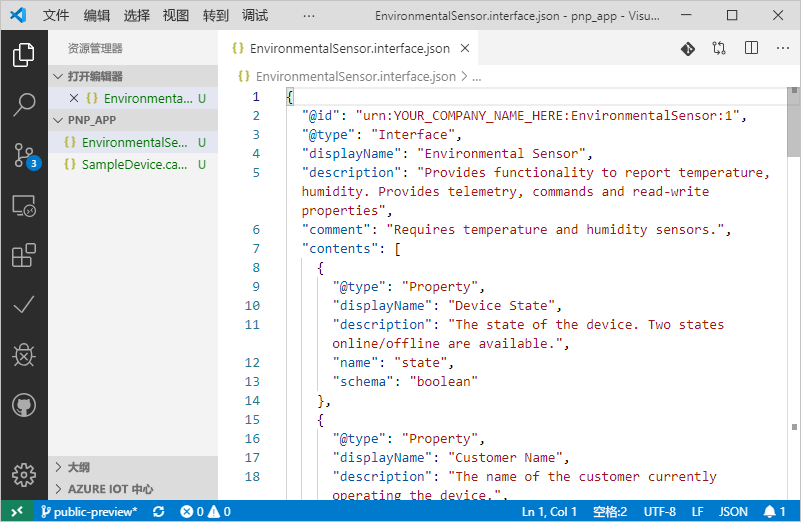
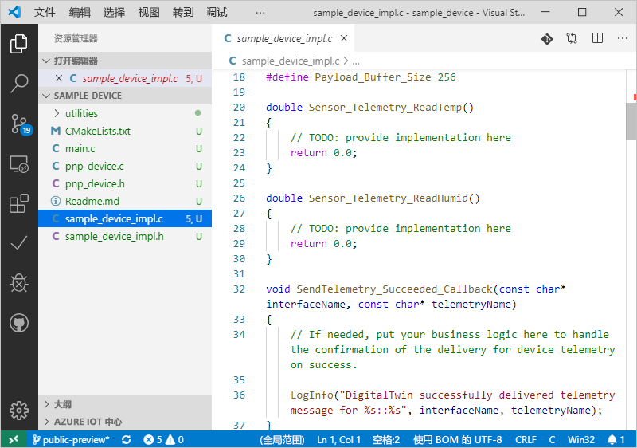

# <a name="quickstart-use-a-device-capability-model-to-create-an-iot-plug-and-play-preview-device-windows"></a>快速入门：使用设备功能模型创建 IoT 即插即用预览设备 (Windows)

[!INCLUDE [iot-pnp-quickstarts-1-selector.md](../../includes/iot-pnp-quickstarts-1-selector.md)]

_设备功能模型_ (DCM) 描述 IoT 即插即用设备的功能。 DCM 通常与产品 SKU 相关联。 DCM 中定义的功能组织成可重复使用的接口。 可以基于 DCM 生成主干设备代码。 本快速入门介绍如何在 Windows 上的 VS Code 中使用 DCM 创建 IoT 即插即用设备。

## <a name="prerequisites"></a>先决条件

若要完成本快速入门，需在本地计算机上安装以下软件：

* [适用于 Visual Studio 的生成工具](https://visualstudio.microsoft.com/thank-you-downloading-visual-studio/?sku=BuildTools&rel=16)，其中包含 C++ 生成工具和 NuGet 包管理器组件工作负荷   。 安装了相同工作负荷的 [Visual Studio（Community、Professional 或 Enterprise）](https://visualstudio.microsoft.com/downloads/)2019、2017 或 2015。
* [Git](https://git-scm.com/download/)。
* [CMake](https://cmake.org/download/)。
* [Visual Studio Code](https://code.visualstudio.com/)。

### <a name="install-azure-iot-tools"></a>安装 Azure IoT Tools

使用以下步骤安装[适用于 VS Code 的 Azure IoT Tools](https://marketplace.visualstudio.com/items?itemName=vsciot-vscode.azure-iot-tools) 扩展包：

1. 在 VS Code 中选择“扩展”选项卡。 
1. 搜索“Azure IoT Tools”  。
1. 选择“安装”  。

### <a name="install-the-azure-iot-explorer"></a>安装 Azure IoT 资源管理器

从 Azure IoT 资源管理器的[存储库](https://github.com/Azure/azure-iot-explorer/releases)页面，选择“资产”下的 .msi 文件以查找最近更新，下载并安装该工具的最新版本  。

### <a name="get-the-connection-string-for-your-company-model-repository"></a>获取公司模型存储库的连接字符串

使用 Microsoft 工作或学校帐户（或者 Microsoft 合作伙伴 ID，如果有）登录后，可以在 [Azure IoT 认证门户](https://preview.catalog.azureiotsolutions.com)中找到你的公司模型存储库连接字符串。  登录后，依次选择“公司存储库”、“连接字符串”。  

[!INCLUDE [cloud-shell-try-it.md](../../includes/cloud-shell-try-it.md)]

[!INCLUDE [iot-pnp-prepare-iot-hub.md](../../includes/iot-pnp-prepare-iot-hub.md)]

运行以下命令，获取中心的 _IoT 中心连接字符串_（记录以供稍后使用）：

```azurecli-interactive
az iot hub show-connection-string --hub-name <YourIoTHubName> --output table
```

## <a name="prepare-the-development-environment"></a>准备开发环境

本快速入门将使用 [Vcpkg](https://github.com/microsoft/vcpkg) 库管理器在开发环境中安装 Azure IoT C 设备 SDK。

1. 打开命令提示符。 执行以下命令以安装 Vcpkg：

    ```cmd
    git clone https://github.com/Microsoft/vcpkg.git
    cd vcpkg

    .\bootstrap-vcpkg.bat
    ```

    然后，若要挂接用户范围的[集成](https://github.com/microsoft/vcpkg/blob/master/docs/users/integration.md)，运行以下命令（注意：首次使用时需要管理员）：

    ```cmd
    .\vcpkg.exe integrate install
    ```

1. 安装 Azure IoT C 设备 SDK Vcpkg：

    ```cmd
    .\vcpkg.exe install azure-iot-sdk-c[public-preview,use_prov_client]
    ```

## <a name="author-your-model"></a>创作模型

在本快速入门中，你将使用现有的示例设备功能模型和关联的接口。

1. 在本地驱动器中创建 `pnp_app` 文件夹。 使用此文件夹来存储设备模型文件和设备代码存根。

1. 下载[设备功能模型和接口示例文件](https://github.com/Azure/IoTPlugandPlay/blob/master/samples/SampleDevice.model.json)和[接口示例](https://github.com/Azure/IoTPlugandPlay/blob/master/samples/EnvironmentalSensor.interface.json)，并将文件保存到 `pnp_app` 文件夹中。

    > [!TIP]
    > 若要从 GitHub 下载某个文件，请导航到该文件，右键单击“原始”，然后选择“链接另存为”。  

1. 使用 VS Code 打开 `pnp_app` 文件夹。 可以使用 IntelliSense 查看文件：

    

1. 在下载的文件中，将 `@id` 和 `schema` 字段中的 `<YOUR_COMPANY_NAME_HERE>` 替换为唯一值。 请仅使用字符 a-z、A-Z、0-9 和下划线。 有关详细信息，请参阅[数字孪生标识符格式](https://github.com/Azure/IoTPlugandPlay/tree/master/DTDL#digital-twin-identifier-format)。

## <a name="generate-the-c-code-stub"></a>生成 C 代码存根

现已获得一个 DCM 及其关联的接口，接下来可以生成用于实现该模型的设备代码。 若要在 VS Code 中生成 C 代码存根：

1. 在 VS 代码中打开 `pnp_app` 文件夹后，按 Ctrl+Shift+P 打开命令面板，输入“IoT 即插即用”，然后选择“生成设备代码存根”    。

    > [!NOTE]
    > 首次使用 IoT 即插即用 CodeGen CLI 时，需要花费几秒钟时间来自动下载并安装。

1. 选择用于生成设备代码存根的 SampleDevice.capabilitymodel.json 文件  。

1. 输入项目名称 sample_device  。 这是设备应用程序的名称。

1. 选择“ANSI C”作为语言。 

1. 选择“通过 IoT 中心设备连接字符串”作为连接方法。 

1. 选择“Windows 上的 CMake 项目”作为项目模板  。

1. 选择“通过 Vcpkg”作为包括设备 SDK 的方式  。

1. 会在与 DCM 文件相同的位置创建名为“sample_device”的新文件夹，其中包含生成的设备代码存根文件  。 VS Code 会打开新窗口以显示这些内容。
    

## <a name="build-and-run-the-code"></a>生成并运行代码

使用 Vcpkg 包生成设备代码存根。 生成的应用程序将模拟连接到 IoT 中心的设备。 应用程序将发送遥测数据和属性，并接收命令。

1. 在 `sample_device` 文件夹中创建 `cmake` 子目录，并导航到该文件夹：

    ```cmd
    mkdir cmake
    cd cmake
    ```

1. 运行以下命令，构建生成的代码存根（将占位符替换为 Vcpkg 存储库的目录）：

    ```cmd
    cmake .. -G "Visual Studio 16 2019" -A Win32 -Duse_prov_client=ON -Dhsm_type_symm_key:BOOL=ON -DCMAKE_TOOLCHAIN_FILE="<directory of your Vcpkg repo>\scripts\buildsystems\vcpkg.cmake"

    cmake --build .
    ```
    
    > [!NOTE]
    > 如果使用 Visual Studio 2017 或 2015，则需要根据所使用的生成工具指定 CMake 生成器：
    >```cmd
    ># Either
    >cmake .. -G "Visual Studio 15 2017" -Duse_prov_client=ON -Dhsm_type_symm_key:BOOL=ON -DCMAKE_TOOLCHAIN_FILE="{directory of your Vcpkg repo}\scripts\buildsystems\vcpkg.cmake"
    ># or
    >cmake .. -G "Visual Studio 14 2015" -Duse_prov_client=ON -Dhsm_type_symm_key:BOOL=ON -DCMAKE_TOOLCHAIN_FILE="{directory of your Vcpkg repo}\scripts\buildsystems\vcpkg.cmake"
    >```

    > [!NOTE]
    > 如果 cmake 找不到 C++ 编译器，则在运行以上命令时会出现生成错误。 如果出现这种情况，请尝试在 [Visual Studio 命令提示符](https://docs.microsoft.com/dotnet/framework/tools/developer-command-prompt-for-vs)下运行此命令。

1. 成功完成生成后，运行应用程序并将 IoT 中心设备连接字符串作为参数传递。

    ```cmd\sh
    .\Debug\sample_device.exe "<YourDeviceConnectionString>"
    ```

1. 设备应用程序将开始向 IoT 中心发送数据。

    

## <a name="validate-the-code"></a>验证代码

### <a name="publish-device-model-files-to-model-repository"></a>将设备模型文件发布到模型存储库

若要使用“Azure IoT 资源管理器”验证设备代码，需将文件发布到模型存储库。 

1. 在 VS Code 中打开 `pnp_app` 文件夹后，按“Ctrl+Shift+P”打开命令面板，然后键入并选择“IoT 即插即用:   将文件提交到模型存储库”。

1. 选择 `SampleDevice.capabilitymodel.json` 和 `EnvironmentalSensor.interface.json` 文件。

1. 输入公司模型存储库连接字符串。

    > [!NOTE]
    > 仅当首次连接到存储库时，才需要输入连接字符串。

1. 在 VS Code 输出窗口和通知中，可以检查文件是否已成功发布。

    > [!NOTE]
    > 如果在发布设备模型文件时遇到错误，可尝试使用命令“IoT 即插即用:  注销模型存储库”注销，然后再次执行这些步骤。

### <a name="use-the-azure-iot-explorer-to-validate-the-code"></a>使用 Azure IoT 资源管理器验证代码

[!INCLUDE [iot-pnp-iot-explorer-1.md](../../includes/iot-pnp-iot-explorer-1.md)]

4. 若要添加公司存储库，请依次选择“设置”、“+ 添加模块定义源”、“公司存储库”    。 添加公司模型存储库连接字符串，然后选择“保存并连接”  。

1. 回到“设备”概述页上，找到前面创建的设备标识  。 如果设备应用程序仍在命令提示符中运行，请检查设备 Azure IoT 资源管理器中的“连接状态”是否为“已连接”（如果不是，请点击“刷新”直至状态为“已连接”）    。 选择该设备可查看更多详细信息。

1. 展开 ID 为 urn:<YOUR_INTERFACE_NAME>:EnvironmentalSensor:1 的接口，以查看 IoT 即插即用基元 - 属性、命令和遥测  。 将显示的接口名称是在创建模型时输入的名称。

[!INCLUDE [iot-pnp-iot-explorer-2.md](../../includes/iot-pnp-iot-explorer-2.md)]

[!INCLUDE [iot-pnp-clean-resources.md](../../includes/iot-pnp-clean-resources.md)]

## <a name="next-steps"></a>后续步骤

本快速入门已介绍如何使用 DCM 创建 IoT 即插即用设备。

若要详细了解 DCM 以及如何创建自己的模型，请继续学习教程：

> [!div class="nextstepaction"]
> [教程：使用 Visual Studio Code 创建和测试设备功能模型](tutorial-pnp-visual-studio-code.md)
