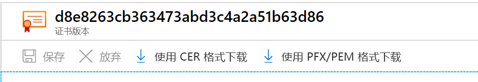

# <a name="export-certificates-from-azure-key-vault"></a>从 Azure Key Vault 中导出证书

了解如何从 Azure Key Vault 中导出证书。 你可以使用 Azure CLI、Azure PowerShell 或 Azure 门户来导出证书。 还可以使用 Azure 门户来导出 Azure 应用服务证书。

## <a name="about-azure-key-vault-certificates"></a>关于 Azure Key Vault 证书

使用 Azure Key Vault，你可以轻松地为网络预配、管理和部署数字证书。 它还能使应用程序之间进行安全的通信。 有关详细信息，请参阅 [Azure Key Vault 证书](https://docs.microsoft.com/azure/key-vault/certificates/about-certificates)。

### <a name="composition-of-a-certificate"></a>证书的组成部分

创建 Key Vault 证书时，还会创建具有相同名称的可寻址密钥和机密 。 Key Vault 密钥允许密钥操作。 Key Vault 机密允许以机密的形式检索证书值。 Key Vault 证书还包含公共 x509 证书元数据。 有关详细信息，请参阅[证书的组成部分](https://docs.microsoft.com/azure/key-vault/certificates/about-certificates#composition-of-a-certificate)。

### <a name="exportable-and-non-exportable-keys"></a>可导出和不可导出的密钥

创建 Key Vault 证书后，可以使用私钥从可寻址机密中检索该证书。 以 PFX 或 PEM 格式检索证书。

- **可导出**：用于创建证书的策略指示密钥可导出。
- **不可导出**：用于创建证书的策略指示密钥不可导出。 在这种情况下，当以机密的形式进行检索时，私钥不是值的一部分。

支持的 KeyType：RSA、RSA-HSM、EC、EC-HSM 等（参见[此处](https://docs.microsoft.com/rest/api/keyvault/createcertificate/createcertificate#jsonwebkeytype)）“可导出”状态仅与 RSA 和 EC 一起使用。 HSM 密钥不可导出。

有关详细信息，请参阅[关于 Azure Key Vault 证书](https://docs.microsoft.com/azure/key-vault/certificates/about-certificates#exportable-or-non-exportable-key)。

## <a name="export-stored-certificates"></a>导出存储的证书

你可以使用 Azure CLI、Azure PowerShell 或 Azure 门户来导出 Azure Key Vault 中存储的证书。

> [!NOTE]
> 只有在密钥保管库中导入证书时，才需要证书密码。 Key Vault 不会保存关联的密码。 导出证书时，密码为空。

# <a name="azure-cli"></a>[Azure CLI](#tab/azure-cli)

在 Azure CLI 中使用以下命令，下载 Key Vault 证书的公有部分。

```azurecli
az keyvault certificate download --file
                                 [--encoding {DER, PEM}]
                                 [--id]
                                 [--name]
                                 [--subscription]
                                 [--vault-name]
                                 [--version]
```

有关详细信息，请查看[示例和参数定义](https://docs.microsoft.com/cli/azure/keyvault/certificate?view=azure-cli-latest#az-keyvault-certificate-download)。

如果要下载整个证书（组成证书的公有部分和私有部分），则可以通过将证书下载为机密来实现此操作。

```azurecli
az keyvault secret download -–file {nameofcert.pfx}
                            [--encoding {ascii, base64, hex, utf-16be, utf-16le, utf-8}]
                            [--id]
                            [--name]
                            [--subscription]
                            [--vault-name]
                            [--version]
```

有关详细信息，请参阅[参数定义](https://docs.microsoft.com/cli/azure/keyvault/secret?view=azure-cli-latest#az-keyvault-secret-download)。

# <a name="powershell"></a>[PowerShell](#tab/azure-powershell)

在 Azure PowerShell 中使用此命令，从名为 ContosoKV01 的密钥保管库中获取名为 TestCert01 的证书 。 若要将证书下载为 PFX 文件，请运行以下命令。 这些命令访问 SecretId，并将内容另存为 PFX 文件。

```azurepowershell
$cert = Get-AzKeyVaultCertificate -VaultName "ContosoKV01" -Name "TestCert01"
$kvSecret = Get-AzKeyVaultSecret -VaultName "ContosoKV01" -Name $Cert.Name
$kvSecretBytes = [System.Convert]::FromBase64String($kvSecret.SecretValueText)
$certCollection = New-Object System.Security.Cryptography.X509Certificates.X509Certificate2Collection
$certCollection.Import($kvSecretBytes,$null,[System.Security.Cryptography.X509Certificates.X509KeyStorageFlags]::Exportable)
$password = '******'
$protectedCertificateBytes = $certCollection.Export([System.Security.Cryptography.X509Certificates.X509ContentType]::Pkcs12, $password)
$pfxPath = [Environment]::GetFolderPath("Desktop") + "\MyCert.pfx"
[System.IO.File]::WriteAllBytes($pfxPath, $protectedCertificateBytes)
```

此命令使用私钥导出整个证书链。 证书受密码保护。
有关 Get-AzKeyVaultCertificate 命令和参数的详细信息，请参阅 [Get-AzKeyVaultCertificate - 示例 2](https://docs.microsoft.com/powershell/module/az.keyvault/Get-AzKeyVaultCertificate?view=azps-4.4.0)。

# <a name="portal"></a>[门户](#tab/azure-portal)

在 Azure 门户上，当你在“证书”边栏选项卡上创建/导入证书后，你将收到已成功创建证书的通知。 选择证书和当前版本以查看下载选项。

若要下载证书，请单击“使用 CER 格式下载”或“使用 PFX/PEM 格式下载” 。



**导出 Azure 应用服务证书**

通过 Azure 应用服务证书可以方便地购买 SSL 证书。 你可以从门户中将它们分配给 Azure 应用。 你还可以从门户中将这些证书导出为 PFX 文件，以便在其他地方使用。 导入这些证书后，可以在机密下找到应用服务证书。

有关详细信息，请参阅[导出 Azure 应用服务证书](https://social.technet.microsoft.com/wiki/contents/articles/37431.exporting-azure-app-service-certificates.aspx)的步骤。

---

## <a name="read-more"></a>了解详细信息
* [各种证书文件类型和定义](https://docs.microsoft.com/archive/blogs/kaushal/various-ssltls-certificate-file-typesextensions)
