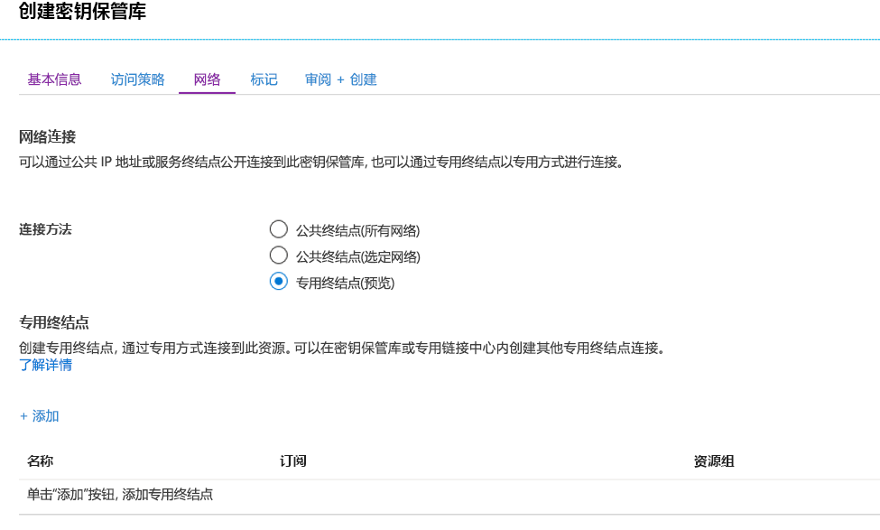
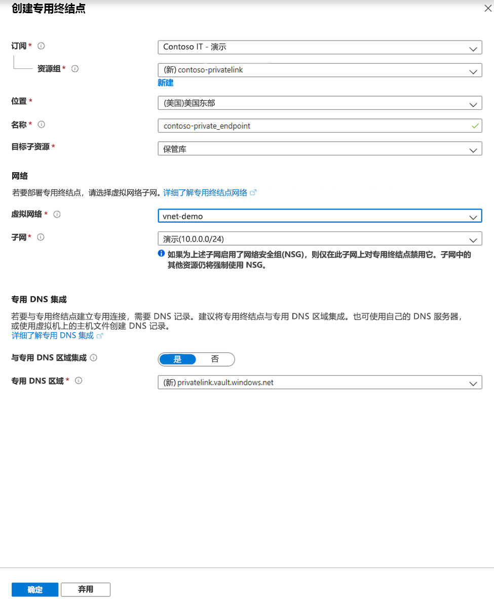
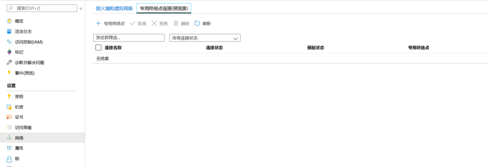
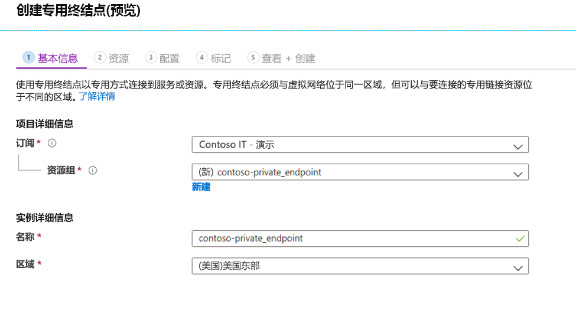
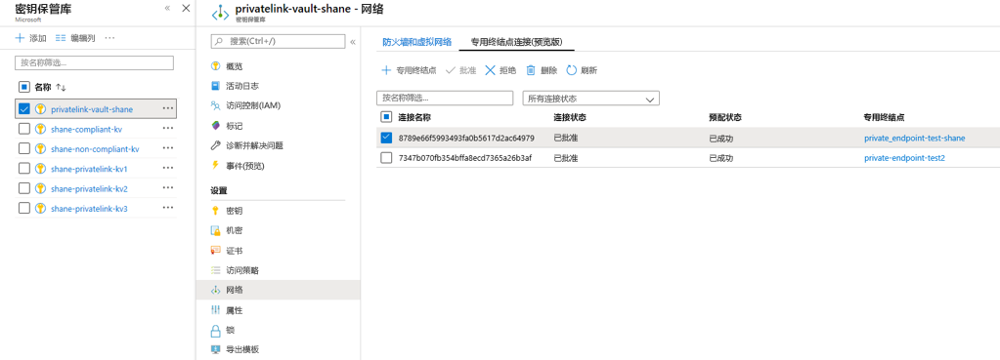

# <a name="integrate-key-vault-with-azure-private-link-preview"></a>将 Key Vault 与 Azure 专用链接（预览版）集成

使用 Azure 专用链接服务，可以通过虚拟网络中的专用终结点访问 Azure 服务（例如 Azure Key Vault、Azure 存储和 Azure Cosmos DB）以及 Azure 托管的客户服务/合作伙伴服务。

Azure 专用终结点是一个网络接口，可以通过私密且安全的方式将你连接到 Azure 专用链接支持的服务。 专用终结点使用 VNet 中的专用 IP 地址将服务有效接入 VNet 中。 发往服务的所有流量都可以通过专用终结点路由，因此不需要网关、NAT 设备、ExpressRoute 或 VPN 连接或公共 IP 地址。 虚拟网络与服务之间的流量将通过 Microsoft 主干网络，因此不会从公共 Internet 泄露。 可以连接到 Azure 资源的实例，从而获得最高级别的访问控制粒度。

有关详细信息，请参阅[什么是 Azure 专用链接（预览版）？](../private-link/private-link-overview.md)

## <a name="prerequisites"></a>必备条件

若要将 Key Vault 与 Azure 专用链接（预览版）集成，需要准备好以下各项：

- 一个 Key Vault。
- 一个 Azure 虚拟网络。
- 虚拟网络中的子网。
- 对 Key Vault 和虚拟网络拥有所有者或参与者权限。

专用终结点和虚拟网络必须位于同一区域。 使用门户选择专用终结点的区域时，只会自动筛选该区域中的虚拟网络。 Key Vault 可以位于不同的区域。

专用终结点使用虚拟网络中的专用 IP 地址。

## <a name="establish-a-private-link-connection-to-key-vault"></a>与 Key Vault 建立专用链接连接

首先，遵循[使用 Azure 门户创建虚拟网络](../virtual-network/quick-create-portal.md)中的步骤创建虚拟网络

然后可以创建新的 Key Vault，或者与现有的 Key Vault 建立专用链接连接。

### <a name="create-a-new-key-vault-and-establish-a-private-link-connection"></a>创建新 Key Vault 并建立专用链接连接

可以遵循[使用 Azure 门户在 Azure Key Vault 中设置和检索机密](quick-create-portal.md)中的步骤创建新的 Key Vault

配置 Key Vault 基本设置后，选择“网络”选项卡并执行以下步骤：

1. 在“网络”选项卡中选中“专用终结点(预览版)”单选按钮。
1. 单击“+ 添加”按钮添加专用终结点。

    
 
1. 在“创建专用终结点”边栏选项卡的“位置”字段中，选择虚拟网络所在的区域。 
1. 在“名称”字段中创建一个描述性的名称，用于标识此专用终结点。 
1. 从下拉菜单中，选择要在其中创建此专用终结点的虚拟网络和子网。 
1. 将“与专用区域 DNS 集成”选项保留不变。  
1. 选择“确定”。

    
 
现在可以看到配置的专用终结点。 可以使用相应的选项来删除和编辑此专用终结点。 选择“查看 + 创建”按钮并创建 Key Vault。 完成部署需要 5-10 分钟。 

### <a name="establish-a-private-link-connection-to-an-existing-key-vault"></a>与现有的 Key Vault 建立专用链接连接

如果已有 Key Vault，可以执行以下步骤创建专用链接连接：

1. 登录到 Azure 门户。 
1. 在搜索栏中键入“key vault”
1. 从列表中选择要将专用终结点添加到的 Key Vault。
1. 选择“设置”下的“网络”选项卡
1. 选择页面顶部的“专用终结点连接(预览版)”选项卡
1. 选择页面顶部的“+ 专用终结点”按钮。

     

可以使用此边栏选项卡选择为任何 Azure 资源创建专用终结点。 可以使用下拉菜单选择资源类型并在目录中选择资源，或者使用资源 ID 连接到任何 Azure 资源。 将“与专用区域 DNS 集成”选项保留不变。  


## <a name="manage-private-link-connection"></a>管理专用链接连接

创建专用终结点时，必须批准连接。 如果要为其创建专用终结点的资源位于你的目录中，则你可以批准连接请求（前提是你有足够的权限）；如果连接到另一个目录中的 Azure 资源，则必须等待该资源的所有者批准连接请求。

有四种预配状态：

| 服务提供商操作 | 服务使用者专用终结点状态 | 说明 |
|--|--|--|
| 无 | 挂起的 | 连接是手动创建的，正等待专用链接资源所有者批准。 |
| 审批 | 已批准 | 连接已自动或手动批准，可供使用。 |
| 拒绝 | 已拒绝 | 连接被专用链接资源所有者拒绝。 |
| 删除 | 已断开连接 | 连接已被专用链接资源所有者删除，专用终结点仅供参考，应将其删除以清理资源。 |
 
###  <a name="how-to-manage-a-private-endpoint-connection-to-key-vault"></a>如何管理与 Key Vault 建立的专用终结点连接

1. 登录到 Azure 门户。
1. 在搜索栏中键入“key vault”
1. 选择要管理的 Key Vault。
1. 选择“网络”选项卡。
1. 如果有任何挂起的连接，则会列出预配状态为“挂起”的连接。 
1. 选择要批准的专用终结点
1. 选择“批准”按钮。
1. 如果你要拒绝任何专用终结点连接（不管是挂起的请求还是现有的连接），请选择该连接并单击“拒绝”按钮。

    

## <a name="validate-that-the-private-link-connection-works"></a>验证专用链接连接是否有效

应该验证专用终结点资源的同一子网中的资源是否可以通过专用 IP 地址连接到 Key Vault，以及它们是否具有正确的专用 DNS 区域集成。

首先，遵循[在 Azure 门户中创建 Windows 虚拟机](../virtual-machines/windows/quick-create-portal.md)中的步骤创建一个虚拟机。

在“网络”选项卡中：

1. 指定虚拟网络和子网。 可以创建新的或选择现有的虚拟网络。 如果选择现有的虚拟网络，请确保区域匹配。
1. 指定公共 IP 资源。
1. 在“NIC 网络安全组”中选择“无”。
1. 在“负载均衡”中选择“否”。

打开命令行并运行以下命令：

```console
nslookup <your-key-vault-name>.vault.azure.net
```

如果运行 ns lookup　命令通过公共终结点解析 Key Vault 的 IP 地址，将会看到如下所示的结果：

```console
c:\ >nslookup <your-key-vault-name>.vault.azure.net

Non-authoritative answer:
Name:    
Address:  (public IP address)
Aliases:  <your-key-vault-name>.vault.azure.net
```

如果运行 ns lookup　命令通过专用终结点解析 Key Vault 的 IP 地址，将会看到如下所示的结果：

```console
c:\ >nslookup your_vault_name.vault.azure.net

Non-authoritative answer:
Name:    
Address:  10.1.0.5 (private IP address)
Aliases:  <your-key-vault-name>.vault.azure.net
          <your-key-vault-name>.privatelink.vaultcore.azure.net
```

## <a name="limitations-and-design-considerations"></a>限制和设计注意事项

**定价**：有关定价信息，请参阅 [Azure 专用链接（预览版）定价](https://azure.microsoft.com/pricing/details/private-link/)。

**限制**：Azure Key Vault 的专用终结点目前为公共预览版。 此功能可在所有 Azure 公共区域中使用。

**每个 Key Vault 的专用终结点数目上限**：64。

**每个订阅的包含专用终结点的 Key Vault 数目上限**：64。

有关详细信息，请参阅 [Azure 专用链接服务：限制](../private-link/private-link-service-overview.md#limitations)

## <a name="next-steps"></a>后续步骤

- 详细了解 [Azure 专用链接（预览版）](../private-link/private-link-service-overview.md)
- 详细了解 [Azure Key Vault](key-vault-overview.md)
