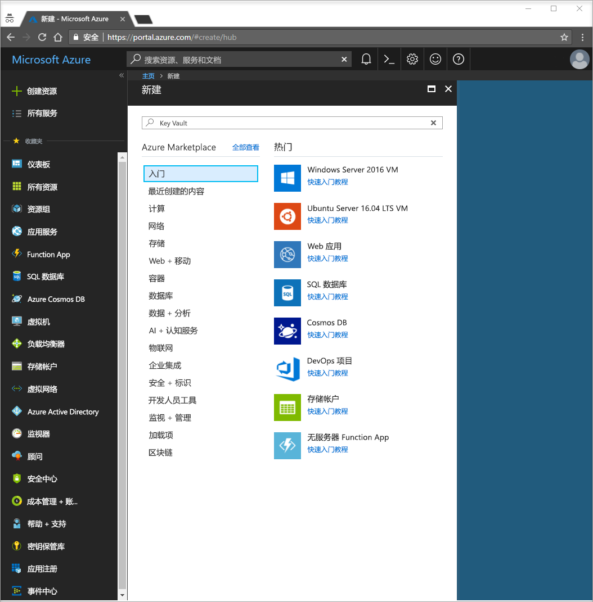
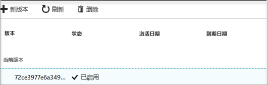

# 快速入门：使用 Azure 门户在 Azure Key Vault 中设置和检索机密

Azure Key Vault 是一项云服务，它为机密提供了安全的存储。 可以安全地存储密钥、密码、证书和其他机密。 可以通过 Azure 门户创建和管理 Azure Key Vault。 在本快速入门中，你将创建一个 Key Vault 并使用它来存储机密。 有关 Key Vault 的详细信息，请参阅[概述](key-vault-overview.md)。

如果没有 Azure 订阅，请在开始之前创建一个[免费帐户](https://azure.microsoft.com/free/?WT.mc_id=A261C142F)。

## 登录 Azure

通过 http://portal.azure.com 登录到 Azure 门户。

## 创建保管库

1. 选择 Azure 门户左上角的“创建资源”选项

    
2. 在“搜索”框中输入“Key Vault”。
3. 从结果列表中选择“Key Vault”。
4. 在“Key Vault”部分，选择“创建”。
5. 在“创建密钥保管库”部分，提供以下信息：
    - **名称**：必须提供唯一的名称。 对于本快速入门，请使用 **Contoso-vault2**。 
    - **订阅**：选择订阅。
    - 在“资源组”下选择“新建”，然后输入资源组名称。
    - 在“位置”下拉菜单中选择一个位置。
    - 勾选“固定到仪表板”复选框。
    - 让其他选项保留默认值。
6. 提供上述信息后，选择“创建”。

请记下下面列出的两个属性：

* **保管库名称**：在本示例中，此项为 **Contoso-Vault2**。 将在其他步骤中使用此名称。
* **保管库 URI**：在本示例中，此项为 https://contoso-vault2.vault.azure.net/。 通过其 REST API 使用保管库的应用程序必须使用此 URI。

目前，只有你的 Azure 帐户有权对这个新保管库执行操作。

## 向 Key Vault 添加机密

只需再执行几个步骤即可向保管库添加机密。 在此示例中，我们将添加可供应用程序使用的密码。 此密码名为 **ExamplePassword**，我们在其中存储的值为 **hVFkk965BuUv**。

1. 在 Key Vault 属性页中，选择“机密”。
2. 单击“生成/导入”。
3. 在“创建机密”屏幕上，选择以下值：
    - **上传选项**：手动。
    - **名称**：ExamplePassword。
    - **值**：hVFkk965BuUv
    - 让其他值保留默认设置。 单击“创建”。

收到机密已成功创建的消息后，即可单击列表中的该机密， 然后就可以看到某些属性。 如果单击当前版本，则可看到在上一步指定的值。

## 清理资源

其他 Key Vault 快速入门和教程是在本快速入门的基础上制作的。 如果打算继续使用后续的快速入门和教程，则可能需要保留这些资源。
如果不再需要资源组，可以将其删除，这将删除 Key Vault 和相关的资源。 要通过门户删除资源组，请执行以下操作：

1. 在门户顶部的“搜索”框中输入资源组的名称。 在搜索结果中看到在本快速入门中使用的资源组后，将其选中。
2. 选择“删除资源组”。
3. 在“键入资源组名称:”框中，键入资源组的名称，然后选择“删除”。

## 后续步骤

在本快速入门中，你已创建 Key Vault 并存储了一个机密。 若要详细了解 Key Vault 以及如何将它与应用程序配合使用，请继续学习有关如何将 Web 应用程序与 Key Vault 配合使用的教程。

> [!div class="nextstepaction"]
> 若要了解如何使用 Web 应用程序通过 Azure 资源的托管标识从 Key Vault 读取机密，请继续学习以下教程：[将 Azure Web 应用程序配置为从 Key Vault 读取机密](quick-create-net.md)。
