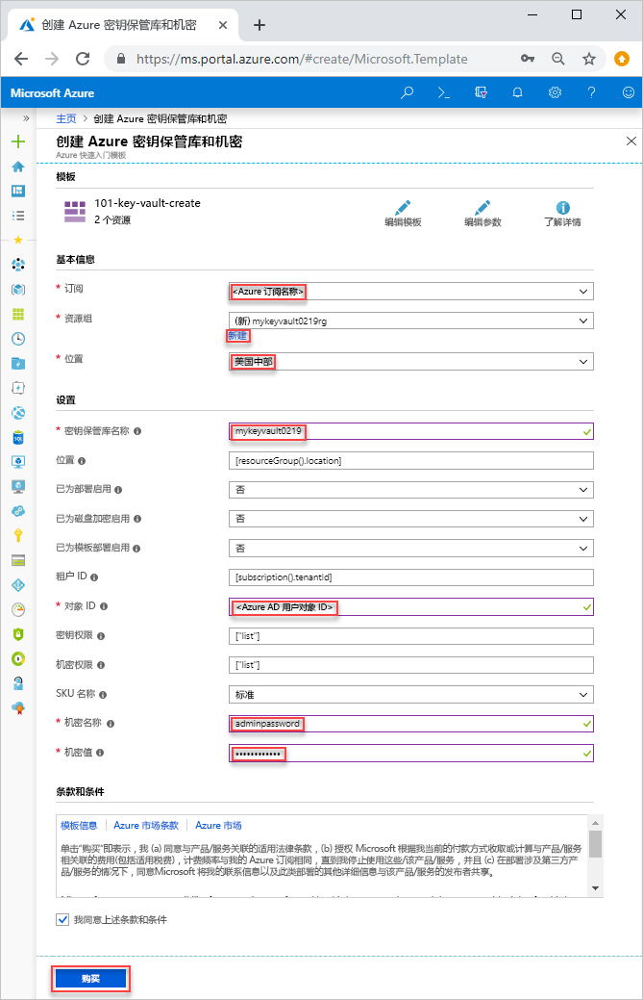

# <a name="quickstart-set-and-retrieve-a-secret-from-azure-key-vault-using-resource-manager-template"></a>快速入门：使用资源管理器模板设置机密以及从 Azure Key Vault 检索机密

[Azure Key Vault](./key-vault-overview.md) 是为密钥、密码、证书等机密及其他机密提供安全存储的云服务。 本快速入门重点介绍部署资源管理器模板用于创建 Key Vault 和机密的过程。 有关开发资源管理器模板的详细信息，请参阅[资源管理器文档](/azure/azure-resource-manager/)和[模板参考](/azure/templates/microsoft.keyvault/allversions)。

如果没有 Azure 订阅，请在开始之前创建一个[免费帐户](https://azure.microsoft.com/free/?WT.mc_id=A261C142F)。

## <a name="prerequisites"></a>先决条件

若要完成本文，需要做好以下准备：

* 模板需要使用你的 Azure AD 用户对象 ID 来配置权限。 以下过程获取对象 ID (GUID)。

    1. 运行以下 Azure PowerShell 或 Azure CLI 命令：选择“试用”，然后在 shell 窗格中粘贴脚本。  若要粘贴脚本，请右键单击 shell，然后选择“粘贴”  。 

        ```azurecli-interactive
        echo "Enter your email address that is used to sign in to Azure:" &&
        read upn &&
        az ad user show --upn-or-object-id $upn --query "objectId" 
        ```

        ```azurepowershell-interactive
        $upn = Read-Host -Prompt "Enter your email address used to sign in to Azure"
        (Get-AzADUser -UserPrincipalName $upn).Id
        ```

    2. 请记下对象 ID， 本快速入门的下一部分需要使用该 ID。

## <a name="create-a-vault-and-a-secret"></a>创建保管库和机密

本快速入门中使用的模板来自 [Azure 快速入门模板](https://azure.microsoft.com/resources/templates/101-key-vault-create/)。 可在[此处](https://azure.microsoft.com/resources/templates/?resourceType=Microsoft.Keyvault)找到更多的 Azure Key Vault 模板示例。

1. 选择下图登录到 Azure 并打开一个模板。 该模板将创建 Key Vault 和机密。

    <a href="https://portal.azure.com/#create/Microsoft.Template/uri/https%3A%2F%2Fraw.githubusercontent.com%2FAzure%2Fazure-quickstart-templates%2Fmaster%2F101-key-vault-create%2Fazuredeploy.json"></a>

2. 选择或输入以下值。  

    

    除非另有指定，否则请使用默认值创建 Key Vault 和机密。

    * **订阅**：选择一个 Azure 订阅。
    * **资源组**：选择“新建”，输入资源组的唯一名称，然后单击“确定”。   
    * **位置**：选择一个位置。  例如“美国中部”。 
    * **密钥保管库名称**：为密钥保管库输入一个在 .vault.azure.net 命名空间中必须全局唯一的名称。  
    * **租户 ID**：模板函数会自动检索租户 ID。不要更改默认值。
    * **AD 用户 ID**：输入在[先决条件](#prerequisites)中检索到的 Azure AD 用户对象 ID。
    * **机密名称**：输入要存储在 Key Vault 中的机密的名称。  例如 **adminpassword**。
    * **机密值**：输入机密值。  如果存储密码，则我们建议使用在“先决条件”中创建的生成密码。
    * **我同意上述条款和条件**：选中。
3. 选择“购买”。 

## <a name="validate-the-deployment"></a>验证部署

可以使用 Azure 门户检查 Key Vault 和机密，或者使用以下 Azure CLI 或 Azure PowerShell 脚本列出创建的机密。

```azurecli-interactive
echo "Enter your key vault name:" &&
read keyVaultName &&
az keyvault secret list --vault-name $keyVaultName
```

```azurepowershell-interactive
$keyVaultName = Read-Host -Prompt "Enter your key vault name"
Get-AzKeyVaultSecret -vaultName $keyVaultName
```

## <a name="clean-up-resources"></a>清理资源

其他 Key Vault 快速入门和教程是在本快速入门的基础上制作的。 如果打算继续使用后续的快速入门和教程，则可能需要保留这些资源。
如果不再需要资源组，可以将其删除，这将删除 Key Vault 和相关的资源。 使用 Azure CLI 或 Azure PowerShell 删除资源组：

```azurecli-interactive
echo "Enter the Resource Group name:" &&
read resourceGroupName &&
az group delete --name $resourceGroupName 
```
```azurepowershell-interactive
$resourceGroupName = Read-Host -Prompt "Enter the Resource Group name"
Remove-AzResourceGroup -Name $resourceGroupName 
```

## <a name="next-steps"></a>后续步骤

* [Azure Key Vault 主页](https://azure.microsoft.com/services/key-vault/)
* [Azure Key Vault 文档](index.yml)
* [用于 Node 的 Azure SDK](https://docs.microsoft.com/javascript/api/overview/azure/key-vault)
* [Azure REST API 参考](https://docs.microsoft.com/rest/api/keyvault/)
