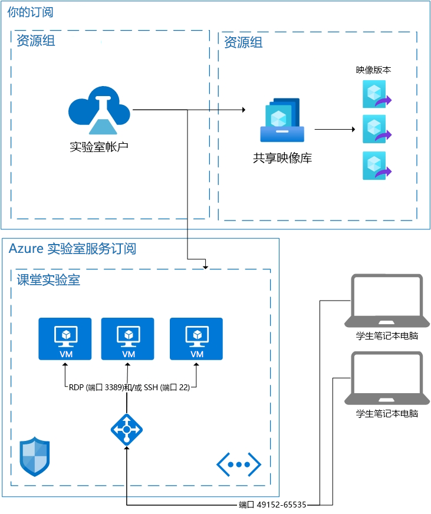

# Azure 实验室服务中的体系结构基础知识

Azure 实验室服务是一种 SaaS（软件即服务）解决方案，这意味着系统会为你处理实验室服务所需的资源。 本文介绍实验室服务所使用的基础资源和实验室的基本体系结构。  

Azure 实验室服务确实提供了几个区域，可让你将自己的资源与实验室服务结合使用。  有关在自己的网络上使用 VM 的详细信息，请参阅如何[将虚拟网络对等互连](how-to-connect-peer-virtual-network.md)。  若要重新使用共享映像库中的映像，请参阅如何[附加共享映像库](how-to-attach-detach-shared-image-gallery.md)。

下面是教室实验室的基本体系结构。  实验室帐户托管在你的订阅中。 学生 VM 以及支持这些 VM 所需的资源托管在实验室服务拥有的订阅中。 让我们更详细地讨论实验室服务的订阅中的内容。

## 托管资源

运行教室实验室所需的资源托管在 Microsoft 管理的某一 Azure 订阅中。  资源包括讲师的模板虚拟机、每个学生的虚拟机以及与网络相关的项目，例如负载均衡器、虚拟网络和网络安全组。  系统会监视这些订阅中是否有可疑活动。  需要特别注意的是，此监视是通过 VM 扩展或网络模式监视从外部对虚拟机进行的。  如果启用了[断开连接时关闭](how-to-enable-shutdown-disconnect.md)，则会在虚拟机上启用诊断扩展。 此扩展使实验室服务可以收到有关远程桌面协议 (RDP) 会话断开连接事件的信息。

## 虚拟网络

每个实验室均由其自己的虚拟网络隔离。  如果实验室具有[对等互连虚拟网络](how-to-connect-peer-virtual-network.md)，则每个实验室都由其自己的子网隔离。  学生通过负载均衡器连接到其虚拟机。  任何学生虚拟机都没有公共 IP 地址；它们只有专用 IP 地址。  学生的连接字符串将是负载均衡器的公共 IP 地址以及一个介于 49152 和 65535 之间的随机端口。  负载均衡器上的入站规则会将连接转发到相应虚拟机的端口22 (SSH) 或端口3389 (RDP)，具体取决于操作系统。 NSG 将阻止任何其他端口上的外部流量。

## 对虚拟机的访问控制

实验室服务将处理学生在其虚拟机上执行启动和停止等操作的能力。  它还控制对其 VM 连接信息的访问。

实验室服务还处理有关学生注册到服务的事宜。 目前有两种不同的访问设置：受限和不受限。 有关详细信息，请参阅[管理实验室用户](how-to-configure-student-usage.md#send-invitations-to-users)一文。 “受限访问”意味着，实验室服务将先确认学生已添加为用户，然后才允许访问。 “不受限”意味着，任何用户都可以注册，只要他们有注册链接并且实验室中有容量。 “不受限”可用于黑客松活动。

在教室实验室中托管的学生 VM 具有实验室创建者设置的用户名和密码。  实验室创建者也可以允许注册的学生在首次登录时选择他们自己的密码。  

## 后续步骤

若要详细了解实验室服务中提供的功能，请参阅 [Azure 实验室服务的概念](classroom-labs-concepts.md)和 [Azure 实验室服务概述](classroom-labs-overview.md)。
