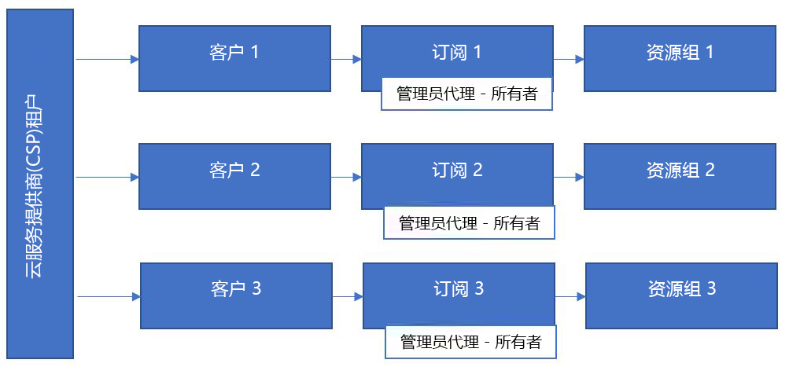
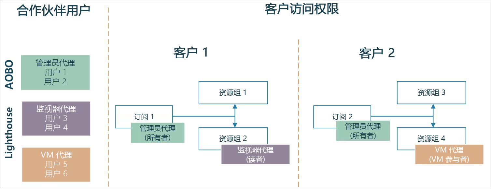

# Azure Lighthouse 和云解决方案提供商计划

如果你是 [CSP（云解决方案提供商）](https://docs.microsoft.com/partner-center/csp-overview)合作伙伴，则可以使用[代表客户管理 (AOBO)](https://channel9.msdn.com/Series/cspdev/Module-11-Admin-On-Behalf-Of-AOBO) 功能，通过 CSP 计划访问为客户创建的 Azure 订阅。 通过这一访问权限，可直接支持、配置和管理客户的订阅。

AOBO 机制授予对客户环境的完整访问权限。 将 Azure 委派资源管理与 AOBO 配合使用，可向用户授予更精细的权限以减少不必要的访问，从而帮助提高安全性。 

## 代表客户管理 (AOBO)

使用 AOBO，租户中具有[管理员代理](https://docs.microsoft.com/partner-center/permissions-overview#manage-commercial-transactions-in-partner-center-azure-ad-and-csp-roles)角色的任何用户都可对通过 CSP 计划创建的 Azure 订阅进行 AOBO 访问。 需要访问任意客户订阅的任何用户都必须是此组的成员。 AOBO 不允许灵活创建对不同客户有效的不同组，也不允许为组或用户启用不同角色。

## Azure 委派资源管理

使用 Azure 委派资源管理，可以将不同的组分配给不同的客户或角色，如下图所示。 通过 Azure 委派资源管理，用户将具有适当级别的访问权限，所以可以减少具有管理员代理角色（并因此具有完整的 AOBO 访问权限）的用户的数量。 通过限制对客户资源的不必要访问，此操作可提供更高的安全性。 还可以更灵活地大规模管理多个客户。

按照[将订阅加入到 Azure 委派资源管理](../how-to/onboard-customer.md)中所述的步骤，加入通过 CSP 计划创建的订阅。 租户中具有管理员代理角色的任何用户都可以执行此加入过程。

请注意，对于通过 CSP 计划创建的订阅，仅服务提供商租户中具有管理员代理角色的用户可生成支持请求。 通过 Azure 委派资源管理添加的用户将无法在这些订阅中打开对委派资源的支持请求。

## 合作伙伴管理链接

可将 Microsoft 合作伙伴网络 (MPN) ID 与载入的订阅相关联，以跟踪你在客户参与中的影响。

如果[将托管服务发布到 Microsoft Azure 市场](../how-to/publish-managed-services-offers.md)，你的 MPN ID 将与发布者配置文件相关联，并自动与该服务关联。 然后，由 Azure 资源通过该服务生成的收入将归属于你的组织。 在合作伙伴报告系统（如合作伙伴中心或 MPN）中，这种归属会显示为“合作伙伴管理链接 (PAL)”。

如果[使用 Azure 资源管理器模板加入客户以便进行 Azure 委派资源管理](../how-to/onboard-customer.md)，仍可以关联 MPN ID 以便就你对客户参与的影响获得认可，但必须手动关联。 有关详细信息，请参阅[将合作伙伴 ID 链接到 Azure 帐户](https://docs.microsoft.com/azure/billing/billing-partner-admin-link-started)。 

## 后续步骤

- 了解[跨租户管理体验](cross-tenant-management-experience.md)。
- 详细了解[云解决方案提供商计划](https://docs.microsoft.com/partner-center/csp-overview)。
