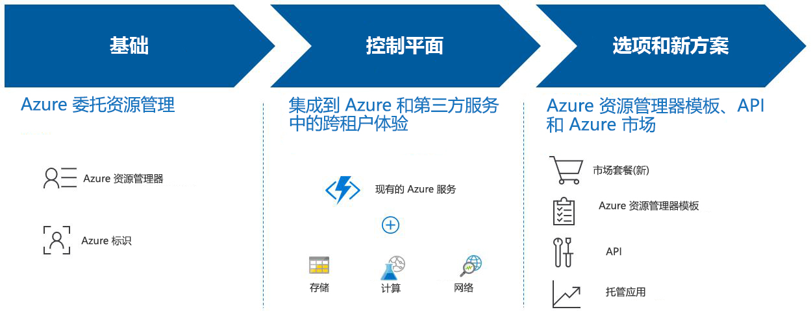

# 什么是 Azure Lighthouse？

Azure Lighthouse 为服务提供商提供了一个用来跨所有客户查看和管理 Azure 的控制平面，具有更高的自动化程度、可伸缩性和增强的管理功能。 借助 Azure Lighthouse，服务提供商可以使用 Azure 平台内置的全面而强大的管理工具来提供托管服务。 此产品/服务还可让企业 IT 组织跨多个租户管理资源。 

## 优点

Azure Lighthouse 有助于你更合理且更有效地为客户构建和交付托管服务。 优点包括：

- **大规模管理**：用于管理客户资源的客户参与和生命周期操作更加简单且更具可缩放性。 现有的 API、管理工具和工作流可以与委托的客户资源配合使用。
- **为客户提供更好的可见性和准确度**：客户会更清楚地了解你的操作，并可精确控制其委托管理的范围，包括在保留 IP 的同时完全删除访问权限的功能。
- **全面统一的平台工具**：我们的工具体验解决了重要的服务提供商方案，其中包括多种许可模型，如 EA、CSP 和即用即付。 新功能适用于现有工具和 API、许可模型和合作伙伴计划，如[云解决方案提供商计划 (CSP)](https://docs.microsoft.com/partner-center/csp-overview)。 Azure Lighthouse 可集成到现有的工作流和应用程序中，你可以通过[关联合作伙伴 ID](../billing/billing-partner-admin-link-started.md) 来跟踪你对客户参与的影响。

使用 Azure Lighthouse 管理客户的 Azure 资源不会产生额外的费用。 任何 Azure 客户或合作伙伴都可以使用 Azure Lighthouse。

## 功能

Azure Lighthouse 提供了多种方法来协助客户简化参与和管理：

- **Azure 委派资源管理**：无需切换上下文和控制平面即可从自己的租户中安全地管理客户的 Azure 资源。 可以将订阅和资源组委托给管理租户中的指定用户和角色，并可以根据需要删除访问权限。 有关详细信息，请参阅 [Azure 委托资源管理](concepts/azure-delegated-resource-management.md)。
- **新 Azure 门户体验**：在 [Azure 门户](https://portal.azure.com)中的新“我的客户”页面中查看跨租户信息  。 使用相应的“服务提供商”边栏选项卡，你的客户可以查看和管理服务提供商访问  。 有关详细信息，请参阅[查看和管理客户](./how-to/view-manage-customers.md)和[查看和管理服务提供商](how-to/view-manage-service-providers.md)。
- **Azure 资源管理器模板**：执行管理任务更加容易，包括载入 Azure 委托资源管理的客户。 有关详细信息，请参阅我们的[存储库示例](https://github.com/Azure/Azure-Lighthouse-samples/tree/master/templates)和[将客户载入到 Azure 委派的资源管理](how-to/onboard-customer.md)。
- **Azure 市场中的托管服务产品**：通过私有或公共产品/服务向客户提供服务，并让他们自动载入 Azure 委派的资源管理，作为使用 Azure 资源管理器模板进行载入的替代方案。 有关详情，请参阅 [Azure 市场中的托管服务产品](concepts/managed-services-offers.md)。

## 后续步骤

- 了解 [Azure 委派资源管理](concepts/azure-delegated-resource-management.md)。
- 了解[跨租户管理体验](concepts/cross-tenant-management-experience.md)。
