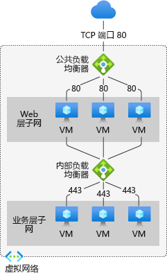
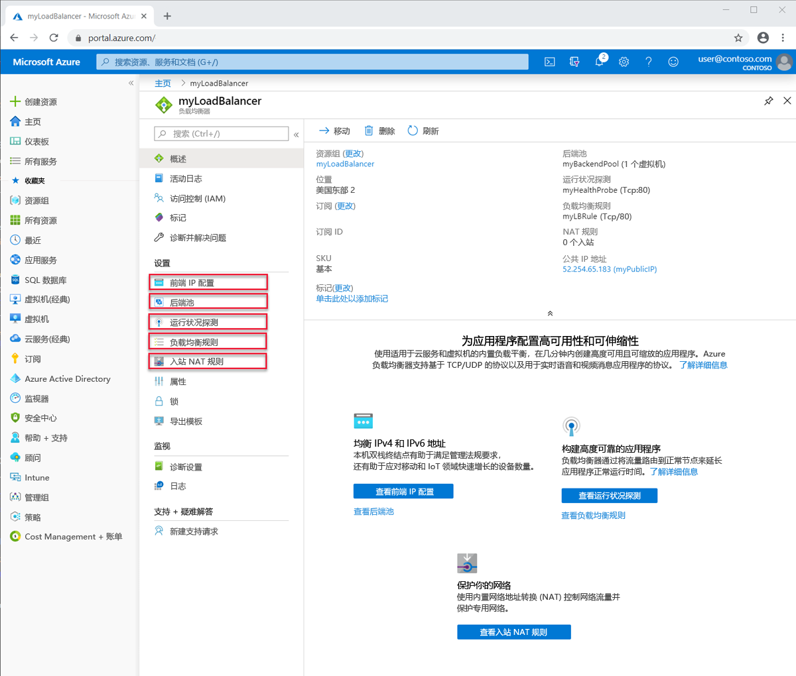

# Azure 负载均衡器组件

Azure 负载均衡器包含几个关键组件，用于执行其操作。 可以通过 Azure 门户、Azure CLI、Azure PowerShell 或模板在你的订阅中配置这些组件。

## 前端 IP 配置

负载均衡器的 IP 地址。 这是客户端的联系点。 这些地址可以是：

- **公共 IP 地址**
- **专用 IP 地址**

对 IP 地址的选择决定了所创建的负载均衡器的类型。  选择“专用 IP 地址”将创建内部负载均衡器。 选择“公共 IP 地址”将创建公共负载均衡器。

|  | 公共负载均衡器  | Internal 负载均衡器（内部负载均衡器） |
| ---------- | ---------- | ---------- |
| 前端 IP 配置| 公共 IP 地址 | 专用 IP 地址|
| 说明 | 公共负载均衡器将传入流量的公共 IP 和端口映射到 VM 的专用 IP 和端口。 负载均衡器将来自 VM 的响应流量映射到另一个方向。 可以通过应用负载均衡规则，在多个 VM 或服务之间分配特定类型的流量。 例如，可将 Web 请求流量负载分配到多个 Web 服务器。| 内部负载均衡器将流量分配给虚拟网络内的各个资源。 Azure 会限制对虚拟网络的负载均衡前端 IP 地址的访问。 前端 IP 地址和虚拟网络不会直接在 Internet 终结点上公开。 内部业务线应用程序可在 Azure 中运行，并可从 Azure 内或从本地资源访问这些应用程序。 |
| 支持的 SKU | 基本、标准 | 基本、标准 |

## 后端池

虚拟机规模集中用于处理传入请求的虚拟机组或实例组。 为了经济高效地扩展以满足大量传入流量，计算准则通常建议向后端池添加更多实例。 

纵向扩展或缩减实例时，负载均衡器可即时通过自动重新配置来重新配置自身。 在后端池中添加或删除 VM 会重新配置负载均衡器，无需执行其他操作。 后端池的范围包括虚拟网络中的任何虚拟机。 

考虑如何设计后端池时，请在设计时尽量减少后端池单个资源的数目，从而缩短管理操作的时长。 数据平面的性能或规模并无差异。

## 运行状况探测

运行状况探测用于确定后端池中实例的运行状况。 可以定义运行状况探测的不正常阈值。 当探测无法响应时，负载均衡器会停止向状况不良的实例发送新连接。 探测失败不会影响现有连接。 连接将继续，直到应用程序：

- 结束流
- 出现空闲超时
- VM 关闭

负载均衡器为终结点提供了不同的运行状况探测类型：

- TCP
- HTTP
- HTTPS

基本负载均衡器不支持 HTTPS 探测。 基本负载均衡器会关闭所有 TCP 连接（包括已建立的连接）。

## 负载均衡规则

负载均衡规则告诉负载均衡器要做什么。 负载均衡规则将给定的前端 IP 配置和端口映射到多个后端 IP 地址和端口。

## 入站 NAT 规则

入站 NAT 规则将来自前端 IP 地址的流量转发到虚拟网络中的后端实例。 可以通过与负载均衡相同的基于哈希的分配来实现此端口转发。 

用法示例：通过远程桌面协议 (RDP) 或安全外壳 (SSH) 会话对虚拟网络中的 VM 实例进行划分。 可将多个内部终结点映射到同一前端 IP 地址上的多个端口。 可以使用前端 IP 地址来远程管理 VM，无需额外配置跳转盒。

## 出站规则

出站规则为后端池所标识的所有虚拟机或实例配置出站网络地址转换 (NAT)。

基本负载均衡器不支持出站规则。

## 后续步骤

- 请参阅[创建公共标准负载均衡器](quickstart-load-balancer-standard-public-portal.md)，开始使用负载均衡器。
- 详细了解 [Azure 负载均衡器](load-balancer-overview.md)。
- 了解[公共 IP 地址](https://docs.microsoft.com/azure/virtual-network/virtual-network-public-ip-address)
- 了解[专用 IP 地址](https://docs.microsoft.com/azure/virtual-network/virtual-network-ip-addresses-overview-arm#private-ip-addresses)
- 了解如何使用[标准负载均衡器和可用性区域](load-balancer-standard-availability-zones.md)。
- 了解有关[标准负载均衡器诊断](load-balancer-standard-diagnostics.md)的信息。
- 了解如何[在空闲时重置 TCP](load-balancer-tcp-reset.md)。
- 了解[具有 HA 端口负载均衡规则的标准负载均衡器](load-balancer-ha-ports-overview.md)。
- 了解如何使用[具有多个前端的负载均衡器](load-balancer-multivip-overview.md)。
- 详细了解[网络安全组](../virtual-network/security-overview.md)。
- 了解[探测类型](load-balancer-custom-probe-overview.md#types)。
- 详细了解[负载均衡器限制](https://docs.microsoft.com/azure/azure-resource-manager/management/azure-subscription-service-limits#load-balancer)。
- 了解如何使用[端口转发](https://docs.microsoft.com/azure/load-balancer/tutorial-load-balancer-port-forwarding-portal)。
- 详细了解[负载均衡器出站规则](https://docs.microsoft.com/azure/load-balancer/load-balancer-outbound-rules-overview)。
