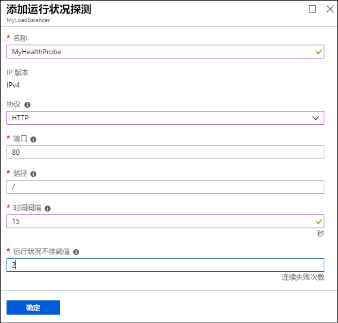
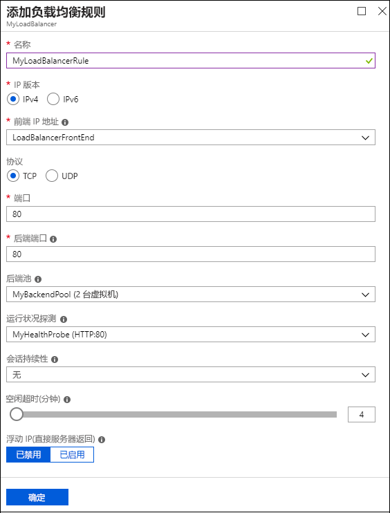

# 使用 Azure 门户创建公共的基本负载均衡器，以便对 VM 进行负载均衡

可以通过负载均衡将传入请求分布到多个虚拟机，从而提供更高级别的可用性和规模。 可以通过 Azure 门户创建负载均衡器，对虚拟机进行负载均衡。 本快速入门演示如何创建网络资源、后端服务器和公共的基本负载均衡器。

如果你还没有 Azure 订阅，可以在开始前创建一个 [免费帐户](https://azure.microsoft.com/free/?WT.mc_id=A261C142F)。 

## 登录到 Azure 门户

在 [http://portal.azure.com](http://portal.azure.com) 中登录 Azure 门户。

## 创建基本负载均衡器

在此部分，请使用门户创建公共的基本负载均衡器。 使用门户创建负载均衡器资源时会创建公共 IP，此时会自动将公共 IP 地址配置为负载均衡器的前端，即 *LoadBalancerFrontend*。

1. 在屏幕的左上方，单击“创建资源” > “网络” > “负载均衡器”。
2. 在“创建负载均衡器”页中，输入负载均衡器的以下值：
    - *myLoadBalancer* - 负载均衡器的名称。
    - **公共** - 负载均衡器的类型。
    - *myPublicIP* - 必须创建的公共 IP，其 SKU 必须设置为“基本”，“分配”必须设置为“动态”。
    - *myResourceGroupLB* - 所创建的新资源组的名称。
3. 单击“创建”以创建负载均衡器。
   
    

## 创建后端服务器

在此部分，请先创建一个虚拟网络，为基本负载均衡器的后端池创建两个虚拟机，然后在虚拟机上安装 IIS，以便对负载均衡器进行测试。

### 创建虚拟网络
1. 在屏幕的左上方，单击“新建” > “网络” > “虚拟网络”，然后输入虚拟网络的以下值：
    - *myVnet* - 虚拟网络的名称。
    - *myResourceGroupLB* - 现有资源组的名称。
    - *myBackendSubnet* - 子网名称。
2. 单击“创建”以创建虚拟网络。

    

### 创建虚拟机

1. 在屏幕的左上方，单击“新建” > “计算” > “Windows Server 2016 Datacenter”，然后输入虚拟机的以下值：
    - *myVM1* - 虚拟机的名称。        
    - *azureuser* - 管理员用户名。 -    
    - *myResourceGroupLB* - 对于“资源组”，请选择“使用现有”，然后选择“myResourceGroupLB”。
2. 单击“确定”。
3. 选择“DS1_V2”作为虚拟机的大小，然后单击“选择”。
4. 为 VM 设置输入以下值：
    - *myAvailabilitySet* - 新建的可用性集的名称。
    -  *myVNet* - 确保选择它作为虚拟网络。
    - *myBackendSubnet* - 确保选择它作为子网。
    - *myVM1-ip* - 公共 IP 地址。
    - *myNetworkSecurityGroup* - 必须创建的新网络安全组（防火墙）的名称。
5. 单击“禁用”以禁用启动诊断。
6. 创建“确定”，检查“摘要”页上的设置，然后单击“创建”。
7. 通过步骤 1-6 创建名为 *VM2* 的另一个 VM，使用 *myAvailabilityset* 作为可用性集，*myVnet* 作为虚拟网络，*myBackendSubnet* 作为子网，*myNetworkSecurityGroup* 作为其网络安全组。 

### 创建 NSG 规则

在此部分，请创建允许使用 HTTP 和 RDP 进行入站连接的 NSG 规则。

1. 单击左侧菜单中的“所有资源”，然后从资源列表中单击“myNetworkSecurityGroup”，后者位于 **myResourceGroupLB** 资源组中。
2. 在“设置”下单击“入站安全规则”，然后单击“添加”。
3. 为名为 *myHTTPRule* 的入站安全规则输入以下值，以允许来自端口 80 的入站 HTTP 连接：
    - 服务标记 - **源**。
    - *Internet* - **源服务标记**
    - *80* - **目标端口范围**
    - *TCP* - **协议**
    - 允许 - **操作**
    - *100* - **优先级**
    - *myHTTPRule* - 名称
    - 允许 HTTP - 说明
4. 单击“确定”。
 
 
5. 重复步骤 2 到 4，使用以下值创建名为 *myRDPRule* 的另一规则，以允许来自端口 3389 的入站 RDP 连接：
    - 服务标记 - **源**。
    - *Internet* - **源服务标记**
    - *3389* - **目标端口范围**
    - *TCP* - **协议**
    - 允许 - **操作**
    - *200* - **优先级**
    - *myRDPRule* - 名称
    - 允许 RDP - 说明

   

### 安装 IIS

1. 单击左侧菜单中的“所有资源”，然后从资源列表中单击“myVM1”，后者位于 *myResourceGroupLB* 资源组中。
2. 在“概览”页上单击“连接”，以便通过 RDP 连接到 VM 中。
3. 使用用户名 *azureuser* 和密码 *Azure123456!* 登录到 VM
4. 在服务器桌面上导航到“Windows 管理工具”>“服务器管理器”。
5. 在“服务器管理器”中单击“管理”，然后单击“添加角色和功能”。
 
6. 在“添加角色和功能向导”中使用以下值：
    - 在“选择安装类型”页中，单击“基于角色或基于功能的安装”。
    - 在“选择目标服务器”页中，单击“myVM1”
    - 在“选择服务器角色”页中，单击“Web 服务器(IIS)”
    - 按照说明完成向导的其余部分 
7. 对于虚拟机 *myVM2*，请重复步骤 1 到 6。

## 创建基本负载均衡器资源

在此部分，请为后端地址池和运行状况探测配置负载均衡器设置，并指定负载均衡器和 NAT 规则。

### 创建后端地址池

若要向 VM 分发流量，后端地址池需包含连接到负载均衡器的虚拟 NIC 的 IP 地址。 创建包括 *VM1* 和 *VM2* 的后端地址池 *myBackendPool*。

1. 单击左侧菜单中的“所有资源”，然后在资源列表中单击“myLoadBalancer”。
2. 在“设置”下单击“后端池”，然后单击“添加”。
3. 在“添加后端池”页上执行以下操作：
    - 对于“名称”，请键入 *myBackEndPool 作为后端池的名称。
    - 对于“关联到”，请在下拉菜单中单击“可用性集”。
    - 对于“可用性集”，请单击“myAvailabilitySet”。
    - 单击“添加目标网络 IP 配置”将所创建的每个虚拟机 (*myVM1* & *myVM2*) 添加到后端池。
    - 单击“确定”。

    

3. 通过检查确保负载均衡器后端池设置显示 **VM1** 和 **VM2** 这两个 VM。

### 创建运行状况探测器

若要让基本负载均衡器监视应用的状态，请使用运行状况探测。 运行状况探测器基于其对运行状况检查的响应，从负载均衡器中动态添加或删除 VM。 创建运行状况探测 *myHealthProbe* 以监视 VM 的运行状况。

1. 单击左侧菜单中的“所有资源”，然后在资源列表中单击“myLoadBalancer”。
2. 在“设置”下单击“运行状况探测”，然后单击“添加”。
3. 使用以下值创建运行状况探测：
    - *myHealthProbe* - 运行状况探测的名称。
    - **HTTP** - 协议类型。
    - *80* - 端口号。
    - *15* - 两次探测尝试之间的**时间间隔**（以秒为单位）。
    - *2* - 将 VM 视为不正常所对应的**不正常阈值**或连续探测失败次数。
4. 单击“确定”。

   

### 创建负载均衡器规则

负载均衡器规则用于定义将流量分配给 VM 的方式。 定义传入流量的前端 IP 配置和后端 IP 池以接收流量，同时定义所需源和目标端口。 创建负载均衡器规则 *myLoadBalancerRuleWeb*，以便侦听前端 *LoadBalancerFrontEnd* 中的端口 80，并将经过负载均衡的网络流量发送到也使用端口 80 的后端地址池 *myBackEndPool*。 

1. 单击左侧菜单中的“所有资源”，然后在资源列表中单击“myLoadBalancer”。
2. 在“设置”下单击“负载均衡规则”，然后单击“添加”。
3. 请使用以下值配置负载均衡规则：
    - *myHTTPRule* - 负载均衡规则的名称。
    - **TCP** - 协议类型。
    - *80* - 端口号。
    - *80* - 后端端口。
    - *myBackendPool* - 后端池的名称。
    - *myHealthProbe* - 运行状况探测的名称。
4. 单击“确定”。
    
    

## 测试负载均衡器
1. 在“概览”屏幕上找到负载均衡器的公共 IP 地址。 单击“所有资源”，然后单击“myPublicIP”。

2. 复制该公共 IP 地址，并将其粘贴到浏览器的地址栏。 IIS Web 服务器的默认页会显示在浏览器上。

  

## 清理资源

若不再需要资源组、负载均衡器以及所有相关资源，请将其删除。 为此，请选择包含负载均衡器的资源组，然后单击“删除”。

## 后续步骤

在本快速入门中，创建了资源组、网络资源和后端服务器。 然后使用这些资源创建了负载均衡器。 若要详细了解负载均衡器及其关联的资源，请继续阅读教程文章。
