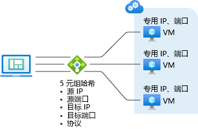
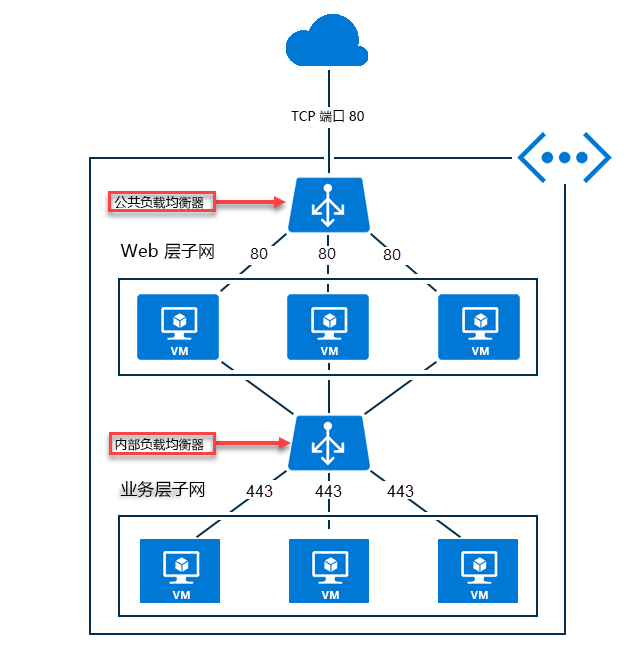

# Azure 负载均衡器概述

使用 Azure 负载均衡器可以缩放应用程序，并为服务提供高可用性。 负载均衡器支持入站和出站场景、提供低延迟和高吞吐量，以及为所有 TCP 和 UDP 应用程序纵向扩展到数以百万计的流。   

负载均衡器根据规则和运行状况探测，将抵达负载均衡器前端的新入站流量分配到后端池实例。  

此外，公共负载均衡器还可将虚拟网络中虚拟机的专用 IP 地址转换为公共 IP 地址，从而为这些虚拟机提供出站连接。

Azure 负载均衡器以两种不同的 SKU 提供：“基本”和“标准”。  规模、功能和定价方面有差异。  尽管使用基本负载均衡器可以实现的任何场景也可以通过标准负载均衡器来创建，但创建方法略有不同。  在学习负载均衡器的过程中，必须熟悉基础知识和 SKU 方面的差异。

## 为何使用负载均衡器？ 

Azure 负载均衡器可用于：

* 对传入到虚拟机的 Internet 流量进行负载均衡。 此配置称为[公共负载均衡器](#publicloadbalancer)。
* 对虚拟网络中虚拟机之间的流量进行负载均衡。 还可以在混合场景中从本地网络访问负载均衡器前端。 这两种场景都使用称作[内部负载均衡器](#internalloadbalancer)的配置。
* 使用入站 NAT 规则通过端口转发将流量转发到特定虚拟机上的特定端口。
* 使用公共负载均衡器为虚拟网络中的虚拟机提供[出站连接](load-balancer-outbound-connections.md)。

>[!NOTE]
> Azure 为方案提供了一套完全托管的负载均衡解决方案。  若要寻求 TLS 终止（“SSL 卸载”）或每个 HTTP/HTTPS 请求的应用层处理，请查看[应用程序网关](../application-gateway/application-gateway-introduction.md)。  若要寻求全局 DNS 负载均衡，请查看[流量管理器](../traffic-manager/traffic-manager-overview.md)。  端到端场景可从结合所需的解决方案中受益。

## 什么是负载均衡器？

负载均衡器资源可以是公共负载均衡器或内部负载均衡器。 负载均衡器资源的功能表示为前端、规则、运行状况探测和后端池定义。  可通过从虚拟机指定后端池，将虚拟机放入后端池。

负载均衡器资源是一些对象，可在其中表述 Azure 应如何设定其多租户基础结构，以实现想要创建的场景。  负载均衡器资源与实际基础结构之间不存在直接的关系，创建负载均衡器不会创建实例，容量始终可用。 

## 基本的负载均衡器功能

负载均衡器为 TCP 和 UDP 应用程序提供以下基本功能：

* **负载均衡**

    使用 Azure 负载均衡器可以创建负载均衡规则，以便将抵达前端的流量分配到后端池实例。  负载均衡器使用基于哈希的算法来分配入站流量，并相应地重写发往后端池实例的流量的标头。 当运行状况探测指示后端终结点正常时，可以使用一个服务器来接收新流量。
    
    默认情况下，负载均衡器使用 5 元组哈希（包括源 IP 地址、源端口、目标 IP 地址、目标端口和 IP 协议编号）将流量映射到可用服务器。  可以启用给定规则的 2 元组或 3 元组哈希，来与特定的源 IP 地址创建关联。  同一数据包流量的所有数据包将会抵达负载均衡前端后面的同一实例。  当客户端从同一源 IP 发起新流量时，源端口将会更改。 生成的 5 元组可能导致流量定向到不同的后端终结点。

    有关详细信息，请参阅[负载均衡器分配模式](load-balancer-distribution-mode.md)。 下图显示了基于哈希的分发：

    

    *图 - 基于哈希的分配*

* **端口转发**

    使用 Azure 负载均衡器可以创建入站 NAT 规则，以便通过端口转发，将来自特定前端 IP 地址的特定端口的流量转发到虚拟网络中特定后端实例的特定端口。 也可以通过与负载均衡相同的基于哈希的分配来实现此目的。  此功能的常见应用场景是与虚拟网络中的单个虚拟机实例建立远程桌面协议 (RDP) 或安全外壳 (SSH) 会话。  可将多个内部终结点映射到相同前端 IP 地址上的不同端口。 使用这些端口可以通过 Internet 远程管理虚拟机，而无需额外配置 Jumpbox。

* **应用程序不可知性和透明性**

    负载均衡器不直接与 TCP、UDP 或应用层交互，可支持任何基于 TCP 或 UDP 的应用场景。  例如，尽管负载均衡器不会终止 TLS 本身，但你可以使用负载均衡器构建并横向扩展 TLS 应用程序，并在虚拟机本身上终止 TLS 连接。 负载均衡器不会终止流，协议握手始终在客户端与哈希选择的后端池实例之间直接发生。 例如，TCP 握手就始终在客户端与选定的后端虚拟机之间发生。  对前端请求做出的响应是从后端虚拟机生成的响应。  负载均衡器的出站网络性能仅受限于所选的虚拟机 SKU，如果永远达不到空闲超时，则流就能长时间保持活动状态。

* **自动重新配置**

    增加或减少实例时，Azure 负载均衡器会立即自行重新配置。 在后端池中添加或删除虚拟机会重新配置负载均衡器，而无需针对负载均衡器资源执行附加的操作。

* **运行状况探测**

    Azure 负载均衡器使用定义的运行状况探测来确定后端池中实例的运行状况。 当探测无法响应时，负载均衡器会停止向状况不良的实例发送新连接。 现有连接不受影响，会一直保留到应用程序终止了流、发生空闲超时或虚拟机关闭为止。

    支持三种类型的探测：

    - **HTTP 自定义探测：**可以使用此探测来创建自己的自定义逻辑，以确定后端池实例的运行状况。 负载均衡器将定期探测终结点（默认情况下，每隔 15 秒探测 1 次）。 如果实例在超时期限内（默认为 31 秒）内使用 HTTP 200 做出响应，则认为该实例正常。 非 HTTP 200 的任何状态会导致此探测失败。  若要实现自己的逻辑以便从负载均衡器轮换中删除实例，此探测也很有用。 例如，可以将实例配置为在实例的 CPU 使用率超出 90% 时返回非 200 状态。   此探测将替代默认来宾代理探测。

    - **TCP 自定义探测：**此探测依赖于在定义的探测端口上成功建立 TCP 会话。  只要虚拟机上指定的侦听器存在，此探测就会成功。 如果连接被拒绝，此探测将会失败。 此探测将替代默认来宾代理探测。

    - **来宾代理探测（仅适用于平台即服务虚拟机）：**负载均衡器也可以利用虚拟机中的来宾代理。 仅当实例处于就绪状态时，来宾代理才会侦听并以“HTTP 200 正常”做出响应。 如果代理没有使用“HTTP 200 正常”进行响应，则负载均衡器会将实例标记为无响应，并停止向该实例发送流量。 负载均衡器继续尝试访问实例。 如果来宾代理使用 HTTP 200 进行了响应，则负载均衡器将再次向该实例发送流量。  来宾代理探测是最终手段，如果支持 HTTP 或 TCP 自定义探测配置，则不应使用来宾代理探测。 
    
* **出站连接（源 NAT）**

    从虚拟网络中的专用 IP 地址发往 Internet 上的公共 IP 地址的所有出站流量可以转换为负载均衡器的前端 IP 地址。 通过负载均衡规则将公共前端绑定到后端虚拟机后，Azure 会将出站连接设定为自动转换成公共前端的 IP 地址。 这也称为源 NAT (SNAT)。 SNAT 的重要优势在于：

    + 可以轻松地对服务进行升级和灾难恢复操作，因为前端可以动态映射到服务的其他实例。
    + 简化了访问控制列表 (ACL) 管理。 以前端 IP 表示的 ACL 不会随着服务的缩放或重新部署而更改。

    有关此功能的详细讨论，请参阅[出站连接](load-balancer-outbound-connections.md)一文。

除这些基本功能以外，标准负载均衡器还提供其他特定于 SKU 的功能。  有关详细信息，请查看本文的余下部分。

## 负载均衡器 SKU 的比较

Azure 负载均衡器支持两个不同的 SKU：“基本”和“标准”。  场景规模、功能和定价方面有差异。  使用基本负载均衡器可以实现的任何场景也可以通过标准负载均衡器来创建。  事实上，这两个 SKU 的 API 类似，都可以通过 SKU 的规范来调用。  从 2017-08-01 API 开始，提供了负载均衡器和公开 IP 的支持性 SKU 的 API。  这两个 SKU 具有相同的常规 API 和结构。

但是，根据所选的 SKU，完整的场景配置详细信息可能略有不同。 如果某篇文章仅适用于特定的 SKU，负载均衡器文档中会做出相应的标识。 请查看下表来比较和了解差异。  有关更多详细信息，请查看[标准负载均衡器概述](load-balancer-standard-overview.md)。

>[!NOTE]
> 应考虑对新设计使用标准负载均衡器。 

独立虚拟机、可用性集和虚拟机规模集只能连接到一个 SKU，永远无法同时连接到两个 SKU。 与公共 IP 地址配合使用时，负载均衡器和公共 IP 地址 SKU 必须匹配。 负载均衡器和公共 IP SKU 不可变。

_最佳做法是显式指定 SKU，尽管目前不强制要求这样做。_  目前，所需的更改保持在最低的限度。 如果未指定 SKU，则认为有意在 2017-08-01 API 版本中使用基本 SKU。

>[!IMPORTANT]
>标准负载均衡器是一款新的负载均衡器产品，在很大程度上是基本负载均衡器的超集。  这两款产品之间存在重要的且有意而为的差异。  使用基本负载均衡器可以实现的任何端到端场景也可以通过标准负载均衡器来创建。  如果你惯于使用基本负载均衡器，则应该也对标准负载均衡器很熟悉，能够理解两者之间在重大行为差异，以及这种差异造成的影响。 请认真阅读本部分。

| | [标准 SKU](load-balancer-standard-overview.md) | 基本 SKU |
| --- | --- | --- |
| 后端池大小 | 最多 1000 个实例 | 最多 100 个实例 |
| 后端池终结点 | 一个虚拟网络中的任何虚拟机，包括虚拟机、可用性集和虚拟机规模集的混合。 | 一个可用性集或虚拟机规模集中的虚拟机 |
| 可用性区域 | 入站和出站的区域冗余和区域前端，出站流映射在发生区域故障后仍保留，跨区域负载均衡 | / |
| 诊断 | Azure Monitor、多维度指标（包括字节和数据包计数器）、运行状况探测状态、连接尝试 (TCP SYN)、出站连接运行状况（SNAT 成功和失败流）、活动数据平面度量 | 仅用于公共负载均衡器的 Azure Log Analytics、SNAT 耗尽警报、后端池运行状况计数 |
| HA 端口 | 内部负载均衡器 | / |
| 默认保护 | 在默认情况下，对公共 IP 和负载均衡器终结点关闭，网络安全组必须用于显式允许列表，以便流量流动 | 默认打开，可选网络安全组 |
| 出站连接 | 多个前端，可根据每个规则选择禁用。必须显式创建出站方案，以便虚拟机能够使用出站连接。  [VNet 服务终结点](../virtual-network/virtual-network-service-endpoints-overview.md)无需出站连接便可访问，且不会计入处理的数据。  任何公共 IP 地址（包括不作为 VNet 服务终结点提供的 Azure PaaS 服务）必须通过出站连接才能访问，且计入处理的数据。 如果只有一个内部负载均衡器向虚拟机提供服务，通过默认 SNAT 的出站连接将不可用。 出站 SNAT 编程特定于传输协议，并以入站负载均衡规则的协议为基础。 | 单个前端，存在多个前端时随机选择。  如果仅内部负载均衡器向虚拟机提供服务，则使用默认 SNAT。 |
| 多个前端 | 入站和出站 | 仅限入站 |
| 管理操作 | 大多数操作都小于 30 秒 | 通常为 60 - 90 多秒 |
| SLA | 对拥有两个正常运行的虚拟机的数据路径为 99.99% | 在 VM SLA 中为隐式 | 
| 定价 | 基于规则数、与资源关联且经过入站或出站处理的数据量进行计费  | 免费 |

查看[负载均衡器的服务限制](https://aka.ms/lblimits)。  对于标准负载均衡器，另请查看更详细的[概述](load-balancer-standard-overview.md)、[定价](https://aka.ms/lbpricing)和 [SLA](https://aka.ms/lbsla)。

## 概念

### 公共负载均衡器

公共负载均衡器将传入流量的公用 IP 地址和端口号映射到虚拟机的专用 IP 地址和端口号，对于来自虚拟机的响应流量，则进行反向的映射。 借助负载均衡规则，可在多个虚拟机或服务之间分配特定类型的流量。 例如，可将 Web 请求流量负载分配到多个 Web 服务器。

下图显示了公用和专用 TCP 端口 80 的 Web 流量的负载均衡终结点，由三个虚拟机共享。 三台虚拟机位于负载均衡集中。

*图：使用公共负载均衡器对 Web 流量进行负载均衡*

当 Internet 客户端将网页请求发送到 TCP 端口 80 上的 Web 应用的公共 IP 地址时，Azure 负载均衡器会在负载均衡集中的三个虚拟机之间分配请求。 有关负载均衡器算法的详细信息，请参阅[负载均衡器概述页](load-balancer-overview.md#load-balancer-features)。

默认情况下，Azure 负载均衡器在多个虚拟机实例之间平均分发网络流量。 还可以配置会话关联。 有关详细信息，请参阅[负载均衡器分配模式](load-balancer-distribution-mode.md)。

### 内部负载均衡器。

内部负载均衡器仅将流量定向到虚拟网络中的资源，或定向到使用 VPN 访问 Azure 基础结构的资源。 在此方面，内部负载均衡器不同于公共负载均衡器。 Azure 基础结构会限制对虚拟网络的负载均衡前端 IP 地址的访问。 前端 IP 地址和虚拟网络不会直接在 Internet 终结点上公开。 内部业务线应用程序可在 Azure 中运行，并可从 Azure 内或从本地资源访问这些应用程序。

内部负载均衡器支持以下类型的负载均衡：

* 在虚拟网络中：从虚拟网络中的 VM 负载均衡到驻留在同一虚拟网络中的一组 VM。
* 对于跨界虚拟网络：从本地计算机负载均衡到驻留在同一虚拟网络中的一组 VM。 
* 对于多层应用程序：对面向 Internet 的多层应用程序进行负载均衡，其中的后端层不面向 Internet。 后端层需要针对面向 Internet 的层发出的流量进行负载均衡（参阅图 2）。
* 对于业务线应用程序：使托管在 Azure 中的业务线应用程序实现负载均衡，而无需其他负载均衡器硬件或软件。 此方案将本地服务器包含在一组流量已实现负载均衡的计算机中。

*图 - 使用公共和内部负载均衡器对多层应用程序进行负载均衡*

## 定价
标准负载均衡器根据以下内容计费：配置的负载均衡规则数量以及处理的所有入站和出站数据量。 有关标准负载均衡器的定价信息，请访问[负载均衡器定价](https://azure.microsoft.com/pricing/details/load-balancer/)页。

基本负载均衡器是免费提供的。

## SLA

有关标准负载均衡器 SLA 的信息，请访问[负载均衡器 SLA](https://aka.ms/lbsla) 页。 

## 后续步骤

- 查看[有关标准负载均衡器的更多详细信息](load-balancer-standard-overview.md)
- 了解如何使用[标准负载均衡器和可用性区域](load-balancer-standard-availability-zones.md)
- 了解如何[对出站连接使用负载均衡器](load-balancer-outbound-connections.md)
- 了解[负载均衡器高可用性端口](load-balancer-ha-ports-overview.md)
- 了解如何[对多个前端使用负载均衡器](load-balancer-multivip-overview.md)
- 了解 [VNet 服务终结点](../virtual-network/virtual-network-service-endpoints-overview.md)
- 了解如何创建[基本的公共负载均衡器](load-balancer-get-started-internet-portal.md)

