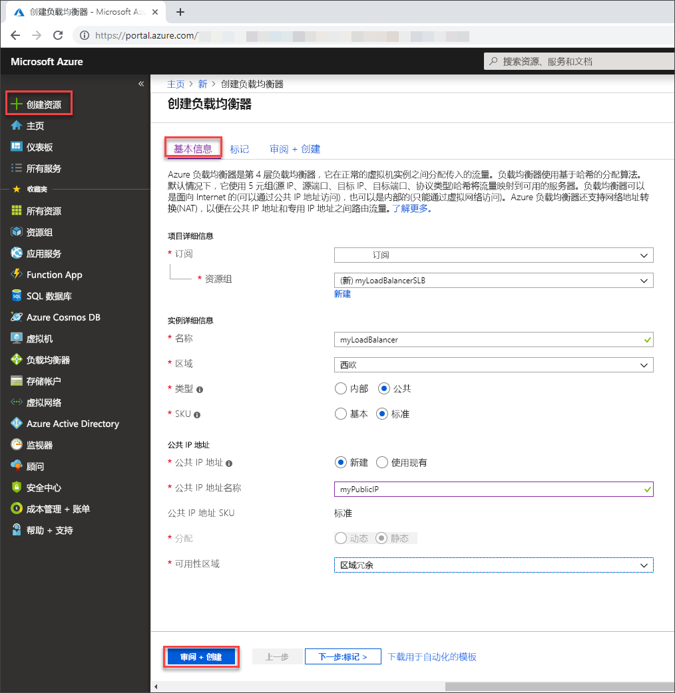

# <a name="quickstart-create-a-standard-load-balancer-to-load-balance-vms-using-the-azure-portal"></a>快速入门：使用 Azure 门户创建标准负载均衡器以对 VM 进行负载均衡

可以通过负载均衡将传入请求分布到多个虚拟机，从而提供更高级别的可用性和可伸缩性。 可以通过 Azure 门户创建负载均衡器，对虚拟机 (VM) 进行负载均衡。 本快速入门演示如何使用标准负载均衡器对 VM 进行负载均衡。

如果没有 Azure 订阅，请在开始之前创建一个[免费帐户](https://azure.microsoft.com/free/?WT.mc_id=A261C142F)。 

## <a name="sign-in-to-azure"></a>登录 Azure

在 [https://portal.azure.com](https://portal.azure.com) 中登录 Azure 门户。

## <a name="create-a-standard-load-balancer"></a>创建标准负载均衡器

在本部分，我们将创建一个标准负载均衡器，以帮助对虚拟机进行负载均衡。 标准负载均衡器仅支持标准公共 IP 地址。 创建标准负载均衡器时，还必须为该标准负载均衡器创建一个配置为前端（默认情况下命名为 *LoadBalancerFrontend*）的新的标准公共 IP 地址。 

1. 在屏幕的左上方，选择“创建资源” > “网络” > “负载均衡器”。
2. 在“创建负载均衡器”页的“基本”选项卡中输入或选择以下信息，接受其余的默认设置，然后选择“查看 + 创建”：

    | 设置                 | 值                                              |
    | ---                     | ---                                                |
    | 订阅               | 选择订阅。    |    
    | 资源组         | 选择“新建”并在文本框中键入 *myResourceGroupSLB*。|
    | 名称                   | *myLoadBalancer*                                   |
    | 区域         | 选择“西欧”。                                        |
    | Type          | 选择“公共”。                                        |
    | SKU           | 选择“标准”。                          |
    | 公共 IP 地址 | 选择“新建”。 |
    | 公共 IP 地址名称              | 在文本框中键入 myPublicIP。   |
    |可用性区域| 选择“区域冗余”。    |
3. 在“查看 + 创建”选项卡中，选择“创建”。   

    

## <a name="create-load-balancer-resources"></a>创建负载均衡器资源

在本部分中，我们将为后端地址池和运行状况探测配置负载均衡器设置，并指定均衡器规则。

### <a name="create-a-backend-address-pool"></a>创建后端地址池

若要向 VM 分发流量，后端地址池需包含连接到负载均衡器的虚拟 NIC 的 IP 地址。 创建后端地址池 *myBackendPool* 以包含用于对 Internet 流量进行负载均衡的虚拟机。

1. 在左侧菜单中选择“所有服务”，选择“所有资源”，然后在资源列表中选择“myLoadBalancer”。
2. 在“设置”下，依次选择“后端池”、“添加”。
3. 在“添加后端池”页上，键入 **myBackendPool** 作为后端池的名称，然后选择“添加”。

### <a name="create-a-health-probe"></a>创建运行状况探测器

若要允许负载均衡器监视应用的状态，请使用运行状况探测器。 运行状况探测器基于其对运行状况检查的响应，在负载均衡器中动态添加或删除 VM。 创建运行状况探测 *myHealthProbe* 以监视 VM 的运行状况。

1. 在左侧菜单中选择“所有服务”，选择“所有资源”，然后在资源列表中选择“myLoadBalancer”。
2. 在“设置”下，依次选择“运行状况探测”、“添加”。
    
    | 设置 | 值 |
    | ------- | ----- |
    | 名称 | 输入 *myHealthProbe*。 |
    | 协议 | 选择“HTTP”。 |
    | 端口 | 输入 *80*。|
    | 时间间隔 | 输入 *15* 作为两次探测尝试之间的**时间间隔**（以秒为单位）。 |
    | 不正常阈值 | 选择“2”，作为将 VM 视为不正常所要达到的**不正常阈值**或连续探测失败次数。|
    | | |
4. 选择“确定”。

### <a name="create-a-load-balancer-rule"></a>创建负载均衡器规则
负载均衡器规则用于定义将流量分配给 VM 的方式。 定义传入流量的前端 IP 配置和后端 IP 池以接收流量，同时定义所需的源端口和目标端口。 创建负载均衡器规则 *myLoadBalancerRuleWeb*，以侦听前端 *FrontendLoadBalancer* 中的端口 80，并将经过负载均衡的网络流量发送到也使用端口 80 的后端地址池 *myBackEndPool*。 

1. 在左侧菜单中选择“所有服务”，选择“所有资源”，然后在资源列表中选择“myLoadBalancer”。
2. 在“设置”下，依次选择“负载均衡规则”、“添加”。
3. 请使用以下值配置负载均衡规则：
    
    | 设置 | 值 |
    | ------- | ----- |
    | 名称 | 输入 *myHTTPRule*。 |
    | 协议 | 选择“TCP”。 |
    | 端口 | 输入 *80*。|
    | 后端端口 | 输入 *80*。 |
    | 后端池 | 选择“myBackendPool”。|
    | 运行状况探测 | 选择“myHealthProbe”。 |
4. 将剩余的字段保留默认设置，然后选择“确定”。


## <a name="create-backend-servers"></a>创建后端服务器

在本部分，我们将创建一个虚拟网络，为负载均衡器的后端池创建三台虚拟机，然后在虚拟机上安装 IIS，以便对负载均衡器进行测试。

### <a name="create-a-virtual-network"></a>创建虚拟网络
1. 在屏幕的左上方，选择“创建资源” > “网络” > “虚拟网络”。

1. 在“创建虚拟网络”中，输入或选择以下信息：

    | 设置 | 值 |
    | ------- | ----- |
    | 名称 | 输入 *myVNet*。 |
    | 地址空间 | 输入 10.1.0.0/16。 |
    | 订阅 | 选择订阅。|
    | 资源组 | 选择现有资源 - *myResourceGroupSLB*。 |
    | 位置 | 选择“西欧”。|
    | 子网 - 名称 | 输入 *myBackendSubnet*。 |
    | 子网 - 地址范围 | 输入 10.1.0.0/24。 |
1. 将剩余的字段保留默认设置，然后选择“创建”。

### <a name="create-virtual-machines"></a>创建虚拟机
标准负载均衡器仅支持在后端池中具有标准 IP 地址的 VM。 在本部分，我们将在三个不同的区域（区域 1、区域 2 和区域 3）中创建具有标准公共 IP 地址的三个 VM（*myVM1*、*myVM2* 和 *myVM3*），这些 VM 将稍后添加到前面创建的标准负载均衡器后端池。

1. 在门户左上角，选择“创建资源” > “计算” > “Windows Server 2019 Datacenter”。 
   
1. 在“创建虚拟机”中，在“基本信息”选项卡中键入或选择以下值：
   - **订阅** > **资源组**：选择“myResourceGroupSLB”。
   - **实例详细信息** > **虚拟机名称**：键入 *myVM1*。
   - 在“实例详细信息” > “区域”中，选择“西欧”。
   - 在“实例详细信息” > “可用性选项”中，选择“可用性区域”。 
   - 在“实例详细信息” > “可用性区域”中，选择“1”。
   - 管理员帐户 > 输入用户名、密码和确认密码信息。
   - 选择“网络”选项卡，或选择“下一步:磁盘”，然后选择“下一步:网络”。
  
1. 在“网络”选项卡中，确保选中以下项：
   - **虚拟网络**：*myVnet*
   - **子网**：*myBackendSubnet*
   - 在“公共 IP”中选择“新建”，然后在“创建公共 IP 地址”窗口中，为“SKU”选择“标准”，为“可用性区域”选择“区域冗余”，然后选择“确定”。
   - 若要创建新的网络安全组（简称 NSG，一种防火墙），请在“网络安全组”下选择“高级”。 
       1. 在“配置网络安全组”字段中，选择“新建”。 
       1. 键入 *myNetworkSecurityGroup*，然后选择“确定”。
   - 若要使 VM 成为负载均衡器后端池的一部分，请完成以下步骤：
        - 在“负载均衡”中，对于“将此虚拟机置于现有负载均衡解决方案之后?”，请选择“是”。
        - 在“负载均衡设置”中，为“负载均衡选项”选择“Azure 负载均衡器”。
        - 对于“选择负载均衡器”，请选择“myLoadBalancer”。
        - 选择“管理”选项卡，或者选择“下一步” > “管理”。
2. 在“管理”选项卡的“监视”下，将“启动诊断”设置为“关闭”。 
1. 选择“查看 + 创建”。   
1. 检查设置，然后选择“创建”。
1. 按照第 2 到第 6 步，使用以下值创建两个 VM，所有其他设置与 myVM1 相同：

    | 设置 | VM 2| VM 3|
    | ------- | ----- |---|
    | 名称 |  *myVM2* |*myVM3*|
    | 可用性区域 | 2 |3|
    |公共 IP| **标准** SKU|**标准** SKU|
    | 公共 IP - 可用性区域| **区域冗余** |**区域冗余**|
    | 网络安全组 | 选择现有的 myNetworkSecurity 组| 选择现有的 myNetworkSecurity 组|

 ### <a name="create-nsg-rule"></a>创建 NSG 规则

在本部分，我们将创建一个网络安全组规则，以允许使用 HTTP 进行入站连接。

1. 在左侧菜单中选择“所有服务”，选择“所有资源”，然后在资源列表中选择位于“myResourceGroupSLB”资源组中的“myNetworkSecurityGroup”。
2. 在“设置”下，依次选择“入站安全规则”、“添加”。
3. 为名为 *myHTTPRule* 的入站安全规则输入以下值，以允许来自端口 80 的入站 HTTP 连接：
    - 服务标记 - **源**。
    - *Internet* - **源服务标记**
    - *80* - **目标端口范围**
    - *TCP* - **协议**
    - 允许 - **操作**
    - *100* - **优先级**
    - *myHTTPRule* - 名称
    - 允许 HTTP - 说明
4. 选择 **添加** 。
 
### <a name="install-iis"></a>安装 IIS

1. 在左侧菜单中选择“所有服务”，选择“所有资源”，然后在资源列表中选择位于“myResourceGroupSLB”资源组中的“myVM1”。
2. 在“概述”页上选择“连接”，以通过 RDP 连接到 VM。
5. 使用在创建此 VM 过程中提供的凭据登录到 VM。 此时会通过虚拟机 *myVM1* 启动远程桌面会话。
6. 在服务器桌面上，导航到“Windows 管理工具”>“Windows PowerShell”。
7. 在 PowerShell 窗口中，运行以下命令安装 IIS 服务器，删除默认 iisstart.htm 文件，然后添加显示 VM 名称的新 iisstart.htm 文件：

   ```azurepowershell-interactive
    
    # install IIS server role
    Install-WindowsFeature -name Web-Server -IncludeManagementTools
    
    # remove default htm file
     remove-item  C:\inetpub\wwwroot\iisstart.htm
    
    # Add a new htm file that displays server name
     Add-Content -Path "C:\inetpub\wwwroot\iisstart.htm" -Value $("Hello World from " + $env:computername)
   ```
6. 关闭与 *myVM1* 之间的 RDP 会话。
7. 重复步骤 1 到步骤 6，在 *myVM2* 和 *myVM3* 上安装 IIS 和已更新的 iisstart.htm 文件。

## <a name="test-the-load-balancer"></a>测试负载均衡器
1. 在“概览”屏幕上找到负载均衡器的公共 IP 地址。 在左侧菜单中选择“所有服务”，选择“所有资源”，然后选择“myPublicIP”。

2. 复制该公共 IP 地址，并将其粘贴到浏览器的地址栏。 IIS Web 服务器的默认页会显示在浏览器上。

   

要查看所有三个 VM 中的负载均衡器分配流量，可以自定义每个 VM 的 IIS Web 服务器的默认页面，然后从客户端计算机强制刷新 Web 浏览器。

## <a name="clean-up-resources"></a>清理资源

如果不再需要本教程中创建的资源组、负载均衡器和所有相关资源，请将其删除。 为此，请选择包含负载均衡器的资源组 (*myResourceGroupSLB*)，然后选择“删除”。

## <a name="next-steps"></a>后续步骤

在本快速入门中，我们创建了一个标准负载均衡器，向其附加了 VM，配置了负载均衡器流量规则与运行状况探测，然后测试了该负载均衡器。 若要了解有关 Azure 负载均衡器的详细信息，请继续学习 Azure 负载均衡器教程。

> [!div class="nextstepaction"]
> [Azure 负载均衡器教程](tutorial-load-balancer-standard-public-zone-redundant-portal.md)
