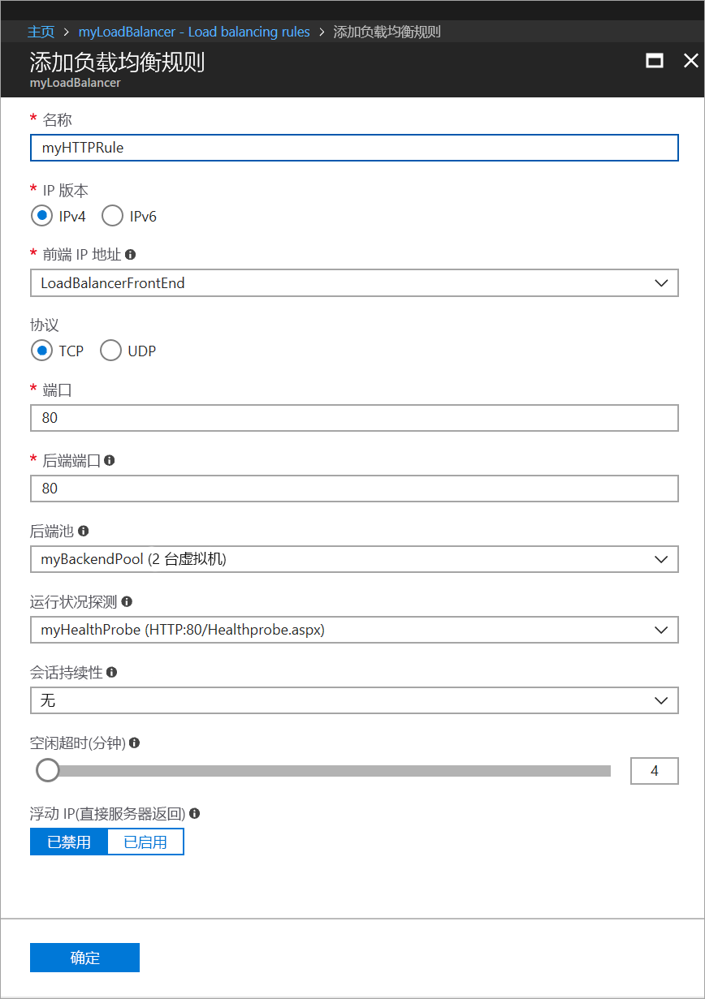
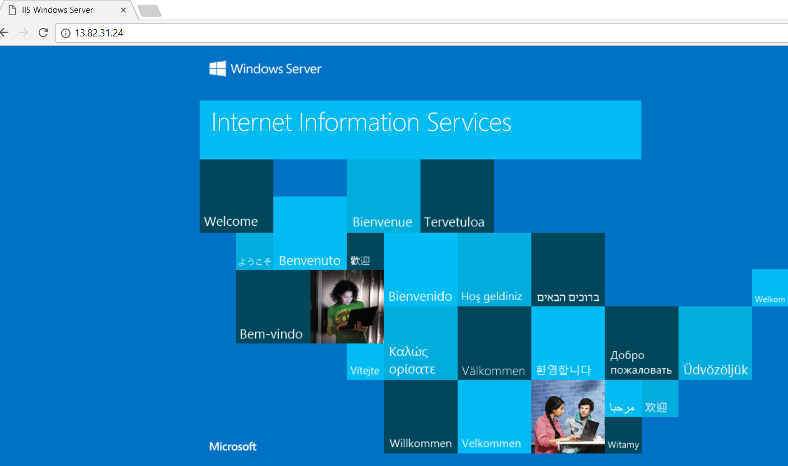

# 快速入门：使用 Azure 门户创建标准负载均衡器以对 VM 进行负载均衡

可以通过负载均衡将传入请求分布到多个虚拟机，从而提供更高级别的可用性和可伸缩性。 可以通过 Azure 门户创建负载均衡器，对虚拟机 (VM) 进行负载均衡。 本快速入门演示如何使用标准负载均衡器对 VM 进行负载均衡。

如果没有 Azure 订阅，请在开始之前创建一个[免费帐户](https://azure.microsoft.com/free/?WT.mc_id=A261C142F)。 

## 登录 Azure

在 [http://portal.azure.com](http://portal.azure.com) 中登录 Azure 门户。

## 创建公共负载均衡器

在本部分，请创建一个公共负载均衡器，以帮助对虚拟机进行负载均衡。 标准负载均衡器仅支持标准公共 IP 地址。 创建标准负载均衡器时，还必须为该标准负载均衡器创建一个配置为前端（默认情况下命名为 *LoadBalancerFrontend*）的新的标准公共 IP 地址。 

1. 在屏幕的左上方，单击“创建资源” > “网络” > “负载均衡器”。
2. 在“创建负载均衡器”页中输入或选择以下信息，接受剩下的默认设置，然后选择“创建”：

    | 设置                 | 值                                              |
    | ---                     | ---                                                |
    | 名称                   | *myLoadBalancer*                                   |
    | 类型          | 公共                                        |
    | SKU           | 标准                          |
    | 公共 IP 地址 | 选择“新建”并在文本框中键入 *myPublicIP*。 默认情况下公共 IP 地址的标准 SKU 处于选中状态。 对于“可用性区域”，请选择“区域冗余”。 |
    | 订阅               | 选择订阅。    |
    |资源组 | 选择“新建”，然后键入 *myResourceGroupSLB*。    |
    | 位置           | 选择“西欧”。                          |
    

## 创建后端服务器

在此部分，请先创建一个虚拟网络，为负载均衡器的后端池创建两个虚拟机，然后在虚拟机上安装 IIS，以便对负载均衡器进行测试。

### 创建虚拟网络
1. 在屏幕的左上方，单击“新建” > “网络” > “虚拟网络”，然后输入虚拟网络的以下值：
    - *myVNet* - 虚拟网络的名称。
    - *myResourceGroupSLB* - 现有资源组的名称。
    - *myBackendSubnet* - 子网名称。
2. 单击“创建”以创建虚拟网络。

    

### 创建虚拟机

1. 在屏幕的左上方，单击“新建” > “计算” > “Windows Server 2016 Datacenter”，然后输入虚拟机的以下值：
    - *myVM1* - 虚拟机的名称。        
    - *myResourceGroupSLB* - 对于“资源组”，请选择“使用现有”，然后选择“myResourceGroupSLB”。
2. 单击“确定”。
3. 选择“DS1_V2”作为虚拟机的大小，然后单击“选择”。
4. 为 VM 设置输入以下值：
    1. 请确保选择 *myVNet* 作为虚拟网络，并选择 *myBackendSubnet* 作为子网。
    2. 对于**公共 IP 地址**，请在“创建公共 IP 地址”窗格中，选择“标准”，然后选择“确定”。
    3. 对于**网络安全组**，选择“高级”，然后执行以下操作：
        1. 选择“网络安全组(防火墙)”，然后在“选择网络安全组”页上，选择“新建”。 
        2. 在“创建网络安全组”页中，对于**名称**，输入 *myNetworkSecurityGroup*，然后选择“确定”。
5. 单击“禁用”以禁用启动诊断。
6. 创建“确定”，检查“摘要”页上的设置，然后单击“创建”。
7. 通过步骤 1-6 创建名为 *VM2* 的另一个 VM（将 *myAvailibilityset* 作为其可用性集，将 *myVnet* 作为其虚拟网络，将 *myBackendSubnet* 作为其子网，将 *myNetworkSecurityGroup* 作为其网络安全组）。 

### 创建 NSG 规则

在此部分中，创建 NSG 规则以允许使用 HTTP 的入站连接。

1. 单击左侧菜单中的“所有资源”，然后从资源列表中单击“myNetworkSecurityGroup”，后者位于 **myResourceGroupSLB** 资源组中。
2. 在“设置”下单击“入站安全规则”，然后单击“添加”。
3. 为名为 *myHTTPRule* 的入站安全规则输入以下值，以允许来自端口 80 的入站 HTTP 连接：
    - 服务标记 - **源**。
    - *Internet* - **源服务标记**
    - *80* - **目标端口范围**
    - *TCP* - **协议**
    - 允许 - **操作**
    - *100* - **优先级**
    - *myHTTPRule* - 名称
    - 允许 HTTP - 说明
4. 单击“确定”。
 
### 安装 IIS

1. 单击左侧菜单中的“所有资源”，然后从资源列表中单击“myVM1”，后者位于 *myResourceGroupLB* 资源组中。
2. 在“概览”页上单击“连接”，以便通过 RDP 连接到 VM 中。
3. 使用用户名 *azureuser* 登录到 VM。
4. 在服务器桌面上导航到“Windows 管理工具”>“服务器管理器”。
5. 在服务器管理器中，单击“添加角色和功能”。
6. 在“添加角色和功能向导”中使用以下值：
    - 在“选择安装类型”页中，单击“基于角色或基于功能的安装”。
    - 在“选择目标服务器”页中，单击“myVM1”
    - 在“选择服务器角色”页中，单击“Web 服务器(IIS)”
    - 按照说明完成向导的其余部分 
7. 对于虚拟机 *myVM2*，请重复步骤 1 到 6。

## 创建负载均衡器资源

在本部分中，将为后端地址池和运行状况探测配置负载均衡器设置，并指定负载均衡器规则。

### 创建后端地址池

若要向 VM 分发流量，后端地址池需包含连接到负载均衡器的虚拟 NIC 的 IP 地址。 创建包括 *VM1* 和 *VM2* 的后端地址池 *myBackendPool*。

1. 单击左侧菜单中的“所有资源”，然后在资源列表中单击“myLoadBalancer”。
2. 在“设置”下单击“后端池”，然后单击“添加”。
3. 在“添加后端池”页上执行以下操作：
   - 对于“名称”，请键入 *myBackendPool* 作为后端池的名称。
   - 对于**虚拟网络**，选择 *myVNet*。
   - 在“虚拟机”下添加 *myVM1* 和 *myVM2* 及其对应的 IP 地址，然后选择“添加”。
    - 单击“确定”。

3. 通过检查确保负载均衡器后端池设置显示 **VM1** 和 **VM2** 这两个 VM。

### 创建运行状况探测器

若要允许负载均衡器监视应用的状态，可以使用运行状况探测器。 运行状况探测器基于其对运行状况检查的响应，从负载均衡器中动态添加或删除 VM。 创建运行状况探测 *myHealthProbe* 以监视 VM 的运行状况。

1. 单击左侧菜单中的“所有资源”，然后在资源列表中单击“myLoadBalancer”。
2. 在“设置”下单击“运行状况探测”，然后单击“添加”。
3. 使用以下值创建运行状况探测：
    - *myHealthProbe* - 运行状况探测的名称。
    - **HTTP** - 协议类型。
    - *80* - 端口号。
    - *Healthprobe.aspx* - URI 路径。 可以将此值替换为任何其他的 URI，或者保留默认路径值 **"\\"** 以获取默认 URI。
    - *15* - 两次探测尝试之间的**时间间隔**（以秒为单位）。
    - *2* - 将 VM 视为不正常所对应的**不正常阈值**或连续探测失败次数。
4. 单击“确定”。

   

### 创建负载均衡器规则

负载均衡器规则用于定义将流量分配给 VM 的方式。 定义传入流量的前端 IP 配置和后端 IP 池以接收流量，同时定义所需的源端口和目标端口。 创建负载均衡器规则 *myLoadBalancerRuleWeb*，以便侦听前端 *FrontendLoadBalancer* 中的端口 80，并将经过负载均衡的网络流量发送到也使用端口 80 的后端地址池 *myBackEndPool*。 

1. 单击左侧菜单中的“所有资源”，然后在资源列表中单击“myLoadBalancer”。
2. 在“设置”下单击“负载均衡规则”，然后单击“添加”。
3. 请使用以下值配置负载均衡规则：
    - *myHTTPRule* - 负载均衡规则的名称。
    - **TCP** - 协议类型。
    - *80* - 端口号。
    - *80* - 后端端口。
    - *myBackendPool* - 后端池的名称。
    - *myHealthProbe* - 运行状况探测的名称。
4. 单击“确定”。
    
    

## 测试负载均衡器
1. 在“概览”屏幕上找到负载均衡器的公共 IP 地址。 单击“所有资源”，然后单击“myPublicIP”。

2. 复制该公共 IP 地址，并将其粘贴到浏览器的地址栏。 IIS Web 服务器的默认页会显示在浏览器上。

      

## 清理资源

若不再需要资源组、负载均衡器以及所有相关资源，请将其删除。 为此，请选择包含负载均衡器的资源组，然后单击“删除”。

## 后续步骤

本快速入门介绍了如何创建标准负载均衡器，向其附加 VM，配置负载均衡器流量规则、运行状况探测，然后测试负载均衡器。 若要了解有关 Azure 负载均衡器的详细信息，请继续学习 Azure 负载均衡器教程。

> [!div class="nextstepaction"]
> [Azure 负载均衡器教程](tutorial-load-balancer-standard-public-zone-redundant-portal.md)
