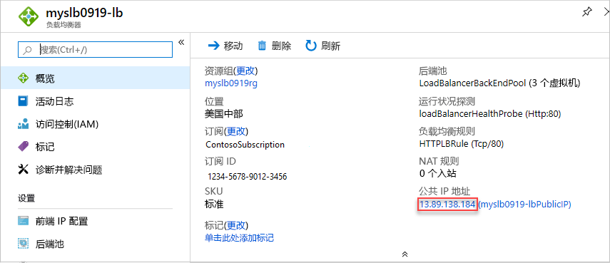

# <a name="quickstart-create-a-standard-load-balancer-to-load-balance-vms-by-using-azure-resource-manager-template"></a>快速入门：使用 Azure 资源管理器模板创建标准负载均衡器以对 VM 进行负载均衡

负载均衡将传入请求分布到多个虚拟机 (VM)，从而提供更高级别的可用性和可伸缩性。 本快速入门介绍如何部署 Azure 资源管理器模板，以便创建标准负载均衡器，从而使 VM 负载均衡。 与其他部署方法相比，使用资源管理器模板需要的步骤更少。

[资源管理器模板](../azure-resource-manager/templates/overview.md)是定义项目基础结构和配置的 JavaScript 对象表示法 (JSON) 文件。 该模板使用声明性语法，使你可以声明要部署的内容，而不需要编写一系列编程命令来进行创建。 若要详细了解如何开发资源管理器模板，请参阅[资源管理器文档](/azure/azure-resource-manager/)和[模板参考](/azure/templates/microsoft.network/loadbalancers)。

如果没有 Azure 订阅，请在开始之前创建一个[免费帐户](https://azure.microsoft.com/free/?WT.mc_id=A261C142F)。

## <a name="create-a-standard-load-balancer"></a>创建标准负载均衡器

标准负载均衡器仅支持标准公共 IP 地址。 创建标准负载均衡器时，还必须创建一个作为该标准负载均衡器的前端配置的新标准公共 IP 地址。

本快速入门中使用的模板是[快速启动模板](https://raw.githubusercontent.com/Azure/azure-quickstart-templates/master/101-load-balancer-standard-create/azuredeploy.json)。

[!code-json[<Azure Resource Manager template create standard load balancer>](~/quickstart-templates/101-load-balancer-standard-create/azuredeploy.json)]

该模板中已定义了多个 Azure 资源：

- **Microsoft.Network/loadBalancers**
- **Microsoft.Network/publicIPAddresses**：用于负载均衡器。
- **Microsoft.Network/networkSecurityGroups**
- **Microsoft.Network/virtualNetworks**
- **Microsoft.Compute/virutalMachines**（其中 3 个）
- **Microsoft.Network/publicIPAddresses**（其中 3 个）：针对三个虚拟机中的每个虚拟机。
- **Microsoft.Network/networkInterfaces**（其中 3 个）
- **Microsoft.Compute/virtualMachine/extensions**（其中 3 个）：用于配置 IIS 和网页

若要查找与 Azure 负载均衡器相关的更多模板，请参阅 [Azure 快速入门模板](https://azure.microsoft.com/resources/templates/?resourceType=Microsoft.Network&pageNumber=1&sort=Popular)。

1. 从以下代码块中选择“试用”，以打开 Azure Cloud Shell，然后按照相关说明登录到 Azure  。

   ```azurepowershell-interactive
   $projectName = Read-Host -Prompt "Enter a project name with 12 or less letters or numbers that is used to generate Azure resource names"
   $location = Read-Host -Prompt "Enter the location (i.e. centralus)"
   $adminUserName = Read-Host -Prompt "Enter the virtual machine administrator account name"
   $adminPassword = Read-Host -Prompt "Enter the virtual machine administrator password" -AsSecureString

   $resourceGroupName = "${projectName}rg"
   $templateUri = "https://raw.githubusercontent.com/Azure/azure-quickstart-templates/master/101-load-balancer-standard-create/azuredeploy.json"

   New-AzResourceGroup -Name $resourceGroupName -Location $location
   New-AzResourceGroupDeployment -ResourceGroupName $resourceGroupName -TemplateUri $templateUri -projectName $projectName -location $location -adminUsername $adminUsername -adminPassword $adminPassword

   Write-Host "Press [ENTER] to continue."
   ```

   等到控制台中显示提示。

1. 从上一个代码块中选择“复制”  ，以复制 PowerShell 脚本。

1. 右键单击 shell 控制台窗格，然后选择“粘贴”  。

1. 输入相应的值。

   模板部署会创建三个可用性区域。 可用性区域仅在[某些地区](../availability-zones/az-overview.md)受到支持。 请使用受支持的地区之一。 如果不确定，请输入 **centralus**。

   资源组名称是追加了 **rg** 的项目名称。 在下一部分中将用到资源组名称。

部署模板大约需要 10 分钟的时间。 完成后，输出类似于：


使用 Azure PowerShell 部署模板。 除了 Azure PowerShell，还可以使用 Azure 门户、Azure CLI 和 REST API。 若要了解其他部署方法，请参阅[部署模板](../azure-resource-manager/templates/deploy-portal.md)。

## <a name="test-the-load-balancer"></a>测试负载均衡器

1. 登录 [Azure 门户](https://portal.azure.com)。

1. 从左侧窗格中选择“资源组”  。

1. 选择你在上一部分中创建的资源组。 默认资源组名称是追加了 **rg** 的项目名称。

1. 选择负载均衡器。 其默认名称是追加了 **-lb** 的项目名称。

1. 仅复制公共 IP 地址的 IP 地址部分，然后将其粘贴到浏览器的地址栏中。

   

    浏览器将显示 Internet Information Services (IIS) Web 服务器的默认页。

   

若要查看负载均衡器如何在所有 3 个 VM 之间分配流量，可从客户端计算机强制刷新 Web 浏览器。

## <a name="clean-up-resources"></a>清理资源

如果不再需要资源组、负载均衡器以及所有相关资源，请将其删除。 为此，请访问 Azure 门户，选择包含负载均衡器的资源组，然后选择“删除资源组”  。

## <a name="next-steps"></a>后续步骤

在本快速入门中，你创建了一个标准负载均衡器，向其附加了 VM，配置了负载均衡器流量规则，执行了运行状况探测，然后测试了该负载均衡器。

若要了解详细信息，请继续学习与负载均衡器相关的教程。

> [!div class="nextstepaction"]
> [Azure 负载均衡器教程](tutorial-load-balancer-standard-public-zone-redundant-portal.md)
