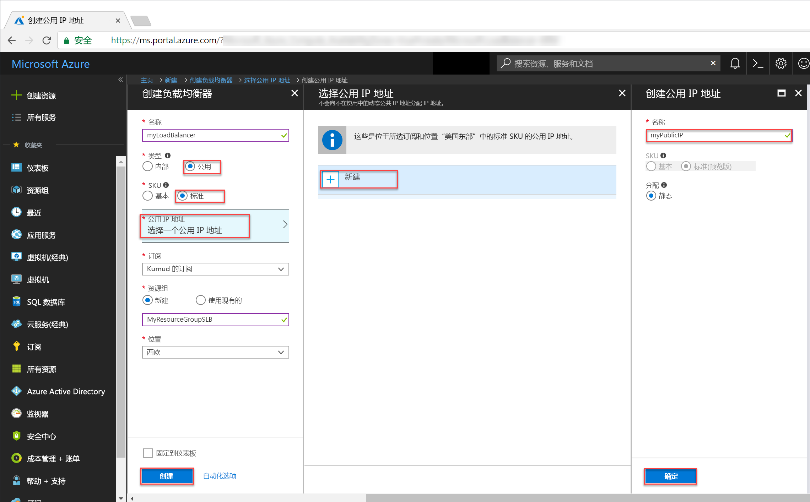
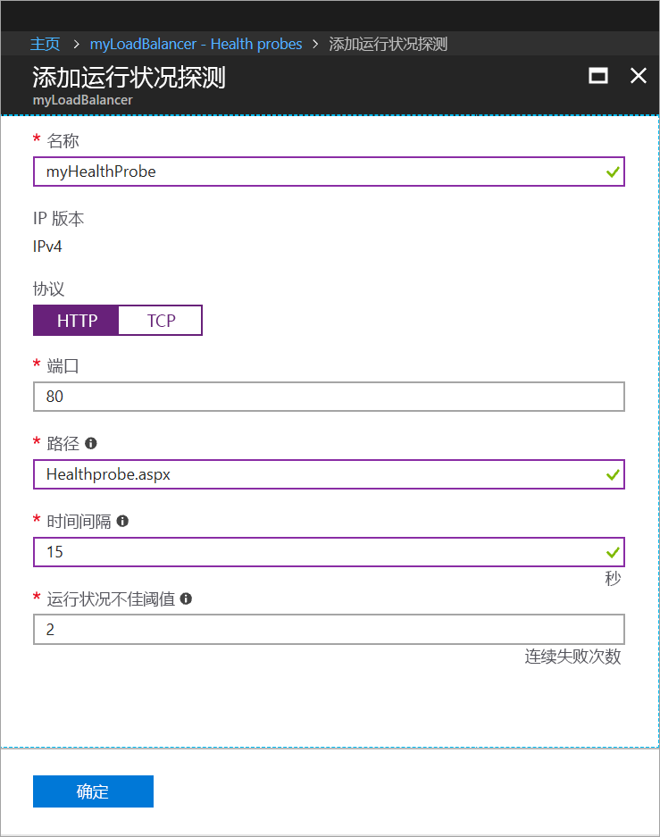
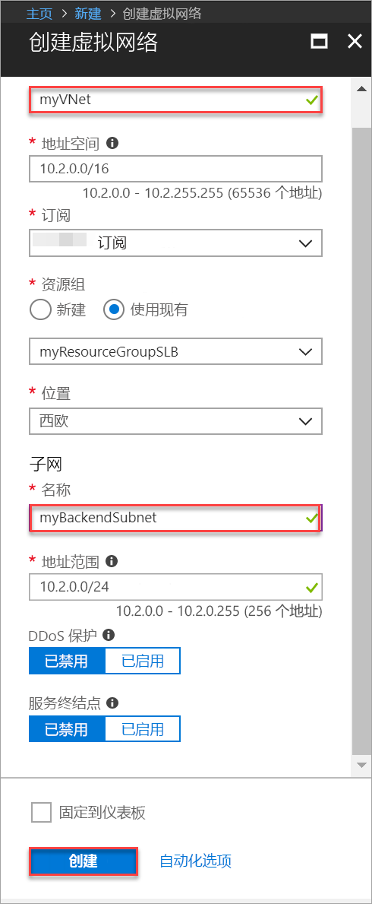

# <a name="tutorial-create-and-manage-standard-load-balancer-using-the-azure-portal"></a>教程：使用 Azure 门户创建和管理标准负载均衡器

可以通过负载均衡将传入请求分布到多个虚拟机，从而提供更高级别的可用性和可伸缩性。 在本教程中，你将了解 Azure 标准负载均衡器的各种组件，这些组件用于分发流量和提供高可用性。 学习如何：


> [!div class="checklist"]
> * 创建 Azure 负载均衡器
> * 创建负载均衡器运行状况探测
> * 创建负载均衡器流量规则
> * 创建虚拟机并安装 IIS 服务器
> * 将虚拟机附加到负载均衡器
> * 查看运行中的负载均衡器
> * 从负载均衡器中添加和删除 VM


如果你还没有 Azure 订阅，可以在开始前创建一个 [免费帐户](https://azure.microsoft.com/free/?WT.mc_id=A261C142F)。 

## <a name="log-in-to-azure"></a>登录 Azure

通过 [http://portal.azure.com](http://portal.azure.com) 登录到 Azure 门户。

## <a name="create-a-standard-load-balancer"></a>创建标准负载均衡器

在本部分，请创建一个公共负载均衡器，以帮助对虚拟机进行负载均衡。 标准负载均衡器仅支持标准公共 IP 地址。 创建标准负载均衡器时，还必须为该标准负载均衡器创建一个配置为前端（默认情况下命名为 *LoadBalancerFrontend*）的新的标准公用 IP 地址。 

1. 在屏幕的左上方，单击“创建资源” > “网络” > “负载均衡器”。
2. 在“创建负载均衡器”页中，输入负载均衡器的以下值：
    - *myLoadBalancer* - 负载均衡器的名称。
    - **公共** - 负载均衡器的类型。
    - **标准** - 负载均衡器的 SKU 版本。
     - *myPublicIP* - 你创建的**新**公共 IP。
    - *myResourceGroupSLB* - 你选择创建的**新**资源组的名称。
    - **westeurope** - 位置。
3. 单击“创建”以创建负载均衡器。


   
## <a name="create-load-balancer-resources"></a>创建负载均衡器资源

在本部分中，将为后端地址池和运行状况探测配置负载均衡器设置，并指定负载均衡器规则。

### <a name="create-a-backend-address-pool"></a>创建后端地址池

若要向 VM 分发流量，后端地址池需包含连接到负载均衡器的虚拟 NIC 的 IP 地址。 创建包括 *VM1* 和 *VM2* 的后端地址池 *myBackendPool*。

1. 单击左侧菜单中的“所有资源”，然后在资源列表中单击“myLoadBalancer”。
2. 在“设置”下单击“后端池”，然后单击“添加”。
3. 在“添加后端池”页面上，对于名称，键入 *myBackEndPool* 作为后端池的名称，然后单击“确定”。

### <a name="create-a-health-probe"></a>创建运行状况探测器

若要允许负载均衡器监视应用的状态，可以使用运行状况探测器。 运行状况探测器基于其对运行状况检查的响应，从负载均衡器中动态添加或删除 VM。 创建运行状况探测 *myHealthProbe* 以监视 VM 的运行状况。

1. 单击左侧菜单中的“所有资源”，然后在资源列表中单击“myLoadBalancer”。
2. 在“设置”下单击“运行状况探测”，然后单击“添加”。
3. 使用以下值创建运行状况探测：
    - *myHealthProbe* - 运行状况探测的名称。
    - **HTTP** - 协议类型。
    - *80* - 端口号。
    - *15* - 两次探测尝试之间的**时间间隔**（以秒为单位）。
    - *2* - 将 VM 视为不正常所对应的**不正常阈值**或连续探测失败次数。
4. 单击“确定”。

   

### <a name="create-a-load-balancer-rule"></a>创建负载均衡器规则

负载均衡器规则用于定义将流量分配给 VM 的方式。 定义传入流量的前端 IP 配置和后端 IP 池以接收流量，同时定义所需的源端口和目标端口。 创建负载均衡器规则 *myLoadBalancerRuleWeb*，以便侦听前端 *FrontendLoadBalancer* 中的端口 80，并将经过负载均衡的网络流量发送到也使用端口 80 的后端地址池 *myBackEndPool*。 

1. 单击左侧菜单中的“所有资源”，然后在资源列表中单击“myLoadBalancer”。
2. 在“设置”下单击“负载均衡规则”，然后单击“添加”。
3. 请使用以下值配置负载均衡规则：
    - *myHTTPRule* - 负载均衡规则的名称。
    - **TCP** - 协议类型。
    - *80* - 端口号。
    - *80* - 后端端口。
    - *myBackendPool* - 后端池的名称。
    - *myHealthProbe* - 运行状况探测的名称。
4. 单击“确定”。
    
## <a name="create-backend-servers"></a>创建后端服务器

在本部分中，创建一个虚拟网络，为负载均衡器的后端池创建三台虚拟机，然后在虚拟机上安装 IIS，以便对负载均衡器进行测试。

### <a name="create-a-virtual-network"></a>创建虚拟网络
1. 在屏幕的左上方，单击“新建” > “网络” > “虚拟网络”，然后输入虚拟网络的以下值：
    - *myVNet* - 虚拟网络的名称。
    - *myResourceGroupSLB* - 现有资源组的名称。
    - *myBackendSubnet* - 子网名称。
2. 单击“创建”以创建虚拟网络。

    

### <a name="create-virtual-machines"></a>创建虚拟机

1. 在屏幕的左上方，单击“新建” > “计算” > “Windows Server 2016 Datacenter”，然后输入虚拟机的以下值：
    - *myVM1* - 虚拟机的名称。        
    - *azureuser* - 管理员用户名。    
    - *myResourceGroupSLB* - 对于“资源组”，请选择“使用现有”，然后选择“myResourceGroupSLB”。
2. 单击“确定”。
3. 选择“DS1_V2”作为虚拟机的大小，然后单击“选择”。
4. 为 VM 设置输入以下值：
    -  *myVNet* - 确保选择它作为虚拟网络。
    - *myBackendSubnet* - 确保选择它作为子网。
    - *myNetworkSecurityGroup* - 必须创建的新网络安全组（防火墙）的名称。
5. 单击“禁用”以禁用启动诊断。
6. 创建“确定”，检查“摘要”页上的设置，然后单击“创建”。
7. 通过步骤 1-6 创建名为 *VM2* 和 *VM3* 的另外两台 VM，将 *myVnet* 作为其虚拟网络，将 *myBackendSubnet* 作为其子网，将 **myNetworkSecurityGroup* 作为其网络安全组。 

### <a name="create-nsg-rules"></a>创建 NSG 规则

在此部分，请创建 NSG 规则以允许使用 HTTP 和 RDP 的入站连接。

1. 单击左侧菜单中的“所有资源”，然后从资源列表中单击“myNetworkSecurityGroup”，后者位于 **myResourceGroupSLB** 资源组中。
2. 在“设置”下单击“入站安全规则”，然后单击“添加”。
3. 为名为 *myHTTPRule* 的入站安全规则输入以下值，以允许来自端口 80 的入站 HTTP 连接：
    - 服务标记 - **源**。
    - *Internet* - **源服务标记**
    - *80* - **目标端口范围**
    - *TCP* - **协议**
    - 允许 - **操作**
    - *100* - **优先级**
    - *myHTTPRule* - 名称
    - 允许 HTTP - 说明
4. 单击“确定”。
 
 
5. 重复步骤 2 到 4，使用以下值创建名为 *myRDPRule* 的另一规则，以允许来自端口 3389 的入站 RDP 连接：
    - 服务标记 - **源**。
    - *Internet* - **源服务标记**
    - *3389* - **目标端口范围**
    - *TCP* - **协议**
    - 允许 - **操作**
    - *200* - **优先级**
    - *myRDPRule* - 名称
    - 允许 RDP - 说明

### <a name="install-iis-on-vms"></a>在 VM 上安装 IIS

1. 在左侧菜单中单击“所有资源”，在资源列表中，单击位于 *myResourceGroupSLB* 资源组中的 **myVM1**。
2. 在“概览”页上单击“连接”，以便通过 RDP 连接到 VM 中。
3. 使用用户名 *azureuser* 登录到 VM。
4. 在服务器桌面上，导航到“Windows 管理工具”>“Windows PowerShell”。
5. 在 PowerShell 窗口中，运行以下命令安装 IIS 服务器，删除默认 iisstart.htm 文件，然后添加显示 VM 名称的新 iisstart.htm 文件：

   ```azurepowershell-interactive
    
    # install IIS server role
    Install-WindowsFeature -name Web-Server -IncludeManagementTools
    
    # remove default htm file
     remove-item  C:\inetpub\wwwroot\iisstart.htm
    
    # Add a new htm file that displays server name
     Add-Content -Path "C:\inetpub\wwwroot\iisstart.htm" -Value $("Hello World from" + $env:computername)
   ```
6. 关闭与 *myVM1* 之间的 RDP 会话。
7. 重复步骤 1 到步骤 6，在 *myVM2* 和 *myVM3* 上安装 IIS 和已更新的 iisstart.htm 文件。

## <a name="add-vms-to-the-backend-address-pool"></a>将 VM 添加到后端地址池

若要将流量分配到各台 VM，请将虚拟机 *VM1*、*VM2* 和 *VM3* 添加到之前创建的后端地址池 *myBackendPool*。 后端池包含连接到负载均衡器的虚拟 NIC 的 IP 地址。

1. 单击左侧菜单中的“所有资源”，然后在资源列表中单击“myLoadBalancer”。
2. 在“设置”下，单击“后端池”，然后在后端池列表中单击 **myBackendPool**。
3. 在 **myBackendPool** 页面上，执行以下操作：
    - 单击“添加目标网络 IP 配置”将所创建的每台虚拟机（*myVM1*、*myVM2* 和 *myVM3*）添加到后端池。
    - 单击“确定”。

4. 进行检查，确保负载均衡器后端池设置显示了 **VM1**、**VM2** 和 **myVM3** 这三台 VM。

## <a name="test-the-load-balancer"></a>测试负载均衡器
1. 在“概览”屏幕上找到负载均衡器的公共 IP 地址。 单击“所有资源”，然后单击“myPublicIP”。

2. 复制该公共 IP 地址，并将其粘贴到浏览器的地址栏。 IIS Web 服务器的默认页会显示在浏览器上。

      

若要查看负载均衡器如何在运行应用的三台 VM 之间分配流量，可强制刷新 web 浏览器。

## <a name="remove-or-add-vms-from-the-backend-pool"></a>在后端池中删除或添加 VM
建议对运行应用的 VM 执行维护，例如安装 OS 更新。 若要应对应用增加的流量，建议添加更多 VM。 本部分演示了如何在负载均衡器中删除或添加 VM。

1. 单击左侧菜单中的“所有资源”，然后在资源列表中单击“myLoadBalancer”。
2. 在“设置”下，单击“后端池”，然后在后端池列表中单击 **myBackendPool**。
3. 在 **myBackendPool** 页面上，在“目标网络 IP 配置”下，若要从后端中删除 *VM1*，请单击“虚拟机:myVM1”旁边的删除图标。

当 *myVM1* 不再位于后端地址池中时，可以对 *myVM1* 执行任何维护任务，例如安装软件更新。 在没有 *VM1** 的情况下，负载目前在 *myVM2* 和 *myVM3* 之间进行均衡。 

若要将 *myVM1* 添加回后端池，请按照本文的*向后端池添加 VM* 部分中的过程进行操作。

## <a name="clean-up-resources"></a>清理资源

若不再需要资源组、负载均衡器以及所有相关资源，请将其删除。 为此，请选择包含负载均衡器的资源组，然后单击“删除”。

## <a name="next-steps"></a>后续步骤

在本快速入门中，你创建了一个标准负载均衡器，向其附加了 VM，配置了负载均衡器流量规则、运行状况探测，然后测试了负载均衡器。 你还从负载均衡集合中删除了一台 VM，然后又将该 VM 添加回后端地址池。 若要了解有关 Azure 负载均衡器的详细信息，请继续学习 Azure 负载均衡器教程。

> [!div class="nextstepaction"]
> [Azure 负载均衡器教程](tutorial-load-balancer-standard-public-zone-redundant-portal.md)
