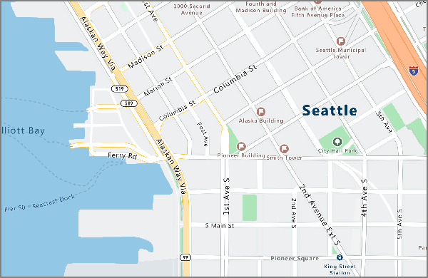

# <a name="an-introduction-to-azure-location-based-services-preview"></a>Azure Location Based Services（预览版）简介
Azure Location Based Services 是一项地理空间服务组合，包括适用于地图、搜索、路线、交通和时区的服务 API。 借助这组与 Azure OneAPI 兼容的服务，可让你使用熟悉的开发人员工具快速开发和缩放将位置信息集成到 Azure 解决方案中的解决方案。 Azure Location Based Services 向开发人员提供各个行业强大的地理空间功能，并搭配所需的全新地图数据，以便为 Web 和移动应用程序提供地理环境。 Azure Location Based Services 是与 Azure One API 兼容的一组 REST API，随基于 Web 的 JavaScript 控件一起提供，使得开发极其简单、灵活且可跨多个媒体移植。 

Azure Location Based Services 由五项主要服务组成，以支持需要地理环境的 Azure 应用程序。 下面将逐一详细介绍上述的每项服务。

呈现服务 – 呈现服务专为开发人员而设计，用于创建与映射有关的 Web 和移动应用程序。 该服务使用有 19 个缩放级别的高品质光栅图形图像或完全可自定义的矢量格式的地图图像。



路线服务 – 路线服务是利用强大的实际基础结构几何计算和多种运输模式方向而生成的。 借助此服务，开发人员可计算多种行驶模式的方向，例如汽车、卡车、自行车或步行；以及各种相关因素，例如交通状况、重量限制或危险品运输。


搜索服务 – 搜索服务旨在让开发人员按名称或类别搜索地址、地点、商家列表和其他地理信息。 搜索服务还可以基于纬度/经度[反向地理编码](https://en.wikipedia.org/wiki/Reverse_geocoding)地址和十字路口。 


时区服务 – 时区服务允许你使用纬度-经度对或 [IANA ID](http://www.iana.org/) 来查询当前、历史和将来的时区信息。 时区服务还允许将 Microsoft Windows 时区 ID 转换为 IANA 时区，提取到 UTC 的时区偏移以及获取相应时区中的当前时间。 查询时区服务的典型 JSON 响应如下所示：

```JSON
{
    "Version": "2017c",
    "ReferenceUtcTimestamp": "2017-11-20T23:09:48.686173Z",
    "TimeZones": [{
        "Id": "America/Los_Angeles",
        "ReferenceTime": {
            "Tag": "PST",
            "StandardOffset": "-08:00:00",
            "DaylightSavings": "00:00:00",
            "WallTime": "2017-11-20T15:09:48.686173-08:00",
            "PosixTzValidYear": 2017,
            "PosixTz": "PST+8PDT,M3.2.0,M11.1.0"
        }
    }]
}
```

交通服务 – 交通服务是一套 Web 服务，旨在让开发人员创建交通所需的 Web 和移动应用程序。 该产品分为以下几部分：
1. 交通流量 - 提供路网中所有关键道路的实时观察速度和行驶时间； 
2. 交通事件 - 提供有关路网周围的交通堵塞和事故的准确视图。


Azure Location Based Services 是针对移动性而构建的，可以支持跨平台的应用程序，因为编程模型是不可知的，并且通过 REST API 支持输出 JSON。 此外，Azure LBS 还提供了一个简单的编程模型和方便的 JavaScript Map Control，可以快速轻松地开发 Web 和移动应用程序。 

Azure Location Based Services 使用基于密钥的身份验证方案，因此，访问这些服务需要导航到 [Azure 门户](http://portal.azure.com)，并创建一个 Azure Location Based Services 帐户。 你的帐户将附带为你预生成的两个密钥。 首先将这些位置功能直接集成到你的应用程序，方法是使用请求 Azure Location Based Services 服务的任一密钥。

**与必应地图的关系** - 请注意，本文档中介绍的 Azure Location Based Services 不同于必应地图提供的。  虽然二者的很多功能是相同的，但这两项服务既不相同，也不相关。  在 Azure 中提供这项将会单独管理的新服务对必应地图产品的提供或路线图没有影响。

Microsoft 的目标是为开发人员社区在定位服务产品方面提供选择。  下面是适用于开发人员的一些简要指南，介绍了如何针对不同的用例和客户情况使用不同的服务。  请注意，此指南目前适用于 Azure LBS，因为它处于公共预览版阶段，在 2018 年末公开发行后会进行更新。

| 客户条件 | 使用 Azure Location Based Services 的情形 | 使用必应地图的情形 |
| ------------- | ------------- | ------------- |
| 开发环境 | 在其他 Azure 服务中生成或利用这些服务 | 使用第三方云或其他开发人员环境 |
| 开发阶段  | 由于 Azure LBS 目前为公共预览版，因此对其的优化是针对早期测试和概念证明开发的 | 对于生产环境来说，企业级 SLA 是所必需 |
| 定价选项 | 初步开发人员定价选项已足够 | 自定义企业级定价是必需的 |
| 用例环境 | 车辆中使用是必需的 | 车辆中使用不是必需的 |
| 地理覆盖范围 | 印度、中国、日本和韩国不是必需的 | 印度、中国、日本和韩国地图覆盖是必需的 |
| 地图内容 | 标准的地面图已足够 | 卫星图、空中图和街道图是必需的 |
| 基础性的地图来源 | TomTom 地图数据为首选 | HERE 地图数据为首选 |

立即注册 [Azure Location Based Services 帐户](http://aka.ms/azurelbsportal)！

## <a name="next-steps"></a>后续步骤

你现在已经对 Azure Location Based Services（预览版）有了初步了解。 接下来，请试用一个展示 Location Based Services 的示例应用，以及在 Web 应用中创建一个端到端方案。

> [!div class="nextstepaction"]
> [使用 Azure Location Based Services（预览版）启动演示交互式地图搜索](quick-demo-map-app.md)
> [使用 Azure Location Based Services 搜索附近的兴趣点](tutorial-search-location.md)
