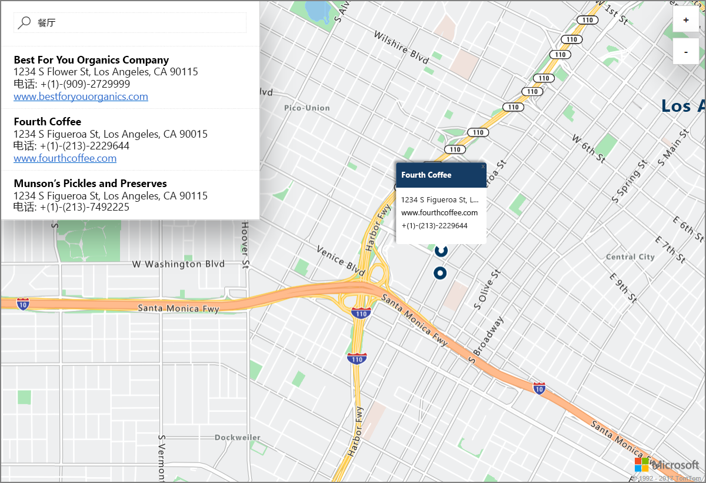

# 使用 Azure Location Based Services（预览版）启动演示性的交互式地图搜索

本文使用 Azure 地图和交互式搜索来演示 Azure Location Based Services (LBS)（预览版）的功能。 此外，还逐步讲解了自行创建 LBS 帐户，以及获取要在演示 Web 应用程序中使用的帐户密钥的基本步骤。 

如果还没有 Azure 订阅，可以在开始前创建一个 [免费帐户](https://azure.microsoft.com/free/?WT.mc_id=A261C142F)。

## 登录到 Azure 门户

登录到 [Azure 门户](https://portal.azure.com/)。

## 创建 Location Based Services 帐户并获取帐户密钥

1. 在 [Azure 门户](https://portal.azure.com)的左上角单击“创建资源”。
2. 在“搜索 Marketplace”框中，键入 **location based services**。
3. 在“结果”中，单击“Location Based Services (预览版)”。 单击地图下面显示的“创建”按钮。 
4. 在“创建 Location Based Services 帐户”页上，输入新帐户的*名称*，选择要使用的*订阅*，并输入新的或现有的*资源组*的名称。 选择资源组的位置，接受*预览版条款*，然后单击“创建”。

    

5. 成功创建帐户后，请将其打开，并导航到该帐户的“设置”。 单击“密钥”获取帐户的主要和辅助订阅密钥。 将“主密钥”值复制到本地剪贴板，以便在下一部分中使用。 

## 下载 Azure 地图的演示应用程序

1. 下载或复制 [interactiveSearch.html](https://github.com/Azure-Samples/location-based-services-samples/blob/master/src/interactiveSearch.html) 文件的内容。
2. 在本地将此文件的内容另存为 **AzureMapDemo.html**，并在文本编辑器中将其打开。
3. 搜索字符串 **<insert-key>**，并将其替换为在上一部分中获取的**主密钥**。 

## 启动 Azure 地图的演示应用程序

1. 在所选的浏览器中打开文件 **AzureMapDemo.html**。
2. 观察显示的洛杉矶市地图。 城市由 *AzureMapDemo.html* 中指定给名为 **center** 的 JavaScript 变量的 `[longitude, latitude]` 对值确定。 可将这些坐标更改为所选的其他任何城市。 例如，纽约市的坐标为 *[-74.0060, 40.7128]*。
3. 在演示 Web 应用程序左上角的搜索框中，输入想要搜索的任何位置类型或地址。 
4. 将鼠标移到搜索框下面显示的地址/位置列表上，可以看到，地图上的相应图钉会弹出有关该位置的信息。 例如，启动此示例 Web 应用程序并搜索 *restaurants* 会显示以下信息。 请注意，为保护私营企业的隐私，地图中显示的名称和地址都是虚构的。 

    

## 清理资源

其他教程详细介绍了如何为帐户使用和配置 Azure Location Based Services。 如何打算继续学习这些教程，请勿清除本快速入门中创建的资源。 如果不打算继续学习，请通过以下步骤删除通过本快速入门创建的所有资源。

1. 关闭运行 **AzureMapDemo.html** Web 应用程序的浏览器。
2. 在 Azure 门户的左侧菜单中单击“所有资源”，然后选择自己的 LBS 帐户。 在“所有资源”边栏选项卡的顶部单击“删除”。

## 后续步骤

本快速入门教程已介绍如何创建 Azure LBS 帐户，然后使用该帐户启动一个演示应用。 若要了解如何使用 Azure Location Based Services API 创建自己的应用程序，请继续学习以下教程。

> [!div class="nextstepaction"]
> [有关使用 Azure 地图和搜索的教程](./tutorial-search-location.md)
