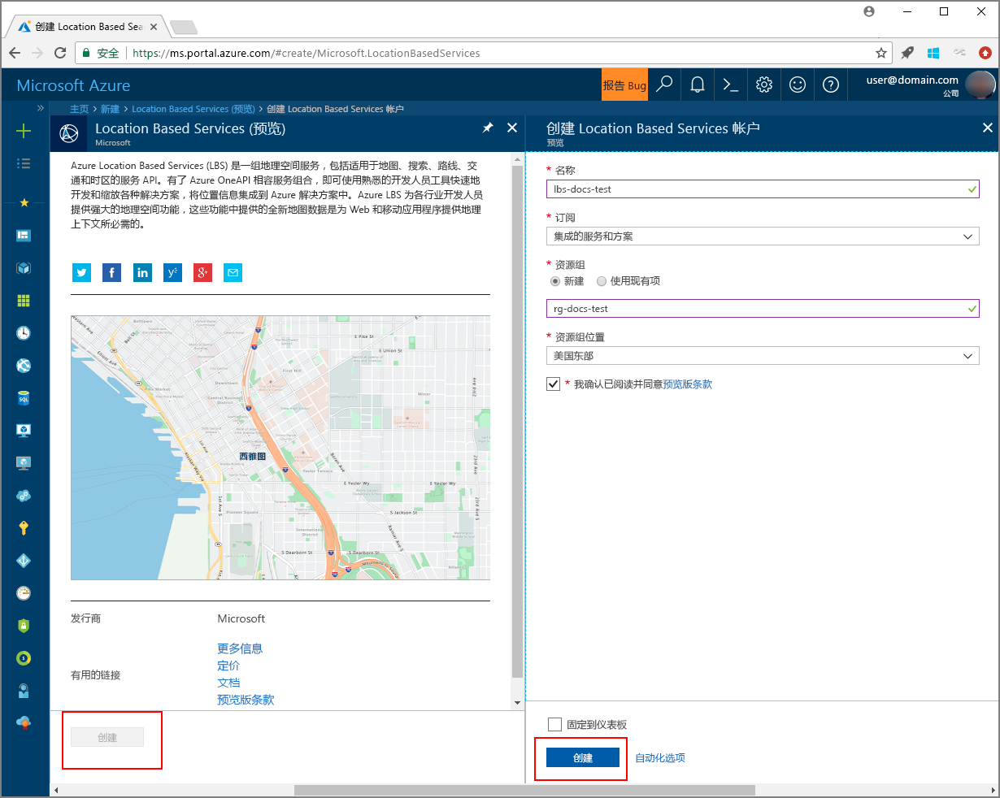

# <a name="search-nearby-points-of-interest-using-azure-location-based-services"></a>使用 Azure Location Based Services 搜索附近的兴趣点

本教程介绍如何使用 Azure Location Based Services 设置一个帐户，然后使用提供的 API 搜索兴趣点。 本教程介绍如何执行下列操作：

> [!div class="checklist"]
> * 使用 Azure Location Based Services 创建帐户
> * 了解 Azure Location Based Services 帐户的主密钥
> * 使用 Map Control API 创建新网页
> * 使用搜索服务查找附近的兴趣点

如果你还没有 Azure 订阅，可以在开始前创建一个 [免费帐户](https://azure.microsoft.com/free/)。

## <a name="log-in-to-the-azure-portal"></a>登录到 Azure 门户
登录到 [Azure 门户](https://portal.azure.com)。

<a id="createaccount"></a>

## <a name="create-an-account-with-azure-location-based-services"></a>使用 Azure Location Based Services 创建帐户

遵循以下步骤创建新的 Location Based Services 帐户。

1. 在 [Azure 门户](https://portal.azure.com)的左上角单击“创建资源”。
2. 在“搜索 Marketplace”框中，键入 **location based services**。
3. 在“结果”中，单击“Location Based Services (预览版)”。 单击地图下面显示的“创建”按钮。 
4. 在“创建 Location Based Services 帐户”页上输入以下值：
    - 新帐户的名称。 
    - 要用于此帐户的订阅。
    - 此帐户的资源组名称。 可以选择新建或使用现有的资源组。
    - 选择“资源组位置”。
    - 阅读“预览版条款”并选中相应的复选框接受条款。 
    - 最后，单击“创建”按钮。
   
    


<a id="getkey"></a>

## <a name="get-the-primary-key-for-your-account"></a>获取帐户的主密钥

成功创建 Location Based Services 帐户后，请遵循以下步骤将该帐户链接到其地图搜索 API：

1. 在门户中打开 Location Based Services 帐户。
2. 导航到帐户的“设置”，选择“密钥”。
3. 将“主密钥”复制到剪贴板。 将此密钥保存在本地，以便在后续步骤中使用。 

    


<a id="createmap"></a>

## <a name="create-new-web-page-using-azure-map-control-api"></a>使用 Azure 地图控件 API 创建新网页
Azure 地图控件 API 是一个方便的客户端库，使用它可以轻松将 Azure Location Based Services 集成到 Web 应用程序中。 它消除了单纯 REST 服务调用的复杂性，并可以通过有样式且可自定义的组件促升工作效率。 以下步骤说明如何使用 Location Based Services 地图控件 API 创建一个嵌入式静态 HTML 页面。 

1. 在本地计算机上，创建一个新文件并将其命名为 **MapSearch.html**。 
2. 将以下 HTML 组件添加到该文件：

    ```HTML
    <!DOCTYPE html>
    <html lang="en">

    <head>
        <meta charset="utf-8" />
        <meta name="viewport" content="width=device-width, user-scalable=no" />
        <title>Map Search</title>

        <link rel="stylesheet" href="https://atlas.microsoft.com/sdk/css/atlas.min.css?api-version=1.0" type="text/css" />
        <script src="https://atlas.microsoft.com/sdk/js/atlas.min.js?api-version=1.0"></script>

        <style>
            html,
            body {
                width: 100%;
                height: 100%;
                padding: 0;
                margin: 0;
            }

            #map {
                width: 100%;
                height: 100%;
            }
        </style>
    </head>

    <body>
        <div id="map"></div>
        <script>
            // Embed Map Control JavaScript code here
        </script>
    </body>

    </html>
    ``` 
    请注意，HTML 标头包含 Azure 地图控件库托管的 CSS 和 JavaScript 资源文件。 请注意已在 HTML 文件的正文中添加 *script* 段。 此段将会包含用于访问 Azure Location Based Services API 的内联 JavaScript 代码。
 
3.  将以下 JavaScript 代码添加到 HTML 文件的 *script* 块。 在脚本中使用 Location Based Services 帐户的主密钥。 

    ```JavaScript
    // Instantiate map to the div with id "map"
    var LBSAccountKey = "<_your account key_>";
    var map = new atlas.Map("map", {
        "subscription-key": LBSAccountKey
    });
    ```
    此段为 Azure Location Based Services 帐户密钥启动地图控件 API。 **Atlas** 是包含 Azure 地图控件 API 和相关视觉组件的命名空间。 **atlas.Map** 提供视觉对象和交互式 Web 地图的控件。 可以在浏览器中打开该 HTML 页面来观察地图的外观。 

4. 将以下 JavaScript 代码添加到 *script* 块，以便在地图控件中添加一个搜索结果图钉层：

    ```JavaScript
    // Initialize the pin layer for search results to the map
    var searchLayerName = "search-results";
    map.addPins([], {
        name: searchLayerName,
        cluster: false,
        icon: "pin-round-darkblue"
    });
    ```

5. 在计算机上保存该文件。 


<a id="usesearch"></a>

## <a name="use-search-service-to-find-nearby-point-of-interest"></a>使用搜索服务查找附近的兴趣点

本部分介绍如何使用 Azure Location Based Services 的搜索服务 API 在地图上查找兴趣点。 这是一个 RESTful API，可让开发人员搜索地址、兴趣点和其他地理信息。 搜索服务会将纬度和经度信息分配到指定的地址。 

1. 打开在上一部分中创建的 **MapSearch.html** 文件，并将以下 JavaScript 代码添加到 *script* 块以演示搜索服务。 
    ```JavaScript
    // Perform a request to the search service and create a pin on the map for each result
    var xhttp = new XMLHttpRequest();
    xhttp.onreadystatechange = function () {
        var searchPins = [];

        if (this.readyState === 4 && this.status === 200) {
            var response = JSON.parse(this.responseText);

            var poiResults = response.results.filter((result) => { return result.type === "POI" }) || [];

            searchPins = poiResults.map((poiResult) => {
                var poiPosition = [poiResult.position.lon, poiResult.position.lat];
                return new atlas.data.Feature(new atlas.data.Point(poiPosition), {
                    name: poiResult.poi.name,
                    address: poiResult.address.freeformAddress,
                    position: poiResult.position.lat + ", " + poiResult.position.lon
                });
            });

            map.addPins(searchPins, {
                name: searchLayerName
            });

            var lons = searchPins.map((pin) => { return pin.geometry.coordinates[0] });
            var lats = searchPins.map((pin) => { return pin.geometry.coordinates[1] });

            var swLon = Math.min.apply(null, lons);
            var swLat = Math.min.apply(null, lats);
            var neLon = Math.max.apply(null, lons);
            var neLat = Math.max.apply(null, lats);

            map.setCameraBounds({
                bounds: [swLon, swLat, neLon, neLat],
                padding: 50
            });
        }
    };
    ```
    此代码片段创建 [XMLHttpRequest](https://xhr.spec.whatwg.org/)，并添加事件处理程序来分析传入的响应。 对于成功的响应，它会在 `searchPins` 变量中收集返回的每个位置的地址、名称、纬度和经度信息。 最后，它会将此位置点集合添加到图钉形式的 `map` 控件。 

2. 将以下代码添加到 *script* 块，以便将 XMLHttpRequest 发送到 Azure Location Based Services 的搜索服务：

    ```JavaScript
    var url = "https://atlas.microsoft.com/search/fuzzy/json?";
    url += "&api-version=1.0";
    url += "&query=gasoline%20station";
    url += "&subscription-key=" + LBSAccountKey;
    url += "&lat=47.6292";
    url += "&lon=-122.2337";
    url += "&radius=100000";

    xhttp.open("GET", url, true);
    xhttp.send();
    ``` 
    此代码片段使用搜索服务的基本搜索 API，即**模糊搜索**。 该 API 可处理最模糊的输入，并可处理地址或 *POI* 标记的任意组合。 它可以搜索附近的**加油站**、以纬度和经度指定的地址，并可以在指定的半径范围内搜索。 它使用前面在示例文件中提供的帐户主密钥向 Location Based Services 发出调用。 对于找到的位置，它以纬度/经度对的形式返回结果。 可以在浏览器中打开该 HTML 页面来观察搜索结果图钉。 

3. 将以下行添加到 *script* 块，以创建搜索服务返回的兴趣点的弹出窗口：

    ```JavaScript
    // Add a popup to the map which will display some basic information about a search result on hover over a pin
    var popup = new atlas.Popup();
    map.addEventListener("mouseover", searchLayerName, (e) => {
        var popupContentElement = document.createElement("div");
        popupContentElement.style.padding = "5px";

        var popupNameElement = document.createElement("div");
        popupNameElement.innerText = e.features[0].properties.name;
        popupContentElement.appendChild(popupNameElement);

        var popupAddressElement = document.createElement("div");
        popupAddressElement.innerText = e.features[0].properties.address;
        popupContentElement.appendChild(popupAddressElement);

        var popupPositionElement = document.createElement("div");
        popupPositionElement.innerText = e.features[0].properties.position;
        popupContentElement.appendChild(popupPositionElement);

        popup.setPopupOptions({
            position: e.features[0].geometry.coordinates,
            content: popupContentElement
        });

        popup.open(map);
    });
    ```
    API **atlas.Popup** 提供一个固定在地图上所需位置的信息窗口。 此代码片段设置弹出窗口的内容和位置，并将一个事件侦听器添加到 `map` 控件，等待鼠标在弹出窗口上滑动。 

4. 保存文件，然后在所选的 Web 浏览器中打开 **MapSearch.html** 文件并观察结果。 现在，将鼠标悬停在显示的任何搜索结果图钉上时，浏览器中的地图会显示信息弹出窗口，如下所示。 

    


## <a name="next-steps"></a>后续步骤
本教程介绍了如何：

> [!div class="checklist"]
> * 使用 Azure Location Based Services 创建帐户
> * 获取帐户的主密钥
> * 使用地图控件 API 创建新网页
> * 使用搜索服务查找附近的兴趣点

继续学习教程[使用 Azure Location Based Services 查找兴趣点的路线](./tutorial-route-location.md)，了解如何使用 Azure Location Based Services 查找兴趣点的路线。 
