# Log Analytics 入门
几分钟内即可在 Microsoft Operations Management Suite (OMS) 中启动并运行 Log Analytics。 可通过两种方法创建 OMS 工作区（与帐户类似）：

* Microsoft Operations Management Suite 网站
* Microsoft Azure 订阅

可以通过 OMS 网站创建免费 OMS 工作区。 还可使用 Microsoft Azure 订阅创建免费 Log Analytics 工作区。 这两种创建工作区的方式是等效的。 免费工作区每天只能向 OMS 服务发送 500 MB 数据。 所有工作区都需要 Azure 订阅，因此还可使用订阅来访问其他 Azure 服务。 无论使用哪种方法创建工作区，都通过 Microsoft 帐户或组织帐户创建工作区。

有关过程概述如下：

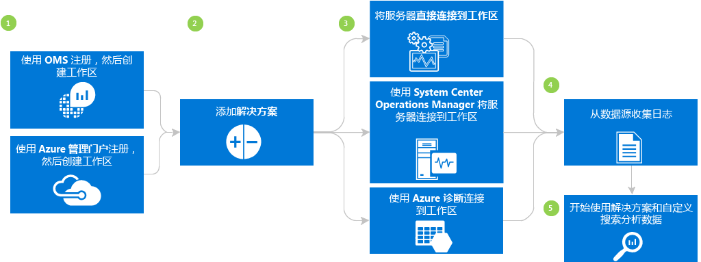

## Log Analytics先决条件和部署注意事项
* 需要付费的 Microsoft Azure 订阅才能使用完整的 Log Analytics。 如果不具有 Azure 订阅，可以先创建一个[免费帐户](https://azure.microsoft.com/free/)，这样就可以访问任何 Azure 服务（期限为 30 天）。 也可在 [Operations Management Suite](http://microsoft.com/oms) 网站创建免费 OMS 帐户。
* 需要创建工作区
* 要从中收集数据的每台 Windows 计算机都必须运行 Windows Server 2008 SP1 或更高版本
* [防火墙](log-analytics-proxy-firewall.md)可访问 OMS Web 服务的地址
* 确定计算机可直接访问 Internet。 如果不能，则需通过网关服务器访问 OMS Web 服务站点。 所有访问都通过 HTTPS 进行。 计算机无法访问 Internet 时，可设置[OMS 网关](log-analytics-oms-gateway.md)服务器将流量从服务器转发到 OMS。
* 如果使用 Operations Manager，则 Log Analytics 支持 Operations Manager 2012 SP1 UR6 和更高版本，以及 Operations Manager 2012 R2 UR2 和更高版本。 Operations Manager 2012 SP1 UR7 和 Operations Manager 2012 R2 UR3 中添加了代理服务器支持。 确定如何与 OMS 集成。
* 确定用于将数据发送到 OMS 的技术和服务器。 例如域控制器、SQL Server 等。
* 向 OMS 和 Azure 中的用户授予权限。
* 如果担心数据使用，请单独部署每个解决方案，并在添加其他解决方案前测试性能影响。
* 将解决方案和功能添加到 Log Analytics 后，查看数据使用情况和性能。 包括事件收集、日志收集、性能数据收集等。最好从最小收集开始，直到识别到数据使用或性能影响。
* 验证未同时通过 Operations Manager 管理 Windows 代理（否则将导致数据重复）。 这同样适用于已启用 Azure 诊断的基于 Azure 的代理。
* 安装代理后，验证代理正常工作。 如果不正常，请检查以确保未使用组策略禁用加密 API：下一代 (CNG) 密钥隔离。
* 某些 Log Analytics 解决方案还有其他要求

## 使用 OMS 3 步完成注册
1. 转到 [Operations Management Suite](http://microsoft.com/oms) 网站。 使用 Microsoft 帐户（如 Outlook.com）或公司或教育机构提供的组织帐户登录，以使用 Office 365 或其他 Microsoft 服务。
2. 提供唯一工作区名称。 工作区是存储管理数据的逻辑容器。 可使用工作区对组织中不同团队的数据进行划分，因为数据专用于其工作区。 指定要用于存储数据的电子邮件地址和区域。  
    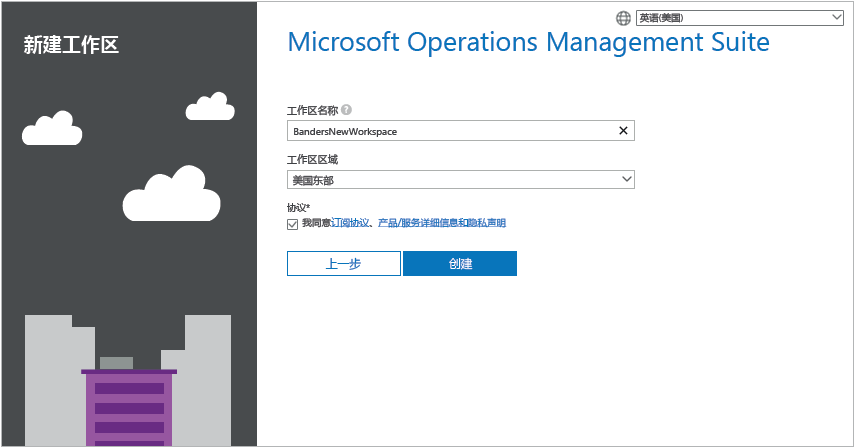
3. 接下来，创建新的免费 Azure 订阅，或链接到现有 Azure 订阅。  
   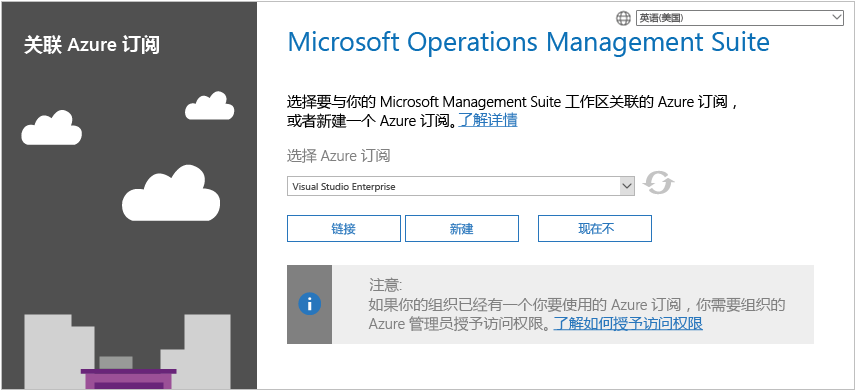

现在即可开始使用 Operations Management Suite 门户。

有关通过 Operations Management Suite 设置工作区并将现有 Azure 帐户链接到所创建的工作区的详细信息，请参阅[管理工作区](log-analytics-manage-access.md)。

## 使用 Microsoft Azure 快速注册
1. 转到 [Azure 门户](https://portal.azure.com)并登录，浏览服务列表，然后选择“Log Analytics”。  
    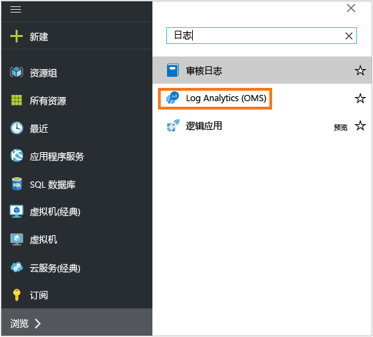
2. 单击“添加”，然后为以下各项选择选项：
   * **OMS 工作区**名称
   * **订阅** -若有多个订阅，请选择要与新工作区相关联的订阅。
   * **资源组**
   * **位置**
   * **定价层**  
       
3. 单击“确定”，将看到工作区列表。
4. 选择工作区以在 Azure 门户中查看其详细信息。       
             
5. 单击“OMS 门户”链接，打开包含新工作区的 Operations Management Suite 网站。

现在即可开始使用 Operations Management Suite 门户。

有关通过 Azure 订阅的 Operations Management Suite 设置工作区并链接所创建的现有工作区的详细信息，请参阅[管理对 Log Analytics 的访问](log-analytics-manage-access.md)。

## 开始使用 Operations Management Suite 门户
若要选择解决方案并连接要管理的服务器，请单击“设置”磁贴，然后按照本节中的步骤进行操作。  

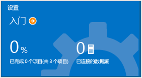  

1. **添加解决方案** -查看已安装的解决方案。  
    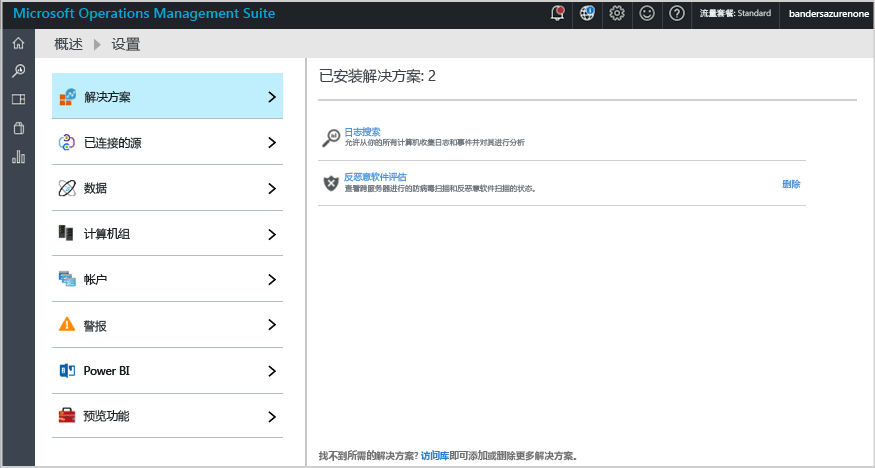  
    单击“访问库”添加更多解决方案。  
    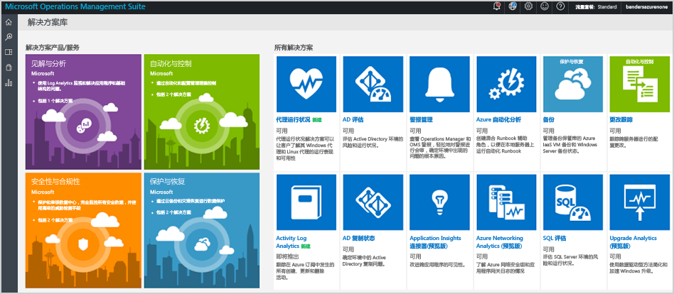  
    选择解决方案，然后单击“添加”。
2. **连接源** - 选择要如何连接服务器环境以收集数据：

   * 通过安装代理，直接连接任意 Windows Server 或客户端。
   * 通过适用于 Linux 的 OMS 代理连接 Linux 服务器。
   * 使用配置了 Windows 或 Linux Azure 诊断 VM 扩展的 Azure 存储帐户。
   * 使用 System Center Operations Manager 附加管理组或整个 Operations Manager 部署。
   * 允许 Windows 遥测使用升级分析。
       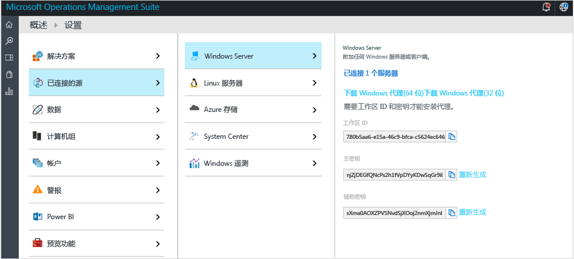    
3. **收集数据** 配置至少一个数据源，以将数据填充到工作区。 完成后，单击“保存”。    

    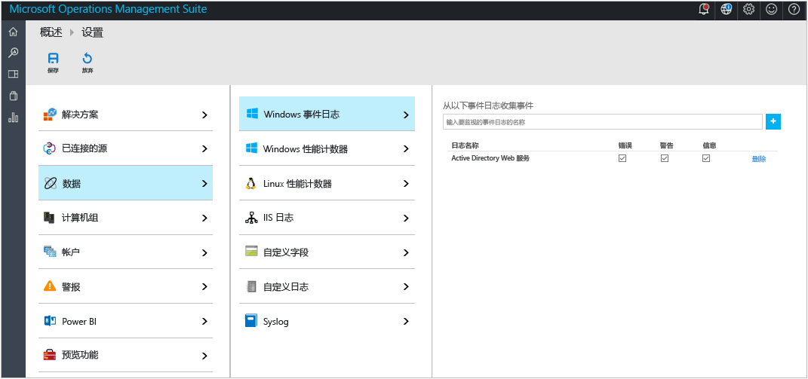    

## 或者通过安装代理连接 Windows 计算机
下面的示例演示如何安装 Windows 代理。

1. 依次单击“设置”磁贴和“连接的源”选项卡，再单击要添加的源类型的选项卡，然后下载代理或了解如何启用代理。 例如，单击“下载 Windows 代理(64 位)”。 对于 Windows 代理，只能在 Windows Server 2008 SP 1 或更高版本，或者 Windows 7 SP1 或更高版本上安装代理。
2. 在一个或多个服务器上安装代理。 可以逐个安装代理，或使用自动化程度较高的[自定义脚本](log-analytics-windows-agents.md)方法，还可使用现有的软件分发解决方案。
3. 同意许可协议并选择安装文件夹后，选择“将代理连接到 Azure Log Analytics (OMS)”。   
    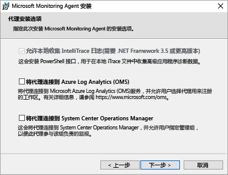
4. 在下一页上，将提示你提供工作区 ID 和工作区密钥。 工作区 ID 和密钥显示在下载代理文件的屏幕上。  
    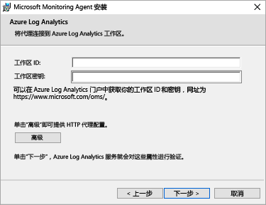  

    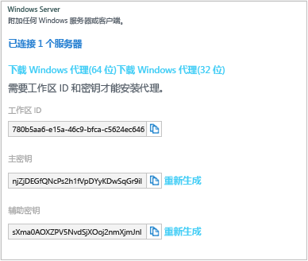
5. 安装期间，可单击“高级”以根据需要设置代理服务器和提供身份验证信息。 单击“下一步”按钮，返回到“工作区信息”屏幕。
6. 单击“下一步”验证工作区 ID 和密钥。 如果发现错误，可以单击“返回”进行更正。 验证工作区 ID 和密钥后，单击“安装”即完成代理安装。
7. 在控制面板中，单击“Microsoft Monitoring Agent”>“Azure Log Analytics (OMS)”选项卡。 代理与 Operations Management Suite 服务通信时，将显示绿色勾号。 最初，这需要大约 5-10 分钟。

> [!NOTE]
> 直接连接到 Operations Management Suite 的服务器当前不支持容量管理和配置评估解决方案。

也可将代理连接到 System Center Operations Manager 2012 SP1 和更高版本。 要进行此操作，请选择“将代理连接到 System Center Operations Manager”。 选择该选项时即将数据发送到服务，无需为管理组增加额外的硬件或负载。

有关将代理连接到 Operations Management Suite 的详细信息，请参阅[将 Windows 计算机连接到 Log Analytics](log-analytics-windows-agents.md)。

## 使用 System Center Operations Manager 连接服务器（可选）
1. 在 Operations Manager 控制台中，选择“管理”。
2. 展开“Operational Insights”节点，然后选择“Operational Insights 连接”。

   > [!NOTE]
   > 答：根据所用 SCOM 更新汇总，可能显示*System Center Advisor*、*Operational Insights*或 *Operations Management Suite* 节点。
   >
   >
3. 单击右上方的“注册 Operational Insights”链接，然后按照说明进行操作。
4. 完成注册向导后，单击“添加计算机/组”链接。
5. 在“**计算机搜索**”对话框中可以搜索 Operations Manager 监视的计算机或组。 选择要载入到 Log Analytics 的计算机或组，单击“添加”，然后单击“确定”。 可在 Operations Management Suite 门户中转到“使用情况”磁贴，以验证 OMS 服务是否接收数据。 应在 5-10 分钟内显示数据。

有关将 Operations Manager 连接到 Operations Management Suite 的详细信息，请参阅[将 Operations Manager 连接到 Log Analytics](log-analytics-om-agents.md)。

## 在 Microsoft Azure 中分析来自云服务的数据（可选）
利用 Operations Management Suite，可通过为 Azure 云服务启用诊断，快速搜索云服务和虚拟机的事件和 IIS 日志。 还可通过安装 Microsoft Monitoring Agent，接收有关 Azure 虚拟机的其他见解。 有关如何将 Azure 环境配置为使用 Operations Management Suite 详细信息，请参阅[将 Azure 存储连接到 Log Analytics](log-analytics-azure-storage.md)。

## 后续步骤
* [从解决方案库中添加 Log Analytics 解决方案](log-analytics-add-solutions.md)，以添加功能和收集数据。
* 熟悉[日志搜索](log-analytics-log-searches.md)以查看解决方案收集的详细信息。
* 使用[仪表板](log-analytics-dashboards.md)保存并显示你自己的自定义搜索。

<!--HONumber=Dec16_HO2-->

