# Log Analytics 工作区入门
用户可以快速启动并运行 Azure Log Analytics，以便评估从 IT 基础结构中收集的操作智能。 阅读本文以后，即可轻松浏览、分析和操作*免费* 收集的数据。

本文为 Log Analytics 简介，以简易教程的方式指导用户在开始使用服务之前完成 Azure 中的最小型部署。 用于存储 Azure 中的管理数据的逻辑容器称为工作区。 用户在查看此信息并完成自己的评估以后，可以删除评估工作区。 本文为教程，因此不讨论业务需求、规划或体系结构指南方面的问题。

>[!NOTE]
>如果你使用 Microsoft Azure 政府版云，可改用 [Azure 政府版监视 + 管理文档](https://docs.microsoft.com/azure/azure-government/documentation-government-services-monitoringandmanagement#log-analytics)。

下面快速介绍入门过程：

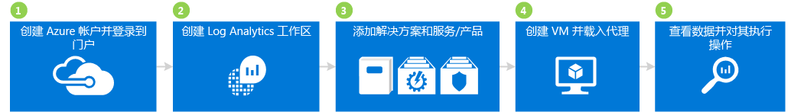

## 1 创建 Azure 帐户并登录

如果还没有 Azure 帐户，需先创建一个，然后才能使用 Log Analytics。 可以先创建一个[免费帐户](https://azure.microsoft.com/free/)，这样就可以访问任何 Azure 服务（期限为 30 天）。

### 创建免费帐户并登录
1. 按[创建免费 Azure 帐户](https://azure.microsoft.com/free/)中的指示操作。
2. 转到 [Azure 门户](https://portal.azure.com)并登录。

## 2 创建工作区

下一步是创建工作区。

1. 在 Azure 门户的应用商店的服务列表中，搜索“Log Analytics”，然后选择“Log Analytics”。  
    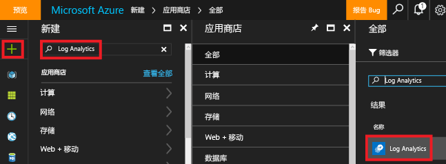
2. 单击“创建”，然后为以下各项选择选项：
   * **OMS 工作区** - 键入工作区的名称。
   * **订阅** -若有多个订阅，请选择要与新工作区相关联的订阅。
   * **资源组**
   * **位置**
   * **定价层**  
       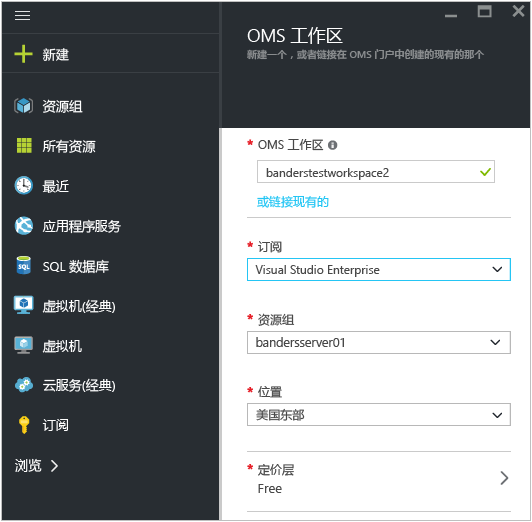
3. 单击“确定”查看工作区列表。
4. 选择工作区，在 Azure 门户中查看其详细信息。       
    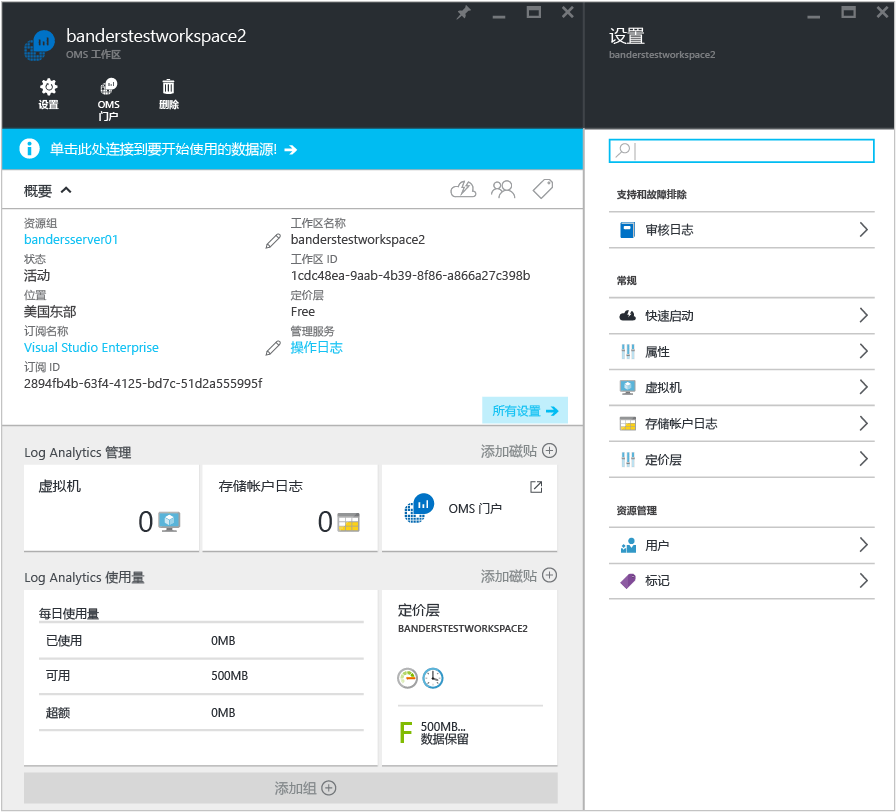         

## 3 添加解决方案和解决方案产品/服务

接下来，添加管理解决方案和解决方案产品/服务。 管理解决方案是逻辑、可视化效果和数据采集规则的集合，提供围绕特定问题领域制定的指标。 一种解决方案产品/服务是管理解决方案捆绑包。

向工作区添加解决方案以后，Log Analytics 就可以从使用代理连接到工作区的计算机收集各种数据。 我们稍后介绍载入代理。

### 添加解决方案和解决方案产品/服务

1. 在 Azure 门户中单击“新建”，在“搜索应用商店”框中键入“活动 Log Analytics”，然后按 Enter。
2. 在“全部”边栏选项卡中，选择“活动 Log Analytics”，然后单击“创建”。  
    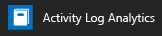  
3. 在*管理解决方案名称*边栏选项卡中，选择要与该管理解决方案相关联的工作区。
4. 单击“创建” 。  
    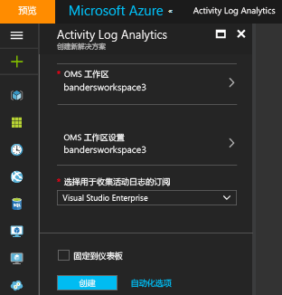  
5. 重复步骤 1 - 4，以便添加：
    - **安全性与符合性**服务产品，包含反恶意软件评估以及安全和审核解决方案。
    - **自动化与控制**服务产品，包含自动化混合辅助角色、更改跟踪以及系统更新评估（也称“更新管理”）解决方案。 添加解决方案产品/服务时，必须创建自动化帐户。  
        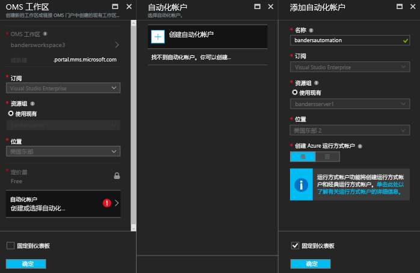  
6. 可以查看已添加到工作区的管理解决方案，只需导航到“Log Analytics” > “订阅” > ***工作区名称*** > “概览”即可。 将会显示已添加管理解决方案的磁贴。  
    >[!NOTE]
    >我们还没有将任何代理连接到工作区，因此用户看不到所添加解决方案的任何数据。  

    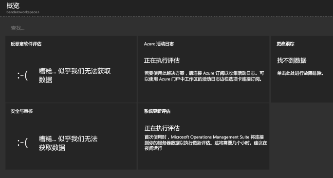

## 4 创建 VM 并载入代理

接下来，在 Azure 中创建简单的虚拟机。 创建 VM 后，载入 OMS 代理将其启用。 启用代理之后，即可从 VM 开始收集数据并将数据发送到 Log Analytics。

### 创建虚拟机

- 按照[在 Azure 门户中创建首台 Windows 虚拟机](../virtual-machines/virtual-machines-windows-hero-tutorial.md)中的指示进行操作，启动新的虚拟机。

### 将虚拟机连接到 Log Analytics

- 按照[将 Azure 虚拟机连接到 Log Analytics](log-analytics-azure-vm-extension.md) 中的指示进行操作，使用 Azure 门户将 VM 连接到 Log Analytics。

## 5 查看和处理数据

用户此前已启用活动 Log Analytics 解决方案、安全性与符合性服务产品，以及自动化与控制服务产品。 接下来，我们开始查看通过解决方案收集的数据以及日志搜索中的结果。

开始时，请先查看解决方案中显示的数据， 然后查看一些可以通过日志搜索访问的日志搜索结果。 日志搜索允许你将环境内来自多个源的任意计算机数据进行组合和关联。 有关详细信息，请参阅 [Log Analytics 中的日志搜索](log-analytics-log-searches.md)。 最后，处理我们使用 OMS 门户（位于 Azure 门户外面）找到的数据。

### 查看反恶意软件数据

1. 在 Azure 门户中，导航到 **Log Analytics** > ***你的工作区***。
2. 在工作区的边栏选项卡的“常规”下单击“概览”。  
    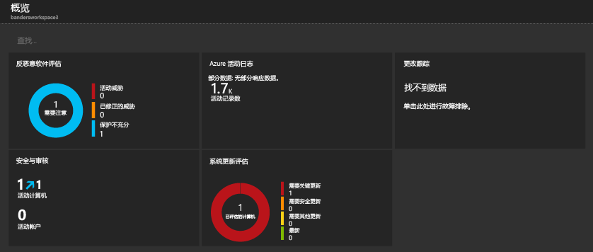
3. 单击“反恶意软件评估”磁贴。 在此示例中，可以看到 Windows Defender 已安装在一台计算机上，但其签名已过期。  
    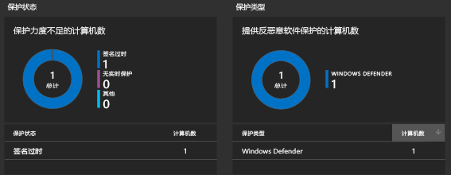
4. 就此示例来说，请在“保护状态”下单击“签名过期”，以便打开日志搜索并查看其签名已过期的计算机的详细信息。 在此示例中，请注意计算机的名称为 *getstarted*。 如果多台计算机签名过期，这些计算机都会显示在日志搜索结果中。  
    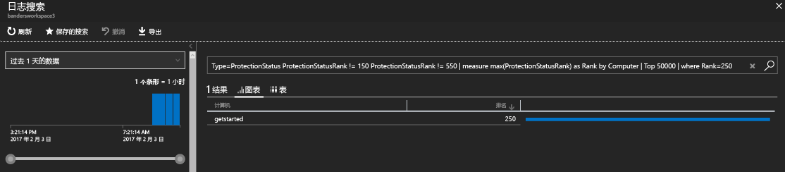

### 查看安全和审核数据

1. 在工作区的边栏选项卡的“常规”下单击“概览”。  
2. 单击“安全和审核”磁贴。 在此示例中，可以看到两个值得注意的问题：一台计算机缺少关键更新，一台计算机保护不够。  
    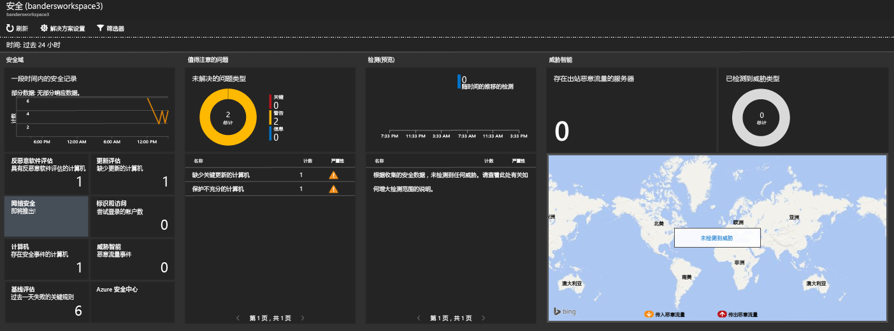
3. 就此示例来说，请在“值得注意的问题”下单击“缺少关键更新的计算机”，以便打开日志搜索并查看缺少关键更新的计算机的详细信息。 在此示例中，缺少一项关键更新，缺少 63 项其他更新。  
    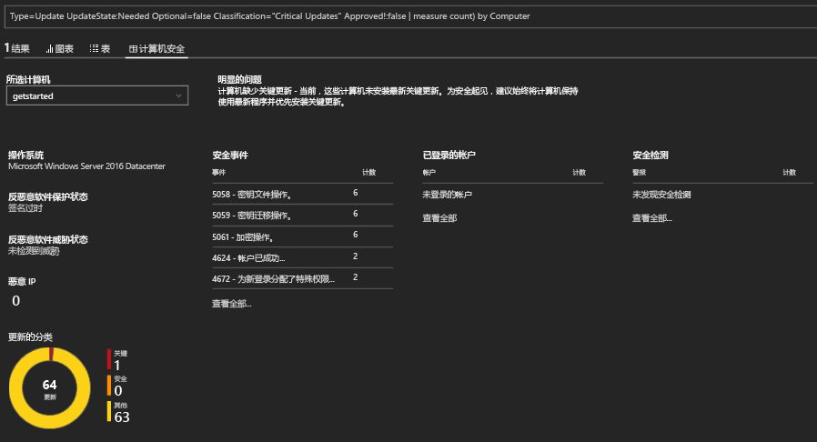

### 查看和处理系统更新数据

1. 在工作区的边栏选项卡的“常规”下单击“概览”。  
2. 单击“系统更新评估”磁贴。 在此示例中，可以看到一台名为 *getstarted* 的 Windows 计算机需要关键更新，一台需要定义更新。  
    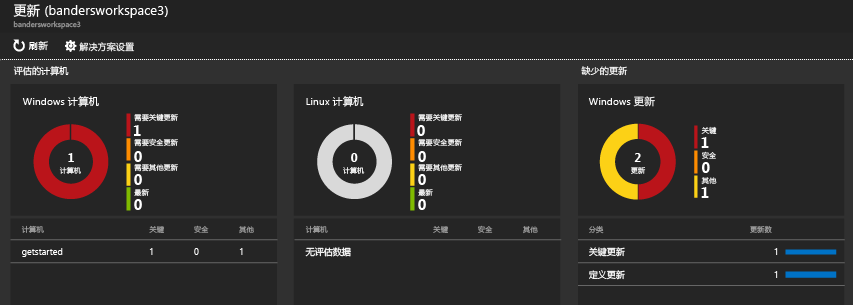
3. 就此示例来说，请在“缺少更新”下单击“关键更新”，以便打开日志搜索并查看缺少关键更新的计算机的详细信息。 在此示例中，有一个缺失的更新，有一个必需的更新。  
    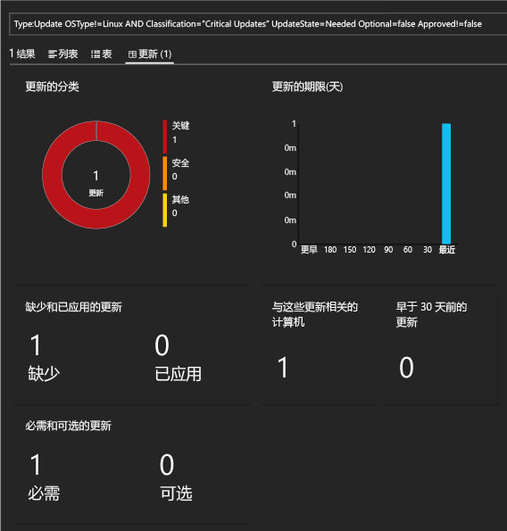
4. 转到 [Operations Management Suite](http://microsoft.com/oms) 网站，使用 Azure 帐户登录。 登录以后，请注意，解决方案信息类似于在 Azure 门户中看到的信息。  
    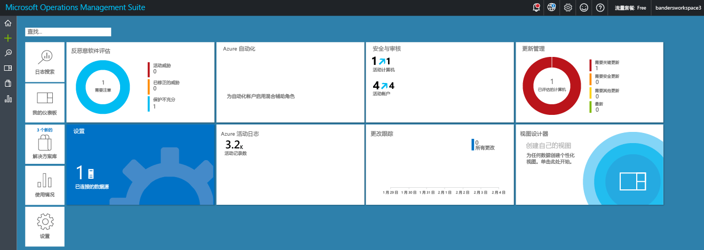
5. 单击“更新管理”磁贴。
6. 在“更新管理”仪表板中，请注意，系统更新信息类似于在 Azure 门户中看到的系统更新信息。 但是，“管理更新部署”磁贴是新的。 单击“管理更新部署”磁贴。  
    
7. 在“更新部署”页中，单击“添加”创建*更新运行*。  
    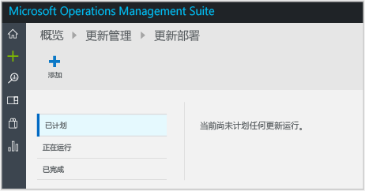
8.  在“新建更新部署”页中，键入更新部署的名称，选择要更新的计算机（此示例中为 *getstarted*），选择一个计划，然后单击“保存”。  
    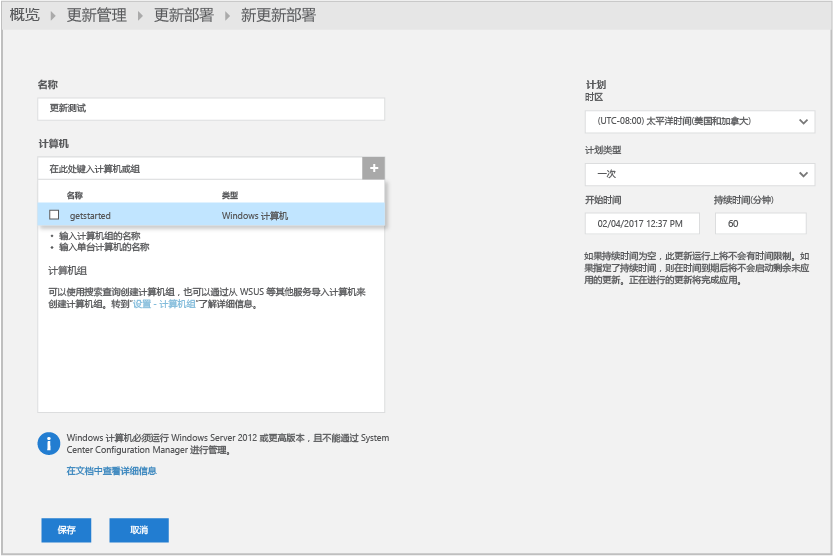  
    保存更新部署以后，可以看到计划的更新。  
    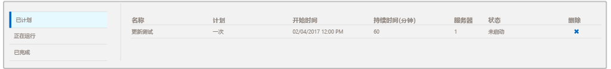  
    完成更新运行以后，状态显示“已完成”。
    
9. 完成更新运行以后，即可查看运行是否成功，以及所应用的具体更新的详细信息。

## 评估之后

在本教程中，用户在虚拟机上安装了一个代理并快速开始操作。 所执行的步骤既快速又简单。 但是，大多数大型组织和企业的本地 IT 基础结构很复杂。 因此，从这些复杂的环境收集数据需要进行比本教程所述更多的规划，付出更多的精力。 请查看下面的“后续步骤”部分中的信息，获取有用文章的链接。

可以选择删除在本教程中创建的工作区。

## 后续步骤
* 了解如何将 [Windows 代理](log-analytics-windows-agents.md)连接到 Log Analytics。
* 了解如何将 [Operations Manager 代理](log-analytics-om-agents.md)连接到 Log Analytics。
* [从解决方案库中添加 Log Analytics 解决方案](log-analytics-add-solutions.md)，以添加功能和收集数据。
* 熟悉[日志搜索](log-analytics-log-searches.md)以查看解决方案收集的详细信息。

