# 管理工作区

若要管理对 Log Analytics 的访问，需要对工作区执行各种管理任务。 本文提供在使用各种帐户类型管理工作区时可以遵循的最佳实践建议和过程。 工作区实际上是包含帐户信息和帐户简单配置信息的容器。 你或组织中的其他成员可以使用多个工作区，管理收集自所有或部分 IT 基础结构的不同数据集。

若要创建工作区，需要：

1. 一个 Azure 订阅。
2. 选择工作区名称。
3. 将该工作区与订阅相关联。
4. 选择地理位置。

## 确定所需工作区数
工作区是一种 Azure 资源，也是 Azure 门户中收集、聚合、分析和呈现数据的容器。

可以创建多个工作区，并允许用户访问一个或多个工作区。 最大限度减少工作区数可查询和关联最多的数据。 本部分介绍有助于创建多个工作区的情况。

工作区目前提供：

* 数据存储的地理位置
* 计费粒度
* 数据隔离

基于上述特征，在以下情况下可能会想要创建多个工作区：

* 贵公司是全球性公司，因数据所有权和合规性需要将数据存储于特定区域。
* 你正在使用 Azure，并希望通过让工作区与它所管理的 Azure 资源位于同一区域，避免产生出站数据传输费用。
* 希望根据使用情况将费用分配到不同部门或业务组。 为每个部门或业务组创建工作区时，Azure 帐单和使用声明单独显示每个工作区的费用。
* 公司是托管服务提供商，需要为所管理的每位客户单独保留 Log Analytics 数据，即与其他客户的数据分开保存。
* 管理多个客户，并希望每个客户/部门/业务组能够看到自己的数据，而不是他人的数据。

使用代理收集数据时，可将每个代理配置为向一个或多个工作区报告。

如果使用 System Center Operations Manager，每个 Operations Manager 管理组仅可以连接一个工作区。 可以在 Operations Manager 管理的计算机上安装 Microsoft Monitoring Agent，并使代理向 Operations Manager 和不同 Log Analytics 工作区报告。

### 工作区信息

可以在 Azure 门户中查看有关工作区的详细信息。 也可以在 OMS 门户中查看详细信息。

#### 在 Azure 门户中查看工作区信息

1. 如果尚未登录 [Azure 门户](https://portal.azure.com)，请使用 Azure 订阅登录。
2. 在“中心”菜单中，单击“更多服务”，然后在资源列表中，键入“Log Analytics”。 当你开始键入时，会根据你的输入筛选该列表。 单击“Log Analytics”。  
    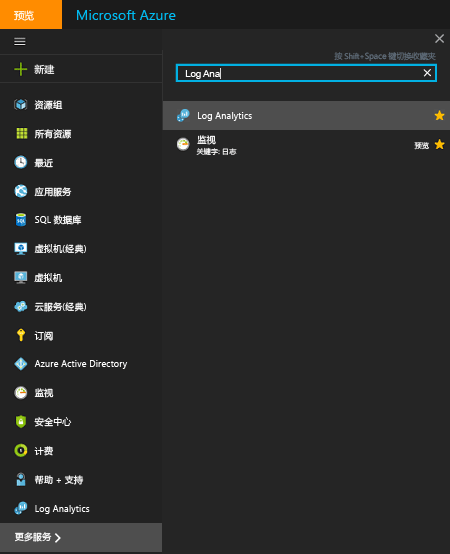  
3. 在 Log Analytics 订阅边栏选项卡中选择一个工作区。
4. 工作区边栏选项卡将显示有关工作区的详细信息，以及其他信息的链接。  
    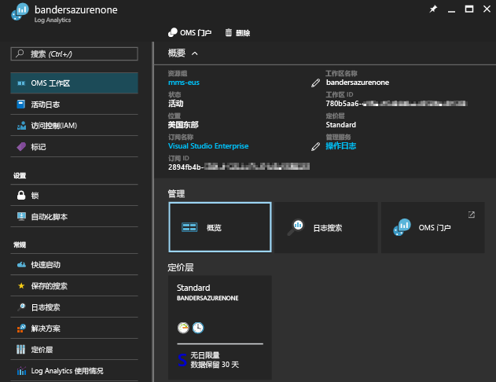  

## 管理帐户和用户
每个工作区可有多个与其关联的用户帐户，每个用户帐户（Microsoft 帐户或组织帐户）可访问多个工作区。

默认情况下，用于创建工作区的 Microsoft 帐户或组织帐户会成为该工作区的管理员。 然后，管理员可以邀请其他 Microsoft 帐户，或从 Azure Active Directory 中选取用户。

在两个位置控制用户对工作区的访问权限：

* 在 Azure 中，可以使用基于角色的访问控制提供对 Azure 订阅和关联 Azure 资源的访问权限。 这些权限也可用于访问 PowerShell 和 REST API。
* 在 OMS 门户中，仅可访问 OMS 门户，不能访问关联的 Azure 订阅。

如果仅授予用户访问 OMS 门户的权限，但不授予访问门户所链接的 Azure 订阅的权限，则用户无法查看“备份”和 Site Recovery 解决方案磁贴中的数据。
若要允许所有用户查看这些解决方案中的数据，确保它们至少具备对备份保管库和链接到工作区的 Site Recovery 保管库的**读取者**访问权限。   

### 使用 Azure 门户管理对 Log Analytics 的访问
例如，如果授予用户在 Azure 门户中使用 Azure 权限访问 Log Analytics 工作区的权限，则该用户也可以访问 Log Analytics 门户。 在 Azure 门户中，用户可以在查看 Log Analytics 工作区资源时，通过单击“OMS 门户”任务导航到 OMS 门户。

有关 Azure 门户需记住的一些要点：

* 这不是基于角色的访问控制。 在 Azure 门户中，如果拥有对 Log Analytics 工作区的读者访问权限，则可以使用 OMS 门户更改工作区。 OMS 门户提供管理员、参与者和只读用户的概念。 如果登录所用帐户位于链接到工作区的 Azure Active Directory，则你为 OMS 门户的管理员，否则为参与者。
* 通过 http://mms.microsoft.com 登录 OMS 门户时，则默认可看到“选择工作区”列表。 其中仅包含已通过 OMS 门户添加的工作区。 若要查看使用 Azure 订阅可以访问的工作区，需要指定租户作为 URL 的一部分。 例如：

  `mms.microsoft.com/?tenant=contoso.com` 租户标识符通常是用于登录的电子邮件地址的最后一部分。
* 如果登录所用帐户是租户 Azure Active Directory 中的帐户，则你是 OMS 门户中的管理员。 通常如此，但作为 CSP 登录的情况例外。  如果所用帐户不是租户 Azure Active Directory 中的帐户，则你是 OMS 门户中的用户。
* 如果希望直接导航到使用 Azure 权限可以访问的门户，需要指定资源作为 URL 的一部分。 使用 PowerShell 可以获得此 URL。

  例如，`(Get-AzureRmOperationalInsightsWorkspace).PortalUrl`。

  URL 如下所示：`https://eus.mms.microsoft.com/?tenant=contoso.com&resource=%2fsubscriptions%2faaa5159e-dcf6-890a-a702-2d2fee51c102%2fresourcegroups%2fdb-resgroup%2fproviders%2fmicrosoft.operationalinsights%2fworkspaces%2fmydemo12`

### 在 OMS 门户管理用户
在“设置”页中“帐户”选项卡下的“管理用户”选项卡中，管理用户和组。   

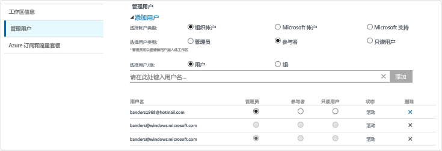

#### 将用户添加到现有工作区
使用以下步骤将用户或组添加到工作区。

1. 在 OMS 门户中，单击“设置”磁贴。
2. 单击“帐户”选项卡，然后单击“管理用户”选项卡。
3. 在“管理用户”部分，选择要添加的帐户类型：**组织帐户**、**Microsoft 帐户**、**Microsoft 支持**。

   * 如果选择 Microsoft 帐户，键入与 Microsoft 帐户关联的用户的电子邮件地址。
   * 如果选择组织帐户，可以输入部分用户名或组织名或者电子邮件别名，随后下拉框中将显示一列匹配的用户和组。 选择用户或组。
   * 使用 Microsoft 支持可向 Microsoft 支持工程师或其他 Microsoft 员工提供临时访问工作区的权限，帮助进行疑难解答。

     > [!NOTE]
     > 若要获得最佳性能，可将与单个 OMS 帐户关联的 Active Directory 组数限制为三个，分别用于管理员、参与者和只读用户。 使用多个组可能会影响 Log Analytics 的性能。
     >
     >
4. 选择要添加的用户或组的类型：**管理员**、**参与者**或**只读用户**。  
5. 单击“添加”。

   如果正要添加 Microsoft 帐户，系统会向所提供的电子邮件发送加入工作区的邀请。 用户按照邀请中的说明加入 OMS 后，便可访问此工作区。
   如果正要添加组织帐户，该帐户用户可以立即访问 Log Analytics。  

#### 编辑现有用户类型
可以更改与 OMS 帐户关联的用户帐户角色。 可以使用以下角色选项：

* 管理员：可以管理用户、查看和处理所有警报，并添加和删除服务器
* 参与者：可以查看和处理所有警报，并添加和删除服务器
* 只读用户：标记为只读的用户无法：

  1. 添加/删除解决方案。 已隐藏解决方案库。
  2. 在“我的仪表板”上添加/修改/删除磁贴。
  3. 查看“设置”页。 已隐藏该页面。
  4. 在“搜索”视图中，已隐藏“PowerBI 配置”、“保存的搜索”和“警报任务”。

#### 编辑帐户
1. 在 OMS 门户中，单击“设置”磁贴。
2. 单击“帐户”选项卡，然后单击“管理用户”选项卡。
3. 选择想要更改的用户角色。
4. 在确认对话框中，单击“是”。

### 从工作区中删除用户
使用以下步骤可从工作区中删除用户。 删除用户不会关闭工作区。 而会删除该用户与工作区之间的关联。 如果用户与多个工作区关联，该用户仍可以登录 OMS 并查看其他工作区。

1. 在 OMS 门户中，单击“设置”磁贴。
2. 单击“帐户”选项卡，然后单击“管理用户”选项卡。
3. 在要删除的用户名旁，单击“删除”。
4. 在确认对话框中，单击“是”。

### 将组添加到现有工作区
1. 按照上方“将用户添加到现有工作区”中的步骤 1-4 进行操作。
2. 在“选择用户/组”下，选择“组”。  
   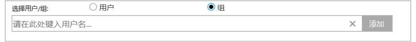
3. 输入要添加的组的显示名称或电子邮件地址。
4. 在列表结果中选择该组，然后单击“添加”。

## 将现有工作区链接到 Azure 订阅
2016 年 9 月 26 日之后创建的所有工作区必须在创建时链接到 Azure 订阅。 此日期之前创建的工作区必须在下次登录时链接到某工作区。 从 Azure 门户创建工作区或者将工作区链接到 Azure 订阅时，Azure Active Directory 会链接为组织帐户。

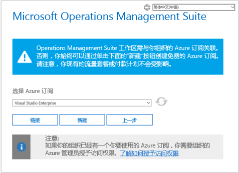

> [!IMPORTANT]
> 若要链接工作区，Azure 帐户必须已可以访问要链接的工作区。  换言之，用于访问 Azure 门户的帐户必须与用于访问工作区的帐户**相同**。 否则，请参阅[将用户添加到现有工作区](#add-a-user-to-an-existing-workspace)。
>
>

### 将工作区链接到 OMS 门户中的 Azure 订阅
若要将工作区链接到 OMS 门户中的 Azure 订阅，登录用户必须已有付费的 Azure 帐户。

1. 在 OMS 门户中，单击“设置”磁贴。
2. 单击“帐户”选项卡，然后单击“Azure 订阅和数据计划”选项卡。
3. 单击要使用的数据计划。
4. 单击“保存”。  
   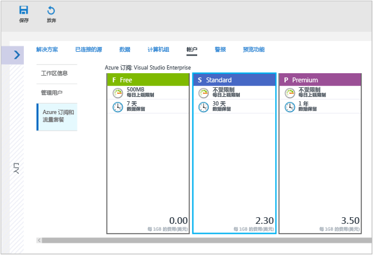

新数据计划会显示网页顶部的 OMS 门户功能区。

### 将工作区链接到 Azure 门户中的 Azure 订阅
1. 登录到 [Azure 门户](http://portal.azure.com)。
2. 浏览到 **Log Analytics**，然后选择它。
3. 随即会看到现有工作区列表。 单击“添加”。  
   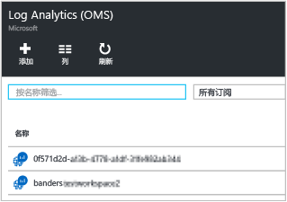
4. 在“OMS 工作区”下，单击“或链接现有的”。  
   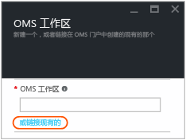
5. 单击“配置所需设置”。  
   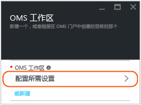
6. 随即会看到尚未链接到 Azure 帐户的工作区列表。 选择工作区。  
   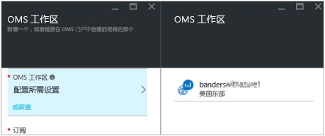
7. 如果需要，可以更改以下项的值：
   * 订阅
   * 资源组
   * 位置
   * 定价层  
     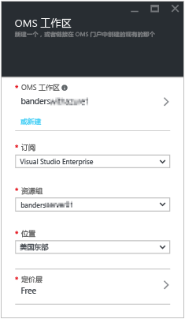
8. 单击“确定”。 工作区现已链接到 Azure 帐户。

> [!NOTE]
> 如果找不到要链接的工作区，则 Azure 订阅无法访问使用 OMS 网站创建的工作区。  需要从 OMS 门户对此帐户授予访问权限。 为此，请参阅[将用户添加到现有工作区](#add-a-user-to-an-existing-workspace)。
>
>

## 将工作区升级为付费计划
有三个用于 OMS 的工作区计划类型：**免费**、**独立**和 **OMS**。  如果使用免费计划，则每天发送到 Log Analytics 的数据大小限制为 500 MB。  如果超量，需要将工作区更改为付费计划，避免无法收集超出此限制的数据。 可以随时更改计划类型。  有关 OMS 定价的详细信息，请参阅[定价详细信息](https://www.microsoft.com/en-us/cloud-platform/operations-management-suite-pricing)。

### 使用 OMS 订阅中的权利
若要使用通过购买用于 System Center 的 OMS E1、OMS E2 OMS 或 OMS 附加设备所获得的权利，请选择 OMS Log Analytics 的 OMS  计划。

购买 OMS 订阅时，相应权利将添加到企业协议。 依据本协议创建的任何 Azure 订阅都可以使用这些权利。 例如，这允许拥有多个使用 OMS 订阅中的权利的工作区。

若要确保工作区的使用情况适用于 OMS 订阅中的权利，需要：

1. 在 Azure 订阅（包含 OMS 订阅的企业协议的一部分）中创建工作区
2. 为工作区选择 *OMS* 计划

> [!NOTE]
> 如果工作区创建于 2016 年 9 月 26 日之前，并且 Log Analytics 定价计划为高级，此工作区将使用用于 System Center 的 OMS 附加设备中的权利。 更改为 *OMS* 定价层也可使用这些权利。
>
>

OMS 订阅权利在 Azure 或 OMS 门户中不可见。 可在企业门户中看到权利和使用情况。  

如果需要更改工作区链接到的 Azure 订阅，可以使用 Azure PowerShell [Move-AzureRmResource](https://msdn.microsoft.com/library/mt652516.aspx) cmdlet。

### 使用企业协议中的 Azure 承诺
如果没有 OMS 订阅，则需单独为 OMS 的每个组件付费，使用量会显示在 Azure 帐单上。

如果在 Azure 订阅链接到的企业许可登记表上有 Azure 资金承诺，Log Analytics 的任何使用量都将自动从任何资金承诺余额抵扣。

如果需要更改工作区链接到的 Azure 订阅，可以使用 Azure PowerShell [Move-AzureRmResource](https://msdn.microsoft.com/library/mt652516.aspx) cmdlet。  

### 将工作区更改为付费数据计划
1. 登录到 [Azure 门户](http://portal.azure.com)。
2. 浏览到 **Log Analytics**，然后选择它。
3. 随即会看到现有工作区列表。 选择工作区。  
4. 在工作区边栏选项卡中“常规”下面，单击“定价层”。  
5. 在“定价层”下面单击一个数据计划，然后单击“选择”。  
    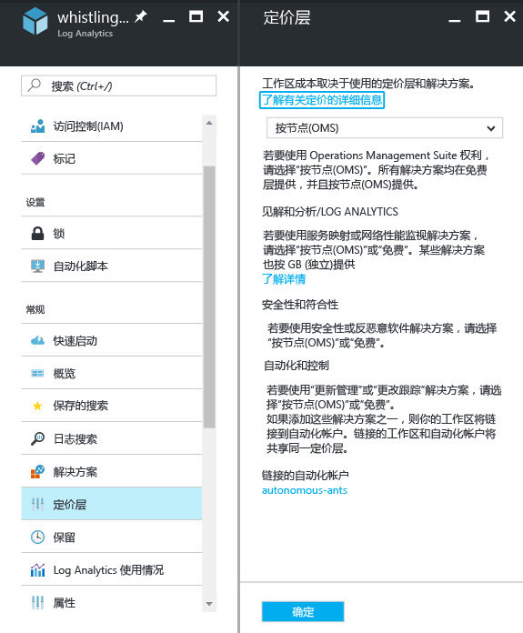
6. 刷新 Azure 门户中的视图后，可看到所选计划的已更新**定价层**。  
    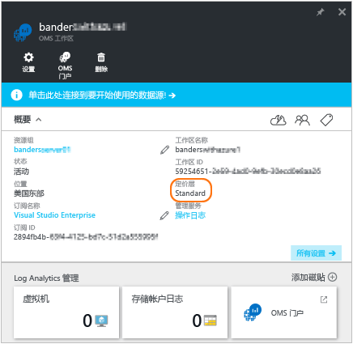

## 更改 Log Analytics 的数据存储期限

在免费定价层中，Log Analytics 会提供过去 7 天的数据。
在标准定价层中，Log Analytics 会提供过去 30 天的数据。
在高级定价层中，Log Analytics 会提供过去 365 天的数据。
在独立和 OMS 定价层中，Log Analytics 默认会提供过去 31 天的数据。

使用独立和 OMS 定价层时，可将数据保留长达 2 年（730 天）之久。 如果数据的存储超过默认的 31 天，将产生数据保留费。 有关价格详细信息，请参阅[超额费用](https://azure.microsoft.com/pricing/details/log-analytics/)。

若要更改数据保留期，请执行以下操作：

1. 登录到 [Azure 门户](http://portal.azure.com)。
2. 浏览到 **Log Analytics**，然后选择它。
3. 随即会看到现有工作区列表。 选择工作区。  
4. 在工作区边栏选项卡中“常规”下面，单击“保留期”。  
5. 使用滑块增加或减少保留天数，然后单击“保存”
“更改保留期”****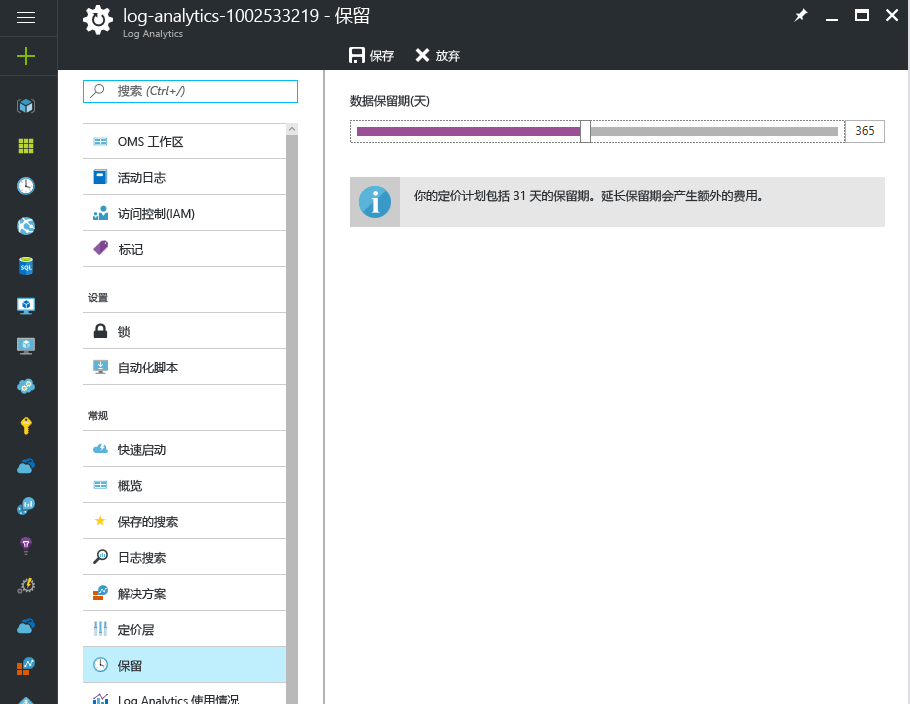

## 更改工作区的 Azure Active Directory 组织

可以更改工作区的 Azure Active Directory 组织 更改 Azure Active Directory 组织可将该目录中的用户和组添加到工作区。

### 更改工作区的 Azure Active Directory 组织

1. 在 OMS 门户中的“设置”页上单击“帐户”，然后单击“管理用户”选项卡。  
2. 查看组织帐户的有关信息，然后单击“更改组织”。  
    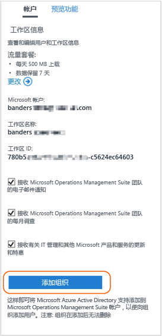
3. 输入 Azure Active Directory 域管理员的标识信息。 随后，可看到说明工作区已链接到 Azure Active Directory 域的确认消息。  
    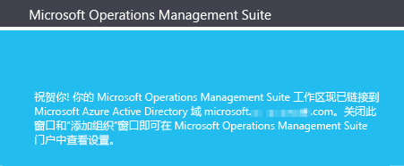

## 删除 Log Analytics 工作区
删除 Log Analytics 工作区时，将在 30 天内从 OMS 服务中删除与工作区相关的所有数据。

如果你是管理员并且存在多个关联到工作区的用户，则会断开这些用户和该工作区之间的关联。 如果这些用户与其他工作区关联，他们可以继续通过其他工作区使用 OMS。 但是，如果他们未与其他工作区关联，则需要创建工作区才能使用 OMS。

### 删除工作区
1. 登录到 [Azure 门户](http://portal.azure.com)。
2. 浏览到 **Log Analytics**，然后选择它。
3. 随即会看到现有工作区列表。 选择要删除的工作区。
4. 在工作区边栏选项卡中，单击“删除”。  
    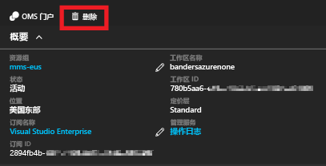
5. 在删除工作区确认对话框中，单击“是”。

## 后续步骤
* 若要添加代理和收集数据，请参阅[将 Windows 计算机连接到 Log Analytics](log-analytics-windows-agents.md)。
* [从解决方案库中添加 Log Analytics 解决方案](log-analytics-add-solutions.md)，以添加功能和收集数据。
* 如果组织使用代理服务器或防火墙，请[在 Log Analytics 中配置代理服务器和防火墙设置](log-analytics-proxy-firewall.md)以便代理可以与 Log Analytics 服务进行通信。

<!--HONumber=Jan17_HO1-->

