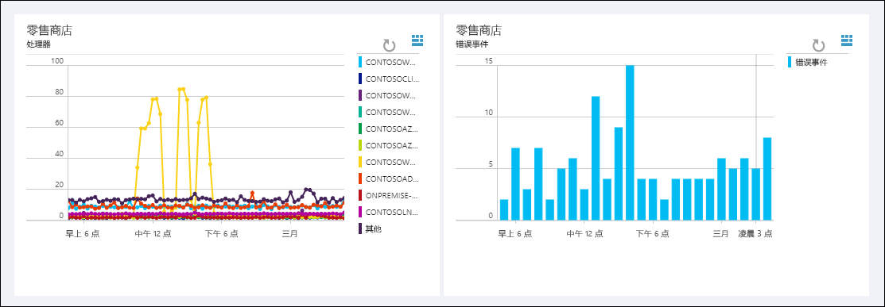

# 什么是 Log Analytics？
Log Analytics 是 [Operations Management Suite \(OMS\)](../operations-management-suite/operations-management-suite-overview.md) 中的服务，可帮助收集和分析云和本地环境中资源生成的数据。 使用集成的搜索和自定义仪表板，轻松分析所有工作负载和服务器上的数百万记录，而无需考虑它们的物理位置，从而获得实时见解。表板，轻松分析所有工作负载和服务器上的数百万记录，而无需考虑它们的物理位置，从而获得实时见解。

## Log Analytics 组件
Log Analytics 的中心是托管在 Azure 云中的 OMS 存储库。  通过配置数据源和向你的订阅添加解决方案，将连接的源中的数据收集到存储库。  数据源和解决方案将分别创建具有自身属性集的不同记录类型，但是仍可在对存储库的查询中同时对它们进行分析。  这允许你使用相同的工具和方法来处理不同资源收集的各种数据。

连接的源是生成 Log Analytics 收集的数据的计算机和其他资源。  其中可包括直接连接的 [Windows](log-analytics-windows-agents.md) 和 [Linux](log-analytics-linux-agents.md) 计算机上安装的代理或 [连接的 System Center Operations Manager 管理组](log-analytics-om-agents.md) 中的代理。  Log Analytics 还可收集 [Azure 存储](log-analytics-azure-storage.md) 中的数据。

[数据源](log-analytics-data-sources.md) 是从各个连接的源中收集的各种数据。  除 [IIS 日志](log-analytics-data-sources-iis-logs.md) 和 [自定义文本日志](log-analytics-data-sources-custom-logs.md) 等源外，还包括 [Windows](log-analytics-data-sources-windows-events.md) 和 Linux 代理中的事件和 [性能数据](log-analytics-data-sources-performance-counters.md)。  你可以配置要收集的各个数据源，配置将自动传递到各个连接的源。

## 分析 Log Analytics 数据
与 Log Analytics 的大部分交互都将通过 OMS 门户完成，该门户在任意浏览器中运行，并提供对配置设置和多个工具的访问权限，以对收集的数据进行分析和操作。  你可以在该门户中使用 [日志搜索](log-analytics-log-searches.md)，在此过程中，你可以构造查询（分析收集的数据）、[仪表板](log-analytics-dashboards.md)（可以使用最有价值的搜索的图形视图自定义）和 [解决方案](log-analytics-add-solutions.md)（提供其他功能和分析工具）。

Log Analytics 提供快速检索和整合存储库中的数据的查询语法。  可以创建并保存 [日志搜索](log-analytics-log-searches.md) 以直接在 OMS 门户中分析数据，或者自动运行日志搜索，以在查询结果指示重要状况时创建警告。

若要提供整体环境运行状况的快速图形视图，可以将已保存日志搜索的可视化效果添加到你的 [仪表板](log-analytics-dashboards.md) 中。   

可以将 OMS 存储库的数据导出到 [Power BI](log-analytics-powerbi.md) 或 Excel 等工具，以在 Log Analytics 外部分析数据。  还可以使用 [Log Search API](log-analytics-log-search-api.md) 生成利用 Log Analytics 数据的自定义解决方案或与其他系统集成。

## 解决方案
解决方案向 Log Analytics 添加功能。  解决方案主要在云中运行，并提供对 OMS 存储库中收集的数据的分析。 解决方案也可以定义要收集的新记录类型，并使用日志搜索或通过 OMS 仪表板中的解决方案提供的其他用户界面进行分析。  

解决方案可用于多个函数，你可以轻松浏览可用的解决方案，并将其从解决方案库 [添加到你的 OMS 工作区](log-analytics-add-solutions.md)。  许多解决方案将自动进行部署并立即开始运行，其他的解决方案则可能需要进行一些配置。

## Log Analytics 体系结构
由于中心组件在 Azure 云中托管，因此 Log Analytics 的部署要求很少。  除允许关联和分析收集的数据的服务之外，其中还包括存储库。  门户可以通过任意浏览器进行访问，因此对客户端软件没有要求。

必须在 [Windows](log-analytics-windows-agents.md) 和 [Linux](log-analytics-linux-agents.md) 计算机上安装代理，但是已属于 [连接的 SCOM 管理组](log-analytics-om-agents.md) 成员的计算机无需安装其他代理。  SCOM 代理将继续与管理服务器进行通信，该服务器会将通信数据转发到 Log Analytics。  但是一些解决方案需要代理才能直接与 Log Analytics 进行通信。  各解决方案的文档将指定解决方案的通信要求。

[注册 Log Analytics](log-analytics-get-started.md) 时，会创建一个 OMS 工作区。  可以将工作区视为唯一的 OMS 环境，其中具备其自身的数据存储库、数据源和解决方案。 可以在你的订阅中创建多个工作区来支持生产和测试等多种环境。

## 后续步骤
* [注册免费的 Log Analytics 帐户](log-analytics-get-started.md) 以在自己的环境中进行测试。
* 查看各种可用的 [数据源](log-analytics-data-sources.md) 以将数据收集到 OMS 存储区中。
* [浏览解决方案库中的可用解决方案](log-analytics-add-solutions.md) 以向 Log Analytics 中添加功能。

<!--HONumber=Dec16_HO2-->

