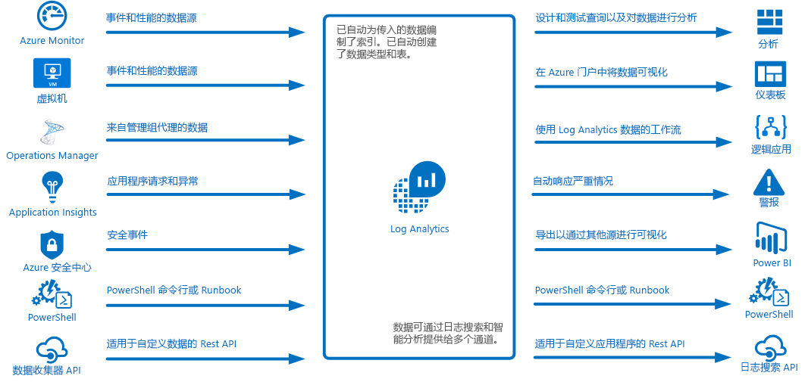
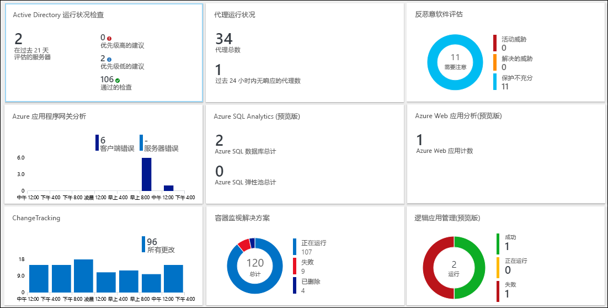
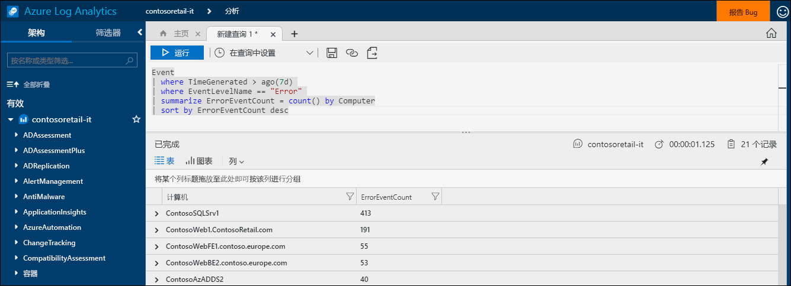
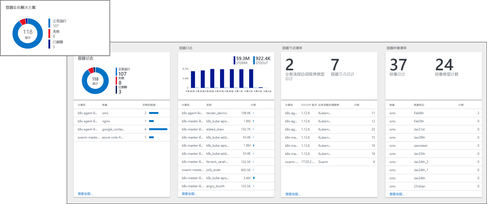
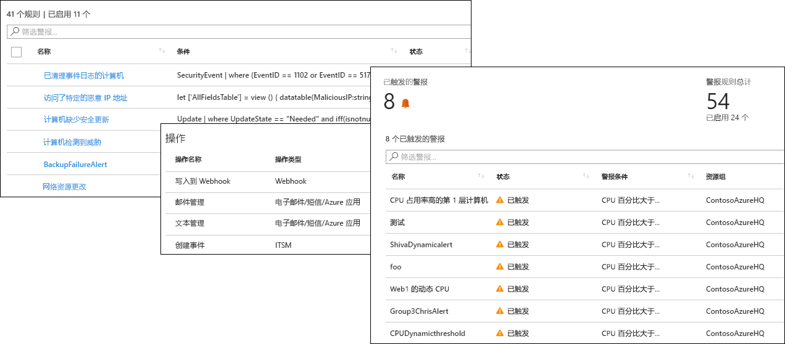
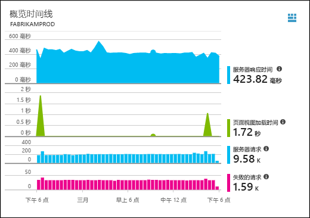
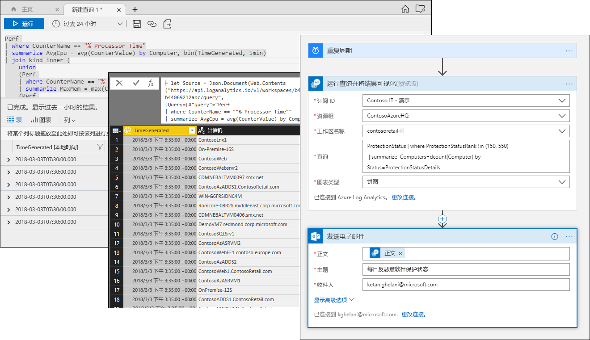

# 什么是 Azure Log Analytics？
Log Analytics 在 Azure 管理中发挥中心作用，具体表现在：从各种源收集遥测数据和其他数据，以及提供查询语言和分析引擎，用于了解应用程序和资源的运行情况。  可以通过日志搜索和视图直接与 Log Analytics 数据交互，也可以在其他 Azure 服务（例如 Application Insights 或 Azure 安全中心，可以将其数据存储在 Log Analytics 中）中使用分析工具。  

Log Analytics 需要的配置最少，已经与其他 Azure 服务集成。  只需创建一个工作区来启用集合。  然后即可在虚拟机上安装代理，以便将其包括在工作区中并启用管理解决方案。这些解决方案包含可以更深入了解不同应用程序的逻辑。  在后台，数据类型是预定义的，或者是在收集数据时自动创建的。

## 在监视中的角色

若要了解 Azure 中的不同监视服务，请参阅[监视 Azure 应用程序和资源](../monitoring-and-diagnostics/monitoring-overview.md)。  Log Analytics 所起的中心作用是：从不同的源整合监视数据，并提供一种强大的查询语言，用于整合和分析。  

不过，Log Analytics 不限于监视 Azure 资源。  它可以从位于本地或其他云中的资源收集数据，用于创建混合监视环境；可以直接连接到 System Center Operations Manager，以便从现有代理处收集遥测数据。  Log Analytics 中的分析工具（例如日志搜索、视图和管理解决方案）可以处理收集的所有数据，让你能够集中分析整个环境。

## 数据收集
Log Analytics 从各种源收集数据。  收集以后，数据会按数据类型整理到不同的表中，这样就可以对所有数据进行集中分析，不管其最初来源是什么。

将数据收集到 Log Analytics 中的方法包括：

- 对 Azure Monitor 进行配置，以复制它从 Azure 资源收集的[指标和日志](../monitoring/monitoring-data-collection.md#types-of-monitoring-data)。
- 收集写入到 [Azure 存储](log-analytics-azure-storage-iis-table.md)的遥测数据。
- [Windows](log-analytics-windows-agent.md) 和 [Linux](log-analytics-linux-agents.md) 虚拟机上的代理会根据所配置的[数据源](log-analytics-data-sources.md)，将遥测数据从来宾操作系统和应用程序发送到 Log Analytics。 代理可以直接连接，在没有防火墙访问权限时通过 [OMS 网关](log-analytics-oms-gateway.md)进行连接，或者通过 [System Center Operations Manager 管理组](log-analytics-om-agents.md)进行连接。
- Azure 服务（例如 [Application Insights](https://docs.microsoft.com/azure/application-insights/) 和 [Azure 安全中心](https://docs.microsoft.com/azure/security-center/)）将其数据直接存储在 Log Analytics 中，不需任何配置。
- 使用 Log Analytics cmdlet，从 PowerShell 命令行或 [Azure 自动化 runbook](../automation/automation-runbook-types.md) 写入数据。
- 如果有自定义的要求，则可以使用 [HTTP 数据收集器 API](log-analytics-data-collector-api.md) 将数据从任何 REST API 客户端或 [Azure 逻辑应用](https://docs.microsoft.com/azure/logic-apps/)写入到 Log Analytics 以写入来自自定义流的数据。

## 使用管理解决方案添加功能
[管理解决方案](log-analytics-add-solutions.md)提供预打包的逻辑，适用于特定的产品或方案。  这些解决方案可以将额外的数据收集到 Log Analytics 中，也可以处理已收集的数据。  此类方案通常会包括一个视图，用于分析这些额外的数据。  解决方案适用于各种功能，我们将持续添加更多的解决方案。  可以轻松浏览可用的解决方案，并将其从 Azure 市场[添加到工作区](log-analytics-add-solutions.md)。  

## 查询语言

Log Analytics 提供用于快速检索、整合和分析已收集数据的[富查询语言](http://docs.loganalytics.io)。  可以使用[日志搜索或高级分析门户](log-analytics-log-search-portals.md)创建和测试查询，然后使用这些工具直接分析数据，或者将查询保存下来，与可视化效果、警报一起配合使用，或者将其导出到其他工具，例如 Power BI 或 Excel。

Log Analytics 查询语言适用于简单的日志查询，但也包括高级功能，例如聚合、联接、智能分析。 可以通过提供的[多个教程](https://docs.loganalytics.io/docs/Learn/Tutorials)快速了解此查询语言。  特定指南提供给已熟悉 [SQL](https://docs.loganalytics.io/docs/Learn/References/SQL-to-Azure-Log-Analytics) 和 [Splunk](https://docs.loganalytics.io/docs/Learn/References/Splunk-to-Azure-Log-Analytics) 的用户。

## 可视化 Log Analytics 数据

[Log Analytics 中的视图](log-analytics-view-designer.md)可直观地显示日志搜索中的数据。  每个视图都包括各种可视化效果的组合，例如汇总了关键数据的列表，以及条形图和折线图。  [管理解决方案](#add-functionality-with-management-solutions)包括的视图汇总了特定应用程序的数据。你可以创建自己的视图来显示任何 Log Analytics 日志搜索的数据。

也可将 Log Analytics 查询的结果固定到 [Azure 仪表板](../azure-portal/azure-portal-dashboards.md)，该仪表板可以将不同 Azure 服务的磁贴组合起来。  甚至可以将 Log Analytics 视图固定到某个仪表板。

## 根据 Log Analytics 数据创建警报

使用 [Azure 警报](../monitoring-and-diagnostics/monitoring-overview-unified-alerts.md)主动向你发送通知，介绍 Log Analytics 数据中对你很重要的情况。  系统会自动按计划的时间间隔运行某个查询，并在结果复合特定条件的情况下创建警报。  这样就可以将来自 Log Analytics 的警报与其他源的警报组合在一起，例如，来自 [Azure Monitor](../monitoring-and-diagnostics/monitoring-near-real-time-metric-alerts.md) 的近实时警报、来自 [Application Insights](../application-insights/app-insights-alerts.md) 的应用程序异常、为了响应警报条件而共享[操作组](../monitoring-and-diagnostics/monitoring-action-groups.md)。

## 在其他服务中使用 Log Analytics 数据
服务（例如 Application Insights 和 Azure 安全中心）将其数据存储在 Log Analytics 中。  通常可以与这些服务所提供的富分析工具交互，但也可以使用 Log Analytics 查询来 访问其数据，并在可能情况下将其与来自其他服务的数据组合起来。  

例如，以下视图来自 Application Insights。  如果单击右上角的图标，则会启动 Log Analytics 分析控制台，其中包含图形所使用的查询。

## 导出 Log Analytics 数据

Log Analytics 还在 Azure 外部提供其数据。  可以将 [Power BI](log-analytics-powerbi.md) 配置为按计划的时间间隔导入查询结果，以便利用其各项功能，例如合并不同来源的数据以及在 Web 和移动设备上共享报表。  还可以使用[日志搜索 API](log-analytics-log-search-api.md) 生成利用 Log Analytics 数据的自定义解决方案或与其他系统集成。

可以在 Azure 中使用[逻辑应用](../logic-apps/logic-apps-overview.md)，根据 Log Analytics 数据来创建自定义工作流。  如需更复杂的基于 PowerShell 的逻辑，可以使用 [Azure 自动化中的 Runbook](../automation/automation-runbook-types.md)。

## 后续步骤
- 通过[从 Azure VM 收集数据](log-analytics-quick-collect-azurevm.md)来入门。
- 浏览一项[讲述如何使用简单查询来分析 Log Analytics 数据的教程](log-analytics-tutorial-viewdata.md)。
* [浏览可用解决方案](log-analytics-add-solutions.md)，以向 Log Analytics 中添加功能。

