# <a name="configure-proxy-and-firewall-settings-in-log-analytics"></a>在 Log Analytics 中配置代理和防火墙设置
为 Log Analytics 配置代理和防火墙设置所需的操作因用户所使用的代理类型的不同而不同。 查看以下各节，了解所用代理类型。

## <a name="settings-for-the-oms-gateway"></a>OMS 网关的设置

如果代理无法访问 Internet，它们会改用你自己的网络资源将数据发送到 OMS 网关。 网关可以收集数据，然后代表这些设备将数据发送到 OMS 服务。

使用完全限定域名和自定义端口号配置与 OMS 网关通信的代理。

OMS 网关需要 Internet 访问权限。 将代理服务器或防火墙设置用于 OMS 网关，这些相同的设置你也会用于自己拥有的那类代理。 有关 OMS 网关的详细信息，请参阅[使用 OMS 网关将计算机和设备连接到 OMS](log-analytics-oms-gateway.md)。

## <a name="configure-settings-with-the-microsoft-monitoring-agent"></a>使用 Microsoft Monitoring Agent 配置设置
要使 Microsoft Monitoring Agent 连接到 OMS 服务并向其注册，它必须能够访问你的域和 URL 的端口号。 如果使用代理服务器在代理与 OMS 服务之间通信，则需要确保能够访问相应的资源。 如果使用防火墙来限制对 Internet 的访问，则需要将防火墙配置为允许访问 OMS。 下列各表列出了 OMS 需要的端口。

| **代理资源** | **端口** | **绕过 HTTPS 检查** |
| --- | --- | --- |
| \*.ods.opinsights.azure.com |443 |是 |
| \*.oms.opinsights.azure.com |443 |是 |
| \*.blob.core.windows.net |443 |是 |
| \*.azure-automation.net |443 |是 |
| ods.systemcenteradvisor.com |443 | |

可通过以下过程，使用控制面板为 Microsoft Monitoring Agent 配置代理设置。 需要对每个服务器使用此过程。 如果需要配置多台服务器，使用脚本自动执行此过程可能更加轻松。 如果是，请参阅下一过程：[使用脚本配置 Microsoft Monitoring Agent 的代理设置](#to-configure-proxy-settings-for-the-microsoft-monitoring-agent-using-a-script)。

### <a name="to-configure-proxy-settings-for-the-microsoft-monitoring-agent-using-control-panel"></a>使用控制面板为 Microsoft Monitoring Agent 配置代理设置
1. 打开“控制面板”
2. 打开“Microsoft Monitoring Agent”
3. 单击“代理设置”选项卡。<br>  
   
4. 选择“使用代理服务器”并键入 URL 和端口号（如果需要），如以下示例所示。 如果你的代理服务器要求身份验证，请键入用户名和密码以访问代理服务器。

通过以下过程创建 PowerShell 脚本，运行它以便为直接连接到服务器的每个代理设置代理设置。

### <a name="to-configure-proxy-settings-for-the-microsoft-monitoring-agent-using-a-script"></a>使用脚本配置 Microsoft Monitoring Agent 的代理设置
复制以下示例，使用特定于你的环境的信息进行更新，保存并使其带有 PS1 文件扩展名，然后在直接连接到 OMS 服务的每台计算机上运行该脚本。

    param($ProxyDomainName="http://proxy.contoso.com:80", $cred=(Get-Credential))

    # First we get the Health Service configuration object.  We need to determine if we
    #have the right update rollup with the API we need.  If not, no need to run the rest of the script.
    $healthServiceSettings = New-Object -ComObject 'AgentConfigManager.MgmtSvcCfg'

    $proxyMethod = $healthServiceSettings | Get-Member -Name 'SetProxyInfo'

    if (!$proxyMethod)
    {
         Write-Output 'Health Service proxy API not present, will not update settings.'
         return
    }

    Write-Output "Clearing proxy settings."
    $healthServiceSettings.SetProxyInfo('', '', '')

    $ProxyUserName = $cred.username

    Write-Output "Setting proxy to $ProxyDomainName with proxy username $ProxyUserName."
    $healthServiceSettings.SetProxyInfo($ProxyDomainName, $ProxyUserName, $cred.GetNetworkCredential().password)


## <a name="configure-settings-with-operations-manager"></a>使用 Operations Manager 配置设置
要使 Operations Manager 管理组连接到 OMS 服务并向其注册，它必须能够访问你的域和 URL 的端口号。 如果使用代理服务器在 Operations Manager 管理服务器与 OMS 服务之间通信，则需要确保能够访问相应的资源。 如果使用防火墙来限制对 Internet 的访问，则需要将防火墙配置为允许访问 OMS。 代理服务器后即使没有 Operations Manager 管理服务器，也可能有其代理。 在这种情况下，应以与代理相同的方式配置代理服务器，以启用和允许将安全和日志管理解决方案数据发送到 OMS Web 服务。

为了使 Operations Manager 代理能与 OMS 服务进行通信，Operations Manager 基础结构（包括代理）应具有正确的代理设置和版本。 在 Operations Manager 控制台中指定代理的代理设置。 应为以下版本之一：

* Operations Manager 2012 SP1 更新汇总 7 或更高版本
* Operations Manager 2012 R2 更新汇总 3 或更高版本

下表列出了与这些任务相关的端口。

> [!NOTE]
> 以下某些资源提及了 Advisor 和 Operational Insights，它们都是 OMS 的早期版本。 但所列资源将会变化。
>
>

以下是代理资源和端口的列表：<br>

| **代理资源** | **端口** |
| --- | --- |
| \*.ods.opinsights.azure.com |443 |
| \*.oms.opinsights.azure.com |443 |
| .blob.core.windows.net/\*\* |443 |
| ods.systemcenteradvisor.com |443 |

<br>
以下是管理服务器资源和端口的列表：<br>

| **管理服务器资源** | **端口** | **绕过 HTTPS 检查** |
| --- | --- | --- |
| service.systemcenteradvisor.com |443 | |
| \*.service.opinsights.azure.com |443 | |
| \*.blob.core.windows.net |443 |是 |
| data.systemcenteradvisor.com |443 | |
| ods.systemcenteradvisor.com |443 | |
| \*.ods.opinsights.azure.com |443 |是 |
| \*.azure-automation.net |443 |是 |

<br>
以下是 OMS 和 Operations Manager 控制台资源和端口的列表。<br>

| **OMS 与 Operations Manager 控制台资源** | **端口** |
| --- | --- |
| service.systemcenteradvisor.com |443 |
| \*.service.opinsights.azure.com |443 |
| \*.live.com |端口 80 和 443 |
| \*.microsoft.com |端口 80 和 443 |
| \*.microsoftonline.com |端口 80 和 443 |
| \*.mms.microsoft.com |端口 80 和 443 |
| login.windows.net |端口 80 和 443 |

<br>

使用以下过程，将 Operations Manager 管理组注册到 OMS 服务。 如果管理组和 OMS 服务之间存在通信问题，请使用验证过程对向 OMS 服务的数据传输进行故障排除。

### <a name="to-request-exceptions-for-the-oms-service-endpoints"></a>为 OMS 服务终结点请求异常
1. 使用前面显示的第一张表中的信息，确保可通过所用的任意防火墙访问 Operations Manager 管理服务器所需的资源。
2. 使用前面显示的第二张表中的信息，确保可通过所用的任意防火墙访问 Operations Manager 和 OMS 中操作控制台所需的资源。
3. 如果在 Internet Explorer 中使用代理服务器，请确保它已正确配置并能正常工作。 若要进行验证，可以打开安全 Web 连接 (HTTPS)，例如[https://bing.com](https://bing.com)。 如果安全 Web 连接在浏览器中无法工作，则它有可能无法在具有位于云中的 Web 服务的 Operations Manager 管理控制台中工作。

### <a name="to-configure-the-proxy-server-in-the-operations-manager-console"></a>在 Operations Manager 控制台中配置代理服务器
1. 打开 Operations Manager 控制台并选择“**管理**”工作区。
2. 展开“Operational Insights”，然后选择“Operational Insights 连接”。<br>  
   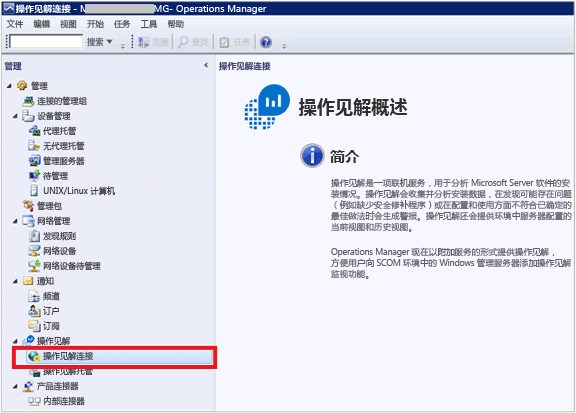
3. 在“OMS 连接”视图中，单击“**配置代理服务器**”。<br>  
   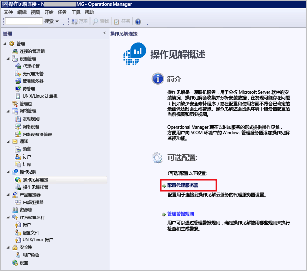
4. 在“Operational Insights 设置向导：代理服务器”中，选择“使用代理服务器访问 Operational Insights Web 服务”，然后键入具有端口号的 URL，如 **http://myproxy:80**。<br>  
   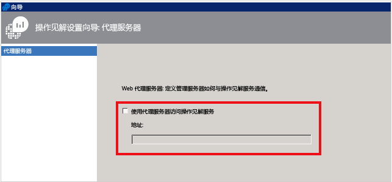

### <a name="to-specify-credentials-if-the-proxy-server-requires-authentication"></a>如果代理服务器需要身份验证，请指定凭据
 需要将代理服务器凭据和设置传播到要向 OMS 报告的托管计算机。 这些服务器应位于 Microsoft System Center Advisor Monitoring Server Group 内。 在组中每个服务器的注册表中加密凭据。

1. 打开 Operations Manager 控制台并选择“**管理**”工作区。
2. 在“**运行方式配置**”下面，选择“**配置文件**”。
3. 打开 **System Center Advisor Run As Profile Proxy** 配置文件。<br>  
   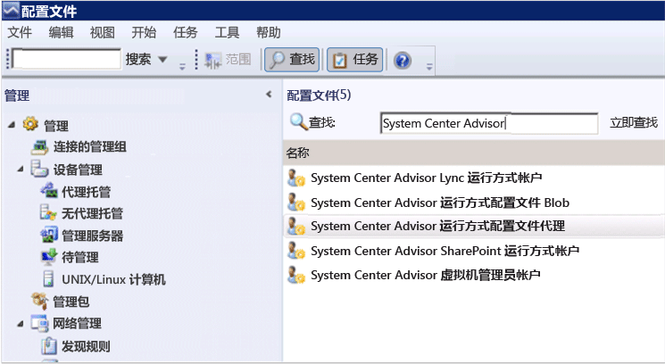
4. 在运行方式配置文件向导中，单击“添加”以使用运行方式帐户。 可以新建运行方式帐户，或使用现有帐户。 此帐户需要有足够的权限以通过代理服务器。<br>   
   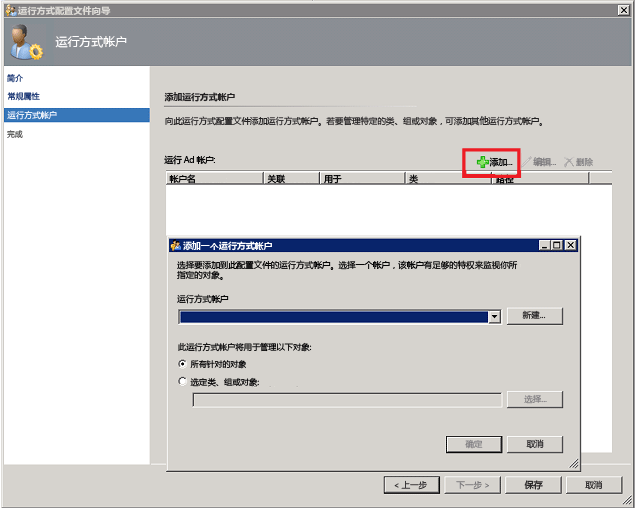
5. 若要设置管理的帐户，请选择“选定的类、组或对象”以打开对象搜索框。<br>  
   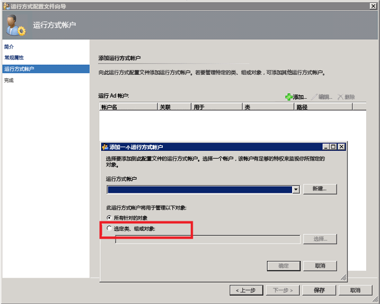
6. 搜索然后选择 **Microsoft System Center Advisor Monitoring Server Group**。<br>  
   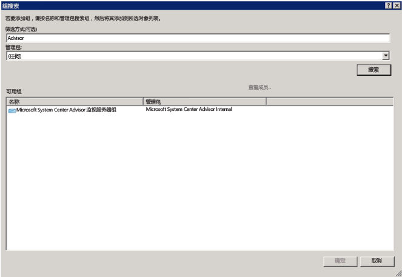
7. 单击“确定”以关闭“添加运行方式帐户”框。<br>  
   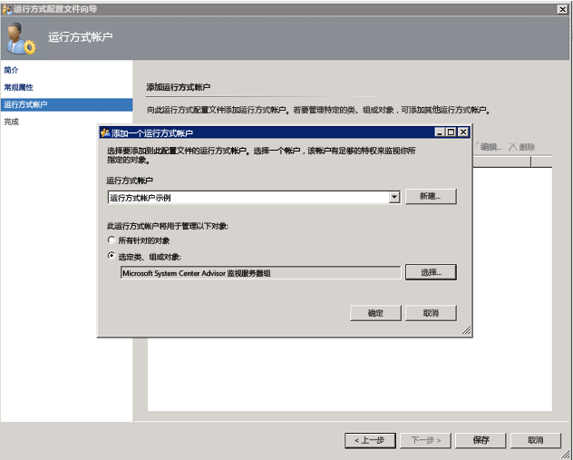
8. 完成向导并保存更改。<br>  
   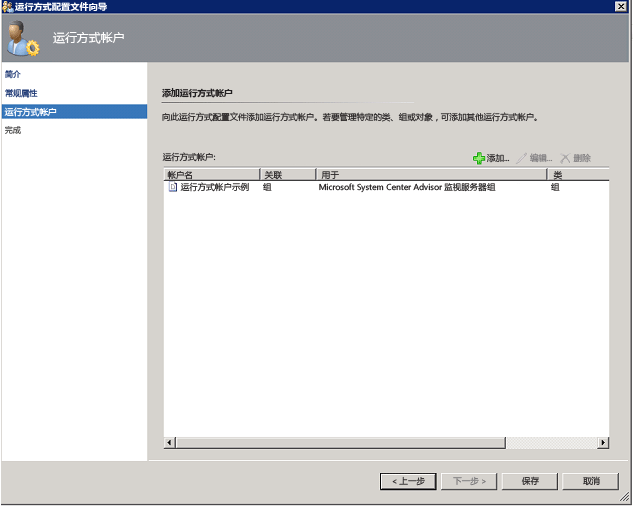

### <a name="to-validate-that-oms-management-packs-are-downloaded"></a>验证已下载 OMS 管理包
如果已将解决方案添加到 OMS，可在 Operations Manager 控制台中“管理”之下看到它们显示为管理包。 搜索 System Center Advisor 可快速找到它们。<br>  
   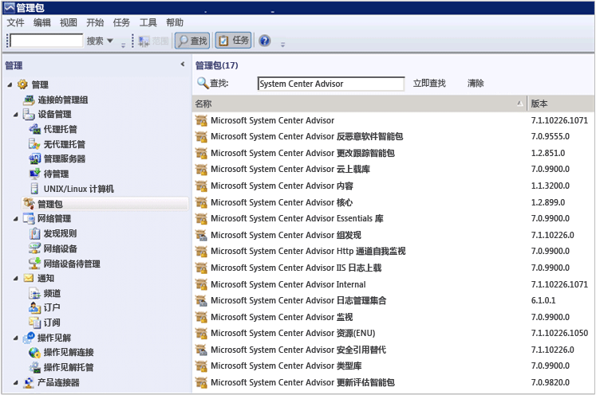  <br>  
还可在 Operations Manager 管理服务器中使用以下 Windows PowerShell 命令查看 OMS 管理包：

   ```  
    Get-ScomManagementPack | where {$_.DisplayName -match 'Advisor'} | select Name,DisplayName,Version,KeyToken
   ```  

### <a name="to-validate-that-operations-manager-is-sending-data-to-the-oms-service"></a>验证 Operations Manager 将数据发送到 OMS 服务
1. 在“Operations Manager 管理服务器”中，打开性能监视器 (perfmon.exe)，然后选择“性能监视器”。
2. 单击“添加”，然后选择“运行状况服务管理组”。
3. 添加以 **HTTP** 开头的所有计数器。<br>  
   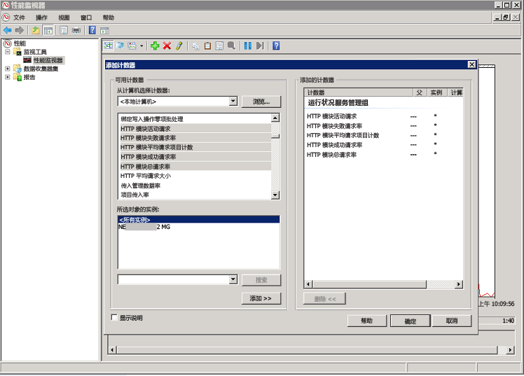
4. 如果 Operations Manager 配置正确，则根据在 OMS 中添加的管理包和已配置的日志收集策略，可看到事件和其它数据项的运行状况服务管理计数器活动。<br>  
   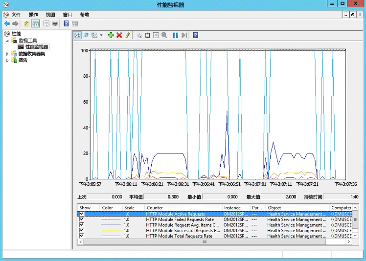

## <a name="next-steps"></a>后续步骤
* [从解决方案库中添加 Log Analytics 解决方案](log-analytics-add-solutions.md)，以添加功能和收集数据。
* 熟悉[日志搜索](log-analytics-log-searches.md)以查看解决方案收集的详细信息。


<!--HONumber=Feb17_HO2-->


