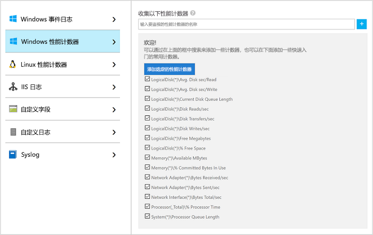
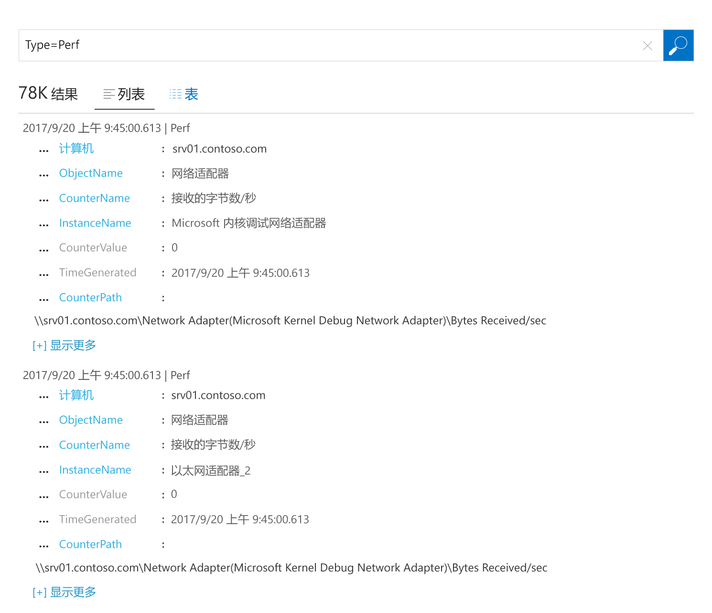

# 收集 Azure 虚拟机相关数据
[Azure Log Analytics](log-analytics-overview.md) 可直接从 Azure 虚拟机及环境中的其他资源收集数据，并将数据置于单个存储库进行详细的分析和关联。  本快速入门介绍如何通过几个简单步骤，从 Azure Linux 或 Windows VM 中配置或收集数据。  
 
本快速入门假定你拥有现有 Azure 虚拟机。 如果没有，可根据 VM 快速入门[创建 Windows VM](../virtual-machines/windows/quick-create-portal.md) 或[创建 Linux VM](../virtual-machines/linux/quick-create-cli.md)。

## 登录到 Azure 门户
登录 Azure 门户 ([https://portal.azure.com](https://portal.azure.com))。 

## 创建工作区
1. 在 Azure 门户中，单击左下角的“更多服务”。 在资源列表中，键入“Log Analytics”。 开始键入时，会根据输入筛选该列表。 选择“Log Analytics”。     
2. 单击“创建”，然后为以下各项选择选项：

  * 为新的 OMS 工作区提供名称，如 DefaultLAWorkspace。 
  * 如果选择的默认值不合适，请从下拉列表中选择要链接到的**订阅**。
  * 对于“资源组”，选择包含一个或多个 Azure 虚拟机的现有资源组。  
  * 选择向其部署 VM 的“位置”。  如需其他信息，请参阅[提供 Log Analytics 的区域](https://azure.microsoft.com/regions/services/)。
  * 可从 Log Analytics 中三个不同的“定价层”进行选择，但本快速入门将选择“免费”层。  有关特定层的其他信息，请参阅 [Log Analytics 定价详细信息](https://azure.microsoft.com/pricing/details/log-analytics/)。

           
3. 在“OMS 工作区”窗格上提供所需信息后，单击“确定”。  

在验证信息和创建工作区时，可以在菜单中的“通知”下面跟踪操作进度。 

## 启用 Log Analytics VM 扩展
对于已在 Azure 中部署的 Windows 和 Linux 虚拟机，可使用 Log Analytics VM 扩展安装 Log Analytics 代理。  使用扩展可简化安装流程，并可自动配置代理，以将数据发送至指定的 Log Analytics 工作区。 代理还会自动升级，以确保拥有最新的功能和修补程序。

>[!NOTE]
>无法将适用于 Linux 的 OMS 代理配置为向多个 Log Analytics 工作区报告。 

你可能会注意到门户中 Log Analytics 资源页顶部显示的邀请升级的横幅。  出于本快速入门的目的，不需要升级。 

。    
1. 在 Azure 门户中，单击左下角的“更多服务”。 在资源列表中，键入“Log Analytics”。 开始键入时，会根据输入筛选该列表。 选择“Log Analytics”。
2. 在 Log Analytics 工作区列表中，选择之前创建的 DefaultLAWorkspace。
3. 在左侧菜单上的“工作区数据源”下，单击“虚拟机”。  
4. 在“虚拟机”列表中，选择要在其中安装代理的虚拟机。 请注意，VM 的“OMS 连接状态”指示其“未连接”。
5. 在虚拟机的详细信息中，选择“连接”。 则自动会为 Log Analytics 工作区安装并配置代理。 此过程需要几分钟的时间，在此期间，“状态”为“正在连接”。
6. 安装并连接代理后，会使用“此工作区”更新“OMS 连接状态”。

## 收集的事件和性能数据
Log Analytics 可从 Windows 事件日志或 Linux Syslog 以及指定用于长期分析的性能计数器中收集事件，并在检测到特定条件时采取措施。  首先，请按照下列步骤操作，配置从 Windows 系统日志和 Linux Syslog 以及几个常见性能计数器中收集事件。  

### Windows VM 中的数据收集
1. 选择“高级设置”。    
3. 选择“数据”，然后选择“Windows 事件日志”。  
4. 可通过键入日志名称添加事件日志。  键入“System”，然后单击加号 +。  
5. 在表中，选中严重性“错误”和“警告”。   
6. 单击页面顶部的“保存”来保存配置。
7. 选择“Windows 性能数据”，在 Windows 计算机上启用性能计数器收集。 
8. 首次为新的 Log Analytics 工作区配置 Windows 性能计数器时，可以选择快速创建几个通用的计数器。 将这些计数器在一个复选框中依次列出。  。  单击“添加所选性能计数器”。  随即会添加它们，并且通过 10 秒收集示例间隔进行预设。  
9. 单击页面顶部的“保存”来保存配置。

### Linux VM 中的数据收集

1. 选择“Syslog”。  
2. 可通过键入日志名称添加事件日志。  键入“Syslog”，然后单击加号 +。  
3. 在表中，取消选中严重性“信息”、“通知”和“调试”。 
4. 单击页面顶部的“保存”来保存配置。
5. 选择“Linux 性能数据”，在 Windows 计算机上启用性能计数器收集。 
6. 首次为新的 Log Analytics 工作区配置 Linux 性能计数器时，可以选择快速创建几个通用的计数器。 将这些计数器在一个复选框中依次列出。  。  单击“添加所选性能计数器”。  随即会添加它们，并且通过 10 秒收集示例间隔进行预设。  
7. 单击页面顶部的“保存”来保存配置。

## 查看收集的数据
现已启用数据收集，开始运行简单的日志搜索示例，查看来自目标 VM 的部分数据。  

1. 在 Azure 门户中，导航到 Log Analytics 并选择之前创建的工作区。
2. 单击“日志搜索”磁贴并在“日志搜索”窗格上的查询字段中键入 `Type=Perf`，然后按 Enter 或单击查询字段右侧的搜索按钮。    例如，下图中的查询返回了 78,000 条性能记录。  结果会大大减少。  

## 清理资源
不再需要 Log Analytics 工作区时，将其删除。 为此，请选择之前创建的 Log Analytics 工作区，并在资源页上单击“删除”。  

## 后续步骤
从 Windows 或 Linux 虚拟机收集操作和性能数据后，现在可轻松开始浏览、分析免费收集的数据，并对它们采取措施。  

若要了解如何查看和分析数据，请继续本教程。   

> [!div class="nextstepaction"]
> [在 Log Analytics 中查看或分析数据](log-analytics-tutorial-viewdata.md)
