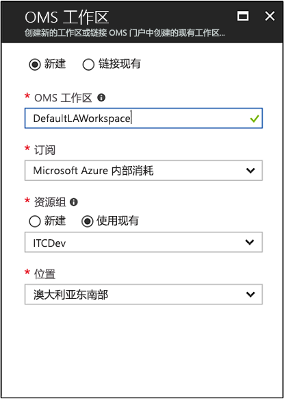
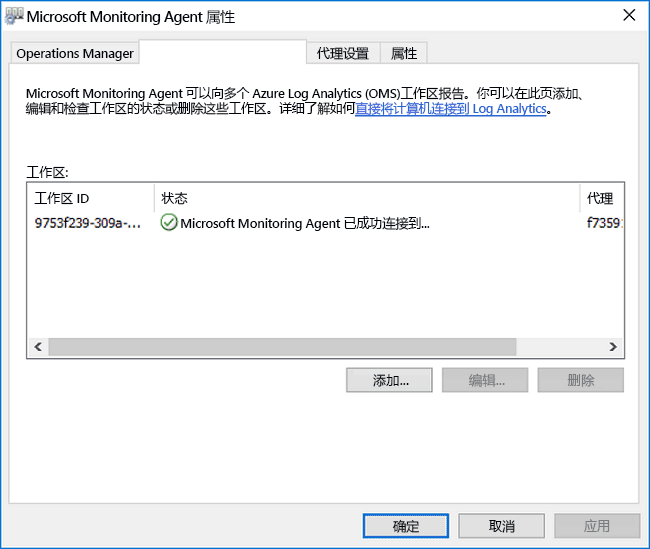
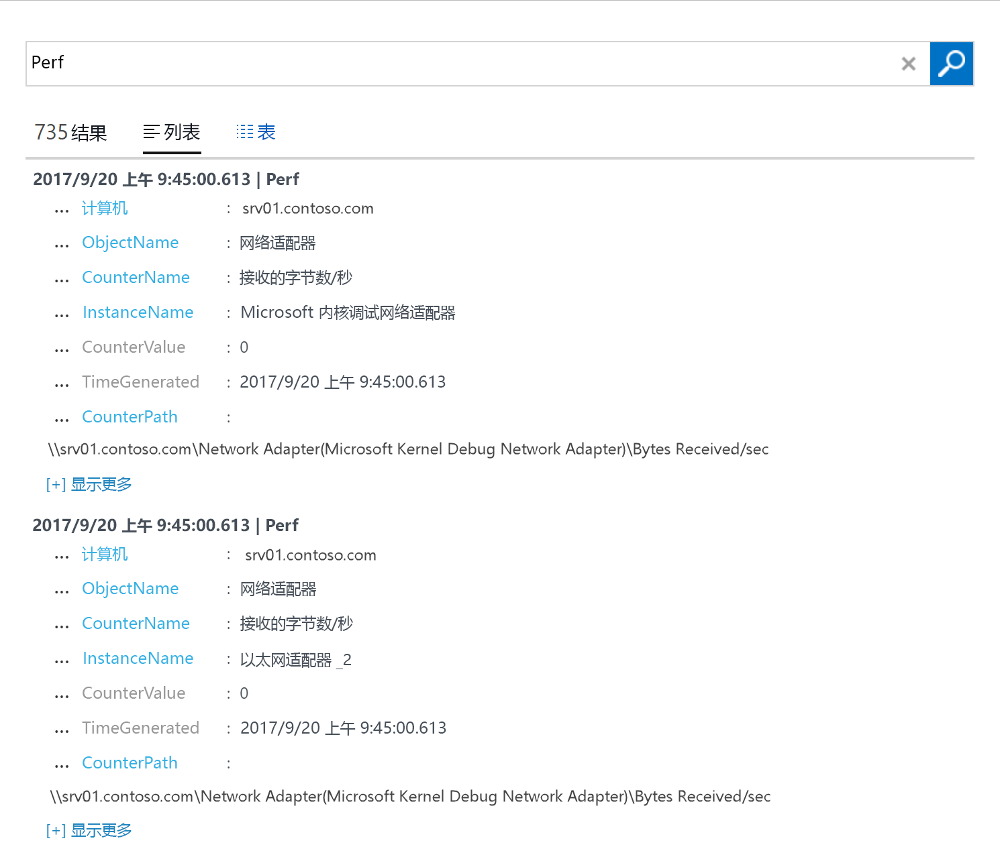

# 从托管在环境中的 Windows 计算机上收集数据
[Azure Log Analytics](log-analytics-overview.md) 可直接从物理或虚拟 Windows 计算机及环境中的其他资源收集数据，并将数据置于单个存储库进行详细的分析和关联。  本快速入门介绍如何通过几个简单步骤，从 Windows 计算机中配置或收集数据。  有关 Azure Windows VM 的信息，请参阅以下主题[收集 Azure 虚拟机的相关数据](log-analytics-quick-collect-azurevm.md)。  

若要了解支持的配置，请查看[支持的 Windows 操作系统](log-analytics-concept-hybrid.md#supported-windows-operating-systems)和[网络防火墙配置](log-analytics-concept-hybrid.md#network-firewall-requirements)。
 
如果你还没有 Azure 订阅，可以在开始前创建一个 [免费帐户](https://azure.microsoft.com/free/?WT.mc_id=A261C142F)。

## 登录到 Azure 门户
通过 [https://portal.azure.com](https://portal.azure.com) 登录到 Azure 门户。 

## 创建工作区
1. 在 Azure 门户中，单击“所有服务”。 在资源列表中，键入“Log Analytics”。 开始键入时，会根据输入筛选该列表。 选择“Log Analytics”。       
2. 单击“创建”，然后为以下各项选择选项：

  * 为新的 OMS 工作区提供名称，如 DefaultLAWorkspace。 
  * 如果选择的默认值不合适，请从下拉列表中选择要链接到的**订阅**。
  * 对于“资源组”，选择包含一个或多个 Azure 虚拟机的现有资源组。  
  * 选择向其部署 VM 的“位置”。  如需其他信息，请参阅[提供 Log Analytics 的区域](https://azure.microsoft.com/regions/services/)。  
  * 如果在 2018 年 4 月 2 日后创建的新订阅中创建工作区，则它将自动使用“每 GB”定价计划，并且不提供用于选择定价层的选项。  如果是为 4 月 2 日之前创建的现有订阅创建工作区，或者是为绑定到现有 EA 注册的订阅创建工作区，则可以选择首选定价层。  有关特定层的其他信息，请参阅 [Log Analytics 定价详细信息](https://azure.microsoft.com/pricing/details/log-analytics/)。

           

3. 在“OMS 工作区”窗格上提供所需信息后，单击“确定”。  

在验证信息和创建工作区时，可以在菜单中的“通知”下面跟踪操作进度。 

## 获取工作区 ID 和密钥
在安装适用于 Windows 的 Microsoft Monitoring Agent 之前，需要先获得 Log Analytics 工作区的工作区 ID 和密钥。  安装向导需要使用此信息来正确配备代理，并确保它能与 Log Analytics 成功通信。  

1. 在 Azure 门户中，单击左上角的“所有服务”。 在资源列表中，键入“Log Analytics”。 开始键入时，会根据输入筛选该列表。 选择“Log Analytics”。
2. 在 Log Analytics 工作区列表中，选择之前创建的 DefaultLAWorkspace。
3. 选择“高级设置”。       
4. 选择“已连接的源”，然后选择“Windows 服务器”。   
5. “工作区 ID”和“主密钥”右侧的值。 将它们复制并粘贴到喜爱的编辑器中。   

## 安装适用于 Windows 的代理
以下步骤使用计算机上 Microsoft Monitoring Agent 的设置在 Azure 和 Azure 政府云中安装并配置 Log Analytics 的代理。  

1. 在“Windows 服务器”页上，选择“下载 Windows 代理”，根据 Windows 操作系统的处理器体系结构下载相应的版本。
2. 运行安装程序在计算机上安装该代理。
2. 在“欢迎”页面上，单击“下一步”。
3. 在“许可条款”页面上阅读许可协议，然后单击“我接受”。
4. 在“目标文件夹”页面上更改或保留默认安装文件夹，然后单击“下一步”。
5. 在“代理安装选项”页上，选择将代理连接到 Azure Log Analytics (OMS)，单击“下一步”。   
6. 在“Azure Log Analytics”页上执行以下操作：
   1. 粘贴前面复制的“工作区 ID”和“工作区密钥(主密钥)”。  如果计算机应向 Azure 政府云中的 Log Analytics 工作区报告，请从“Azure 云”下拉列表中选择“Azure 美国政府版”。  
   2. 如果计算机需要通过代理服务器来与 Log Analytics 通信，请单击“高级”并提供代理服务器的 URL 和端口号。  如果代理服务器要求身份验证，请键入用于在代理服务器上进行身份验证的用户名和密码，并单击“下一步”。  
7. 提供所需的配置设置后，单击“下一步”。     
8. 在“准备安装”页上检查所做的选择，并单击“安装”。
9. 在“配置已成功完成”页上，单击“完成”。

完成后，**Microsoft Monitoring Agent** 将显示在“**控制面板**”中。 可以检查配置，并验证代理是否已连接到 Log Analytics。 如果已连接，代理会在“Azure Log Analytics (OMS)”选项卡上显示一条消息，指出：“Microsoft Monitoring Agent 已成功连接到 Microsoft Operations Management Suite 服务”。   

## 收集的事件和性能数据
Log Analytics 可从 Windows 事件日志以及指定用于长期分析的性能计数器中收集事件，并在检测到特定条件时采取措施。  首先，请按照下列步骤操作，配置 Windows 事件日志以及几个常见性能计数器中收集事件。  

1. 在 Azure 门户中，单击左下角的“更多服务”。 在资源列表中，键入“Log Analytics”。 开始键入时，会根据输入筛选该列表。 选择“Log Analytics”。
2. 选择“高级设置”。      
3. 选择“数据”，然后选择“Windows 事件日志”。  
4. 可通过键入日志名称添加事件日志。  键入“System”，然后单击加号 +。  
5. 在表中，选中严重性“错误”和“警告”。   
6. 单击页面顶部的“保存”来保存配置。
7. 选择“Windows 性能数据”，在 Windows 计算机上启用性能计数器收集。 
8. 首次为新的 Log Analytics 工作区配置 Windows 性能计数器时，可以选择快速创建几个通用的计数器。 将这些计数器在一个复选框中依次列出。  。  单击“添加所选性能计数器”。  随即会添加它们，并且通过 10 秒收集示例间隔进行预设。  
9. 单击页面顶部的“保存”来保存配置。

## 查看收集的数据
现已启用数据收集，开始运行简单的日志搜索示例，查看来自目标计算机的部分数据。  

1. 在 Azure 门户中的所选工作区下，单击“日志搜索”磁贴。  
2. 在“日志搜索”窗格上的查询字段中键入 `Perf`，然后按 Enter 或单击查询字段右侧的搜索按钮。      例如，下图中的查询返回了 735 条性能记录。   

## 清理资源
如果不再需要使用该代理，可从 Windows 计算机中将其删除，并删除 Log Analytics 工作区。  

若要删除代理，请执行以下步骤。

1. 打开“控制面板”
2. 打开“程序和功能”。
3. 在“程序和功能”中选择“Microsoft Monitoring Agent”，单击“卸载”。

若要删除工作区，请选择前面创建的 Log Analytics 工作区，在资源页上单击“删除”。   

## 后续步骤
从本地 Linux 计算机上收集操作和性能数据后，现在可轻松开始浏览、分析免费收集的数据，并对它们采取措施。  

若要了解如何查看和分析数据，请继续本教程。   

> [!div class="nextstepaction"]
> [在 Log Analytics 中查看或分析数据](log-analytics-tutorial-viewdata.md)
