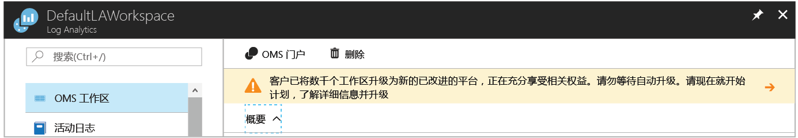

# <a name="view-or-analyze-data-collected-with-log-analytics-log-search"></a>查看或分析使用 Log Analytics 日志搜索收集的数据

在 Log Analytics 中，可通过构建查询利用日志搜索来分析收集的数据，也可使用预先存在的仪表板，可使用最有价值的搜索图形视图来自定义该仪表板。  定义从 Azure VM 和活动日志中的操作数据收集之后，可通过本教程了解如何：

> [!div class="checklist"]
> * 将 Azure Log Analytics 资源升级到新的查询语言 
> * 对事件数据执行简单搜索，并使用功能来修改和筛选结果 
> * 了解如何处理性能数据

要完成本教程中的示例，必须将现有虚拟机[连接到 Log Analytics 工作区](log-analytics-quick-collect-azurevm.md)。  

除了以交互方式使用返回的数据外，还可通过以下两种方式之一创建和编辑查询。  对于基础查询，请使用 Azure 门户中的“日志搜索”页；对于高级查询，可使用“高级分析”门户。 若要深入了解有关这两个门户之间的功能差异，请参阅[用于在 Azure Log Analytics 中创建和编辑日志查询的门户](log-analytics-log-search-portals.md)

在本教程中，我们将使用 Azure 门户中的“日志搜索”。 

## <a name="log-in-to-azure-portal"></a>登录到 Azure 门户
登录 Azure 门户 ([https://portal.azure.com](https://portal.azure.com))。 

## <a name="open-the-log-search-portal"></a>打开日志搜索门户 
首先打开日志搜索门户。   

1. 在 Azure 门户中，单击左下角的“更多服务”。 在资源列表中，键入“Log Analytics”。 开始键入时，会根据输入筛选该列表。 选择“Log Analytics”。
2. 在 Log Analytics 订阅窗格中，选择一个工作区，然后选择“日志搜索”磁贴。<br> 

你可能已注意到门户中 Log Analytics 资源页顶部显示的邀请升级的横幅。<br> 

Log Analytics 最近引入了一种新查询语言，这种语言使构造查询更简单、可关联来自各种源的数据并进行分析以快速确定趋势或问题。

升级也很简单。  单击显示“了解详细信息并执行升级”的横幅即可开始此进程。  在升级信息页面上阅读有关升级的其他信息，然后单击“立即升级”。

此过程需要几分钟才能完成，在此期间，可从菜单中的“通知”下跟踪其进度。 可详细了解[新查询语言的好处](log-analytics-log-search-upgrade.md#why-the-new-language)。

## <a name="create-a-simple-search"></a>创建简单的搜索
用于检索某些要使用的数据的最快方法是使用一个简单查询，它可返回表中的所有记录。  如果将任何 Windows 或 Linux 客户端连接到自己的工作区，将具有 Event（事件）(Windows) 或 Syslog (Linux) 表中的数据。

在搜索框中键入以下任一查询，然后单击“搜索”按钮。  

```
Event
```
```
Syslog
```

数据会返回到默认列表视图中，并可看到返回的总记录条数。


仅显示每条记录的前几个属性。  单击“显示更多”可显示特定记录的所有属性。

## <a name="filter-results-of-the-query"></a>筛选查询的结果
屏幕左侧是“筛选器”窗格，可用于向查询添加筛选而无需直接修改查询。  该记录类型显示有多个记录属性，可选择一个或多个属性值来缩小搜索结果范围。

如果正在处理“事件”，请选择“EVENTLEVELNAME”下“错误”旁边的复选框。   如果正在处理“Syslog”，请选择“SEVERITYLEVEL”下“err”旁边的复选框。  这会将查询更改为以下任一内容，将结果限制为错误事件。

```
Event | where (EventLevelName == "Error")
```
```
Syslog | where (SeverityLevel == "err")
```


通过从其中一条记录上的“属性”菜单中选择“添加到筛选器”，将属性添加到“筛选器”窗格中。


通过为一个记录（具有要筛选的值）选择“属性”菜单中的“筛选器”，可以设置相同的筛选器。  

将鼠标悬停在名称为蓝色的属性上时，只具有“筛选器”选项。  这些是“可搜索”字段，针对搜索条件编制了索引。  灰色字段是“自定义文本搜索”字段，只具有“显示引用”选项。  此选项返回任一属性中具有该值的记录。

通过在“记录”菜单中选择“分组依据”选项，可以根据单个属性对结果进行分组。  这会向查询中添加一个 [summarize](https://docs.loganalytics.io/docs/Language-Reference/Tabular-operators/summarize-operator) 运算符，会将结果显示为一个图表。  可以根据多个属性进行分组，但需要直接编辑查询。  选择“计算机”属性旁边的“记录”菜单，并选择“按‘计算机’分组”。  


## <a name="work-with-results"></a>处理结果
日志搜索门户具有用于处理查询结果的各种功能。  可以对结果进行排序、筛选和分组，由此对数据进行分析，而无需修改实际查询。  默认情况下，查询结果不会进行排序。

若要以表的形式查看数据 - 这种形式可提供其他用于筛选和排序的选项，请单击“表”。  


单击某记录旁的箭头，查看该记录的详细信息。


通过单击任意字段的列标题，对该字段进行排序。


通过单击“筛选器”按钮并提供筛选条件，按列中的特定值筛选结果。


通过将列的列标题拖到结果的顶端，根据该列进行分组。  通过将多个列拖到顶部，可以根据多个字段进行分组。


## <a name="work-with-performance-data"></a>处理性能数据
用于 Windows 和 Linux 代理的性能数据存储在 Log Analytics 工作区的“性能”表中。  性能记录看起来与任何其他记录一样，我们将编写一个返回所有性能记录的简单查询，与处理事件的方式一样。

```
Perf
```


返回所有性能对象和计数器的数百万条记录并不是很有用。  但可使用上面使用的同一方法来筛选数据，或只需直接在“日志搜索”框中键入以下查询。  这样只会返回 Windows 和 Linux 计算机的处理器利用率记录。

```
Perf | where (ObjectName == "Processor")  | where (CounterName == "% Processor Time")
```


这会将数据限制到一个特定的计数器，但数据的显示方式仍不会很有用。  可以折线图的形式显示数据，但首先需要按“计算机”和“TimeGenerated”对数据进行分组。  若要按多个字段进行分组，需要直接修改查询，所以请将查询修改为以下内容。  这会在“CounterValue”属性上使用 [avg](https://docs.loganalytics.io/docs/Language-Reference/Aggregation-functions/avg()) 函数来计算每小时的平均值。

```
Perf  | where (ObjectName == "Processor")  | where (CounterName == "% Processor Time") | summarize avg(CounterValue) by Computer, TimeGenerated
```


现已对数据进行适当分组，通过添加 [render](https://docs.loganalytics.io/docs/Language-Reference/Tabular-operators/render-operator) 运算符，可在可视图表中显示数据。  

```
Perf  | where (ObjectName == "Processor")  | where (CounterName == "% Processor Time") | summarize avg(CounterValue) by Computer, TimeGenerated | render timechart
```


## <a name="next-steps"></a>后续步骤
本教程介绍了如何创建基本日志搜索来分析事件和性能数据。  继续学习下一教程，了解如何通过创建仪表板可视化数据。

> [!div class="nextstepaction"]
> [创建和共享 Log Analytics 仪表板](log-analytics-tutorial-dashboards.md)
