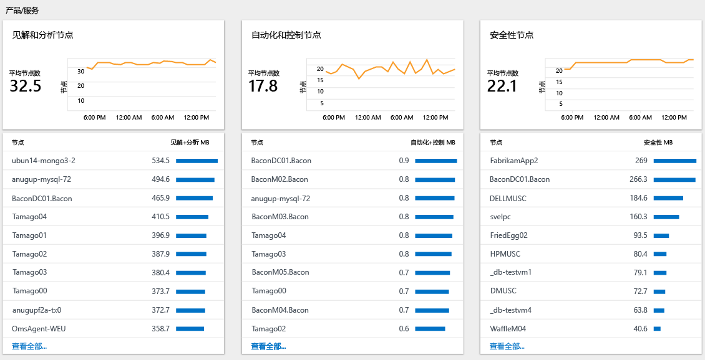

# 在 Log Analytics 中分析数据使用情况
Log Analytics 收集数据，并定期将数据发送到 OMS 服务。  可以使用“Log Analytics 使用情况”仪表板查看要发送到 OMS 服务的数据量。 该仪表板还显示解决方案发送的数据量以及服务器发送数据的频率。

> [!NOTE]
> 如果使用的是免费帐户，则每天仅可将 500 MB 数据发送到 OMS 服务。 如果达到日限量，数据分析将停止并在下一日开始时恢复。 在这种情况下，需要重新发送 OMS 未接受或处理的任何数据。

如果已超过或接近日使用限量，可选择删除解决方案，减少发送到 OMS 服务的数据量。 有关删除解决方案的详细信息，请参阅[从解决方案库中添加 Log Analytics 解决方案](log-analytics-add-solutions.md)。

“Log Analytics 使用情况”仪表板将显示以下信息：

- 数据量
    - 一段时间的数据量（基于当前的时间范围）
    - 按解决方案统计的数据量
    - 未与计算机关联的数据
- 计算机
    - 发送数据的计算机
    - 过去 24 小时内无数据的计算机
- 产品/服务
    - 见解与分析节点
    - 自动化与控制节点
    - 安全节点
- 性能
    - 收集数据和为数据建索引所花的时间
- 查询列表

## 了解用于 OMS 产品/服务的节点

如果用户位于每节点 (OMS) 定价层，则根据用户启用的节点和解决方案数量对用户收费。 可以在使用情况仪表板的产品/服务部分中查看使用了每项产品的多少个节点。

## 处理使用情况数据
1. 如果尚未登录 [Azure 门户](https://portal.azure.com)，请使用 Azure 订阅登录。
2. 在“中心”菜单中，单击“更多服务”，然后在资源列表中，键入“Log Analytics”。 当你开始键入时，会根据你的输入筛选该列表。 单击“Log Analytics”。  
    
3. “Log Analytics”仪表板将显示工作区的列表。 选择工作区。
4. 在“工作区”仪表板中，单击“Log Analytics 使用情况”。
5. 在“Log Analytics 使用情况”仪表板中，单击“时间: 过去 24 小时”更改时间间隔。  
    
6. 查看“使用情况类别”边栏选项卡以显示你感兴趣的区域。 选择一个边栏选项卡，然后单击其中的项以在 [日志搜索](log-analytics-log-searches.md) 中查看更多详细信息。  
    
7. 在“日志搜索”仪表板中，查看搜索返回的结果。  
    

## 后续步骤
* 请参阅 [Log Analytics 中的日志搜索](log-analytics-log-searches.md)，查看功能和解决方案收集和发送到 OMS 的详细信息。

