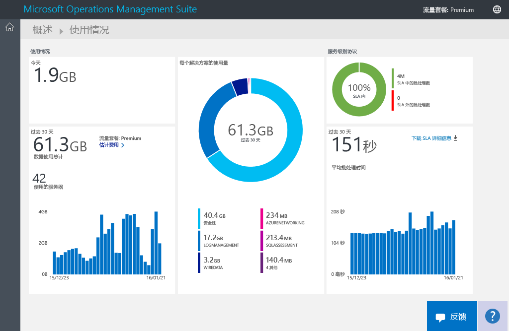
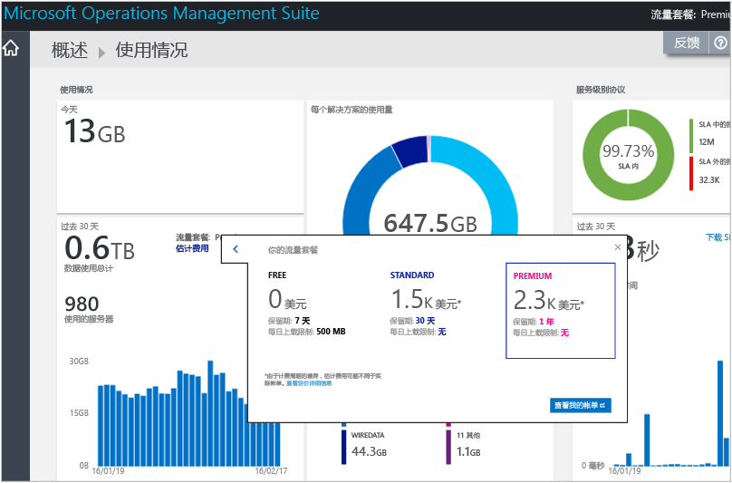
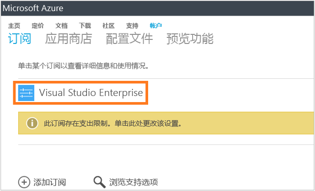
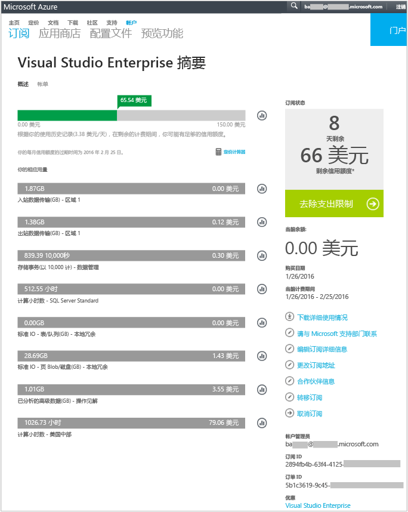
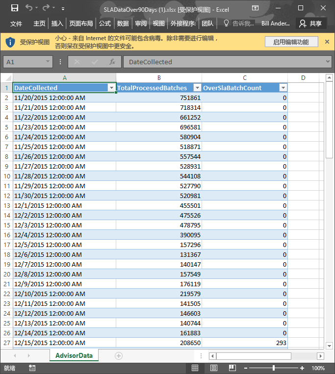

# 在 Log Analytics 中分析数据使用情况
Operations Management Suite (OMS) 中的 Log Analytics 收集数据并定期将其发送到 OMS 服务。  可使用“使用情况”页，查看要发送到 OMS 服务的数据量。 “使用情况”页还显示解决方案每天发送的数据量以及服务器发送数据的频率。

> [!NOTE]
> 如果已使用 [OMS 网站](http://www.microsoft.com/oms)创建免费帐户，则每天仅可将 500 MB 数据发送到 OMS 服务。 如果达到日限量，数据分析将停止并在第二天恢复服务。 还将需要重新发送 OMS 未接受或处理的任何数据。
> 
> 

可使用 OMS 中“概述”仪表板上的“使用情况”磁贴来查看使用情况。

如果已超过日使用限量，或者接近限量，可选择删除解决方案，减少发送到 OMS 服务的数据量。 有关删除解决方案的详细信息，请参阅[从解决方案库中添加 Log Analytics 解决方案](log-analytics-add-solutions.md)。

“使用情况”页显示以下信息：

* 每天平均使用量
* 最近 30 天内每个解决方案的数据使用量
* 最近 30 天内环境中的服务器向 OMS 服务发送的数据量
* 数据计划定价层和预估成本
* 有关服务级别协议 (SLA) 的信息，包括 OMS 处理数据所需的时长

## 处理使用情况数据
1. 在“概述”页上，单击“使用情况”磁贴。
2. 在“使用情况”页上，查看显示关注区域的使用情况类别。
3. 如果某解决方案消耗了过多的每日上传配额，可考虑删除此解决方案。

## 查看预估成本和帐单信息
1. 在“概述”页上，单击“使用情况”磁贴。
2. 在“使用情况”页上的“使用情况”中，单击“预估成本”旁的 V 形标记 (**>**)。
3. 在展开的“数据计划”详细信息中，可查看每月预估成本。  
    
4. 若要查看账单信息，单击“查看账单”，查看订阅信息。
   * 在订阅页上，单击订阅可查看详细信息和使用情况的行项目列表。  
       
   * 在订阅的“摘要”页上，可执行管理和查看订阅相关详细信息的各种任务。  
       

## 查看 SLA 的数据批
1. 在“概述”页上，单击“使用情况”磁贴。
2. 在“服务级别协议”下，单击“下载 SLA 详细信息”。
3. 随即会下载 Excel XLSX 文件以供查看。  
    

## 后续步骤
* 请参阅 [Log Analytics 中的日志搜索](log-analytics-log-searches.md)，查看解决方案收集的详细信息。

<!--HONumber=Nov16_HO2-->

