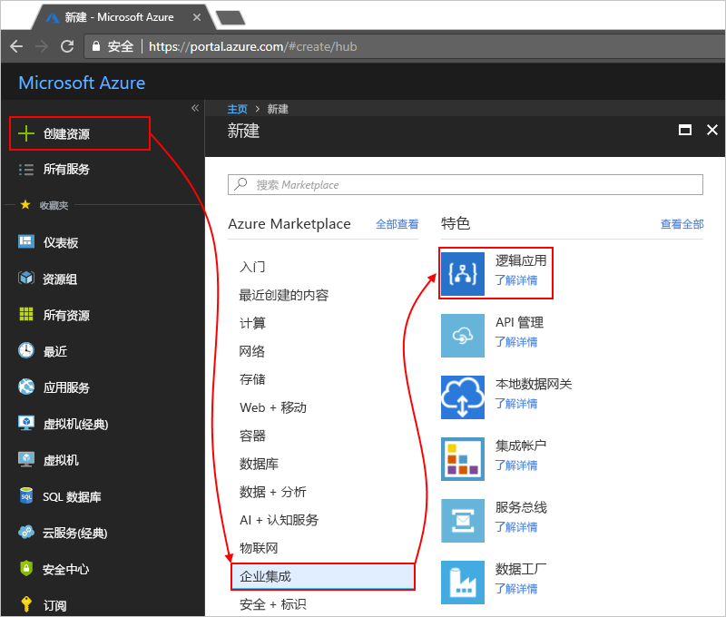

# 使用 Operations Management Suite (OMS) 和 Log Analytics 监视和获取有关逻辑应用运行的见解

有关监视和更丰富的调试信息，可在创建逻辑应用的同时启用 Log Analytics。 Log Analytics 提供了诊断日志记录并通过 Operations Management Suite (OMS) 门户监视逻辑应用运行。 将逻辑应用管理解决方案添加到 OMS 时，你将获得逻辑应用运行的聚合状态，同时获得特定详细信息，如状态、执行时间、重新提交状态和关联 ID。

本主题演示如何在 OMS 中开启 Log Analytics 或安装逻辑应用管理解决方案，以便查看逻辑应用的运行时事件和数据。

 > [!TIP]
 > 若要监视现有逻辑应用，请按照这些步骤[启用诊断日志记录并将逻辑应用运行时数据发送到 OMS](../logic-apps/logic-apps-monitor-your-logic-apps.md#azure-diagnostics)。

## 要求

在开始之前，需要具有 OMS 工作区。 了解[如何创建 OMS 工作区](../log-analytics/log-analytics-get-started.md). 

## 创建逻辑应用时请启用诊断日志记录

1. 在 [Azure 门户](https://portal.azure.com)中，创建一个逻辑应用。 选择“新建” > “Enterprise Integration” > “逻辑应用” > “创建”。

   

2. 在“创建逻辑应用”页上，执行这些任务，如下所示：

   1. 为逻辑应用命名，并选择 Azure 订阅。 
   2. 创建或选择 Azure 资源组。
   3. 将“Log Analytics”设置为“开”。 
   选择希望发送逻辑应用运行数据的 OMS 工作区。 
   4. 准备就绪后，请选择“固定到仪表板” > “创建”。

      

      完成此步骤后，Azure 将创建逻辑应用，该应用现在与 OMS 工作区相关联。 
      此外，此步骤还将在 OMS 工作区中自动安装逻辑应用管理解决方案。

3. 要在 OMS 中查看逻辑应用运行，请[继续执行这些步骤](#view-logic-app-runs-oms)。

## 在 OMS 中安装逻辑应用管理解决方案

如果在创建逻辑应用时已启用了 Log Analytics，可跳过此步骤。 OMS 中已经安装了逻辑应用管理解决方案。

1. 在 [Azure 门户](https://portal.azure.com)中，选择“更多服务”。 搜索“log analytics”作为筛选器，然后选择“Log Analytics”，如下所示：

   

2. 在“Log Analytics”下，查找并选择“OMS 工作区”。 

   

3. 在“管理”下，选择“OMS 门户”。

   

4. 在 OMS 主页上，选择“解决方案库”。

   

5. 在“所有解决方案”下，查找并选择“逻辑应用管理”解决方案的磁贴。

   

6. 要在 OMS 工作区中安装该解决方案，选择“添加”。

   

## 在 OMS 工作区中查看逻辑应用运行

1. 要查看逻辑应用运行的计数和状态，请转到 OMS 工作区的概述页。 在“逻辑应用管理”磁贴上查看详细信息。

   

2. 要查看有关逻辑应用运行更多详细信息的摘要，请选择“逻辑应用管理”磁贴。

   此时，逻辑应用运行将按名称或执行状态进行分组。

   
   
3. 要查看特定逻辑应用或状态的所有运行，请选择逻辑应用或状态的行。

   下面是一个显示特定逻辑应用所有运行的示例：

   

   > [!NOTE]
   > 对于因重新提交运行而导致的运行，“重新提交”列会显示“是”。

4. 要筛选这些结果，可以执行客户端和服务器端筛选。

   * 客户端筛选器：对于每个列，请选择所需的筛选器。 
   下面是一些示例：

     

   * 服务器端筛选器：要选择特定的时间窗口或限制显示的运行次数，请使用页面顶部的作用域控件。 
   默认情况下，一次仅显示 1,000 条记录。 
   
     
 
5. 要查看特定运行的所有操作及其详细信息，请选择“行”，这将打开“日志搜索”页。 

   * 要在表中查看此信息，请选择“表”。
   * 要更改查询，可在搜索栏中编辑查询字符串。 
   要获取更好的体验，请选择“高级分析”。

     

     在 Azure Log Analytics 页上，可以更新查询并查看表中的结果。 
     此查询使用 [Kusto 查询语言](https://docs.loganalytics.io/learn/tutorials/getting_started_with_queries.html)，如果希望查看不同的结果，可对其进行编辑。 

     

## 后续步骤

* [监视 B2B 消息](../logic-apps/logic-apps-monitor-b2b-message.md)

