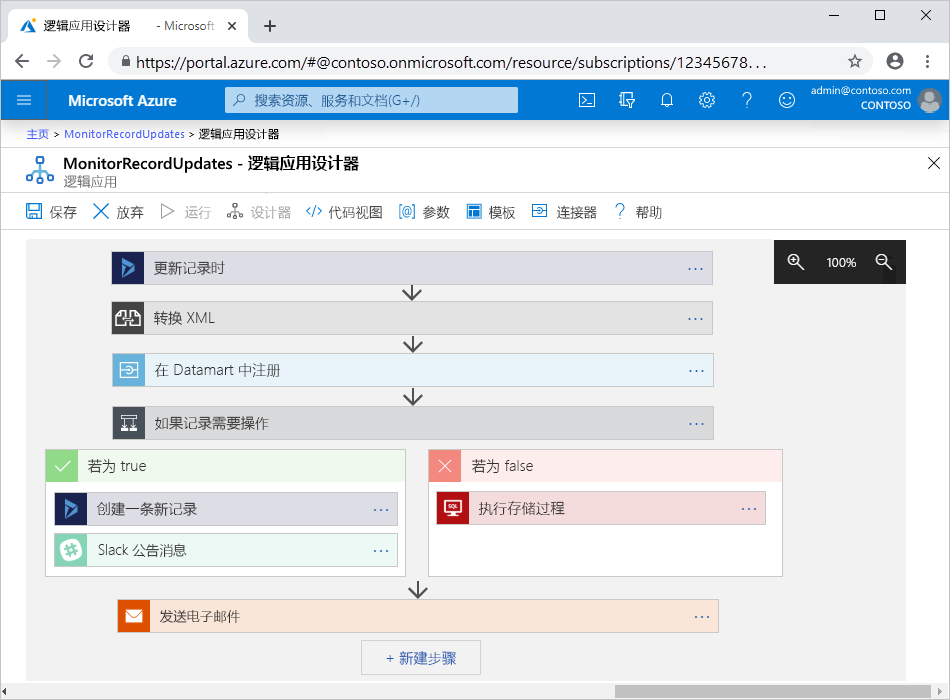

# 概述 - 什么是 Azure 逻辑应用？

[Azure 逻辑应用](https://azure.microsoft.com/services/logic-apps)是一项云服务，用于在需要跨企业或组织集成应用、数据、系统和服务时计划、自动执行和协调任务、业务流程和[工作流](#logic-app-concepts)。 逻辑应用可简化可缩放解决方案的设计和生成方式，适用于应用[集成](https://azure.microsoft.com/product-categories/integration/)、数据集成、系统集成、企业应用程序集成 (EAI) 和企业到企业 (B2B) 通信，不管是在云中还是在本地。

例如，下面就是一些可以通过逻辑应用自动完成的工作负荷：

* 跨本地系统和云服务处理并路由订单。

* 当各种系统、应用和服务中发生活动时，使用 Office 365 发送电子邮件通知。

* 将上传的文件从 SFTP 或 FTP 服务器移至 Azure 存储。

* 监视推文中的特定主题，分析观点，针对需要查看的项目创建警报或任务。

若要使用 Azure 逻辑应用生成企业集成解决方案，可以从一个不断扩充的库中进行选择。该库包含[数百个可使用的连接器](../connectors/apis-list.md)，包括各种服务，例如 Azure 服务总线、Azure Functions 和 Azure 存储、SQL Server、Office 365、Dynamics、Salesforce、BizTalk、SAP、Oracle DB、文件共享等。 [连接器](#logic-app-concepts)提供[触发器](#logic-app-concepts)和/或[操作](#logic-app-concepts)，所创建的逻辑应用可以安全地对数据进行实时访问和处理。

> [!VIDEO https://channel9.msdn.com/Blogs/Azure/Introducing-Azure-Logic-Apps/player]

## 逻辑应用的工作原理 

每个逻辑应用工作流都从触发器开始，在发生特定事件或新的可用数据符合特定条件的情况下触发。 逻辑应用中的连接器提供的许多触发器都包含基本的计划功能，方便你设置工作负荷的运行频率。 对于更复杂的计划或高级重复周期，你可以使用重复触发器作为任何工作流的第一步。 详细了解[基于计划的工作流](../logic-apps/concepts-schedule-automated-recurring-tasks-workflows.md)。

每当触发器触发时，逻辑应用引擎就会创建一个逻辑应用实例来运行工作流中的操作。 这些操作也可包括数据转换和工作流控制，如条件语句、开关语句、循环和分支。 例如，以下逻辑应用通过 Dynamics 365 触发器启动，带有内置的条件“当更新记录时”。 触发器在检测到与此条件匹配的事件时，会触发并运行工作流的操作。 在这里，这些操作包括 XML 转换、数据更新、决策分支和电子邮件通知。

可以使用逻辑应用设计器直观地生成逻辑应用。该设计器可通过浏览器在 Azure 门户中获取，也可在 Visual Studio 中获取。 若要获取更多的自定义逻辑应用，可以使用“代码视图”编辑器以 JavaScript 对象表示法 (JSON) 创建或编辑逻辑应用定义。 也可对选定的任务使用 Azure PowerShell 命令和 Azure 资源管理器模板。 逻辑应用部署和运行在 Azure 云中。 如需更详细的介绍，请观看此视频：[Use Azure Enterprise Integration Services to run cloud apps at scale](https://channel9.msdn.com/Events/Connect/2017/T119/)（使用 Azure Enterprise Integration Services 大规模运行云应用）

## 为什么使用逻辑应用？

随着企业逐渐转向数字化，逻辑应用应运而生。它可以提供预生成的 API 作为 Microsoft 托管的连接器，从而可以更轻松快捷地连接旧系统和新式、前沿的系统。 因此，你可以专注于应用的业务逻辑和功能， 不需担心应用的生成、托管、缩放、管理、维护和监视。 逻辑应用为你解决这一切。 另外，只需根据使用情况付费，具体取决于使用量[定价模型](../logic-apps/logic-apps-pricing.md)。

在许多情况下，无需编写代码。 但如果必须编写一些代码，则可使用 [Azure Functions](../azure-functions/functions-overview.md) 创建代码片段，然后通过逻辑应用按需运行该代码。 另外，如果逻辑应用需要与来自 Azure 服务、自定义应用或其他解决方案的事件交互，则可将 [Azure 事件网格](../event-grid/overview.md)与逻辑应用配合使用，以便进行事件监视、路由和发布。

逻辑应用、Functions 和事件网格由 Microsoft Azure 全权托管，因此不必担心解决方案的生成、托管、缩放、管理、监视和维护。 由于能够创建[“无服务器”应用和解决方案](../logic-apps/logic-apps-serverless-overview.md)，因此只需关注业务逻辑。 这些服务可以按需自动缩放，加快集成速度，使用最少的代码生成可靠的云应用。

若要了解公司如何将逻辑应用与其他 Azure 服务和 Microsoft 产品配合使用，以便增强敏捷性并更加专注于核心业务，请查看这些[客户案例](https://aka.ms/logic-apps-customer-stories)。

下面更详细地介绍逻辑应用的功能和好处：

### 使用易用的工具直观地生成工作流

使用可视化设计工具，既节省时间，又能简化复杂的流程。 从头至尾使用逻辑应用设计器来生成逻辑应用，不管是通过浏览器在 Azure 门户中使用，还是在 Visual Studio 中使用。 使用触发器启动工作流，并从[连接器库](../connectors/apis-list.md)添加任意数量的操作。

### 使用逻辑应用模板加快入门速度

从[模板库](../logic-apps/logic-apps-create-logic-apps-from-templates.md)选择预定义的工作流时，可以更快速地创建常用解决方案。 模板既有适用于软件即服务 (SaaS) 应用的简单连接，也有高级 B2B 解决方案，还有“兴趣型”模板。 了解如何[从预生成的模板创建逻辑应用](../logic-apps/logic-apps-create-logic-apps-from-templates.md)。

### 跨不同的环境连接不同的系统

某些模式和工作流描述起来容易，但难以在代码中实现。 逻辑应用可用于跨本地环境和云环境无缝连接不同的系统。 例如，可以将云营销解决方案连接到本地计费系统，也可以使用企业服务总线集中进行跨 API 和系统的消息传送。 可以通过逻辑应用快速、可靠且一致地为这些方案提供可重复使用和重新配置的解决方案。

### 针对企业集成和 B2B 方案的一流支持

企业和组织使用符合行业标准但却不同的消息协议和格式（例如 EDIFACT、AS2 和 X12）进行电子方式的相互通信。 可以使用 [Enterprise Integration Pack (EIP)](../logic-apps/logic-apps-enterprise-integration-overview.md) 中的功能来生成逻辑应用，以便将合作伙伴使用的消息格式转换成组织的系统能够解释和处理的格式。 逻辑应用可以通过加密和数字签名顺利且安全地处理这些交换。

一开始采用小规模，只需使用当前的系统和服务，然后按自己的步调逐渐扩大规模。 准备就绪以后，即可使用逻辑应用和 EIP 来获得以下功能和其他功能，从而实现集成方案并通过纵向扩展将其变为更成熟的方案：

* 在以下产品和服务的基础上进行生成：

  * [Microsoft BizTalk Server](https://docs.microsoft.com/biztalk/core/introducing-biztalk-server)
  * [Azure 服务总线](../service-bus-messaging/service-bus-messaging-overview.md)
  * [Azure Functions](../azure-functions/functions-overview.md)
  * [Azure API 管理](../api-management/api-management-key-concepts.md)

* 处理 [XML 消息](../logic-apps/logic-apps-enterprise-integration-xml.md)

* 处理[平面文件](../logic-apps/logic-apps-enterprise-integration-flatfile.md)

* 使用 [EDIFACT](../logic-apps/logic-apps-enterprise-integration-edifact.md)、[AS2](../logic-apps/logic-apps-enterprise-integration-as2.md) 和 [X12](../logic-apps/logic-apps-enterprise-integration-x12.md) 协议交换消息

* 使用[集成帐户](../logic-apps/logic-apps-enterprise-integration-accounts.md)在一个位置存储和管理以下 B2B 项目和其他项目：

  * [合作伙伴](../logic-apps/logic-apps-enterprise-integration-partners.md)
  * [协议](../logic-apps/logic-apps-enterprise-integration-agreements.md) 
  * [XML 转换映射](../logic-apps/logic-apps-enterprise-integration-maps.md)
  * [XML 验证架构](../logic-apps/logic-apps-enterprise-integration-schemas.md)

例如，如果使用 Microsoft BizTalk Server，则逻辑应用可以使用 [BizTalk Server 连接器](../connectors/apis-list.md#on-premises-connectors)与 BizTalk Server 通信。 然后，可以通过包含[集成帐户连接器](../connectors/apis-list.md#integration-account-connectors)（已在 Enterprise Integration Pack 中提供），在逻辑应用中进行扩展或执行类似于 BizTalk 的操作。

从另一个方向看，BizTalk Server 可以使用[适用于逻辑应用的 Microsoft BizTalk Server 适配器](https://www.microsoft.com/download/details.aspx?id=54287)连接到逻辑应用并与其通信。 了解如何在 BizTalk Server 中[设置和使用 BizTalk 服务器适配器](https://docs.microsoft.com/biztalk/core/logic-app-adapter)。

### 编写一次即可多次重复使用

将逻辑应用创建为 Azure 资源管理器模板，以便可以跨多个环境和区域[自动执行逻辑应用部署](../logic-apps/logic-apps-azure-resource-manager-templates-overview.md)。

### 访问 Azure 虚拟网络中的资源

当你创建[集成服务环境 (ISE)](../logic-apps/connect-virtual-network-vnet-isolated-environment-overview.md) 时，逻辑应用可访问[Azure 虚拟网络](../virtual-network/virtual-networks-overview.md)中的受保护资源，例如虚拟机 (VM) 以及其他系统或服务。 ISE 是逻辑应用服务的独立实例，该实例使用专用资源并独立于“全局”多租户逻辑应用服务运行。

在你自己的独立隔离实例中运行逻辑应用有助于降低其他 Azure 租户对应用性能的影响，此影响也称为[“邻近干扰”影响](https://en.wikipedia.org/wiki/Cloud_computing_issues#Performance_interference_and_noisy_neighbors)。 ISE 还带来以下好处：

* 你自己的静态 IP 地址，它们不同于多租户服务中的逻辑应用共享的静态 IP 地址。 还可以设置单个公共的、静态的和可预测的出站 IP 地址，以便与目标系统通信。 这样就无需在每个 ISE 的那些目标系统上设置其他防火墙开口。

* 增加了对运行持续时间、存储保留、吞吐量、HTTP 请求和响应超时、消息大小和自定义连接器请求的限制。 有关详细信息，请参阅 [Azure 逻辑应用的限制和配置](../logic-apps/logic-apps-limits-and-config.md)。

当你创建 ISE 时，Azure 会将该 ISE 注入  或部署到 Azure 虚拟网络中。 然后，你可以将该 ISE 用作需要进行访问的逻辑应用和集成帐户的位置。 若要详细了解如何创建 ISE，请参阅[从 Azure 逻辑应用连接到 Azure 虚拟网络](../logic-apps/connect-virtual-network-vnet-isolated-environment.md)。

### 内置的扩展性

如果找不到所需的连接器以运行自定义代码，则可通过 [Azure Functions](../azure-functions/functions-overview.md) 根据需要创建和调用自己的代码片段，从而扩展逻辑应用。 创建自己的 [API](../logic-apps/logic-apps-create-api-app.md) 和[自定义连接器](../logic-apps/custom-connector-overview.md)，以便通过逻辑应用对其进行调用。

### 只需为使用的服务付费
  
逻辑应用使用基于使用情况的[定价和计费](../logic-apps/logic-apps-pricing.md)，除非该逻辑应用是以前使用应用服务计划创建的。

通过以下介绍性视频详细了解逻辑应用：

* [Integration with Logic Apps - Go from zero to hero](https://channel9.msdn.com/Events/Build/2017/C9R17)（与逻辑应用集成 - 从无到有）
* [Enterprise integration with Microsoft Azure Logic Apps](https://channel9.msdn.com/Events/Ignite/Microsoft-Ignite-Orlando-2017/BRK2188)（与 Microsoft Azure 逻辑应用进行企业集成）
* [Building advanced business processes with Logic Apps](https://channel9.msdn.com/Events/Ignite/Microsoft-Ignite-Orlando-2017/BRK3179)（使用逻辑应用生成高级业务流程）

## 逻辑应用与 Functions、WebJobs 及 Power Automate 的区别在哪里？

所有这些服务都可以用来将不同的系统“粘贴”和连接到一起。 每项服务都有其优点和优势，因此若要快速生成可缩放且功能完备的集成系统，最好的方法是将这些服务的功能组合到一起。 有关详细信息，请参阅[在逻辑应用、Functions、WebJobs 和 Power Automate 之间进行选择](../azure-functions/functions-compare-logic-apps-ms-flow-webjobs.md)。

## 关键术语

* **工作流**：以一系列步骤的方式完成业务流程的可视化、设计、生成、自动化和部署操作。

* **托管连接器**：逻辑应用需要访问数据、服务和系统。 可以使用预生成的 Microsoft 托管连接器，这些连接器旨在连接、访问和使用数据。 请参阅[适用于 Azure 逻辑应用的连接器](../connectors/apis-list.md)。

* **触发器**：许多 Microsoft 托管连接器提供的触发器可以在事件或新数据符合指定条件时触发。 例如，某个事件可能正在获取电子邮件或检测 Azure 存储帐户中的更改。 每当触发器触发时，逻辑应用引擎就会创建一个新的逻辑应用实例来运行工作流。

* **操作**：操作是在触发器之后发生的所有步骤。 每个操作通常都会映射到由托管连接器、自定义 API 或自定义连接器定义的操作。

* **Enterprise Integration Pack**：对于更高级的集成方案，逻辑应用会包括 BizTalk Server 中的功能。 Enterprise Integration Pack 提供的连接器可以帮助逻辑应用轻松地执行验证、转换等操作。

## 入门

逻辑应用是托管在 Microsoft Azure 上的许多服务之一。 因此在开始之前，你需要一个 Azure 订阅。 如果没有订阅，可以[注册免费的 Azure 帐户](https://azure.microsoft.com/free/)。

如果有 Azure 订阅，可以尝试此[创建第一个逻辑应用的快速入门](../logic-apps/quickstart-create-first-logic-app-workflow.md)。该逻辑应用通过 RSS 源监视网站上的新内容，在新内容出现时发送电子邮件。

## 后续步骤

* [使用按计划的逻辑应用检查流量](../logic-apps/tutorial-build-schedule-recurring-logic-app-workflow.md)
* 详细了解 [Azure 的无服务器解决方案](../logic-apps/logic-apps-serverless-overview.md)
* 详细了解[通过 Enterprise Integration Pack 进行的 B2B 集成](../logic-apps/logic-apps-enterprise-integration-overview.md)
