# 快速入门：使用 Azure 逻辑应用创建第一个工作流 - Azure 门户

本快速入门介绍了使用 [Azure 逻辑应用](../logic-apps/logic-apps-overview.md)构建第一个工作流背后的通用基本概念，例如创建空白逻辑应用、添加触发器和操作及测试逻辑应用。 在本快速入门中，构建一个逻辑应用，以便定期查看网站的 RSS 源中是否有新项。 如果存在新项，逻辑应用会针对每个项发送电子邮件。 完成后，逻辑应用看起来大致与以下工作流类似：

对于此方案，需要一个 Azure 订阅或[注册一个免费的 Azure 帐户](https://azure.microsoft.com/free/)，并需要一个由 Azure 逻辑应用支持的服务（例如 Office 365 Outlook、Outlook.com 或 Gmail）提供的电子邮件帐户。 如需其他受支持的电子邮件服务，请[在这里查看连接器列表](https://docs.microsoft.com/connectors/)。 在此示例中，逻辑应用使用 Office 365 Outlook 帐户。 如果使用其他电子邮件服务，则总体常规步骤相同，但用户界面可能略有不同。

> [!IMPORTANT]
> 如果要使用 Gmail 连接器，则只有 G-Suite 商业帐户可以在逻辑应用中不受限制地使用此连接器。 如果有 Gmail 用户帐户，则只能将此连接器与 Google 批准的特定服务一起使用，也可以[创建用于通过 Gmail 连接器进行身份验证的 Google 客户端应用](https://docs.microsoft.com/connectors/gmail/#authentication-and-bring-your-own-application)。 有关详细信息，请参阅 [Azure 逻辑应用中 Google 连接器的数据安全和隐私策略](../connectors/connectors-google-data-security-privacy-policy.md)。

## 登录到 Azure 门户

使用 Azure 帐户凭据登录到 [Azure 门户](https://portal.azure.com)。

## 创建逻辑应用

1. 在 Azure 主页上的搜索框中，查找并选择“逻辑应用”  。

   

1. 在“逻辑应用”页上，选择“添加”   。

   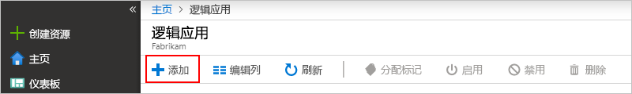

1. 在“逻辑应用”窗格上，提供有关逻辑应用的详细信息，如下所示  。 完成后，选择“创建”  。

   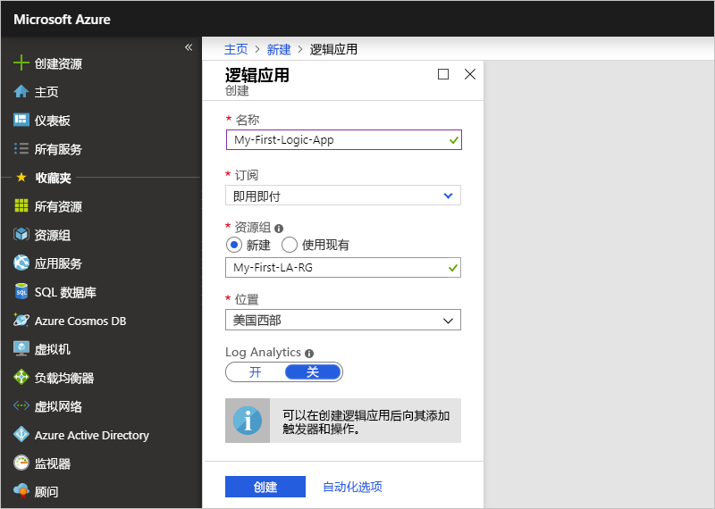

   | properties | 值 | 说明 |
   |----------|-------|-------------|
   | **名称** | <*logic-app-name*> | 逻辑应用名称，只能包含字母、数字、连字符 (`-`)、下划线 (`_`)、括号（`(`、`)`）和句点 (`.`)。 此示例使用“My-First-Logic-App”。 |
   | **订阅** | <*Azure-subscription-name*> | Azure 订阅名称 |
   | **资源组** | <*Azure-resource-group-name*> | 用于组织相关资源的 [Azure 资源组](../azure-resource-manager/management/overview.md)的名称。 此示例使用“My-First-LA-RG”。 |
   | **位置** | <*Azure-region*> | 用于存储逻辑应用信息的区域。 此示例使用“美国西部”。 |
   | **Log Analytics** | 关闭 | 对于诊断日志记录，请保留“关闭”设置。  |
   ||||

1. 在 Azure 部署你的应用后，在 Azure 工具栏上，选择“通知”   > “转到资源”  ，查看你部署的逻辑应用。

   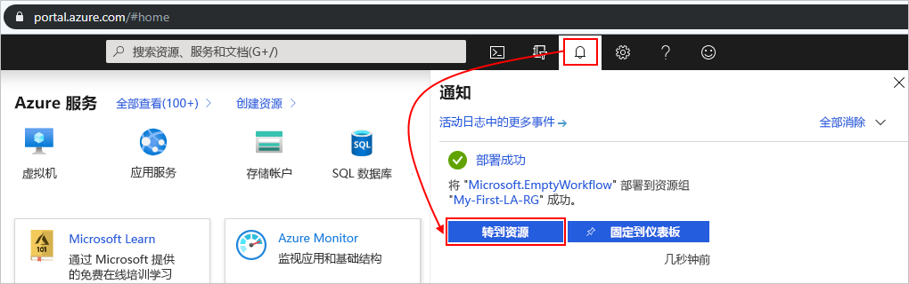

   或者，可以通过在搜索框中键入名称来查找和选择逻辑应用。

   逻辑应用设计器打开并显示一个包含简介视频和常用触发器的页面。   在“模板”下选择“空白逻辑应用”。

   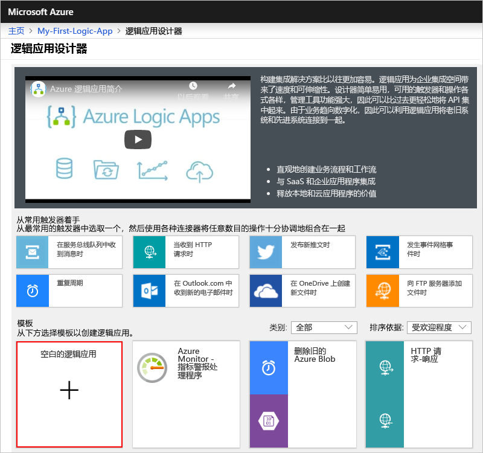

接下来请添加一个[触发器](../logic-apps/logic-apps-overview.md#logic-app-concepts)，该触发器在出现新的 RSS 源项时触发。 每个逻辑应用都必须从触发器开始，该触发器在发生特定事件或特定条件得到满足的情况下触发。 每当触发器触发时，Azure 逻辑应用引擎就会创建一个逻辑应用实例来启动并运行工作流。

## 添加 RSS 触发器

1. 在“逻辑应用设计器”的搜索框下，选择“全部”   。

1. 在搜索框中，输入 `rss` 以查找 RSS 连接器。 从触发器列表中，选择“发布源项时”触发器  。

   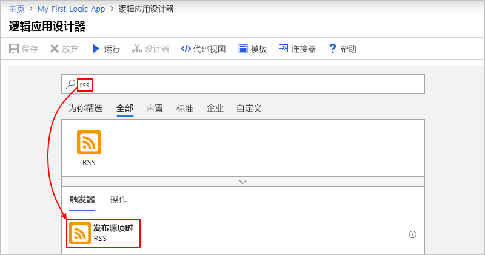

1. 为触发器提供如下所示的信息：

   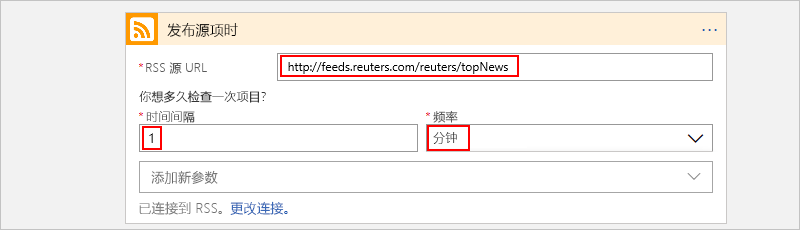

   | properties | 值 | 说明 |
   |----------|-------|-------------|
   | **RSS 源 URL** | `http://feeds.reuters.com/reuters/topNews` | 要监视的 RSS 源的链接 |
   | 间隔  | 1 | 在两次检查之间需等待的时间间隔数 |
   | **频率** | Minute | 两次检查的间隔的时间单位  |
   ||||

   时间间隔和频率合在一起，即可定义逻辑应用的触发器的计划。 此逻辑应用每分钟检查一次源。

1. 若要暂时折叠触发器详细信息，请单击触发器的标题栏。

   

1. 保存逻辑应用。 在设计器工具栏上，选择“保存”  。

逻辑应用现已生成，但除了检查 RSS 源，不能执行任何操作。 因此，请添加一项在触发器触发时进行响应的操作。

## 添加“发送电子邮件”操作

现在请添加一项[操作](../logic-apps/logic-apps-overview.md#logic-app-concepts)，在 RSS 源中出现新项时发送电子邮件。

1. 在“发布源项时”触发器下，选择“新建步骤”   。

   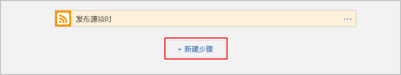

1. 在“选择操作”和搜索框下，选择“全部”   。

1. 在搜索框中，输入 `send an email` 以查找提供此操作的连接器。 从操作列表中，为要使用的电子邮件服务选择“发送电子邮件”操作。 此示例使用 Office 365 Outlook 连接器，该连接器具有“发送电子邮件”操作  。

   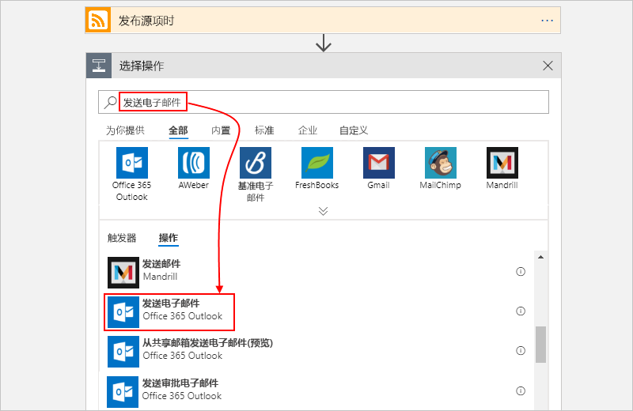

   若要通过对操作列表进行筛选来查找特定的应用或服务，可以先选择应用或服务：

   * 对于 Azure 工作或学校帐户，请选择“Office 365 Outlook”。
   * 对于个人 Microsoft 帐户，请选择“Outlook.com”。

1. 如果你选择的电子邮件连接器提示你进行身份验证，请立即完成该步骤，以在逻辑应用与电子邮件服务之间创建连接。

   > [!NOTE]
   > 在此特定示例中，你将手动进行身份验证。 但是，要求进行身份验证的各种连接器所支持的身份验证类型有所不同。 你也可以选择设置要用于处理身份验证的方式。 例如，当使用 Azure 资源管理器模板进行部署时，可以对你想要经常或轻松更改的输入（如连接信息）进行参数化并提高安全性。 有关详细信息，请参阅以下主题：
   >
   > * [部署的模板参数](../logic-apps/logic-apps-azure-resource-manager-templates-overview.md#template-parameters)
   > * [授权 OAuth 连接](../logic-apps/logic-apps-deploy-azure-resource-manager-templates.md#authorize-oauth-connections)
   > * [使用托管标识验证访问](../logic-apps/create-managed-service-identity.md)
   > * [为逻辑应用部署验证连接](../logic-apps/logic-apps-azure-resource-manager-templates-overview.md#authenticate-connections)

1. 在“发送电子邮件”操作中，指定需要电子邮件包括的数据。 

   1. 在“收件人”  框中，输入收件人的电子邮件地址。 为进行测试，可以使用你的电子邮件地址。

      现在，请忽略出现的“添加动态内容”列表。  单击某些编辑框时，此列表会出现并显示前一步骤中提供的参数，这样即可将其作为工作流的输入包括进去。

   1. 在“主题”框中，输入带有尾随空格的以下文本：  `New RSS item: `

      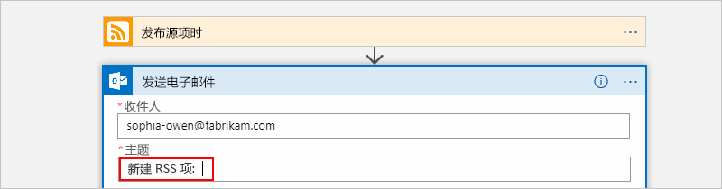

   1. 从“添加动态内容”列表  中选择“源标题”  ，用于包括 RSS 项标题。

      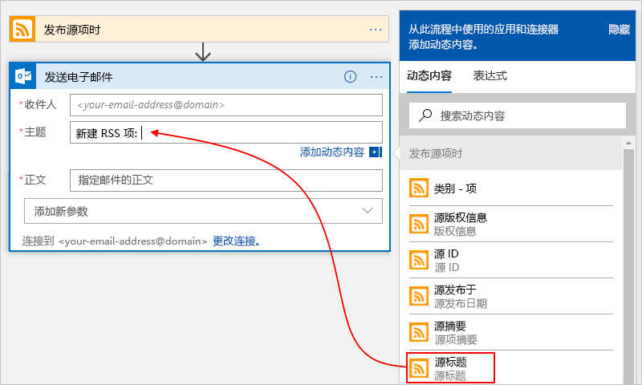

      完成后，电子邮件主题如以下示例所示：

      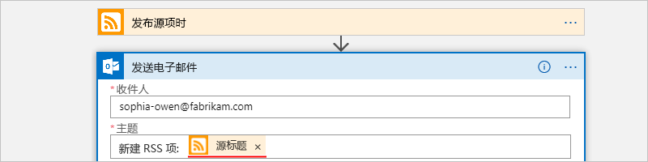

      如果“For each”循环显示在设计器上，则你为数组选择了一个令牌，例如 **categories-Item** 令牌。 对于这些类型的令牌，设计器会自动围绕引用该令牌的操作添加此循环。 这样一来，逻辑应用会对每个数组项执行同一操作。 若要删除循环，请选择循环的标题栏上的省略号 ( **...** )，然后选择“删除”。  

   1. 在“正文”框中选择此文本，然后选择这些令牌作为电子邮件正文。  若要在编辑框中添加空行，请按 Shift + Enter。

      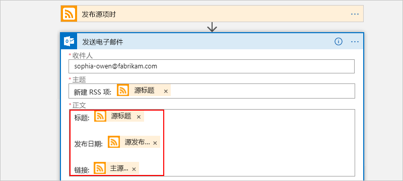

      | properties | 说明 |
      |----------|-------------|
      | 源标题  | 项的标题 |
      |  源发布日期 | 项的发布日期和时间 |
      | 源主链接  | 项的 URL |
      |||

1. 保存逻辑应用。

接下来，测试逻辑应用。

## 运行逻辑应用

若要手动启动逻辑应用，请在设计器工具栏中选择“运行”  。 或者，等待逻辑应用根据指定的计划（每隔一分钟）检索 RSS 源。 如果 RSS 源有新项，逻辑应用会为每个新项发送一封电子邮件。 否则，逻辑应用会等到下一个间隔过后才进行检查。 如果没有收到任何电子邮件，请检查垃圾邮件文件夹。

例如，下面是此逻辑应用发送的一封示例电子邮件。

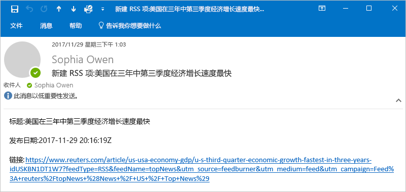

从技术上讲，当触发器检查 RSS 源并找到新项时，触发器将会激发，并且 Azure 逻辑应用引擎会创建一个逻辑应用工作流实例，用于运行工作流中的操作。 如果触发器未找到新项，则触发器不会激发，而是“跳过”实例化工作流的操作。

祝贺你，现已使用 Azure 门户成功生成并运行了第一个逻辑应用。

## 清理资源

不再需要此示例时，删除包含你的逻辑应用和相关资源的资源组。

1. 在 Azure 主菜单中，选择“资源组”，然后选择逻辑应用的资源组。  在“概述”  窗格上，选择“删除资源组”。 

   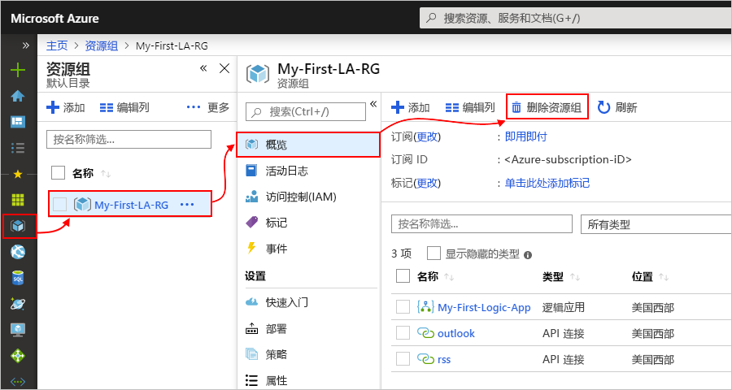

1. 出现确认窗格时，输入资源组名称，然后选择“删除”  。

   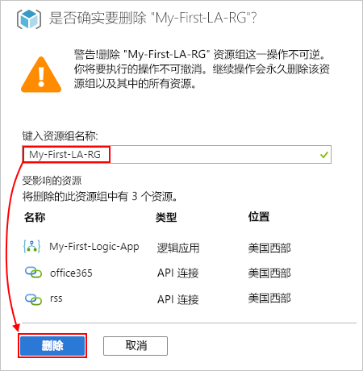

> [!NOTE]
> 删除逻辑应用后，任何新运行都不会实例化。 所有正在进行和挂起的运行都将取消。 如果有成千上万个运行，取消操作可能需要很长时间才能完成。

## 后续步骤

本快速入门介绍了如何创建第一个逻辑应用，以便按指定计划检查 RSS 更新（每分钟检查一次），当存在更新时执行操作（发送电子邮件）。 若要了解详细信息，请继续学习本教程，了解如何创建更高级的基于计划的工作流：

> [!div class="nextstepaction"]
> [使用基于计划的逻辑应用检查流量](../logic-apps/tutorial-build-schedule-recurring-logic-app-workflow.md)
