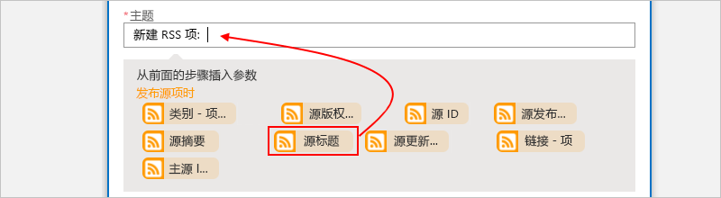

# <a name="quickstart-build-your-first-logic-app-workflow---azure-portal"></a>快速入门：生成第一个逻辑应用工作流 - Azure 门户

本快速入门介绍如何使用 [Azure 逻辑应用](../logic-apps/logic-apps-overview.md)创建第一个自动化工作流。 在本文中，请创建一个逻辑应用，以便定期查看网站的 RSS 源中是否有新项。 如果存在新项，逻辑应用会针对每个项发送电子邮件。 完成后，逻辑应用看起来大致与以下工作流类似：


若要按照本快速入门进行操作，你需要逻辑应用支持的提供商（例如 Office 365 Outlook、Outlook.com 或 Gmail）提供的电子邮件帐户。 至于其他提供商，请[查看此处的连接器列表](https://docs.microsoft.com/connectors/)。 此逻辑应用使用 Office 365 Outlook 帐户。 如果使用其他电子邮件帐户，整个步骤仍然是相同的，但 UI 可能稍有不同。 

另外，如果还没有 Azure 订阅，请<a href="https://azure.microsoft.com/free/" target="_blank">注册一个免费 Azure 帐户</a>。

## <a name="sign-in-to-the-azure-portal"></a>登录到 Azure 门户

使用 Azure 帐户凭据登录到 <a href="https://portal.azure.com" target="_blank">Azure 门户</a>。

## <a name="create-your-logic-app"></a>创建逻辑应用 

1. 从主 Azure 菜单中选择“新建” > “企业集成” > “逻辑应用”。

   

3. 在“创建逻辑应用”下，提供有关逻辑应用的详细信息，如下所示。 完成后，请选择“固定到仪表板” > “创建”。

   

   | 设置 | 值 | 说明 | 
   | ------- | ----- | ----------- | 
   | **Name** | MyFirstLogicApp | 逻辑应用的名称 | 
   | **订阅** | <*your-Azure-subscription-name*> | Azure 订阅的名称 | 
   | **资源组** | My-First-LA-RG | 用于组织相关资源的 [Azure 资源组](../azure-resource-manager/resource-group-overview.md)的名称 | 
   | **位置** | 美国东部 2 | 用于存储逻辑应用信息的区域 | 
   | **Log Analytics** | 关闭 | 对于诊断日志记录，请保留“关闭”设置。 | 
   |||| 

3. 在 Azure 部署应用以后，逻辑应用设计器会打开并显示一个包含简介视频和常用触发器的页面。 在“模板”下选择“空白逻辑应用”。

   

接下来请添加一个[触发器](../logic-apps/logic-apps-overview.md#logic-app-concepts)，该触发器在出现新的 RSS 源项时触发。 每个逻辑应用都必须从触发器开始，该触发器在发生特定事件或特定条件得到满足的情况下触发。 每当触发器触发时，逻辑应用引擎就会创建一个逻辑应用实例来启动并运行工作流。

## <a name="check-rss-feed-with-a-trigger"></a>使用触发器检查 RSS 源

1. 在设计器的搜索框中输入“rss”。 选择触发器“RSS - 发布源项时”

   

2. 为触发器提供如下所示的信息： 

   

   | 设置 | 值 | 说明 | 
   | ------- | ----- | ----------- | 
   | **RSS 源 URL** | ```http://feeds.reuters.com/reuters/topNews``` | 要监视的 RSS 源的链接 | 
   | **间隔** | 1 | 在两次检查之间需等待的时间间隔数 | 
   | **频率** | 分钟 | 两次检查的间隔的时间单位  | 
   |  |  |  | 

   时间间隔和频率合在一起，即可定义逻辑应用的触发器的计划。 
   此逻辑应用每分钟检查一次源。

3. 若要立即隐藏触发器详细信息，请单击触发器的标题栏。

   

4. 保存逻辑应用。 在设计器工具栏上，选择“保存”。 

逻辑应用现已生成，但除了检查 RSS 源，不能执行任何操作。 因此，请添加一项在触发器触发时进行响应的操作。

## <a name="send-email-with-an-action"></a>使用操作发送电子邮件

现在请添加一项[操作](../logic-apps/logic-apps-overview.md#logic-app-concepts)，在 RSS 源中出现新项时发送电子邮件。 

1. 在“发布源项时”触发器下，选择“+ 新建步骤” > “添加操作”。

   

2. 在“选择操作”下搜索“发送电子邮件”，然后选择与所需电子邮件提供商相对应的“发送电子邮件”操作。 若要通过筛选操作列表来查找特定的服务，可以先在“连接器”下选择连接器。

   

   * 对于 Azure 工作或学校帐户，请选择“Office 365 Outlook”。 
   * 对于个人 Microsoft 帐户，请选择“Outlook.com”。

3. 如果系统要求提供凭据，请登录电子邮件帐户，这样逻辑应用就可以创建到该电子邮件帐户的连接了。

4. 在“发送电子邮件”操作中，指定需要电子邮件包括的数据。 

   1. 在“收件人”框中，输入收件人的电子邮件地址。 
   为进行测试，可以使用自己的电子邮件地址。

      现在，请忽略出现的参数列表或“添加动态内容”列表。 
      单击某些编辑框时，此列表会出现并显示前一步骤中提供的参数，这样即可将其作为工作流的输入包括进去。
      浏览器宽度决定了哪个列表显示。

   2. 在“主题”框中，输入带有尾随空格的以下文本：```New RSS item: ```

      
 
   3. 从参数列表或“添加动态内容”列表中选择**源标题**，用于包括 RSS 项标题。

      例如，下面是参数列表：

      

      下面是动态内容列表：

      

      完成后，电子邮件主题如以下示例所示：

      

      如果“For each”循环显示在设计器上，则所选字段包含一个数组，例如“categories-item”字段。 
      对于这些类型的字段，设计器会自动围绕引用该字段的操作添加此循环。 
      这样一来，逻辑应用会对每个数组项执行同一操作。 
      若要删除循环，请选择循环的标题栏上的省略号 (**...**)，然后选择“删除”。

   4. 在“正文”框中选择此文本，然后选择这些字段作为电子邮件正文。 
   若要在编辑框中添加空行，请按 Shift + Enter。 

      

      | 设置 | 说明 | 
      | ----- | ----------- | 
      | 源标题 | 项的标题 | 
      | 源发布日期 | 项的发布日期和时间 | 
      | 源主链接 | 项的 URL | 
      ||| 
   
5. 保存逻辑应用。

接下来，测试逻辑应用。

## <a name="run-your-logic-app"></a>运行逻辑应用

若要手动启动逻辑应用，可在设计器工具栏中选择“运行”。 或者，等待逻辑应用按指定计划运行（每分钟运行一次）。 如果 RSS 源有新项，逻辑应用会为每个新项发送一封电子邮件。 但如果源没有新项，逻辑应用会跳过触发器的触发，等待下次再进行检查。 

例如，下面是此逻辑应用发送的一封示例电子邮件：


如果没有收到任何电子邮件，请检查电子邮件的垃圾邮件文件夹。 垃圾电子邮件筛选器可能会将这些类型的邮件重定向。 

祝贺！你已生成并运行第一个逻辑应用。

## <a name="clean-up-resources"></a>清理资源

不再需要包含逻辑应用和相关资源的资源组时，可将其删除。 在 Azure 主菜单中转到“资源组”，然后选择逻辑应用的资源组。 选择“删除资源组”。 输入资源组名称作为确认，然后选择“删除”。


## <a name="get-support"></a>获取支持

* 有关问题，请访问 [Azure 逻辑应用论坛](https://social.msdn.microsoft.com/Forums/en-US/home?forum=azurelogicapps)。
* 若要提交功能建议或对功能建议进行投票，请访问[逻辑应用用户反馈网站](http://aka.ms/logicapps-wish)。

## <a name="next-steps"></a>后续步骤

本快速入门介绍了如何创建第一个逻辑应用，以便按指定计划检查 RSS 更新（每分钟检查一次），当存在更新时执行操作（发送电子邮件）。 若要了解详细信息，请继续学习本教程，了解如何创建更高级的基于计划的工作流：

> [!div class="nextstepaction"]
> [使用基于计划的逻辑应用检查流量](../logic-apps/tutorial-build-schedule-recurring-logic-app-workflow.md)