# <a name="quickstart-create-and-manage-logic-app-workflow-definitions-by-using-visual-studio-code"></a>快速入门：使用 Visual Studio Code 创建和管理逻辑应用工作流定义

通过 [Azure 逻辑应用](../logic-apps/logic-apps-overview.md)和 Visual Studio Code，可以创建和管理逻辑应用，以帮助你自动完成用于跨组织和企业集成应用、数据、系统和服务的任务、工作流和进程。 本快速入门介绍如何通过基于代码的体验为逻辑应用创建和编辑底层工作流定义，这些定义使用 JavaScript 对象表示法 (JSON)。 也可以使用已部署到 Azure 的现有逻辑应用。

尽管可以在 [Azure 门户](https://portal.azure.com)和 Visual Studio 中执行这些相同的任务，但是当你已熟悉逻辑应用程序定义并想要直接使用代码时，可以在 Visual Studio Code 更快地开始使用。 例如，你可以禁用、启用、删除和刷新已创建的逻辑应用。 此外，还可以从运行 Visual Studio Code 的任何开发平台（如 Linux、Windows 和 Mac）处理逻辑应用和集成帐户。

对于本文，可以创建此[快速入门](../logic-apps/quickstart-create-first-logic-app-workflow.md)提供的同一逻辑应用，重点介绍基本概念。 在 Visual Studio Code 中，逻辑应用看起来如下例所示：


在开始之前，请确保做好以下各项准备：

* 如果没有 Azure 帐户和订阅，请[注册一个免费 Azure 帐户](https://azure.microsoft.com/free/)。

* 有关[逻辑应用工作流定义](../logic-apps/logic-apps-workflow-definition-language.md)及其使用 JSON 描述的结构的基本知识

  如果不熟悉逻辑应用，请尝试此[快速入门](../logic-apps/quickstart-create-first-logic-app-workflow.md)，了解如何在 Azure 门户中创建第一个逻辑应用，重点了解基本概念。

* 用于登录到 Azure 和 Azure 订阅的 Web 的访问权限

* 下载并安装以下工具（如果没有）：

  * [Visual Studio Code 版本 1.25.1 或更高版本](https://code.visualstudio.com/)，免费提供

  * 适用于 Azure 逻辑应用的 Visual Studio Code 扩展

    可以从 [Visual Studio Marketplace](https://marketplace.visualstudio.com/items?itemName=ms-azuretools.vscode-logicapps) 或直接从 Visual Studio Code 内部下载并安装此扩展。 请确保在安装后重新加载 Visual Studio Code。

    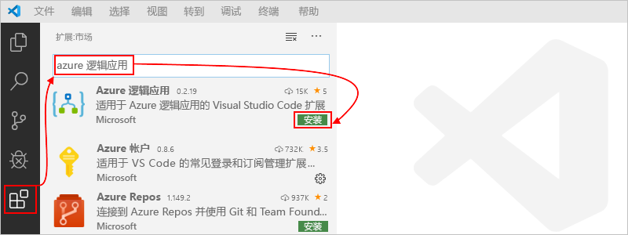

    若要检查扩展是否已正确安装，请选择在 Visual Studio Code 工具栏中显示的 Azure 图标。

    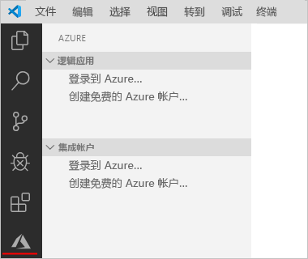

    有关详细信息，请参阅[扩展市场](https://code.visualstudio.com/docs/editor/extension-gallery)。 若要为此扩展的开源版本贡献内容，请访问 [GitHub 上适用于 Visual Studio Code 的 Azure 逻辑应用扩展](https://github.com/Microsoft/vscode-azurelogicapps)。

<a name="sign-in-azure"></a>

## <a name="sign-in-to-azure"></a>登录 Azure

1. 打开 Visual Studio Code。 在 Visual Studio Code 工具栏上，选择 Azure 图标。

   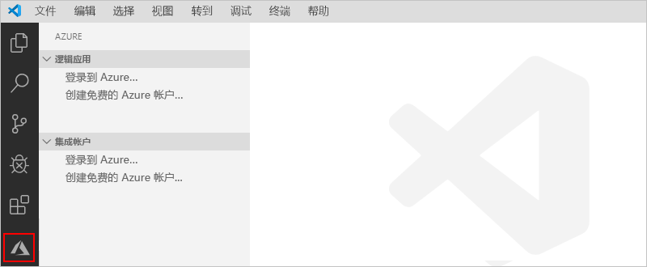

1. 在 Azure 窗口中的“逻辑应用”  下，选择“登录到 Azure”  。 当 Microsoft 登录页面出现提示时，请使用 Azure 帐户登录。

   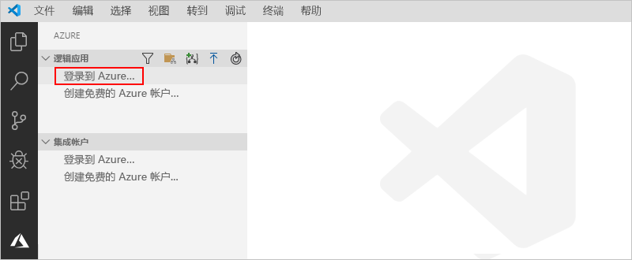

   1. 如果登录花费的时间比平时长，Visual Studio Code 会提示你通过提供设备代码由 Microsoft 身份验证网站登录。 若要改为使用代码登录，请选择“使用设备代码”  。

      

   1. 若要复制代码，请选择“复制并打开”  。

      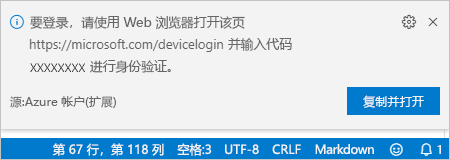

   1. 若要打开新的浏览器窗口并继续访问身份验证网站，请选择“打开链接”  。

      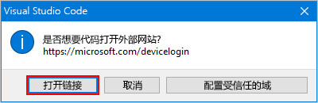

   1. 在“登录到你的帐户”页上，输入验证码，然后选择“下一步”   。

      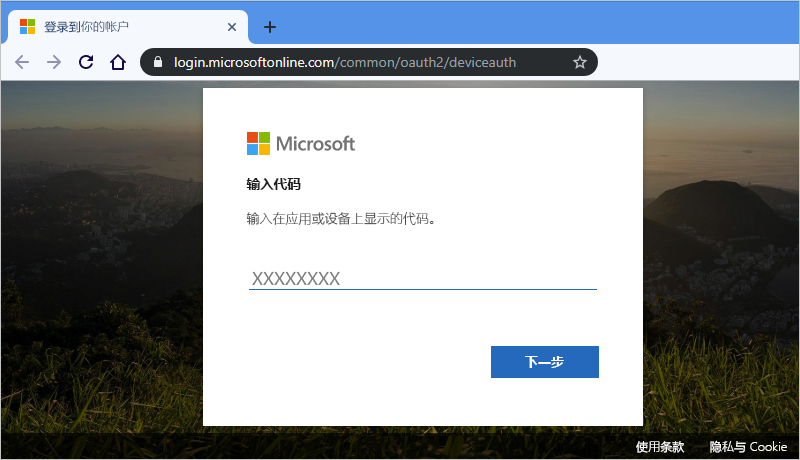

1. 选择你的 Azure 帐户。 登录后，可以关闭浏览器，然后返回到 Visual Studio Code。

   在 Azure 窗格中，“逻辑应用”和“集成帐户”部分现在显示与帐户关联的 Azure 订阅   。 但是，如果未看到所需的订阅，或者各部分显示的订阅过多，请执行以下步骤：

   1. 将指针移到“逻辑应用”标签上  。 显示工具栏后，选择“选择订阅”（筛选器图标）  。

      

   1. 从出现的列表中，选择要显示的订阅。

1. 在“逻辑应用”下，选择所需的订阅  。 订阅节点将展开并显示该订阅中存在的任何逻辑应用。

   

   > [!TIP]
   > 在“集成帐户”下，选择订阅将显示该订阅中存在的任何集成帐户  。

<a name="create-logic-app"></a>

## <a name="create-new-logic-app"></a>创建新的逻辑应用

1. 如果你尚未从 Visual Studio Code 内登录到 Azure 订阅，请按照[前面的步骤操作，以立即登录](#sign-in-azure)。

1. 在 Visual Studio 代码中的“逻辑应用”下，打开订阅的快捷菜单，并选择“创建逻辑应用”   。

   

   将出现一个列表，显示订阅中的所有 Azure 资源组。

1. 从资源组列表中，选择“创建新的资源组”或选择现有资源组  。 对于本示例，请创建新的资源组。

   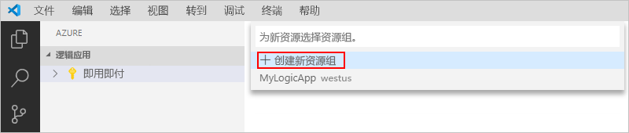

1. 提供 Azure 资源组的名称，然后按 Enter。

   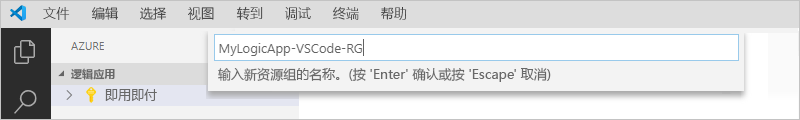

1. 选择要在其中保存逻辑应用元数据的 Azure 区域。

   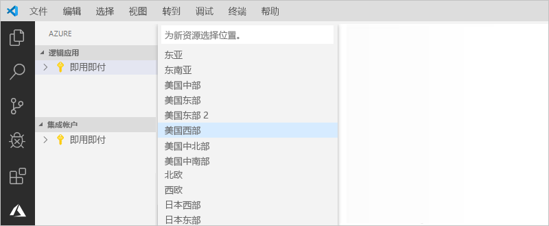

1. 提供逻辑应用的名称，然后按 Enter。

   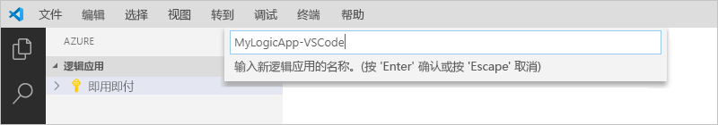

   在 Azure 窗口中，你的 Azure 订阅下将显示新的空白逻辑应用。 Visual Studio Code 还会打开一个 JSON (.logicapp.json) 文件，其中包含逻辑应用的主干工作流定义。 现在，可以开始在此 JSON 文件中手动创作逻辑应用的工作流定义。 有关工作流定义的结构和语法的技术参考，请参阅[适用于 Azure 逻辑应用的工作流定义语言架构](../logic-apps/logic-apps-workflow-definition-language.md)。

   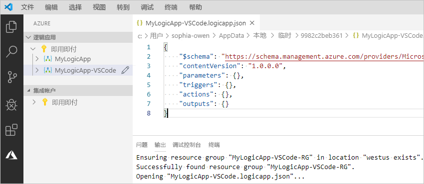

   例如，下面是一个示例逻辑应用工作流定义，该定义以 RSS 触发器和 Office 365 Outlook 操作开头。 通常情况下，JSON 元素在每个部分按字母顺序显示。 但是，此示例大致以逻辑应用的步骤在设计器中显示的顺序来显示这些元素。

   > [!IMPORTANT]
   > 若要重用此示例逻辑应用定义，需要使用 Office 365 组织帐户，例如 @fabrikam.com。 请确保将虚拟电子邮件地址替换为你自己的电子邮件地址。 若要使用其他电子邮件连接器（如 Outlook.com 或 Gmail），请将 `Send_an_email_action` 操作替换为 [Azure 逻辑应用支持的电子邮件连接器](../connectors/apis-list.md)的类似操作。

   ```json
   {
      "$schema": "https://schema.management.azure.com/providers/Microsoft.Logic/schemas/2016-06-01/workflowdefinition.json#",
      "contentVersion": "1.0.0.0",
      "parameters": {
         "$connections": {
            "defaultValue": {},
            "type": "Object"
         }
      },
      "triggers": {
         "When_a_feed_item_is_published": {
            "recurrence": {
               "frequency": "Minute",
               "interval": 1
            },
            "splitOn": "@triggerBody()?['value']",
            "type": "ApiConnection",
            "inputs": {
               "host": {
                  "connection": {
                     "name": "@parameters('$connections')['rss']['connectionId']"
                  }
               },
               "method": "get",
               "path": "/OnNewFeed",
               "queries": {
                  "feedUrl": "http://feeds.reuters.com/reuters/topNews"
               }
            }
         }
      },
      "actions": {
         "Send_an_email_(V2)": {
            "runAfter": {},
            "type": "ApiConnection",
            "inputs": {
               "body": {
                  "Body": "<p>Title: @{triggerBody()?['title']}<br>\n<br>\nDate published: @{triggerBody()?['updatedOn']}<br>\n<br>\nLink: @{triggerBody()?['primaryLink']}</p>",
                  "Subject": "RSS item: @{triggerBody()?['title']}",
                  "To": "sophia-owen@fabrikam.com"
               },
               "host": {
                  "connection": {
                     "name": "@parameters('$connections')['office365']['connectionId']"
                  }
               },
               "method": "post",
               "path": "/v2/Mail"
            }
         }
      },
      "outputs": {}
   }
   ```

1. 完成后，保存逻辑应用的工作流定义。 （“文件”菜单 >“保存”，或按 Ctrl+S）

1. 如果系统提示将逻辑应用上传到 Azure 订阅，请选择“上传”  。

   此步骤将逻辑应用发布到 [Azure 门户](https://portal.azure.com)，从而使逻辑能够在 Azure 中活动和运行。

   

## <a name="view-logic-app-in-designer"></a>在设计器中查看逻辑应用

在 Visual Studio Code 中，可以在只读设计视图中打开逻辑应用。 尽管无法在设计器中编辑逻辑应用，但可通过使用设计器视图，直观查看逻辑应用的工作流。

在 Azure 窗口中“逻辑应用”下，打开逻辑应用的快捷菜单，并选择“在设计器中打开”   。

只读设计器将在单独的窗口中打开并显示逻辑应用的工作流，例如：

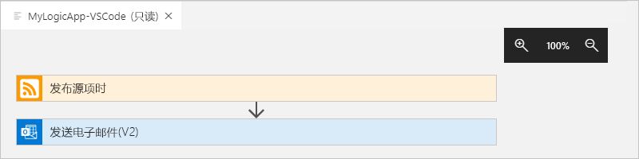

## <a name="view-in-azure-portal"></a>在 Azure 门户中查看

若要在 Azure 门户中查看逻辑应用，请执行以下步骤：

1. 使用与逻辑应用关联的 Azure 帐户和订阅登录到 [Azure 门户](https://portal.azure.com)。

1. 在 Azure 门户的搜索框中，输入逻辑应用的名称。 从结果列表中，选择逻辑应用。

   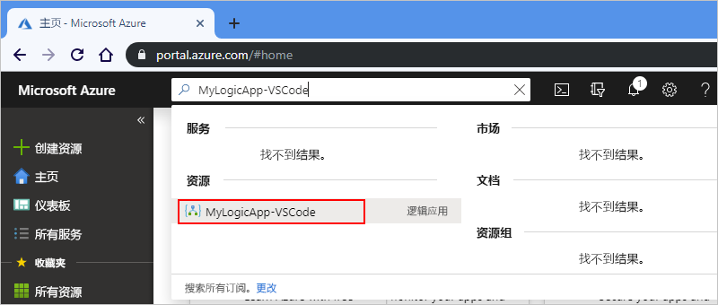

<a name="disable-enable-logic-app"></a>

## <a name="disable-or-enable-logic-app"></a>禁用或启用逻辑应用

在 Visual Studio Code 中，如果对已发布的逻辑应用进行编辑并保存更改，则将覆盖已部署的应用  。 为避免中断生产中的逻辑应用并最大程度地减少干扰，请先停用逻辑应用。 然后，在确认逻辑应用仍可正常工作后，可重新激活逻辑应用。

1. 如果你尚未从 Visual Studio Code 内登录到 Azure 订阅，请按照[前面的步骤操作，以立即登录](#sign-in-azure)。

1. 在 Azure 窗口中的“逻辑应用”下，展开 Azure 订阅，以便查看该订阅中的所有逻辑应用  。

   1. 若要禁用希望禁用的逻辑应用，请打开逻辑应用菜单，并选择“禁用”  。

      

   1. 如果已准备好重新激活逻辑应用，请打开逻辑应用菜单，并选择“启用”  。

      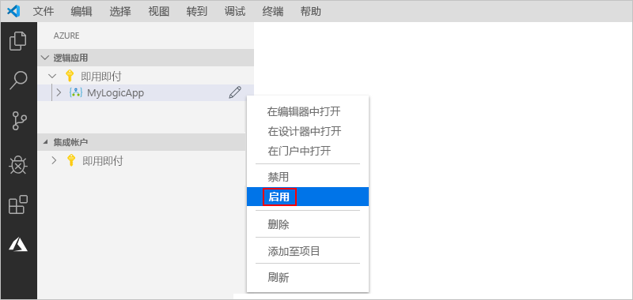

<a name="edit-logic-app"></a>

## <a name="edit-deployed-logic-app"></a>编辑已部署的逻辑应用

在 Visual Studio Code 中，可以打开和编辑 Azure 中已部署的逻辑应用的工作流定义。

> [!IMPORTANT] 
> 在编辑生产环境中正在运行的逻辑应用前，请[首先禁用逻辑应用](#disable-enable-logic-app)以避免使该逻辑应用中断的风险，并最大程度地减少干扰。

1. 如果你尚未从 Visual Studio Code 内登录到 Azure 订阅，请按照[前面的步骤操作，以立即登录](#sign-in-azure)。

1. 在 Azure 窗口中的“逻辑应用”  下，展开 Azure 订阅，然后选择想要使用的逻辑应用。

1. 打开逻辑应用菜单，并选择“在编辑器中打开”  。 或者，选择逻辑应用名称旁的编辑图标。

   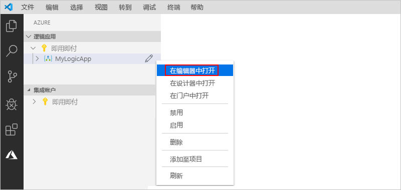

   Visual Studio Code 将在本地临时文件夹中打开 .logicapp.json 文件，以便你查看逻辑应用的工作流定义。

   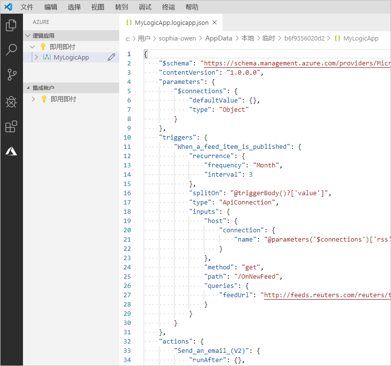

1. 在逻辑应用的工作流定义中进行更改。

1. 完成后，保存所做的更改。 （“文件”菜单 >“保存”，或按 Ctrl+S）

1. 如果系统提示上传更改并覆盖 Azure 门户中的现有逻辑应用，请选择“上传”   。

   此步骤会将更新发布到 [Azure 门户](https://portal.azure.com)中的逻辑应用。

   

## <a name="view-or-promote-other-versions"></a>查看或提升其他版本

在 Visual Studio Code 中，可以打开和查看早期版本的逻辑应用。 还可以将早期版本提升到当前版本。

> [!IMPORTANT] 
> 在更改生产环境中正在运行的逻辑应用前，请[首先禁用逻辑应用](#disable-enable-logic-app)以避免使该逻辑应用中断的风险，并最大程度地减少干扰。

1. 在 Azure 窗口中的“逻辑应用”下，展开 Azure 订阅，以便查看该订阅中的所有逻辑应用  。

1. 在订阅下，展开逻辑应用，然后展开“版本”  。

   “版本”列表显示了逻辑应用的早期版本（如果存在）  。

   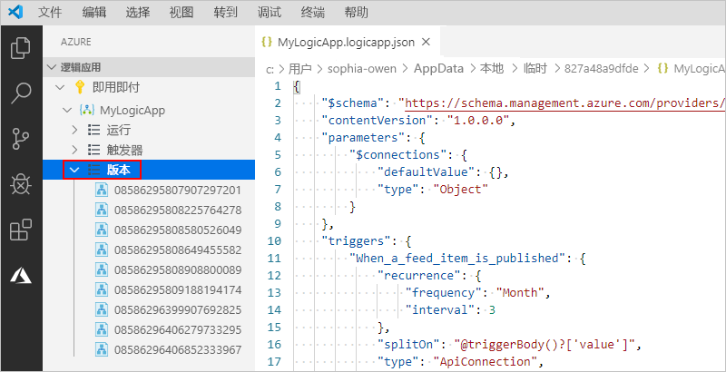

1. 若要查看早期版本，请选择以下任一步骤：

   * 若要查看 JSON 定义，请在“版本”下选择该定义的版本号  。 或者，打开该版本的快捷菜单，然后选择“在编辑器中打开”  。

     将在本地计算机上打开一个新文件，并显示该版本的 JSON 定义。

   * 若要在只读设计器视图中查看版本，请打开该版本的快捷菜单，然后选择“在设计器中打开”  。

1. 若要将早期版本提升到当前版本，请执行以下步骤：

   1. 在“版本”下，打开早期版本的快捷菜单，然后选择“提升”   。

      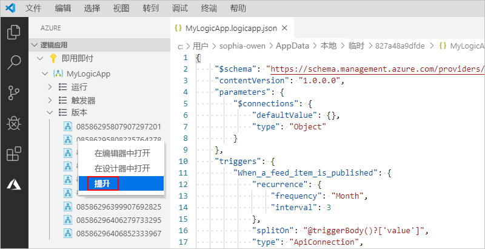

   1. 若要在 Visual Studio 代码提示进行确认后继续，请选择“是”  。

      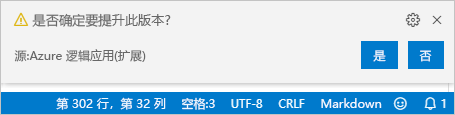

      Visual Studio Code 会将所选版本提升到当前版本，并为提升后的版本分配一个新编号。 原当前版本现在显示在提升后的版本之下。

## <a name="next-steps"></a>后续步骤

> [!div class="nextstepaction"]
> [使用 Visual Studio 创建逻辑应用](../logic-apps/quickstart-create-logic-apps-with-visual-studio.md)