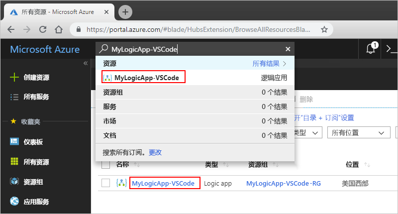

# <a name="quickstart-create-and-manage-logic-app-workflow-definitions-with-visual-studio-code"></a>快速入门：使用 Visual Studio Code 创建和管理逻辑应用工作流定义

通过 [Azure 逻辑应用](../logic-apps/logic-apps-overview.md)和 Visual Studio Code，可以创建和管理逻辑应用，以帮助你自动完成用于跨组织和企业集成应用、数据、系统和服务的任务、工作流和进程。 本快速入门介绍如何通过基于代码的体验为逻辑应用创建和编辑底层工作流定义，这些定义使用 JavaScript 对象表示法 (JSON)。 也可以使用已部署到 Azure 的现有逻辑应用。

尽管可以在 [Azure 门户](https://portal.azure.com)和 Visual Studio 中执行这些相同的任务，但是当你已熟悉逻辑应用程序定义并想要直接使用代码时，可以在 Visual Studio Code 更快地开始使用。 例如，你可以禁用、启用、删除和刷新已创建的逻辑应用。 此外，还可以从运行 Visual Studio Code 的任何开发平台（如 Linux、Windows 和 Mac）处理逻辑应用和集成帐户。

对于本文，可以创建此[快速入门](../logic-apps/quickstart-create-first-logic-app-workflow.md)提供的同一逻辑应用，重点介绍基本概念。 在 Visual Studio Code 中，逻辑应用看起来如下例所示：


在开始之前，请确保做好以下各项准备：

* 如果没有 Azure 订阅，请[注册一个免费 Azure 帐户](https://azure.microsoft.com/free/)。

* 有关[逻辑应用工作流定义](../logic-apps/logic-apps-workflow-definition-language.md)及其使用 JSON 描述的结构的基本知识

  如果不熟悉逻辑应用，请尝试此[快速入门](../logic-apps/quickstart-create-first-logic-app-workflow.md)，了解如何在 Azure 门户中创建第一个逻辑应用，重点了解基本概念。

* 用于登录到 Azure 和 Azure 订阅的 Web 的访问权限

* 下载并安装以下工具（如果没有）：

  * [Visual Studio Code 版本 1.25.1 或更高版本](https://code.visualstudio.com/)，免费提供

  * 适用于 Azure 逻辑应用的 Visual Studio Code 扩展

    可以从 [Visual Studio Marketplace](https://marketplace.visualstudio.com/items?itemName=ms-azuretools.vscode-logicapps) 或直接从 Visual Studio Code 内部下载并安装此扩展。 请确保在安装后重新加载 Visual Studio Code。

    

    若要检查扩展是否已正确安装，请选择在 Visual Studio Code 工具栏中显示的 Azure 图标。

    

    有关详细信息，请参阅[扩展市场](https://code.visualstudio.com/docs/editor/extension-gallery)。 若要为此扩展的开源版本贡献内容，请访问 [GitHub 上适用于 Visual Studio Code 的 Azure 逻辑应用扩展](https://github.com/Microsoft/vscode-azurelogicapps)。

<a name="sign-in-azure"></a>

## <a name="sign-in-to-azure"></a>登录 Azure

1. 打开 Visual Studio Code。 在 Visual Studio Code 工具栏上，选择 Azure 图标。

   

1. 在 Azure 窗口中的“逻辑应用”  下，选择“登录到 Azure”  。

   

   系统将提示你使用提供的身份验证代码登录。

1. 复制身份验证代码，然后选择“复制并打开”  ，这将打开新的浏览器窗口。

   

1. 输入你的身份验证代码。 出现提示时，选择“继续”  。

   

1. 选择你的 Azure 帐户。 登录后，可以关闭浏览器，然后返回到 Visual Studio Code。

   在 Azure 的窗口中，逻辑应用窗格和集成帐户窗格现在在帐户中显示 Azure 订阅。

   

   如果没有看到预期的订阅，在“逻辑应用”  标签旁，选择“选择订阅”  （筛选器图标）。 找到并选择想要使用的订阅。

1. 若要在 Azure 订阅中查看任何现有逻辑应用或集成帐户，请展开你的订阅。

   

<a name="create-logic-app"></a>

## <a name="create-logic-app"></a>创建逻辑应用

1. 如果你尚未从 Visual Studio Code 内登录到你的 Azure 订阅，请按照本文中的步骤操作，以[立即登录](#sign-in-azure)。

1. 在订阅的上下文菜单中，选择“创建”  。

   

1. 从订阅中显示的 Azure 资源组列表中，选择现有资源组或“创建新资源组”  。

   此示例将创建新的资源组。

   

1. 为你的 Azure 资源组提供一个名称，然后按 ENTER。

   

1. 选择保存逻辑应用的元数据的数据中心位置。

   

1. 提供逻辑应用的名称，然后按 ENTER。

   

   新逻辑应用现在显示在 Azure 订阅下的 Azure 窗口中。 现在可以开始创建逻辑应用的工作流定义。

1. 在逻辑应用的快捷菜单中，选择“在编辑器中打开”  。

   

   Visual Studio Code 将打开一个逻辑应用工作流定义模板（.logicapp.json 文件），以便你能够开始创建逻辑应用的工作流。

   

1. 在逻辑应用工作流定义模板文件中，开始生成逻辑应用的工作流定义。
有关技术参考，请参阅[适用于 Azure 逻辑应用的工作流定义语言架构](../logic-apps/logic-apps-workflow-definition-language.md)。

   以下是逻辑定义示例。 通常情况下，JSON 元素在每个部分按字母顺序显示。 但是，此示例大致以逻辑应用的步骤在设计器中显示的顺序来显示这些元素。

   ```json
   {
      "$schema": "https://schema.management.azure.com/providers/Microsoft.Logic/schemas/2016-06-01/workflowdefinition.json#",
      "contentVersion": "1.0.0.0",
      "parameters": {
         "$connections": {
            "defaultValue": {},
            "type": "Object"
         }
      },
      "triggers": {
         "When_a_feed_item_is_published": {
            "recurrence": {
               "frequency": "Minute",
               "interval": 1
            },
            "splitOn": "@triggerBody()?['value']",
            "type": "ApiConnection",
            "inputs": {
               "host": {
                  "connection": {
                     "name": "@parameters('$connections')['rss']['connectionId']"
                  }
               },
               "method": "get",
               "path": "/OnNewFeed",
               "queries": {
                  "feedUrl": "http://feeds.reuters.com/reuters/topNews"
               }
            }
         }
      },
      "actions": {
         "Send_an_email": {
            "runAfter": {},
            "type": "ApiConnection",
            "inputs": {
               "body": {
                  "Body": "Title: @{triggerBody()?['title']}\n\nDate published: @{triggerBody()?['publishDate']}\n\nLink: @{triggerBody()?['primaryLink']}",
                  "Subject": "New RSS item: @{triggerBody()?['title']}",
                  "To": "Sophie.Owen@contoso.com"
               },
               "host": {
                  "connection": {
                     "name": "@parameters('$connections')['outlook']['connectionId']"
                  }
               },
               "method": "post",
               "path": "/Mail"
            }
         }
      },
      "outputs": {}
   }
   ```

1. 完成后，保存逻辑应用定义文件。 当 Visual Studio Code 提示你确认将逻辑应用定义上传到你的 Azure 订阅时，选择“上传”  。

   

   在 Visual Studio Code 将逻辑应用发布到 Azure 后，可以在 Azure 门户中找到正在使用和正在运行的应用。

   

<a name="edit-logic-app"></a>

## <a name="edit-logic-app"></a>编辑逻辑应用

若要使用在 Azure 中发布的逻辑应用，可以通过 Visual Studio Code 打开该逻辑应用的定义。

1. 如果你尚未从 Visual Studio Code 内登录到你的 Azure 订阅，请按照本文中的步骤操作，以[立即登录](#sign-in-azure)。

1. 在 Azure 窗口中的“逻辑应用”  下，展开 Azure 订阅，然后选择想要使用的逻辑应用。

1. 在逻辑应用的菜单中，选择“在编辑器中打开”  。 或者，选择逻辑应用名称旁的编辑图标。

   

   Visual Studio Code 为逻辑应用的工作流定义打开 .logicapp.json 文件。

   

1. 更改逻辑应用的定义。

1. 完成后，保存所做的更改。

1. 当 Visual Studio Code 提示你在 Azure 订阅中更新逻辑应用定义时，选择“上传”  。

   

## <a name="next-steps"></a>后续步骤

> [!div class="nextstepaction"]
> * [使用 Visual Studio 创建逻辑应用](../logic-apps/quickstart-create-logic-apps-with-visual-studio.md)