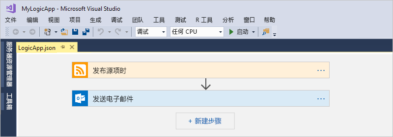
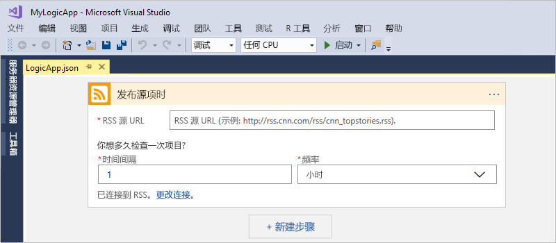
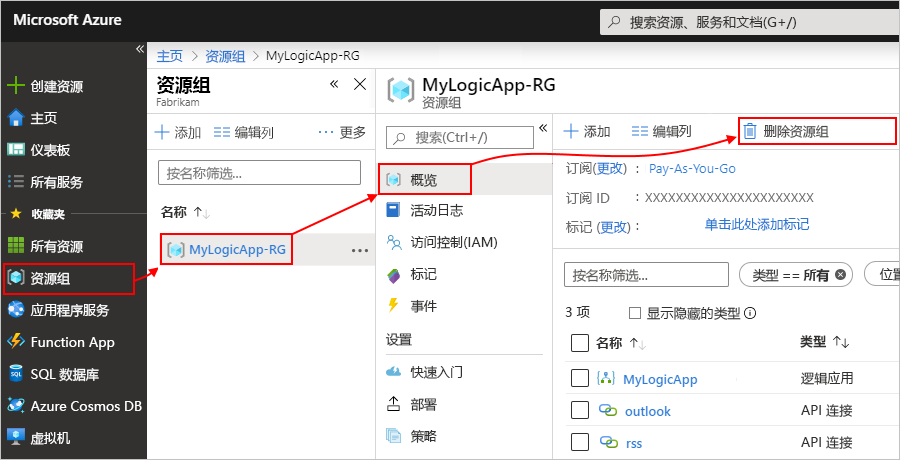

# 快速入门：使用 Azure 逻辑应用自动完成任务和流程 - Visual Studio

可以通过 [Azure 逻辑应用](../logic-apps/logic-apps-overview.md)创建工作流，以便自动完成用于跨企业和组织集成应用、数据、系统和服务的任务和流程。 本快速入门介绍如何在 Visual Studio 中创建逻辑应用并将这些应用部署到云中的 <a href="https://docs.microsoft.com/azure/guides/developer/azure-developer-guide" target="_blank">Azure</a>，以便设计并生成这些工作流。 尽管可以在 <a href="https://portal.azure.com" target="_blank">Azure 门户</a>中执行这些任务，但在需要将逻辑应用添加到源代码管理、发布不同的版本，以及为不同的部署环境创建 Azure 资源管理器模板时，也可以使用 Visual Studio。 

如果不熟悉 Azure 逻辑应用，只希望了解基本概念，则可尝试[关于如何在 Azure 门户中创建逻辑应用的快速入门](../logic-apps/quickstart-create-first-logic-app-workflow.md)。 逻辑应用设计器在 Azure 门户和 Visual Studio 中用起来类似。 

在这里，你创建的逻辑应用与在 Azure 门户快速入门中创建的相同，但使用的是 Visual Studio。 此逻辑应用监视网站的 RSS 源，只要站点上发布了新项目，就会发送电子邮件。 完成后，逻辑应用看起来与下述概略性的工作流类似：

在开始之前，请确保做好以下各项准备：

* 如果没有 Azure 订阅，请<a href="https://azure.microsoft.com/free/" target="_blank">注册一个免费 Azure 帐户</a>。

* 下载并安装以下工具（如果没有）： 

  * <a href="https://www.visualstudio.com/downloads" target="_blank">Visual Studio 2017 或 Visual Studio 2015 - Community Edition 或更高版本</a>。 
  本快速入门使用免费的 Visual Studio Community 2017。

  * <a href="https://azure.microsoft.com/downloads/" target="_blank">Azure SDK（2.9.1 或更高版本）</a>和 <a href="https://github.com/Azure/azure-powershell#installation" target="_blank">Azure PowerShell</a>

  * <a href="https://marketplace.visualstudio.com/items?itemName=VinaySinghMSFT.AzureLogicAppsToolsforVisualStudio-18551" target="_blank">适用于 Visual Studio 2017 的 Azure 逻辑应用工具</a>或 <a href="https://marketplace.visualstudio.com/items?itemName=VinaySinghMSFT.AzureLogicAppsToolsforVisualStudio" target="_blank">Visual Studio 2015 版</a>
  
    可以直接从 Visual Studio Marketplace 下载并安装 Azure 逻辑应用工具，或了解<a href="https://docs.microsoft.com/visualstudio/ide/finding-and-using-visual-studio-extensions" target="_blank">如何从 Visual Studio 内部安装此扩展</a>。 
    完成安装后，请务必重启 Visual Studio。

* 逻辑应用支持的（例如 Office 365 Outlook、Outlook.com 或 Gmail）电子邮件帐户。 至于其他提供商，请<a href="https://docs.microsoft.com/connectors/" target="_blank">查看此处的连接器列表</a>。 此逻辑应用使用 Office 365 Outlook。 如果使用其他提供商，整个步骤仍然是相同的，但 UI 可能稍有不同。

* 使用嵌入式逻辑应用设计器时访问 Web

  设计器需要通过 Internet 连接在 Azure 中创建资源，以及从逻辑应用中的连接器读取属性和数据。 
  例如，如果使用 Dynamics CRM Online 连接器，则设计器在 CRM 实例中检查可用的默认属性和自定义属性。

## 创建 Azure 资源组项目

若要开始，请创建 [Azure 资源组项目](../azure-resource-manager/vs-azure-tools-resource-groups-deployment-projects-create-deploy.md)。 详细了解 [Azure 资源组和资源](../azure-resource-manager/resource-group-overview.md)。

1. 启动 Visual Studio，然后使用 Azure 帐户登录。

2. 在“文件”菜单中，选择“新建” > “项目”。 （键盘：Ctrl+Shift+N）

   

3. 在“已安装”下，选择“Visual C#”或“Visual Basic”。 选择“云” > “Azure 资源组”。 为项目命名，例如：

   

4. 选择“逻辑应用”模板。 

   

   在 Visual Studio 创建项目后，解决方案资源管理器会打开并显示你的解决方案。 

   

   在解决方案中，**LogicApp.json** 文件不仅可以存储逻辑应用的定义，还可以充当为部署而设置的 Azure 资源管理器模板。

## 创建空白逻辑应用

在创建 Azure 资源组项目以后，请从**空白逻辑应用**模板开始创建并生成逻辑应用。

1. 在解决方案资源管理器中，打开适用于 **LogicApp.json** 文件的快捷菜单。 选择“使用逻辑应用设计器打开”。 （键盘：Ctrl+L）

   

2. 对于“订阅”，请选择要使用的 Azure 订阅。 对于“资源组”，请选择“新建...”，以便创建新的 Azure 资源组。 

   

   Visual Studio 需要你提供 Azure 订阅和资源组才能创建和部署与逻辑应用和连接相关联的资源。 

   | 设置 | 示例值 | 说明 | 
   | ------- | ------------- | ----------- | 
   | 用户配置文件列表 | Contoso   jamalhartnett@contoso.com | 默认为曾经用来登录的帐户 | 
   | **订阅** | 即用即付   (jamalhartnett@contoso.com) | Azure 订阅的名称以及关联的帐户 |
   | **资源组** | MyLogicApp-RG   （美国西部） | Azure 资源组和位置，用于为逻辑应用存储和部署资源 | 
   | **位置** | MyLogicApp-RG2   （美国西部） | 在不希望使用资源组位置的情况下可以使用的其他位置 |
   ||||

3. 逻辑应用设计器打开并显示一个包含简介视频和常用触发器的页面。 滚动浏览视频和触发器。 在“模板”下选择“空白逻辑应用”。

   

## 生成逻辑应用工作流

接下来请添加一个[触发器](../logic-apps/logic-apps-overview.md#logic-app-concepts)，该触发器在出现新的 RSS 源项时触发。 每个逻辑应用都必须从触发器开始，该触发器在特定条件得到满足的情况下触发。 每当触发器触发时，逻辑应用引擎就会创建一个逻辑应用实例来运行工作流。

1. 在逻辑应用设计器的搜索框中输入“rss”。 选择触发器“RSS - 发布源项时”

   

   触发器现在显示在设计器中：

   

2. 若要完成逻辑应用的生成，请执行 [Azure 门户快速入门](../logic-apps/quickstart-create-first-logic-app-workflow.md#add-rss-trigger)中的工作流步骤，然后回到本文。

   完成后，逻辑应用如以下示例所示： 

   

3. 若要保存逻辑应用，请保存 Visual Studio 解决方案。 （键盘：Ctrl + S）

现在，请在测试逻辑应用之前将应用部署到 Azure。

## 将逻辑应用部署到 Azure

在运行逻辑应用之前，请将该应用从 Visual Studio 部署到 Azure，只需执行数个步骤即可。

1. 在解决方案资源管理器的项目快捷菜单中，选择“部署” > “新建...”。如果出现系统提示，请使用 Azure 帐户登录。

   

2. 就此部署来说，请保留 Azure 订阅、资源组和其他默认设置。 准备就绪后，选择“部署”。 

   

3. 如果显示“编辑参数”框，请提供供逻辑应用在部署时使用的资源名称，然后保存设置，例如：

   

   部署开始时，应用的部署状态显示在 Visual Studio 的“输出”窗口中。 
   如果状态不显示，请打开“显示输出来源”列表，然后选择 Azure 资源组。

   

   部署完成后，逻辑应用就会出现在 Azure 门户中，并会根据指定的计划（每隔一分钟）检查 RSS 源。 
   如果 RSS 源有新项，逻辑应用会为每个新项发送一封电子邮件。 
   否则，逻辑应用会等到下一个间隔过后才进行检查。 

   例如，下面是此逻辑应用发送的一封示例电子邮件。 
   如果没有收到任何电子邮件，请检查垃圾邮件文件夹。 

   

   从技术上讲，当触发器检查 RSS 源并找到新项时，触发器将会激发，并且逻辑应用引擎会创建一个逻辑应用工作流实例，用于运行工作流中的操作。
   如果触发器未找到新项，则触发器不会激发，而是“跳过”实例化工作流的操作。

祝贺！你现已使用 Visual Studio 成功生成并部署逻辑应用。 若要管理逻辑应用并查看其运行历史记录，请参阅[使用 Visual Studio 管理逻辑应用](../logic-apps/manage-logic-apps-with-visual-studio.md)。

## 清理资源

不再需要包含逻辑应用和相关资源的资源组时，可将其删除。

1. 使用创建逻辑应用时所使用的帐户登录到 <a href="https://portal.azure.com" target="_blank">Azure 门户</a>。 

2. 在 Azure 主菜单上选择“资源组”。 选择逻辑应用的资源组。

3. 选择“删除资源组”。 输入资源组名称作为确认，然后选择“删除”。

   

4. 从本地计算机删除 Visual Studio 解决方案。

## 获取支持

* 有关问题，请访问 <a href="https://social.msdn.microsoft.com/Forums/en-US/home?forum=azurelogicapps" target="_blank">Azure 逻辑应用论坛</a>。
* 若要提交功能建议或对功能建议进行投票，请访问<a href="http://aka.ms/logicapps-wish" target="_blank">逻辑应用用户反馈网站</a>。

## 后续步骤

本文介绍了如何使用 Visual Studio 生成、部署和运行逻辑应用。 若要详细了解如何使用 Visual Studio 管理和执行逻辑应用的高级部署，请参阅以下文章：

> [!div class="nextstepaction"]
> [使用 Visual Studio 管理逻辑应用](../logic-apps/manage-logic-apps-with-visual-studio.md)