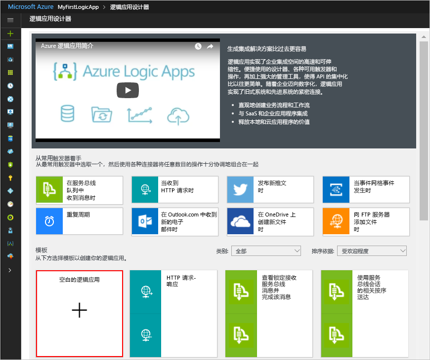

# <a name="check-traffic-with-a-scheduler-based-logic-app"></a>使用基于计划程序的逻辑应用检查流量

可以通过 Azure 逻辑应用自动完成按计划运行的工作流。 本教程介绍如何通过计划程序触发器生成[逻辑应用](../logic-apps/logic-apps-overview.md)。该触发器每个工作日早晨运行，用于检查两个地点之间的行程时间，包括交通情况。 如果该时间超过特定的限制，逻辑应用会发送一封电子邮件，其中包括到达目的地所需的行程时间和额外时间。

本教程介绍如何执行下列操作：

> [!div class="checklist"]
> * 创建空白逻辑应用。 
> * 添加一个触发器，充当逻辑应用的计划程序。
> * 添加一项操作，用于获取路线的行程时间。
> * 添加一项操作，用于创建变量、将行程时间从秒转换为分钟，以及将结果保存在变量中。
> * 添加一个条件，将行程时间与指定的限制进行比较。
> * 添加一项操作，在行程时间超过限制的情况下发送电子邮件。

完成后，逻辑应用看起来大致与以下工作流类似：


如果还没有 Azure 订阅，可以在开始前<a href="https://azure.microsoft.com/free/" target="_blank">注册一个免费 Azure 帐户</a>。

## <a name="prerequisites"></a>先决条件

* 逻辑应用支持的电子邮件提供商（例如 Office 365 Outlook、Outlook.com 或 Gmail）提供的电子邮件帐户。 至于其他提供商，请[查看此处的连接器列表](https://docs.microsoft.com/connectors/)。 本快速入门使用 Outlook.com 帐户。 如果使用其他电子邮件帐户，则常规步骤保持不变，但 UI 显示可能稍有不同。

* 若要获取路线的行程时间，需要必应地图 API 的访问密钥。 若要获取此密钥，请执行<a href="https://msdn.microsoft.com/library/ff428642.aspx" target="_blank">如何获取必应地图密钥</a>中的步骤。 

## <a name="sign-in-to-the-azure-portal"></a>登录到 Azure 门户

使用 Azure 帐户凭据登录到 <a href="https://portal.azure.com" target="_blank">Azure 门户</a>。

## <a name="create-your-logic-app"></a>创建逻辑应用

1. 从主 Azure 菜单中选择“新建” > “企业集成” > “逻辑应用”。

   

2. 在“创建逻辑应用”下，提供有关逻辑应用的信息，如下所示。 完成后，请选择“固定到仪表板” > “创建”。

   

   | 设置 | 值 | 说明 | 
   | ------- | ----- | ----------- | 
   | **Name** | LA-TravelTime | 逻辑应用的名称 | 
   | **订阅** | <*your-Azure-subscription-name*> | Azure 订阅的名称 | 
   | **资源组** | LA-TravelTime-RG | 用于组织相关资源的 [Azure 资源组](../azure-resource-manager/resource-group-overview.md)的名称 | 
   | **位置** | 美国东部 2 | 用于存储逻辑应用信息的区域 | 
   | **Log Analytics** | 关闭 | 对于诊断日志记录，请保留“关闭”设置。 | 
   |||| 

3. 在 Azure 部署应用以后，逻辑应用设计器会打开并显示一个页面，其中包含简介视频以及针对常用逻辑应用模式的模板。 在“模板”下选择“空白逻辑应用”。

   

接下来，请添加定期[触发器](../logic-apps/logic-apps-overview.md#logic-app-concepts)，根据指定的计划进行触发。 每个逻辑应用都必须从触发器开始，在发生特定事件或新数据符合特定条件的情况下触发。 有关详细信息，请参阅[创建第一个逻辑应用](../logic-apps/quickstart-create-first-logic-app-workflow.md)。

## <a name="add-scheduler-trigger"></a>添加计划程序触发器

1. 在设计器的搜索框中输入“定期”。 选择此触发器：**日程安排 - 定期**

   

2. 在“定期”形状中选择**省略号** (**...**) 按钮，然后选择“重命名”。 重命名触发器并提供以下说明：```Check travel time every weekday morning```

   

3. 在触发器中选择“显示高级选项”。

4. 提供触发器的计划和定期触发详细信息，如下所示：

   

   | 设置 | 值 | 说明 | 
   | ------- | ----- | ----------- | 
   | **间隔** | 1 | 在两次检查之间需等待的时间间隔数 | 
   | **频率** | 周次 | 用于定期触发的时间单位 | 
   | **时区** | 无 | 仅在指定开始时间的情况下适用。 用于指定非本地时区。 | 
   | **开始时间** | 无 | 将定期触发延迟到指定的日期和时间。 有关详细信息，请参阅[计划定期运行的任务和工作流](../connectors/connectors-native-recurrence.md)。 | 
   | **在这些日期** | 星期一、星期二、星期三、星期四、星期五 | 仅当“频率”设置为“周”时可用 | 
   | **在这些小时** | 7,8,9 | 仅当“频率”设置为“周”或“天”时可用。 选择一天中的某些小时，用于运行此定期触发。 此示例在 7、8、9 点运行。 | 
   | **在这些分钟** | 0,15,30,45 | 仅当“频率”设置为“周”或“天”时可用。 选择一天中的某些分钟，用于运行此定期触发。 此示例从零点开始，每隔 15 分钟运行一次。 | 
   ||||

   此触发器在每个工作日每隔 15 分钟触发一次，开始时间为早晨 7:00，结束时间为早晨 9:45。 
   “预览”框显示定期触发计划。 
   有关详细信息，请参阅[计划任务和工作流](../connectors/connectors-native-recurrence.md)以及[工作流操作和触发器](../logic-apps/logic-apps-workflow-actions-triggers.md#recurrence-trigger)。

5. 若要立即隐藏触发器的详细信息，请单击形状的标题栏。

   

6. 保存逻辑应用。 在设计器工具栏上，选择“保存”。 

逻辑应用现已生成，但除了定期触发，不能执行任何操作。 因此，请添加一项在触发器触发时进行响应的操作。

## <a name="get-the-travel-time-for-a-route"></a>获取路线的行程时间

有了触发器以后，即可添加[操作](../logic-apps/logic-apps-overview.md#logic-app-concepts)，用于获取两个地点之间的行程时间。 逻辑应用提供适用于必应地图 API 的连接器，可以方便地获取该信息。 在开始此任务之前，请确保有必应地图 API 密钥，如本教程的先决条件部分所述。

1. 在逻辑应用设计器的触发器下，选择“+ 新建步骤” > “添加操作”。

2. 搜索“地图”，然后选择以下操作：**必应地图 - 获取路线**

3. 如果没有必应地图连接，系统会提示创建一个连接。 提供以下连接详细信息，然后选择“创建”。

   

   | 设置 | 值 | 说明 |
   | ------- | ----- | ----------- |
   | **连接名称** | BingMapsConnection | 提供连接的名称。 | 
   | **API 密钥** | <*your-Bing-Maps-key*> | 输入以前接收的必应地图密钥。 如果没有必应地图密钥，请了解<a href="https://msdn.microsoft.com/library/ff428642.aspx" target="_blank">如何获取密钥</a>。 | 
   | | | |  

4. 重命名操作并提供以下说明：```Get route and travel time with traffic```

5. 提供“获取路线”操作的详细信息，如以下示例所示：

    

   | 设置 | 值 | 说明 |
   | ------- | ----- | ----------- |
   | **路标 1** | <*start-location*> | 路线起点 | 
   | **路标 2** | <*end-location*> | 路由终点 | 
   | **避免** | 无 | 路线上需要避免的任何项目，例如高速公路、收费站等 | 
   | **优化** | timeWithTraffic | 一个参数，用于优化路线，例如距离、当前交通状况下的行程时间，等等。 选择“timeWithTraffic”参数 | 
   | **距离单位** | <*your-preference*> | 路线的距离单位。 本文使用的单位为“英里”  | 
   | **旅行模式** | 驾车 | 路线的旅行模式。 选择“驾车”模式 | 
   | **运输日期/时间** | 无 | 仅适用于运输模式 | 
   | **日期时间类型** | 无 | 仅适用于运输模式 | 
   |||| 

   有关这些参数的详细信息，请参阅 [Calculate a route](https://msdn.microsoft.com/library/ff701717.aspx)（计算路线）。

6. 保存逻辑应用。

接下来创建一个变量，以便将当前的行程时间转换为分钟而非秒，然后将其存储。 这样即可避免重复转换，可以在后面的步骤中更方便地使用该值。 

## <a name="create-variable-to-store-travel-time"></a>创建用于存储行程时间的变量

有时候，可能需要对工作流中的数据执行操作，再在以后的操作中使用相关结果。 若要保存这些结果，方便以后重复使用或引用，可以创建变量来存储这些经处理的结果。 只能在逻辑应用的顶层创建变量。

默认情况下，以前的“获取路线”操作通过“旅行期间交通”字段返回特定交通状况下的当前行程时间（以秒为单位）。 将该值改为转换为分钟并进行存储以后，该值在以后就会更易于重复使用，不需再次转换。

1. 在“获取路线”操作下，选择“+ 新建步骤” > “添加操作”。

2. 搜索“变量”，然后选择此操作：**变量 - 初始化变量**

   

3. 重命名此操作并提供以下说明：```Create variable to store travel time```

4. 提供变量的详细信息，如下所述：

   | 设置 | 值 | 说明 | 
   | ------- | ----- | ----------- | 
   | **Name** | travelTime | 变量的名称 | 
   | **类型** | Integer | 变量的数据类型 | 
   | **值** | 一个表达式，可将当前的行程时间从秒转换为分钟（参见此表下面的步骤）。 | 变量的初始值 | 
   |||| 

   1. 若要创建“值”字段的表达式，请单击该字段，使动态内容列表显示。 
   必要时可扩大浏览器，直至列表显示。 
   在动态内容列表中，选择“表达式”。 

      

      在某些编辑框中单击时，会显示动态内容列表或内联参数列表。 此列表显示以前的操作中任何可以在工作流中用作输入的参数。 
      动态内容列表有一个表达式编辑器，可以在其中选择用于执行操作的函数。 
      此表达式编辑器仅显示在动态内容列表中。

      浏览器宽度决定了哪个列表显示。 
      如果浏览器宽，则会显示动态内容列表。 
      如果浏览器窄，则会在当前聚焦的编辑框下显示一个内联形式的参数列表。

   2. 在表达式编辑器中，输入此表达式：```div(,60)```

      

   3. 将光标置于表达式中左括号 (**(**) 和逗号 (**,**) 之间。 
   选择“动态内容”。

      

   4. 在动态内容列表中，选择“旅行期间交通”。

      

   5. 此字段在表达式中解析以后，选择“确定”。

      

      “值”字段现在如下所示：

      

5. 保存逻辑应用。

接下来添加一个条件，检查当前的行程时间是否长于特定的限制。

## <a name="compare-travel-time-with-limit"></a>将行程时间与限制进行比较

1. 在上一操作下，选择“+ 新建步骤” > “添加条件”。 

2. 重命名条件并提供以下说明：```If travel time exceeds limit```

3. 生成一个条件，用于检查 **travelTime** 是否超过指定的限制，如下所示：

   1. 在条件中单击“选择一个值”框，该框位于左侧（宽浏览器视图）或顶部（窄浏览器视图）。

   2. 在动态内容列表或参数列表的“变量”下，选择“travelTime”字段。

   3. 在比较框中选择此运算符：**大于**

   4. 在右侧（宽视图）或底部（窄视图）的“选择一个值”框中，输入此限制：```15```

   例如，如果使用窄视图，则可按以下方法生成此条件：

   

4. 保存逻辑应用。

接下来，添加在行程时间超出限制时需执行的操作。

## <a name="send-email-when-limit-exceeded"></a>在超出限制时发送电子邮件

现在，请添加一项操作，该操作在行程时间超出限制时向你发送电子邮件。 该电子邮件包括当前的行程时间以及行完指定的路线所需的额外时间。 

1. 在条件的 **If true** 分支中，选择“添加操作”。

2. 搜索“发送电子邮件”，选择要使用的电子邮件连接器和“发送电子邮件”操作。

   

   * 对于个人 Microsoft 帐户，请选择“Outlook.com”。 
   * 对于 Azure 工作或学校帐户，请选择“Office 365 Outlook”。

3. 如果还没有连接，系统会要求你登录到电子邮件帐户。

   逻辑应用创建到电子邮件帐户的连接。

4. 重命名操作并提供以下说明：```Send email with travel time```

5. 在“收件人”框中，输入收件人的电子邮件地址。 出于测试目的，请使用你的电子邮件地址。

6. 在“主题”框中指定电子邮件的主题，并包括 **travelTime** 变量。

   1. 输入带尾随空格的文本 ```Current travel time (minutes): ```。 
   
   2. 在参数列表或动态内容列表的“变量”下，选择“travelTime”。 
   
      例如，如果浏览器处于窄视图状态：

      

7. 在“正文”框中，指定电子邮件正文的内容。 

   1. 输入带尾随空格的文本 ```Add extra travel time (minutes): ```。 
   
   2. 必要时可扩大浏览器，直至动态内容列表显示。 
   在动态内容列表中，选择“表达式”。

      

   3. 在表达式编辑器中输入以下表达式，以便计算超出限制的分钟数：```sub(,15)```

      

   4. 将光标置于表达式中左括号 (**(**) 和逗号 (**,**) 之间。 选择“动态内容”。

      

   5. 在“变量”下选择“travelTime”。

      

   6. 此字段在表达式中解析以后，选择“确定”。

      

      “正文”字段现在如下所示：

      

8. 保存逻辑应用。

接下来测试逻辑应用，该应用现在看起来类似于以下示例：


## <a name="run-your-logic-app"></a>运行逻辑应用

若要手动启动逻辑应用，可在设计器工具栏中选择“运行”。 如果当前的行程时间始终没有超出限制，则逻辑应用不会执行任何其他操作，只是等待下一个时间间隔，然后重新进行检查。
但如果当前的行程时间超出限制，则会收到一封电子邮件，其中包含当前的行程时间以及超出限制的分钟数。 下面是逻辑应用发送的一封示例电子邮件：


如果没有收到任何电子邮件，请检查电子邮件的垃圾邮件文件夹。 垃圾电子邮件筛选器可能会将这些类型的邮件重定向。 否则，如果不确定逻辑应用是否正常运行，请参阅[逻辑应用故障排除](../logic-apps/logic-apps-diagnosing-failures.md)。

祝贺！你现已创建并运行基于计划的重复逻辑应用。 

若要创建其他使用“计划 - 定期”触发器的逻辑应用，请检查以下模板，这些模板在创建逻辑应用之后即可使用：

* 获取发送给你的每日提醒。
* 删除较旧的 Azure Blob。
* 将消息添加到 Azure 存储队列中。

## <a name="clean-up-resources"></a>清理资源

不再需要包含逻辑应用和相关资源的资源组时，可将其删除。 在 Azure 主菜单中转到“资源组”，然后选择逻辑应用的资源组。 选择“删除资源组”。 输入资源组名称作为确认，然后选择“删除”。


## <a name="get-support"></a>获取支持

* 有关问题，请访问 [Azure 逻辑应用论坛](https://social.msdn.microsoft.com/Forums/en-US/home?forum=azurelogicapps)。
* 若要提交功能建议或对功能建议进行投票，请访问[逻辑应用用户反馈网站](http://aka.ms/logicapps-wish)。

## <a name="next-steps"></a>后续步骤

本教程介绍了如何创建一个逻辑应用，以便根据指定的计划（在工作日早晨）检查交通状况，并在行程时间超出指定限制时采取行动（发送电子邮件）。 现在，需了解如何通过集成 Azure 服务、Microsoft 服务和其他 SaaS 应用来生成一个逻辑应用，以便发送供审核的邮件列表请求。

> [!div class="nextstepaction"]
> [管理邮件列表请求](../logic-apps/tutorial-process-mailing-list-subscriptions-workflow.md)
