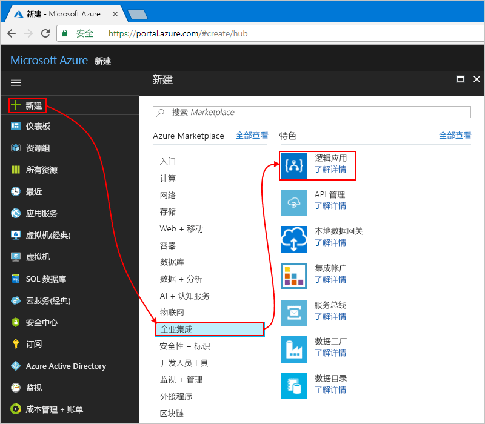

# <a name="manage-mailing-list-requests-with-a-logic-app"></a>使用逻辑应用管理邮件列表请求

Azure 逻辑应用有助于跨 Azure 服务、Microsoft 服务、其他软件即服务 (SaaS) 应用以及本地系统自动完成工作流和集成数据。 本教程介绍如何生成[逻辑应用](../logic-apps/logic-apps-overview.md)，以便处理针对 [MailChimp](https://mailchimp.com/) 服务托管的邮件列表的订阅请求。
此逻辑应用会监视电子邮件帐户中是否存在这些请求，发送这些请求进行审批，并向邮件列表添加批准的成员。

本教程介绍如何执行下列操作：

> [!div class="checklist"]
> * 创建空白逻辑应用。
> * 添加一个触发器，用于监视电子邮件中的订阅请求。
> * 添加一项操作，用于发送批准或拒绝这些请求的电子邮件。
> * 添加一项操作，用于检查审批响应。
> * 添加一项操作，用于向邮件列表添加批准的成员。
> * 添加一个条件，用于检查这些成员是否已成功加入列表。
> * 添加一项操作，其发送的电子邮件用于确认这些成员是否已成功加入列表。

完成后，逻辑应用看起来大致与以下工作流类似：


如果还没有 Azure 订阅，可以在开始前<a href="https://azure.microsoft.com/free/" target="_blank">注册一个免费 Azure 帐户</a>。

## <a name="prerequisites"></a>先决条件

* 一个 MailChimp 帐户。 创建名为“test-members-ML”的列表，供逻辑应用在其中为批准的成员添加电子邮件地址。 如果没有帐户，请[注册免费帐户](https://login.mailchimp.com/signup/)，并了解[如何创建列表](https://us17.admin.mailchimp.com/lists/#)。 

* Office 365 Outlook 或 Outlook.com 提供的电子邮件帐户，支持审批工作流。 本文使用 Office 365 Outlook。 如果使用其他电子邮件帐户，则常规步骤保持不变，但 UI 显示可能稍有不同。

## <a name="sign-in-to-the-azure-portal"></a>登录到 Azure 门户

使用 Azure 帐户凭据登录到 <a href="https://portal.azure.com" target="_blank">Azure 门户</a>。

## <a name="create-your-logic-app"></a>创建逻辑应用

1. 在 Azure 主菜单中，选择“创建资源” > “企业集成” > “逻辑应用”。

   

2. 在“创建逻辑应用”下，提供有关逻辑应用的信息，如下所示。 完成后，请选择“固定到仪表板” > “创建”。

   

   | 设置 | 值 | 说明 | 
   | ------- | ----- | ----------- | 
   | **名称** | LA-MailingList | 逻辑应用的名称 | 
   | **订阅** | <*your-Azure-subscription-name*> | Azure 订阅的名称 | 
   | **资源组** | LA-MailingList-RG | 用于组织相关资源的 [Azure 资源组](../azure-resource-manager/resource-group-overview.md)的名称 | 
   | **位置** | 美国东部 2 | 用于存储逻辑应用信息的区域 | 
   | **Log Analytics** | 关闭 | 对于诊断日志记录，请保留“关闭”设置。 | 
   |||| 

3. 在 Azure 部署应用以后，逻辑应用设计器会打开并显示一个页面，其中包含简介视频以及针对常用逻辑应用模式的模板。 在“模板”下选择“空白逻辑应用”。

   

接下来，请添加一个[触发器](../logic-apps/logic-apps-overview.md#logic-app-concepts)，侦听包含订阅请求的传入电子邮件。
每个逻辑应用都必须从触发器开始，在发生特定事件或新数据符合特定条件的情况下触发。 有关详细信息，请参阅[创建第一个逻辑应用](../logic-apps/quickstart-create-first-logic-app-workflow.md)。

## <a name="add-trigger-to-monitor-emails"></a>添加用于监视电子邮件的触发器

1. 在设计器的搜索框中输入“当电子邮件到达时”。 为电子邮件提供商选择以下触发器：**<*your-email-provider*> - 收到新电子邮件时**
   
   

   * 对于 Azure 工作或学校帐户，请选择“Office 365 Outlook”。
   * 对于个人 Microsoft 帐户，请选择“Outlook.com”。

2. 如果系统要求提供凭据，请登录电子邮件帐户，这样逻辑应用就可以创建到该电子邮件帐户的连接了。

3. 现在，请指定可供触发器在所有新的电子邮件中检查的条件。

   1. 指定用于检查电子邮件的文件夹、时间间隔和频率。

      

      | 设置 | 值 | 说明 | 
      | ------- | ----- | ----------- | 
      | **文件夹** | Inbox | 要监视的电子邮件文件夹 | 
      | **间隔** | 1 | 在两次检查之间需等待的时间间隔数 | 
      | **频率** | 小时 | 两次检查的间隔的时间单位  | 
      |  |  |  | 

   2. 选择“显示高级选项”。 在“主题筛选器”框中输入以下文本，供触发器在电子邮件主题中查找：```subscribe-test-members-ML```

      

4. 若要立即隐藏触发器的详细信息，请单击触发器的标题栏。

   

5. 保存逻辑应用。 在设计器工具栏上，选择“保存”。

   逻辑应用现已生成，但除了检查传入电子邮件，不能执行任何操作。 
   因此，请添加一项在触发器触发时进行响应的操作。

## <a name="send-approval-email"></a>发送批准电子邮件

有了触发器以后，即可添加一项[操作](../logic-apps/logic-apps-overview.md#logic-app-concepts)，以便发送批准或拒绝请求的电子邮件。 

1. 在该触发器下，选择“+ 新建步骤” > “添加操作”。 搜索“审批”，然后选择此操作：**<*your-email-provider*> - 发送审批电子邮件**

   

2. 提供此操作的信息，如下所示： 

   

   | 设置 | 值 | 说明 | 
   | ------- | ----- | ----------- | 
   | **收件人** | <*approver-email-address*> | 审批者的电子邮件地址。 可以使用自己的地址进行测试。 | 
   | **用户选项** | 批准、拒绝 | 审批者可以选择的响应选项。 默认情况下，审批者可以选择“批准”或“拒绝”作为其响应。 | 
   | **主题** | 针对 test-members-ML 审批成员请求 | 一个描述性的电子邮件主题 | 
   |  |  |  | 

   现在，请忽略在单击特定编辑框时会显示的动态内容列表或内联参数列表。 
   可以通过此列表选择以前的操作中可以在工作流中用作输入的参数。 
   浏览器宽度决定了哪个列表显示。 
 
4. 保存逻辑应用。

接下来，请添加一个条件，用于检查审批者选定的响应。

## <a name="check-approval-response"></a>检查审批响应

1. 在“发送审批电子邮件”操作下，选择“+ 新建步骤” > “添加条件”。

   此时会显示条件形状，以及任何可以作为工作流输入包括的参数。 

2. 重命名此条件，并提供更好的说明。

   1. 在条件的标题栏中，选择**省略号** (**...**) 按钮 >“重命名”。

      例如，如果浏览器处于窄视图状态：

      

      如果浏览器处于宽视图状态，且动态内容列表阻止了对省略号按钮的访问，请在条件中选择“添加动态内容”，关闭该列表。

   2. 重命名条件并提供以下说明：```If request approved```

3. 生成一个条件，用于检查审批者是否选择了“批准”：

   1. 在条件中单击“选择一个值”框，该框位于左侧（宽浏览器视图）或顶部（窄浏览器视图）。
   在参数列表或动态内容列表的“发送审批电子邮件”下选择“SelectedOption”字段。

      例如，如果使用的是宽视图，则条件看起来与以下示例类似：

      

   2. 在比较运算符框中选择此运算符：**等于**

   3. 在右侧（宽视图）或底部（窄视图）的“选择一个值”框中，输入此值：```Approve```

      完成后，条件如以下示例所示：

      

4. 保存逻辑应用。

接下来，请指定一项操作，供逻辑应用在审批者批准请求的情况下执行。 

## <a name="add-member-to-mailchimp-list"></a>将成员添加到 MailChimp 列表

现在，请添加一项操作，用于将批准的成员添加到邮件列表。

1. 在条件的 **If true** 分支中，选择“添加操作”。
搜索“mailchimp”，然后选择此操作：**MailChimp - 将成员添加到列表**

   

3. 如果系统要求登录到 MailChimp 帐户，请使用 MailChimp 凭据登录。

4. 提供此操作的信息，如下所示：

   

   | 设置 | 值 | 说明 | 
   | ------- | ----- | ----------- | 
   | **列表 ID** | test-members-ML | MailChimp 邮件列表的名称 | 
   | **Status** | subscribed | 新成员的订阅状态。 有关详细信息，请参阅 <a href="https://developer.mailchimp.com/documentation/mailchimp/guides/manage-subscribers-with-the-mailchimp-api/" target="_blank">Manage subscribers with the MailChimp API</a>（使用 MailChimp API 管理订户）。 | 
   | **电子邮件地址** | <*new-member-email-address*> | 在参数列表或动态内容列表的“收到新电子邮件时”下选择“发件人”，以便传入新成员的电子邮件地址。 
   |  |  |  | 

5. 保存逻辑应用。

接下来，请添加一个条件，以便检查新成员是否已成功加入邮件列表。 这样一来，逻辑应用即可通知你该操作是成功还是失败。

## <a name="check-for-success-or-failure"></a>检查操作是成功还是失败

1. 在 **If true** 分支的“将成员添加到列表”操作下，选择“更多...” > “添加条件”。

2. 重命名条件并提供以下说明：```If add member succeeded```

3. 生成一个条件，用于检查批准的成员在加入邮件列表时是成功还是失败：

   1. 在条件中单击“选择一个值”框，该框位于左侧（宽浏览器视图）或顶部（窄浏览器视图）。
   在参数列表或动态内容列表的“将成员添加到列表”下，选择“状态”字段。

      例如，如果使用的是宽视图，则条件看起来与以下示例类似：

      

   2. 在比较运算符框中选择此运算符：**等于**

   3. 在右侧（宽视图）或底部（窄视图）的“选择一个值”框中，输入此值：```subscribed```

   完成后，条件如以下示例所示：

   

接下来，请设置电子邮件，以便在批准的成员成功加入或无法加入邮件列表时发送。

## <a name="send-email-if-member-added"></a>在添加了成员的情况下发送电子邮件

1. 在条件“如果添加成员成功”的 **If true** 分支中，选择“添加操作”。

   

2. 搜索“outlook 发送电子邮件”，然后选择此操作：**<*your-email-provider*> - 发送电子邮件**

   

3. 重命名操作并提供以下说明：```Send email on success```

4. 提供此操作的信息，如下所示：

   

   | 设置 | 值 | 说明 | 
   | ------- | ----- | ----------- | 
   | **收件人** | <*your-email-address*> | 一个电子邮件地址，可向其发送成功电子邮件。 为进行测试，可以使用自己的电子邮件地址。 | 
   | **主题** | <*subject-for-success-email*> | 成功电子邮件的主题。 对于本教程，请输入以下文本并在参数列表或动态内容列表的“将成员添加到列表”下选择指定的字段： <p>“成功! 成员已添加到 'test-members-ML': **电子邮件地址**” | 
   | **正文** | <*body-for-success-email*> | 成功电子邮件的正文内容。 对于本教程，请输入以下文本并在参数列表或动态内容列表的“将成员添加到列表”下选择指定的字段：  <p>“新成员已加入 'test-members-ML': **电子邮件地址**”</br>“成员的选择加入状态: **状态**” | 
   | | | | 

5. 保存逻辑应用。

## <a name="send-email-if-member-not-added"></a>在添加不了成员的情况下发送电子邮件

1. 在条件“如果添加成员成功”的 **If false** 分支中，选择“添加操作”。

   

2. 搜索“outlook 发送电子邮件”，然后选择此操作：**<*your-email-provider*> - 发送电子邮件**

   

3. 重命名操作并提供以下说明：```Send email on failure```

4. 提供此操作的信息，如下所示：

   

   | 设置 | 值 | 说明 | 
   | ------- | ----- | ----------- | 
   | **收件人** | <*your-email-address*> | 一个电子邮件地址，可向其发送失败电子邮件。 为进行测试，可以使用自己的电子邮件地址。 | 
   | **主题** | <*subject-for-failure-email*> | 失败电子邮件的主题。 对于本教程，请输入以下文本并在参数列表或动态内容列表的“将成员添加到列表”下选择指定的字段： <p>“失败，成员未添加到 'test-members-ML': **电子邮件地址**” | 
   | **正文** | <*body-for-failure-email*> | 失败电子邮件的正文内容。 对于本教程，请输入以下文本： <p>“成员可能已存在。 请检查 MailChimp 帐户。” | 
   | | | | 

5. 保存逻辑应用。 

接下来测试逻辑应用，该应用现在看起来类似于以下示例：

 

## <a name="run-your-logic-app"></a>运行逻辑应用

1. 向自己发送一封加入邮件列表的电子邮件请求。
等待请求显示在收件箱中。

3. 若要手动启动逻辑应用，可在设计器工具栏中选择“运行”。 

   如果电子邮件的主题与触发器的主题筛选器匹配，逻辑应用会向你发送审批订阅请求的电子邮件。

4. 在审批电子邮件中，选择“批准”。

5. 如果订户的电子邮件地址在邮件列表中不存在，逻辑应用会添加该人的电子邮件地址并向你发送一封电子邮件，如以下示例所示：

   

   如果逻辑应用无法添加订户，你会收到一封电子邮件，如下示例所示：

   

   如果没有收到任何电子邮件，请检查电子邮件的垃圾邮件文件夹。 
   垃圾电子邮件筛选器可能会将这些类型的邮件重定向。 
   否则，如果不确定逻辑应用是否正常运行，请参阅[逻辑应用故障排除](../logic-apps/logic-apps-diagnosing-failures.md)。

祝贺！你现在已创建并运行可以跨 Azure、Microsoft 服务和其他 SaaS 应用集成信息的逻辑应用。

## <a name="clean-up-resources"></a>清理资源

不再需要包含逻辑应用和相关资源的资源组时，可将其删除。 在 Azure 主菜单中转到“资源组”，然后选择逻辑应用的资源组。 选择“删除资源组”。 输入资源组名称作为确认，然后选择“删除”。


## <a name="get-support"></a>获取支持

* 有关问题，请访问 [Azure 逻辑应用论坛](https://social.msdn.microsoft.com/Forums/en-US/home?forum=azurelogicapps)。
* 若要提交功能建议或对功能建议进行投票，请访问[逻辑应用用户反馈网站](http://aka.ms/logicapps-wish)。

## <a name="next-steps"></a>后续步骤

本教程介绍了如何创建逻辑应用，以便管理邮件列表请求的审批。 现在，请了解如何集成 Azure 存储和 Azure Functions 之类的 Azure 服务，以便生成处理和存储电子邮件附件的逻辑应用。

> [!div class="nextstepaction"]
> [处理电子邮件附件](../logic-apps/tutorial-process-email-attachments-workflow.md)