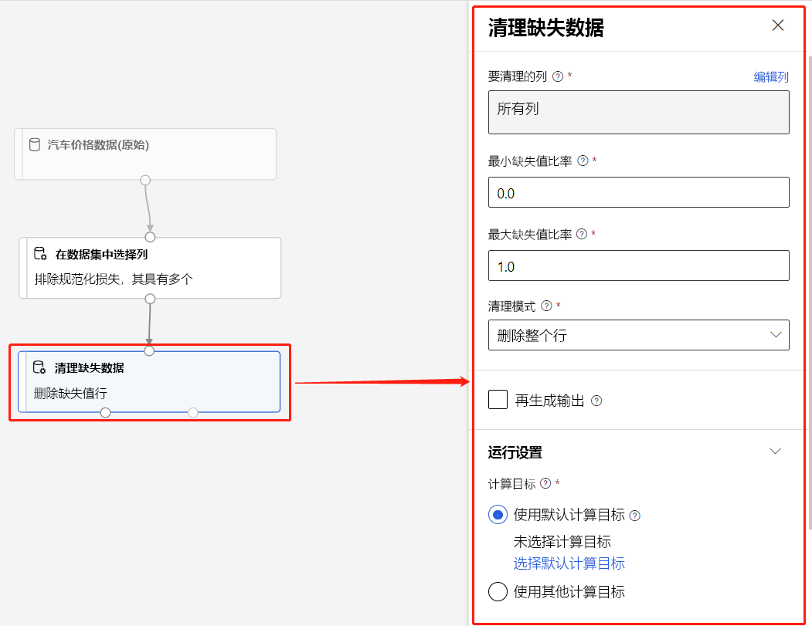

# 什么是 Azure 机器学习设计器（预览版）？ 
[!INCLUDE [applies-to-skus](../../includes/aml-applies-to-enterprise-sku.md)]

使用 Azure 机器学习设计器，能够在交互式画布上直观地连接[数据集](#datasets)和[模块](#module)，以创建机器学习模型。 若要了解如何开始使用设计器，请参阅[教程：使用设计器预测汽车价格](tutorial-designer-automobile-price-train-score.md)

设计器使用 Azure 机器学习[工作区](concept-workspace.md)来整理共享资源，例如：

+ [管道](#pipeline)
+ [数据集](#datasets)
+ [计算资源](#compute)
+ [已注册的模型](concept-azure-machine-learning-architecture.md#models)
+ [已发布的管道](#publish)
+ [实时终结点](#deploy)

## 模型训练和部署

设计器提供用于生成、测试和部署机器学习模型的可视化画布。 使用设计器，可以：

+ 将[数据集](#datasets)和[模块](#module)拖放至画布上。
+ 将模块连接在一起以创建[管道草稿](#pipeline-draft)。
+ 使用 Azure 机器学习工作区中的计算资源提交[管道运行](#pipeline-run)。
+ 将训练管道转换为推理管道   。
+ 将管道[发布](#publish)到 REST 管道终结点，以提交具有不同参数和数据集的新管道运行  。
    + 发布训练管道，在更改参数和数据集时重用单个管道训练多个模型  。
    + 发布批量推理管道，通过使用以前训练的模型针对新数据进行预测  。
+ 将实时推理管道[部署](#deploy)到实时终结点，以便针对新数据进行实时预测  。

## 管道

[管道](concept-azure-machine-learning-architecture.md#ml-pipelines)包含连接在一起的数据集和分析模块。 管道有许多用途，可以创建管道来训练单个模型或多个模型。 可以创建管道来进行实时预测或批量预测，或者仅用于清理数据。 借助管道，可以重复使用工作成果和整理项目。

### 管道草稿

在设计器中编辑管道时，你的进度会保存为管道草稿  。 可以通过添加或删除模块、配置计算目标、创建参数等方式随时编辑管道草案。

有效管道具有以下特征：

* 数据集只能连接到模块。
* 模块只能连接到数据集或其他模块。
* 模块的所有输入端口必须与数据流建立某种连接。
* 必须设置每个模块的所有必需参数。

若准备好运行管道草稿，请提交管道运行。

### 管道运行

每次运行管道时，管道及其结果的配置都作为管道运行存储在工作区中  。 出于故障排除或审核目的，可以返回任何管道运行以对其进行检查。 克隆管道运行，可创建新的管道草稿以供编辑  。

管道运行被分入[试验](concept-azure-machine-learning-architecture.md#experiments)以整理运行历史记录。 可以为每个管道运行设置试验。 

## 数据集

使用机器学习数据集可以轻松地访问和处理数据。 此设计器中包含很多示例数据集供你进行试验。 你可以根据需要[注册](how-to-create-register-datasets.md)更多数据集。

## 模块

模块是可对数据执行的算法。 设计器有许多模块，包括数据引入函数、训练、评分和验证过程。

模块可能提供一组参数用于配置模块的内部算法。 在画布上选择模块时，模块的参数会显示在画布右侧的“属性”窗格中。 可以在该窗格中修改参数来调整模型。 可以在设计器中设置各个模块的计算资源。 

有关在可用的机器学习算法库中导航的帮助，请参阅[算法 & 模块参考概述](algorithm-module-reference/module-reference.md)。 有关选择算法的帮助，请参阅[Azure 机器学习算法](algorithm-cheat-sheet.md)备忘单。

## 计算资源

使用工作区中的计算资源来运行管道，并将已部署的模型作为实时终结点或管道终结点托管（用于批量推理）。 支持的计算目标为：

| 计算目标 | 培训 | 部署 |
| ---- |:----:|:----:|
| Azure 机器学习计算 | ✓ | |
| Azure 机器学习计算实例 | ✓ | |
| Azure Kubernetes 服务 | | ✓ |

计算目标会附加至 [Azure 机器学习工作区](concept-workspace.md)。 在[Azure 机器学习 studio](https://ml.azure.com)中的工作区中管理计算目标。

## 部署

若要执行实时推理，必须将管道部署为**实时终结点**。 实时终结点在外部应用程序和评分模型之间创建接口。 对实时端点的调用会将预测结果实时返回至应用程序。 若要调用实时终结点，请传递部署终结点时创建的 API 密钥。 该终结点基于 REST，这是一种流行的 Web 编程项目的体系结构。

必须将实时终结点部署到 Azure Kubernetes 服务群集。

若要了解如何部署模型，请参阅[教程：使用设计器部署机器学习模型](tutorial-designer-automobile-price-deploy.md)。

## 发布

还可以将管道发布到管道终结点****。 与实时终结点类似，借助管道终结点，可以使用 REST 调用从外部应用程序提交新的管道运行。 但是不能使用管道终结点实时发送或接收数据。

已发布的管道是灵活的，它们可用于训练或重新训练模型、[执行批量推断](how-to-run-batch-predictions-designer.md)、处理新数据等。 可以将多个管道发布到单个管道终结点，并指定要运行的管道版本。

已发布的管道在每个模块的管道草稿中定义的计算资源上运行。

设计器创建与 SDK 相同的 [PublishedPipeline](https://docs.microsoft.com/python/api/azureml-pipeline-core/azureml.pipeline.core.graph.publishedpipeline?view=azure-ml-py) 对象。

## 从可视化界面移动到设计器

可视化界面（预览）已更新，现在是 Azure 机器学习设计器（预览）。 设计器经过重建，可使用基于管道的后端，与 Azure 机器学习的其他功能完全集成。 

通过这些更新，可视化界面的一些概念和术语已产生变化或更改了名称。 请参阅下表，了解最关键的概念更改。 

| 设计器中的概念 | 旧版（在可视化界面中） |
| ---- |:----:|
| 管道草稿 | 试验 |
| 实时终结点 | Web 服务 |

### 迁移到设计器

可将现有可视化界面试验和 Web 服务转换为设计器中的管道和实时终结点。 要迁移可视化界面资产，请执行以下步骤：

[!INCLUDE [migrate from the visual interface](../../includes/aml-vi-designer-migration.md)]

## 后续步骤

* 若要了解有关预测分析和机器学习的基本知识，请参阅[教程：使用设计器预测汽车价格](tutorial-designer-automobile-price-train-score.md)
* 了解如何根据自己的需求修改现有的[设计器示例](samples-designer.md)。

