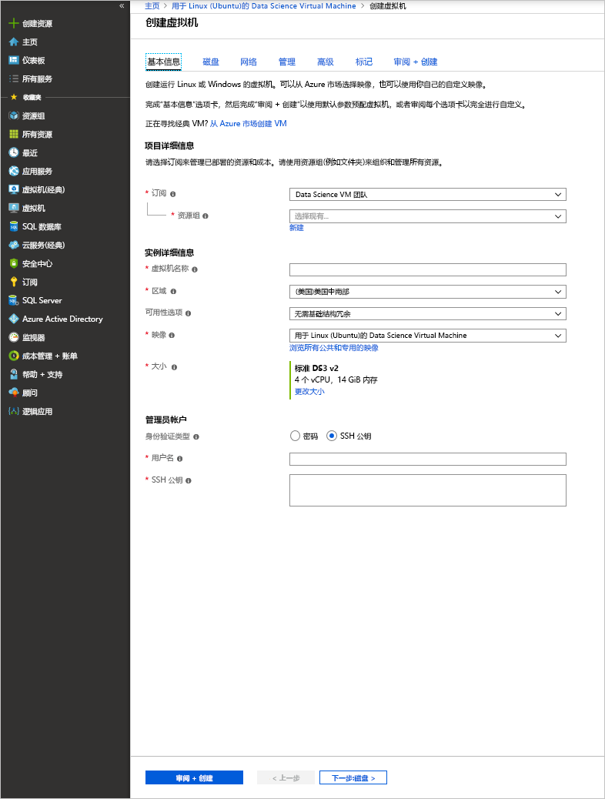

# <a name="quickstart-set-up-the-data-science-virtual-machine-for-linux-ubuntu"></a>快速入门：设置适用于 Linux (Ubuntu) 的 Data Science Virtual Machine

适用于 Linux 的 Data Science Virtual Machine (DSVM) 是基于 Ubuntu 的虚拟机映像，使用它可以轻松地开始在 Azure 上进行机器学习（包括深度学习）。 深度学习工具包括：

* [Caffe](https://caffe.berkeleyvision.org/)：一种以高速、清晰表达和模块化为理念建立起来的深度学习框架。
* [Caffe2](https://github.com/caffe2/caffe2)：Caffe 的跨平台版本。
* [Microsoft 认知工具包](https://github.com/Microsoft/CNTK)：Microsoft Research 提供的深度学习软件工具包。
* [H2O](https://www.h2o.ai/)：开源大数据平台和图形用户界面。
* [Keras](https://keras.io/)：Python 中适用于 TensorFlow、Microsoft Cognitive Toolkit 和 Theano 的高级神经网络 API。
* [MXNet](https://mxnet.io/)：灵活、高效的深度学习库，具有许多语言绑定。
* [NVIDIA DIGITS](https://developer.nvidia.com/digits)：一种简化常见深度学习任务的图形系统。
* [PyTorch](https://pytorch.org/)：高级 Python 库，支持动态网络。
* [TensorFlow](https://www.tensorflow.org/)：Google 提供的用于机器智能的开源库。
* [Theano](http://deeplearning.net/software/theano/)：用于定义、优化和高效评估涉及多维数组的数学表达式的 Python 库。
* [Torch](http://torch.ch/)：一种广泛支持机器学习算法的科学计算框架。
* CUDA、cuDNN 和 NVIDIA 驱动程序。
* 许多示例 Jupyter 笔记本。

所有库都是 GPU 版本，但也可在 CPU 上运行。

适用于 Linux 的数据科学虚拟机还包含数据科学和开发活动的常用工具，包括：

* 包含 Microsoft R Open 的 Microsoft Machine Learning Server。
* Anaconda Python 分发版（2.7 和 3.5 版），包括常用数据分析库。
* JuliaPro：具有常用科学和数据分析库的 Julia 语言的特选分发版。
* 独立 Spark 实例和单节点 Hadoop（HDFS、Yarn）。
* JupyterHub：支持 R、Python、PySpark 和 Julia 内核的多用户 Jupyter Notebook 服务器。
* Azure 存储资源管理器下载。
* 用于管理 Azure 资源的 Azure CLI。
* 机器学习工具：
  * [Vowpal Wabbit](https://github.com/JohnLangford/vowpal_wabbit)：一种快速机器学习系统，支持 online、hashing、allreduce、reductions、learning2search、主动和交互式学习等技术。
  * [XGBoost](https://xgboost.readthedocs.org/en/latest/)：一种可提供快速、 准确地提升树实现的工具。
  * [Rattle](https://togaware.com/rattle/)：一种图形工具，可帮助在 R 中轻松开始进行数据分析和机器学习。
  * [LightGBM](https://github.com/Microsoft/LightGBM)：一种快速、分布式、高性能的梯度提升框架。
* Java、Python、Node.js、Ruby 和 PHP 中的 Azure SDK。
* R 和 Python 中的库，供 Azure 机器学习和其他 Azure 服务使用。
* 开发工具和编辑器（RStudio、PyCharm、IntelliJ、Emacs、vim）。

执行数据科学涉及对一系列任务的迭代：

1. 查找、加载和预处理数据
1. 构建和测试模型
1. 部署模型以在智能应用程序中使用

数据科学家使用各种工具完成这些任务。 找到软件的适当版本，然后下载、编译并安装这些版本，这一过程可能耗时较长。

适用于 Linux 的数据科学虚拟机可大大减轻这种负担。 使用它快速开始分析项目。 它支持处理各种语言版本的任务，包括 R、Python、SQL、Java 和 C++。 使用 VM 中包含的 Azure SDK，可在适用于 Microsoft 云平台的 Linux 上使用各种服务来生成应用程序。 此外，还可以访问其他预安装语言，如 Ruby、Perl、PHP 和 Node.js。

此 DSVM 映像不会产生软件费用。 只需根据预配的虚拟机大小，支付相应的 Azure 硬件使用费。 有关计算费的详细信息，请参阅 [Azure 市场中的 VM 列表页](https://azure.microsoft.com/marketplace/partners/microsoft-ads/linux-data-science-vm/)。

## <a name="other-versions-of-the-data-science-virtual-machine"></a>其他版本的 Data Science Virtual Machine

[CentOS](linux-dsvm-intro.md) 映像同样可用，它包含多种与 Ubuntu 映像相同的工具。 [Windows](provision-vm.md) 映像也可用。

## <a name="prerequisites"></a>先决条件

创建适用于 Linux 的数据科学虚拟机之前，必须具备 Azure 订阅。 可以[获取 Azure 免费试用版](https://azure.microsoft.com/free/)。

## <a name="create-your-data-science-virtual-machine-for-linux"></a>创建适用于 Linux 的数据科学虚拟机

以下步骤用于创建适用于 Linux 的数据科学虚拟机的实例：

1. 转到 [Azure 门户](https://portal.azure.com/#create/microsoft-dsvm.linux-data-science-vm-ubuntulinuxdsvmubuntu)上的虚拟机列表。 如果你尚未登录到 Azure 帐户，系统可能会提示你登录。 
1. 选择“创建”以显示向导。 
    
1. 输入以下信息以配置向导的每个步骤：

    1. **基本信息**：
    
       * **订阅**：如果有多个订阅，请选择要在其上创建虚拟机并对其计费的订阅。 必须具有此订阅的资源创建权限。
       * **资源组**：可以创建新组或使用现有组。
       * **虚拟机名称**：输入要创建的数据科学服务器的名称。
       * **区域**：选择最合适的数据中心。 通常，最合适的数据中心应拥有大部分数据，或者最接近实际位置以实现最快的网络访问。
       * **可用性选项**：若要在可用性集/区域中使用此 VM，请设置此选项。 否则请保留默认值。
       * **映像**：保留默认值。
       * **大小**：选择能满足功能需求和成本约束的服务器类型。 为基于 GPU 的 VM 实例选择 NC 或 ND 系列 VM。 
       * **用户名**：输入管理员用户名。
       * **SSH 公钥**：以单行格式输入 RSA 公钥。 （可以使用密码而不使用 SSH 密钥。）
    
    1. **磁盘**：
    
       * **OS 磁盘类型**：如果希望使用固态硬盘 (SSD)，请选择“高级 SSD”  。 否则，请选择“标准 HDD”  。
    
    1. 对于其余设置，可使用默认值。 若考虑使用非默认值，请将鼠标悬停在信息链接上获取帮助。 完成后，选择“查看 + 创建”  。
    
    1. VM 通过验证后，请检查输入的所有信息是否正确。 单击相应的链接转到使用条款。 除计算“大小”输入中选择的服务器大小所产生的费用外，VM 不产生其他任何费用。  若要开始预配，请选择“创建”。 
    
    预配大约需要 5 分钟。 状态将显示在 Azure 门户中。

## <a name="how-to-access-the-data-science-virtual-machine-for-linux"></a>如何访问适用于 Linux 的数据科学虚拟机

可以使用三种方法访问 Ubuntu DSVM：

- 终端会话 SSH
- 图形会话 X2Go
- Jupyter 笔记本的 JupyterHub 和 JupyterLab

还可以将 Data Science Virtual Machine 附加到 Azure Notebooks，以在 VM 上运行 Jupyter Notebook，并绕过免费服务层的限制。 有关详细信息，请参阅[管理和配置 Azure Notebooks 项目](../../notebooks/configure-manage-azure-notebooks-projects.md#compute-tier)。

### <a name="ssh"></a>SSH

创建 VM 后，可使用 SSH 登录。 使用在步骤 3 的**基本信息**部分中为文本 shell 接口创建的帐户凭据。 可在 Windows 上下载 [PuTTY](https://www.putty.org) 之类的 SSH 客户端工具。 如果你偏好图形桌面（X Windows系统），可以在 PuTTY 上使用 X11 转发或安装 X2Go 客户端。

> [!NOTE]
> 在测试方面，X2Go 客户端的性能优于 X11 转发。 建议对图形桌面界面使用 X2Go 客户端。

### <a name="x2go"></a>X2Go

Linux VM 已通过 X2Go 服务器进行预配并且可接受客户端连接。 若要连接到 Linux VM 图形桌面，请在客户端上完成以下过程：

1. 从 [X2Go ](https://wiki.x2go.org/doku.php/doc:installation:x2goclient) 为客户端平台下载并安装 X2Go 客户端。
1. 运行 X2Go 客户端，并选择“新建会话”  。 这会打开具有多个选项卡的配置窗口。 输入下列配置参数:
   * **会话选项卡**：
     * **主机**：输入 Linux Data Science Virtual Machine 的主机名或 IP 地址。
     * **登录名**：输入 Linux VM 上的用户名。
     * **SSH 端口**：保留默认值 22。
     * **会话类型**：将值更改为“XFCE”  。 Linux VM 目前仅支持 XFCE 桌面。
   * **媒体选项卡**：如果无需使用声音支持和客户端打印功能，可将其关闭。
   * **共享文件夹**：如果希望将目录从客户端计算机装入 Linux VM，则在此选项卡上添加要与 VM 共享的客户端计算机目录。

通过 X2Go 客户端使用 SSH 客户端或 XFCE 图形桌面登录 VM 后，即可开始使用 VM 上安装和配置的工具。 在 XFCE 上，可看到许多工具的应用程序菜单快捷方式和桌面图标。

### <a name="jupyterhub-and-jupyterlab"></a>JupyterHub 和 JupyterLab

Ubuntu DSVM 运行 [JupyterHub](https://github.com/jupyterhub/jupyterhub)，一个多用户 Jupyter 服务器。 若要进行连接，请在便携式计算机或台式机上浏览到 https:\//your-vm-ip:8000。 输入用于创建 VM 的用户名和密码，然后登录。 提供多个示例笔记本用于浏览和试用。

也会提供 JupyterLab（下一代的 Jupyter 笔记本和 JupyterHub）。 若要访问它，请登录到 JupyterHub，然后浏览到 URL https:\//your-vm-ip:8000/user/your-username/lab。 可以通过将此行添加到 `/etc/jupyterhub/jupyterhub_config.py`，将 JupyterLab 设置为默认 Notebook 服务器：

```python
c.Spawner.default_url = '/lab'
```

## <a name="tools-installed-on-the-data-science-virtual-machine-for-linux"></a>在适用于 Linux 的数据科学虚拟机上安装的工具

### <a name="deep-learning-libraries"></a>深度学习库

#### <a name="cntk"></a>CNTK

Microsoft Cognitive Toolki 是一种开放源的深度学习工具包。 Python 绑定位于根环境和 py35 Conda 环境中。 它还具有已存在于路径中的命令行工具 (CNTK)。

示例 Python 笔记本位于 JupyterHub。 若要在命令行中运行基本示例，请在 shell 中运行以下命令：

```bash
cd /home/[USERNAME]/notebooks/CNTK/HelloWorld-LogisticRegression
cntk configFile=lr_bs.cntk makeMode=false command=Train
```

有关详细信息，请参阅 [GitHub](https://github.com/Microsoft/CNTK) 的 CNTK 部分，以及 [CNTK wiki](https://github.com/Microsoft/CNTK/wiki)。

#### <a name="caffe"></a>Caffe

Caffe 是美国伯克利视觉与学习中心的深度学习框架。 其路径为 /opt/caffe。 可以在 /opt/caffe/examples 中找到示例。

#### <a name="caffe2"></a>Caffe2

Caffe2 是 Facebook 基于 Caffe 构建的深度学习框架。 它可在 Conda 根环境中的 Python 2.7 中使用。 若要激活它，请从 shell 运行以下命令：

```bash
source /anaconda/bin/activate root
```

可在 JupyterHub 中获取一些示例笔记本。

#### <a name="h2o"></a>H2O

H2O 是一种快速的内存中分布式机器学习和预测分析平台。 根环境和 py35 Anaconda 环境中都安装有 Python 包。 同时也会安装 R 包。 

若要从命令行打开 H2O，请运行 `java -jar /dsvm/tools/h2o/current/h2o.jar`。 可能需要配置各种[命令行选项](http://docs.h2o.ai/h2o/latest-stable/h2o-docs/starting-h2o.html#from-the-command-line)。 若要开始，可以浏览到 http://localhost:54321 以访问 Flow Web UI。 示例笔记本也位于 JupyterHub。

#### <a name="keras"></a>Keras

Keras 是 Python 中的高级神经网络 API。 它可以在 TensorFlow、Microsoft Cognitive Toolkit 或 Theano 的顶层运行。 它位于根环境和 py35 Python 环境中。

#### <a name="mxnet"></a>MXNet

MXNet 是专为提高效率和灵活性而设计的深度学习框架。 具有 DSVM 上包含的 R 和 Python 绑定。 示例笔记本位于 JupyterHub 中，示例代码位于 /dsvm/samples/mxnet。

#### <a name="nvidia-digits"></a>NVIDIA DIGITS

NVIDIA 深度学习 GPU 训练系统也称为 DIGITS，是用于简化常见深度学习任务的系统。 这些任务包括管理数据，在 GPU 系统上设计和训练神经网络，以及实时监视高级可视化效果的性能。

DIGITS 可用作一项服务，称为 *digits*。 启动服务，然后浏览到 http://localhost:5000 开始操作。

DIGITS 也可在 Conda 根环境中作为 Python 模块安装。

#### <a name="tensorflow"></a>TensorFlow

TensorFlow 是 Google 的深度学习库。 它是使用数据流图进行数值计算的开源软件库。 TensorFlow 位于 py35 Python 环境中，一些示例笔记本位于 JupyterHub 中。

#### <a name="theano"></a>Theano

Theano 是用于高效数值计算的 Python 库。 它位于根环境和 py35 Python 环境中。 

#### <a name="torch"></a>Torch

Torch 是广泛支持机器学习算法的科学计算框架。 位于 /dsvm/tools/torch，**th** 交互式会话和 LuaRocks 程序包管理器可在命令行中使用。 示例位于 /dsvm/samples/torch。

PyTorch 也位于根 Anaconda 环境中。 示例位于 /dsvm/samples/pytorch。

### <a name="microsoft-machine-learning-server"></a>Microsoft 机器学习服务器

R 是数据分析和机器学习的最常用语言之一。 若要使用 R 进行分析，可以利用 VM 中带有 Microsoft R Open 和数学内核库的 Microsoft Machine Learning Server。 数学内核库可优化分析算法中常用的数学运算。 Microsoft R Open 与 CRAN R 完全兼容，在 CRAN 中发布的任何 R 库都可以安装在 Microsoft R Open 上。 

使用 Machine Learning Server 可将 R 模型缩放和实施为 Web 服务。 可以在其中一个默认编辑器（如 RStudio、vi 或 Emacs）中编辑 R 程序。 预安装了 Emacs 编辑器，可根据喜好使用。 Emacs ESS (Emacs Speaks Statistics) 包简化了 Emacs 编辑器内的 R 文件处理。

若要打开 R 控制台，请在 shell 中输入 **R**。 执行此命令将进入交互式环境。 若要开发 R 程序，通常使用 Emacs 或 vi 等编辑器，并在 R 中运行脚本。使用 RStudio，便拥有一个完整的图形 IDE 来开发 R 程序。

还提供一个 R 脚本，可用于安装[前 20 个 R 程序包](https://www.kdnuggets.com/2015/06/top-20-r-packages.html)（如果需要）。 进入 R 交互式界面后可以运行此脚本。 如前所述，可以在 shell 中输入 **R** 打开该界面。  

### <a name="python"></a>Python

使用 Python 2.7 和 3.5 环境安装 Anaconda Python。 2\.7 环境称为根环境，3.5 环境称为 py35 环境   。 此分发版包含基本 Python 以及约 300 种最常用的数学、工程和数据分析包。

默认为 py35 环境。 若要激活根 (2.7) 环境，请使用以下命令：

```bash
source activate root
```

若要再次激活 py35 环境，请使用以下命令：

```bash
source activate py35
```

若要调用 Python 交互式会话，请在 shell 中输入 **python**。 

使用 Conda 或 pip 安装其他 Python 库。 对于 pip，如果不想要使用默认值，请先激活正确的环境：

```bash
source activate root
pip install <package>
```

或者，指定到 pip 的完整路径：

```bash
/anaconda/bin/pip install <package>
```

对于 Conda，始终应指定环境名称（py35 或根）：

```bash
conda install <package> -n py35
```

如果在图形界面上操作或者已设置 X11 转发，可以输入 **pycharm** 打开 PyCharm Python IDE。 可以使用默认文本编辑器。 此外，可以使用 Spyder，它是与 Anaconda Python 分发版捆绑在一起的 Python IDE。 Spyder 需要图形桌面或 X11 转发。 图形桌面中提供了 Spyder 的快捷方式。

### <a name="jupyter-notebook"></a>Jupyter 笔记本

Anaconda 分发版还附带 Jupyter 笔记本 - 用于共享代码和分析的环境。 可通过 JupyterHub 访问 Jupyter notebook。 使用本地 Linux 用户名和密码登录。

已使用 Python 2、Python 3 和 R 内核预配置 Jupyter 笔记本服务器。 使用“Jupyter Notebook”桌面图标打开浏览器并访问 Notebook 服务器。  如果通过 SSH 或 X2Go 客户端登录 VM，则还可以通过 [https://localhost:8000/](https://localhost:8000/) 访问 Jupyter Notebook 服务器。

> [!NOTE]
> 如果收到任何证书警告，请选择继续。

可以从任何主机访问 Jupyter 笔记本服务器。 输入 **https://\<VM DNS 名称或 IP 地址\>:8000/** 。

> [!NOTE]
> 默认情况下，配置 VM 时，防火墙中会打开端口 8000。 

我们已经打包了两个示例笔记本（分别在 Python 和 R 中）。通过使用本地 Linux 用户名和密码向 Jupyter 笔记本进行身份验证后，可以在笔记本主页上看到示例链接。 通过选择“新建”  并选择相应的语言内核，可创建新笔记本。 如果未看到“新建”按钮，请选择左上角的“Jupyter”图标转到 Notebook 服务器的主页。  

### <a name="apache-spark-standalone"></a>Apache Spark 独立版

一个 Apache Spark 独立版实例已预装在 Linux DSVM 上，以帮助你在本地开发 Spark 应用程序，然后在大型群集上对其进行测试和部署。 

可以通过 Jupyter 内核运行 PySpark 程序。 打开 Jupyter 时，选择“新建”按钮即可看到可用内核的列表  。 “Spark - Python”是 PySpark 内核。借助它可以使用 Python 语言生成 Spark 应用程序  。 还可以使用 Python IDE（如 PyCharm 或 Spyder）生成 Spark 程序。 

在此独立实例中，Spark 堆栈会在调用方客户端程序中运行。 与在 Spark 群集上进行开发相比，使用此功能可以更快、更轻松地排查问题。

Jupyter 提供一个示例 PySpark 笔记本。 可以在 Jupyter 主目录下的 SparkML 目录中找到该笔记本 ($HOME/notebooks/SparkML/pySpark)。 

若要以 R for Spark 编程，可以使用 Microsoft Machine Learning Server、SparkR 或 sparklyr。 

在 Microsoft Machine Learning Server 的 Spark 上下文中运行之前，需要执行一次性的设置步骤来启用本地单节点 Hadoop HDFS 和 Yarn 实例。 默认情况下，Hadoop 服务已安装但在 DSVM 上禁用。 若要启用它，需要首次以 root 身份运行以下命令：

```bash
echo -e 'y\n' | ssh-keygen -t rsa -P '' -f ~hadoop/.ssh/id_rsa
cat ~hadoop/.ssh/id_rsa.pub >> ~hadoop/.ssh/authorized_keys
chmod 0600 ~hadoop/.ssh/authorized_keys
chown hadoop:hadoop ~hadoop/.ssh/id_rsa
chown hadoop:hadoop ~hadoop/.ssh/id_rsa.pub
chown hadoop:hadoop ~hadoop/.ssh/authorized_keys
systemctl start hadoop-namenode hadoop-datanode hadoop-yarn
```

不需要 Hadoop 相关服务时，可以通过运行 ```systemctl stop hadoop-namenode hadoop-datanode hadoop-yarn``` 来停止这些服务。

/dsvm/samples/MRS 目录中提供了一个示例，演示如何在远程 Spark 上下文（即，DSVM 上的独立 Spark 实例）中开发和测试 Microsoft Machine Learning Server。

### <a name="ides-and-editors"></a>IDE 和编辑器

可以选择多个代码编辑器，包括 vi/Vim、Emacs、PyCharm、RStudio 和 IntelliJ。 

PyCharm、RStudio 和 IntelliJ 是图形编辑器。 若要使用它们，需要登录到图形桌面。 可以使用桌面和应用程序菜单中的快捷方式打开它们。

Vim 和 Emacs 是基于文本的编辑器。 Emacs 上的 ESS 附加包可以简化 Emacs 编辑器中 R 的处理。 可在 [ESS 网站](https://ess.r-project.org/)上找到更多信息。

LaTex 是通过 texlive 包连同名为 [AUCTeX](https://www.gnu.org/software/auctex/manual/auctex/auctex.html) 的 Emacs 附加包一起安装的。 此包简化了 Emacs 中 LaTex 文档的创作。  

### <a name="databases"></a>数据库

#### <a name="graphical-sql-client"></a>图形化 SQL 客户端

SQuirrel SQL 是一个图形化 SQL 客户端，可连接到各种数据库（如 Microsoft SQL Server 和 MySQL）和运行 SQL 查询。 可以使用桌面图标从图形桌面会话运行 SQuirrel SQL（例如，通过 X2Go 客户端）。 或者，可以在 shell 中使用以下命令运行该客户端：

```bash
/usr/local/squirrel-sql-3.7/squirrel-sql.sh
```

首次使用前，需设置驱动程序和数据库别名。 JDBC 驱动程序位于 /usr/share/java/jdbcdrivers 中。

有关详细信息，请参阅 [SQuirrel SQL](http://squirrel-sql.sourceforge.net/index.php?page=screenshots)。

#### <a name="command-line-tools-for-accessing-microsoft-sql-server"></a>用于访问 Microsoft SQL Server 的命令行工具

SQL Server 的 ODBC 驱动程序包还附带两个命令行工具：

- **bcp**：bcp 工具在 Microsoft SQL Server 实例与用户指定格式的数据文件之间批量复制数据。 可以使用 bcp 工具将大量新行导入 SQL Server 表，或者将表中的数据导出到数据文件。 要将数据导入表中，必须使用为该表创建的格式文件。 或者，必须了解表的结构，以及对其列有效的数据类型。

  有关详细信息，请参阅[使用 bcp 连接](https://msdn.microsoft.com/library/hh568446.aspx)。

- **sqlcmd**：可以使用 sqlcmd 工具输入 Transact-SQL 语句。 还可以在命令提示符下输入系统过程和脚本文件。 此工具使用 ODBC 运行 Transact-SQL 批处理。

  有关详细信息，请参阅[使用 sqlcmd 连接](https://msdn.microsoft.com/library/hh568447.aspx)。

  > [!NOTE]
  > 此工具在 Linux 和 Windows 平台之间存在差异。 有关详细信息，请参阅文档。

#### <a name="database-access-libraries"></a>数据库访问库

在 R 和 Python 中可以使用库来访问数据库：

* 在 R 中，可以使用 RODBC 包或 dplyr 包在数据库服务器上查询或运行 SQL 语句。
* 在 Python 中，pyodbc 库提供使用 ODBC 作为基础层的数据库访问。  

### <a name="azure-tools"></a>Azure 工具

VM 上安装有以下 Azure 工具：

* **Azure CLI**：可以使用 Azure 中的命令行接口通过 shell 命令创建和管理 Azure 资源。 若要打开 Azure 工具，请输入 **azure help**。 有关详细信息，请参阅 [Azure CLI 文档页](https://docs.microsoft.com/cli/azure/get-started-with-az-cli2)。
* **Azure 存储资源管理器**：Azure 存储资源管理器是一个图形工具，用于浏览在 Azure 存储帐户中存储的对象，以及将数据上传到 Azure Blob 和从中下载数据。 可通过桌面快捷方式图标访问存储资源管理器。 还可以通过输入 **StorageExplorer** 从 shell 提示符打开此工具。 必须从 X2Go 客户端登录，或设置 X11 转发。
* **Azure 库**：下面是一些预安装的库。
  
  * **Python**：Python 中的 Azure 相关库包括 *azure*、*azureml*、*pydocumentdb* 和 *pyodbc*。 使用前三个库，可以访问 Azure 存储服务、Azure 机器学习和 Azure Cosmos DB（Azure 上的 NoSQL 数据库）。 使用第四个库 pyodbc（以及 SQL Server 的 Microsoft ODBC 驱动程序），可以通过使用 ODBC 接口从 Python 访问 SQL Server、Azure SQL 数据库和 Azure SQL 数据仓库。 输入 **pip 列表**查看所有列出的库。 请确保在 Python 2.7 和 3.5 环境中都运行此命令。
  * **R**：R 中的 Azure 相关库包括 AzureML 和 RODBC。
  * **Java**：可在 VM 上的 /dsvm/sdk/AzureSDKJava 目录中找到 Azure Java 库列表。 密钥库是 Azure 存储和用于 SQL Server 的管理 API、Azure Cosmos DB 和 JDBC 驱动程序。  

可以从预安装的 Firefox 浏览器访问 [Azure 门户](https://portal.azure.com)。 在 Azure 门户中，可以创建、管理和监视 Azure 资源。

### <a name="azure-machine-learning"></a>Azure 机器学习

Azure 机器学习是完全托管的云服务，允许构建、部署和共享预测分析解决方案。 从 Azure 机器学习工作室中构建实验和模型。 可从 Data Science Virtual Machine 上的 Web 浏览器，通过访问 [Microsoft Azure 机器学习](https://studio.azureml.net)来访问 Azure 机器学习工作室。

登录到 Azure 机器学习工作室后，可以使用试验画布来生成机器学习算法的逻辑流。 还可以访问在 Azure 机器学习上托管的 Jupyter 笔记本，并且可以无缝使用机器学习工作室中的试验。 

通过将已构建的机器学习模型包装在 Web 服务接口中，来对它们执行操作。 实施机器学习模型使得以任何语言编写的客户端都能从这些模型中调用预测。 有关详细信息，请参阅[机器学习文档](https://azure.microsoft.com/documentation/services/machine-learning/)。

还可以在 VM 上的 R 或 Python 中生成模型，然后在 Azure 机器学习中将其部署到生产环境。 我们已在 R (**AzureML**) 和 Python (**azureml**) 中分别安装了库以启用此功能。

有关如何将 R 和 Python 中的模型部署到 Azure 机器学习的信息，请参阅 [Data Science Virtual Machine 的十大功能](vm-do-ten-things.md)。

> [!NOTE]
> 这些说明专为 Windows 版 Data Science Virtual Machine 编写。 但是其中提供的有关将模型部署到 Azure 机器学习的信息也适用于 Linux VM。

### <a name="machine-learning-tools"></a>机器学习工具

VM 随附一些已预编译并已在本地预装的机器学习工具和算法。 其中包括：

* **Vowpal Wabbit**：一种快速的在线学习算法。
* **xgboost**：提供经过优化的提升树算法的工具。
* **Rattle**：基于 R 的图形工具，可用于简单的数据浏览和建模。
* **Python**：Anaconda Python 附带机器学习算法，这些算法含有库（如 Scikit-learn）。 可以通过使用 `pip install` 命令安装其他库。
* **LightGBM**：快速、分布式、高性能的梯度提升框架，基于决策树算法。
* **R**：有丰富的机器学习函数库可供 R 使用。预装的库包括 lm、glm、randomForest 和 rpart。 可运行以下命令安装其他库：
  
        install.packages(<lib name>)

以下是一些关于列表中前三个机器学习工具的附加信息。

#### <a name="vowpal-wabbit"></a>Vowpal Wabbit

Vowpal Wabbit 是一种使用在线、哈希、allreduce、缩减、learning2search、主动和交互式学习等技术的机器学习系统。

若要在基本示例上运行该工具，请使用以下命令：

```bash
cp -r /dsvm/tools/VowpalWabbit/demo vwdemo
cd vwdemo
vw house_dataset
```

该目录中存在其他更大的演示。 有关 Vowpal Wabbit 的详细信息，请参阅 [GitHub 的此部分](https://github.com/JohnLangford/vowpal_wabbit)以及 [Vowpal Wabbit wiki](https://github.com/JohnLangford/vowpal_wabbit/wiki)。

#### <a name="xgboost"></a>xgboost

xgboost 库是为提升（树）算法设计和优化的库。 此库的目标是将计算机的计算限制推向极致，以满足提供可缩放、可移植且精确的大规模树提升的需求。

xgboost 作为命令行和 R 库提供。 若要在 R 中使用此库，可以启动交互式 R 会话（在 shell 中输入 **R**），然后加载该库。

下面是可以在 R 提示符中运行的一个简单示例：

```R
library(xgboost)

data(agaricus.train, package='xgboost')
data(agaricus.test, package='xgboost')
train <- agaricus.train
test <- agaricus.test
bst <- xgboost(data = train$data, label = train$label, max.depth = 2,
                eta = 1, nthread = 2, nround = 2, objective = "binary:logistic")
pred <- predict(bst, test$data)
```

若要运行 xgboost 命令行，下面是要在 shell 中运行的命令：

```bash
cp -r /dsvm/tools/xgboost/demo/binary_classification/ xgboostdemo
cd xgboostdemo
xgboost mushroom.conf
```

一个 .model 文件将写入到指定的目录。 可在 [GitHub](https://github.com/dmlc/xgboost/tree/master/demo/binary_classification) 上找到有关此演示示例的信息。

有关 xgboost 的详细信息，请参阅 [xgboost 文档页](https://xgboost.readthedocs.org/en/latest/)及其 [GitHub 存储库](https://github.com/dmlc/xgboost)。

#### <a name="rattle"></a>Rattle

Rattle (**R** **A**nalytical **T**ool **T**o **L**earn **E**asily) 使用基于 GUI 的数据浏览和建模。 它提供数据的统计和可视化摘要，转换可轻松建模的数据，从数据构建不受监督和受监督的模型，以图形方式呈现模型的性能，以及对新数据集进行评分。 它还生成 R 代码，用于复制 UI 中可直接在 R 中运行或用作进一步分析的起点的操作。

若要运行 Rattle，需进入图形桌面登录会话。 在终端中输入 **R** 打开 R 环境。 在 R 提示符中，输入以下命令：

```R
library(rattle)
rattle()
```

此时会打开包含一组选项卡的图形界面。 在 Rattle 中执行以下快速入门步骤，使用示例天气数据集并生成模型。 在某些步骤中，系统会提示自动安装并加载尚未安装在系统上的某些必需 R 包。

> [!NOTE]
> 如果无权在系统目录（默认）中安装包，可能会在 R 控制台窗口中看到一个提示，提醒将包安装到个人库中。 如果看到这些提示，请回复 y  。

1. 选择“执行”  。
1. 此时会显示一个对话框，询问是否要使用示例气象数据集。 选择“是”以加载示例。 
1. 选择“模型”选项卡。 
1. 选择“执行”以生成决策树。 
1. 选择“绘制”以显示决策树。 
1. 选择“林”选项，然后选择“执行”以生成随机林。  
1. 选择“评估”选项卡。 
1. 选择“风险”选项，然后选择“执行”以显示两个“风险(累积)”性能绘图。   
1. 选择“日志”选项卡以显示为上述操作生成的 R 代码。 
   （由于当前版本 Rattle 中的 bug，需在日志文本中的“导出此日志”  前插入 **#** 字符。）
1. 选择“导出”按钮，将名为 *weather_script.R* 的 R 脚本文件保存到主文件夹。 

可以退出 Rattle 和 R。现在，可以修改生成的 R 脚本。 或者，可以按原样使用该脚本，并可随时运行它来重复 Rattle UI 中的所有操作。 尤其是对于 R 初学者而言，使用此方法可在简单的图形界面中快速执行分析和机器学习，同时在 R 中自动生成代码来修改项目或用于学习。

## <a name="next-steps"></a>后续步骤

以下是继续学习和探索的方法：

* [适用于 Linux 的 Data Science Virtual Machine 上的数据科学](linux-dsvm-walkthrough.md)演练演示了如何使用此处预配的 Linux DSVM 执行多种常见的数据科学任务。 
* 请在 DSVM 上尝试探索本文中所述的各种数据科学工具。 还可以在虚拟机上的 shell 中运行 `dsvm-more-info`，获取有关 VM 上安装的工具的基本介绍和信息指南。  
* 通过使用 [Team Data Science Process](https://aka.ms/tdsp)，了解如何系统地构建端到端分析解决方案。
* 访问 [Azure AI 库](https://gallery.azure.ai/)，获取使用 Azure AI 服务的机器学习和数据分析示例。
