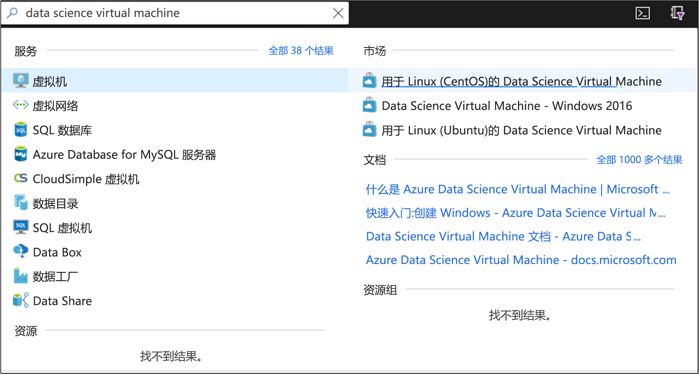
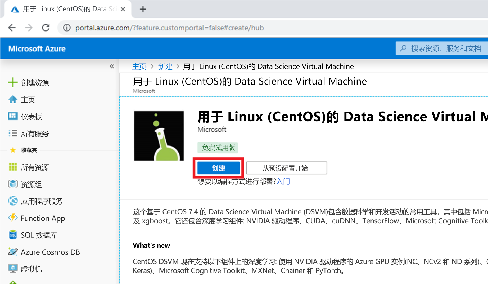
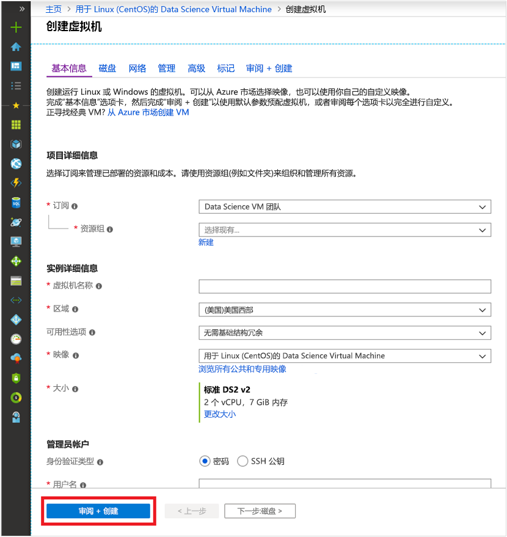
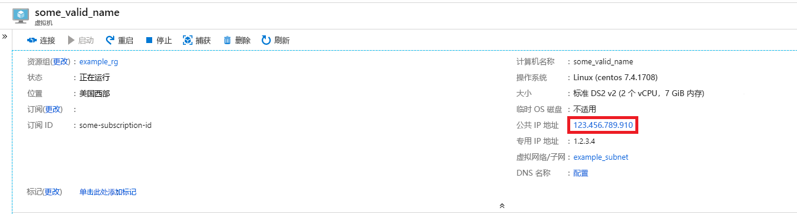
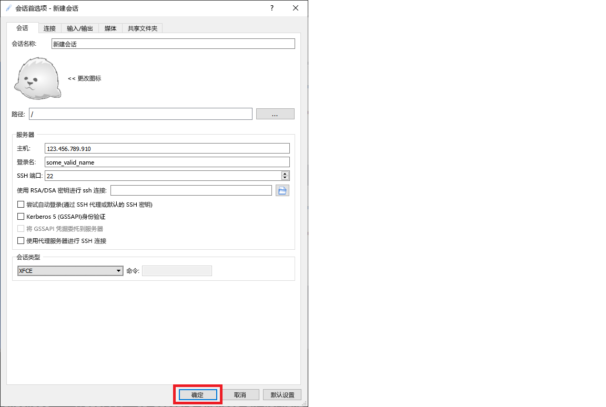

# <a name="quickstart-set-up-a-centos-linux-data-science-virtual-machine-in-azure"></a>快速入门：在 Azure 中设置 CentOS (Linux) Data Science Virtual Machine

启动并运行基于 CentOS 的 Data Science Virtual Machine。

## <a name="prerequisites"></a>先决条件

若要创建 CentOS Data Science Virtual Machine，必须具备 **Azure 订阅**。 [创建免费订阅](https://azure.com/free)。

## <a name="create-your-centos-data-science-virtual-machine"></a>创建 CentOS Data Science Virtual Machine

以下是创建 CentOS Data Science Virtual Machine 实例的步骤：

1. 转到 [Azure 门户](https://portal.azure.com)。 如果你尚未登录到 Azure 帐户，系统可能会提示你登录。 
1. 在搜索栏中键入“data science virtual machine”，然后选择“CentOS DSVM”。

    

1. 在随后的窗口中，选择“创建”  。

    [](media/linux-dsvm-intro/create-centos-expanded.png#lightbox)

1. 你应该被重定向到“创建虚拟机”边栏选项卡。
   
   

1. 输入以下信息以配置向导的每个步骤：

    1. **基本信息**：
    
       * **订阅**：如果有多个订阅，请选择要在其上创建虚拟机并对其计费的订阅。 必须具有此订阅的资源创建权限。
       * **资源组**：新建资源组，或使用现有资源组。
       * **虚拟机名称**：输入虚拟机的名称。 这就是它在 Azure 门户中的显示方式。
       * **区域**：选择最合适的数据中心。 为获得最快的网络访问速度，请选择包含大部分数据，或者最接近实际位置的数据中心。 详细了解 [Azure 区域](https://azure.microsoft.com/global-infrastructure/regions/)。
       * **映像**：保留默认值。
       * **大小**：它应自动填充为适合一般工作负荷的大小。 详细了解 [Azure 中的 Linux VM 大小](../../virtual-machines/linux/sizes.md)。
       * **身份验证类型**：为了更快地设置，请选择“密码”。 
         
         > [!NOTE]
         > 如果打算使用 JupyterHub，请确保选择“密码”，因为 JupyterHub 未  配置为使用 SSH 公钥。

       * **用户名**：输入管理员用户名。 这是你将用于登录到虚拟机的用户名，无需与 Azure 用户名相同。 *不要*使用大写字母。
         
         > [!NOTE]
         > 如果在用户名中使用大写字母，JupyterHub 将无法正常工作，并且你将遇到 500 内部服务器错误。

       * **密码**：输入将用于登录到虚拟机的密码。    
    
   1. 选择“查看 + 创建”  。
   1. **查看 + 创建**
      * 验证输入的所有信息是否正确。 
      * 选择“创建”  。
    
    预配大约需要 5 分钟。 状态将显示在 Azure 门户中。

## <a name="how-to-access-the-centos-data-science-virtual-machine"></a>如何访问 CentOS Data Science Virtual Machine

可以通过以下三种方式之一访问 CentOS DSVM：

  * 终端会话 SSH
  * 图形会话 X2Go
  * Jupyter 笔记本的 JupyterHub 和 JupyterLab

还可以将 Data Science Virtual Machine 附加到 Azure Notebooks，以在 VM 上运行 Jupyter Notebook，并绕过免费服务层的限制。 有关详细信息，请参阅[管理和配置 Azure Notebooks 项目](../../notebooks/configure-manage-azure-notebooks-projects.md#compute-tier)。

### <a name="ssh"></a>SSH

创建 VM 后，如果为其配置了 SSH 访问权限，则可以使用 SSH 登录。 使用在步骤 3 的**基本信息**部分中为文本 shell 接口创建的帐户凭据。 可在 Windows 上下载 [PuTTY](https://www.putty.org) 之类的 SSH 客户端工具。 如果你偏好图形桌面（X Window 系统），可以在 PuTTY 上使用 X11 转发。

> [!NOTE]
> 在测试方面，X2Go 客户端的性能优于 X11 转发。 建议对图形桌面界面使用 X2Go 客户端。

### <a name="x2go"></a>X2Go

Linux VM 已通过 X2Go 服务器进行预配并且可接受客户端连接。 若要连接到 Linux VM 图形桌面，请在客户端上完成以下过程：

1. 从 [X2Go ](https://wiki.x2go.org/doku.php/doc:installation:x2goclient) 为客户端平台下载并安装 X2Go 客户端。
1. 请记下虚拟机的公共 IP 地址，可以通过在 Azure 门户中打开刚刚创建的虚拟机找到该地址。

   

1. 运行 X2Go 客户端。 如果“新建会话”窗口未自动弹出，请转到“会话”->“新建会话”。

1. 在显示的配置窗口中，输入以下配置参数：
   * **会话选项卡**：
     * **主机**：输入之前记下的 VM 的 IP 地址。
     * **登录名**：输入 Linux VM 上的用户名。
     * **SSH 端口**：保留默认值 22。
     * **会话类型**：将值更改为“XFCE”  。 Linux VM 目前仅支持 XFCE 桌面。
   * **媒体选项卡**：如果无需使用声音支持和客户端打印功能，可将其关闭。
   * **共享文件夹**：如果希望将目录从客户端计算机装入 Linux VM，则在此选项卡上添加要与 VM 共享的客户端计算机目录。

   
1. 选择“确定”  。
1. 单击 X2Go 窗口右窗格中的框以调出 VM 的登录屏幕。
1. 输入 VM 的密码。
1. 选择“确定”  。
1. 可能必须授予 X2Go 绕过防火墙的权限才能完成连接。
1. 现在应会看到 CentOS DSVM 的图形界面。 


### <a name="jupyterhub-and-jupyterlab"></a>JupyterHub 和 JupyterLab

CentOS DSVM 运行 [JupyterHub](https://github.com/jupyterhub/jupyterhub)，一个多用户 Jupyter 服务器。 若要连接，请执行以下步骤：

   1. 通过在 Azure 门户中搜索并选择 VM，记下 VM 的公共 IP 地址。

       

   1. 在本地计算机上，打开 Web 浏览器，然后导航到 https:\//your-vm-ip:8000，将“your-vm-ip”替换为之前记下的 IP 地址。
   1. 输入用于创建 VM 的用户名和密码，然后登录。 

      

   1. 浏览许多可用的示例笔记本。

也会提供 JupyterLab（下一代的 Jupyter 笔记本和 JupyterHub）。 若要访问它，请登录到 JupyterHub，然后浏览到 URL https:\//your-vm-ip:8000/user/your-username/lab，将“your-username”替换为在配置 VM 时选择的用户名。

可以通过将此行添加到 `/etc/jupyterhub/jupyterhub_config.py`，将 JupyterLab 设置为默认 Notebook 服务器：

```python
c.Spawner.default_url = '/lab'
```

## <a name="next-steps"></a>后续步骤

以下是继续学习和探索的方法：

* [适用于 Linux 的 Data Science Virtual Machine 上的数据科学](linux-dsvm-walkthrough.md)演练演示了如何使用此处预配的 Linux DSVM 执行多种常见的数据科学任务。 
* 请在 DSVM 上尝试探索本文中所述的各种数据科学工具。 还可以在虚拟机上的 shell 中运行 `dsvm-more-info`，获取有关 DSVM 上安装的工具的基本介绍和信息指南。  
* 通过使用 [Team Data Science Process](https://aka.ms/tdsp)，了解如何系统地构建端到端分析解决方案。
* 访问 [Azure AI 库](https://gallery.azure.ai/)，获取使用 Azure AI 服务的机器学习和数据分析示例。
* 请参阅此虚拟机的相应[参考文档](./reference-centos-vm.md)。