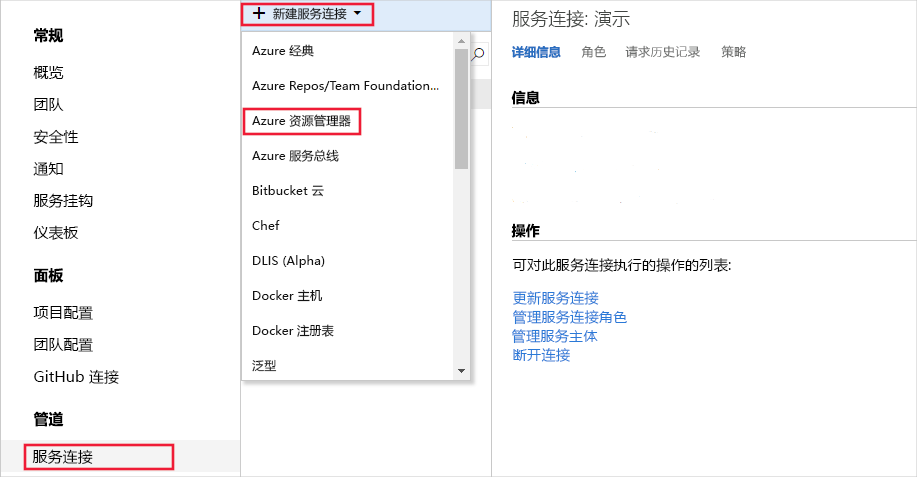
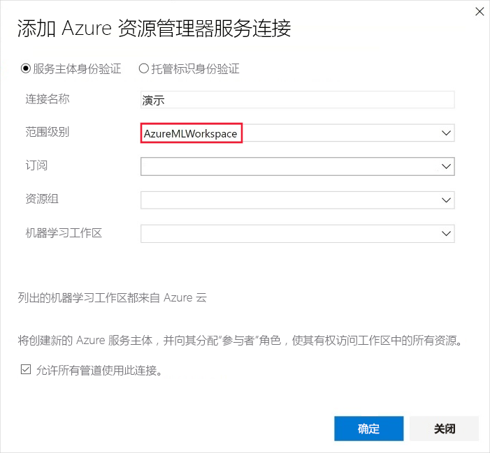
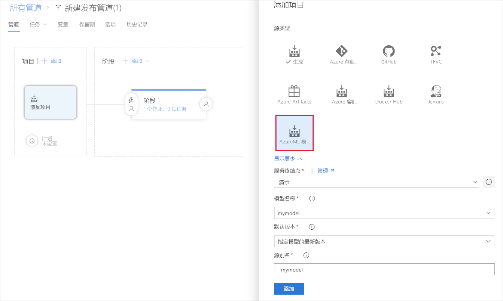
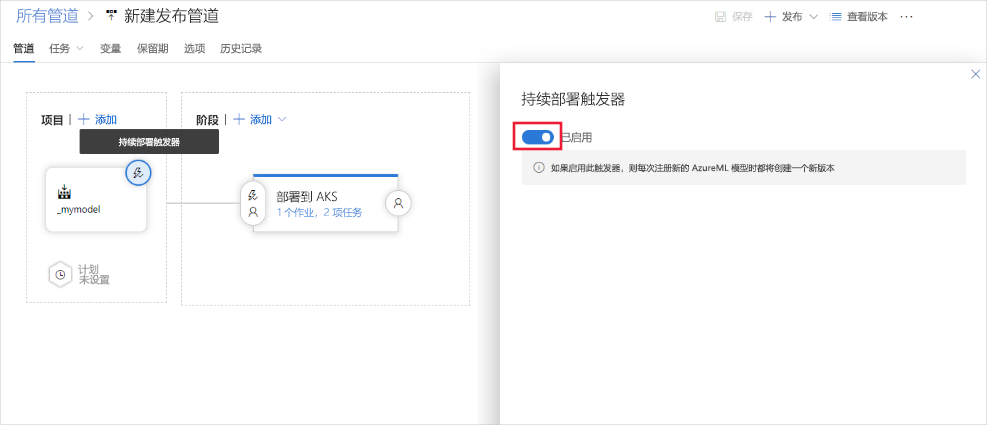

# 连续部署模型

本文介绍如何使用 Azure DevOps 中的持续部署来自动检查新版已注册模型并将这些新模型推送到生产环境中。

## 必备条件

本文假设你已在 Azure 机器学习工作区中注册了一个模型。 有关训练和注册 scikit-learn 模型的示例，请参阅[此教程](how-to-train-scikit-learn.md)。

## 持续部署模型

可以通过使用 [Azure DevOps](https://azure.microsoft.com/services/devops/) 的机器学习扩展来持续部署模型。 如果在 Azure 机器学习工作区中注册了新的机器学习模型，则可以使用 Azure DevOps 的机器学习扩展来触发部署管道。

1. 注册 [Azure Pipelines](https://docs.microsoft.com/azure/devops/pipelines/get-started/pipelines-sign-up?view=azure-devops)，它能将应用程序持续集成和交付到任何平台或云。 （请注意，Azure Pipelines 不同于[机器学习管道](concept-ml-pipelines.md#compare)。）

1. [创建 Azure DevOps 项目。](https://docs.microsoft.com/azure/devops/organizations/projects/create-project?view=azure-devops)

1. 安装 [Azure Pipelines 的机器学习扩展](https://marketplace.visualstudio.com/items?itemName=ms-air-aiagility.vss-services-azureml&targetId=6756afbe-7032-4a36-9cb6-2771710cadc2&utm_source=vstsproduct&utm_medium=ExtHubManageList)。

1. 使用服务连接设置与 Azure 机器学习工作区的服务主体连接，以便访问你的项目。 转到项目设置，选择“服务连接”，然后选择“Azure 资源管理器”**** ****：

    

1. 在“范围级别”列表中选择“AzureMLWorkspace”，然后输入其余值**** ****：

    

1. 若要使用 Azure Pipelines 持续部署机器学习模型，请在管道下选择“发布”****。 添加新项目，然后选择之前创建的“AzureML 模型”项目以及服务连接****。 选择模型和版本以触发部署：

    

1. 对模型项目启用模型触发器。 如果开启触发器，则每次在工作区中注册该模型的指定版本（即最新版本）时，都将触发 Azure DevOps 发布管道。

    

## 后续步骤

查看 GitHub 上的以下项目，了解有关 ML 模型的持续部署的更多示例。

* [Microsoft/MLOps](https://github.com/Microsoft/MLOps)
* [Microsoft/MLOpsPython](https://github.com/microsoft/MLOpsPython)