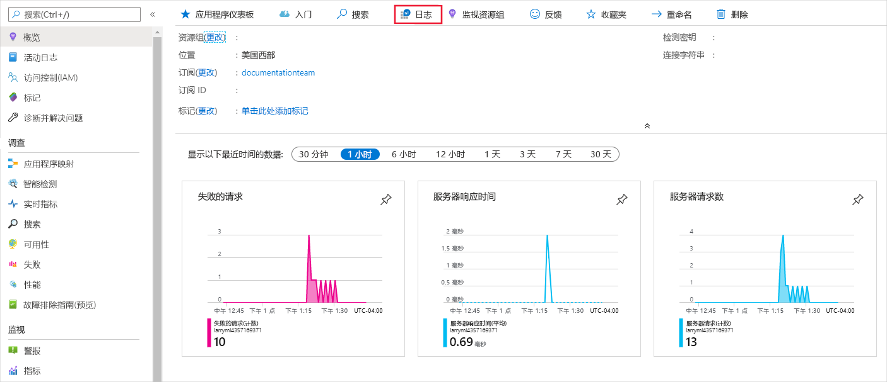
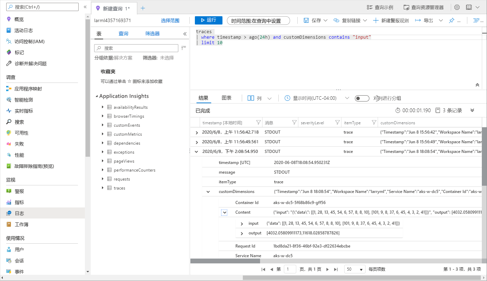

# <a name="monitor-and-collect-data-from-ml-web-service-endpoints"></a>监视和收集 ML web 服务终结点中的数据
[!INCLUDE [applies-to-skus](../../includes/aml-applies-to-basic-enterprise-sku.md)]

本文介绍如何在 Azure Kubernetes Service （AKS）或 Azure 容器实例（ACI）中从部署到 web 服务终结点的数据收集和监视模型，方法是通过启用 Azure 应用程序 Insights 
* [Azure 机器学习 Python SDK](#python)
* https://ml.azure.com [Azure 机器学习 studio](#studio)

除了收集终结点的输出数据和响应外，还可以监视：

* 请求速率、响应时间和失败率
* 依赖项速率、响应时间和失败率
* 例外

[详细了解 Azure 应用程序 Insights](../azure-monitor/app/app-insights-overview.md)。 


## <a name="prerequisites"></a>必备条件

* 如果没有 Azure 订阅，请在开始操作前先创建一个免费帐户。 立即试用 [Azure 机器学习的免费版或付费版](https://aka.ms/AMLFree)

* 已安装 Azure 机器学习工作区、一个包含脚本的本地目录以及用于 Python 的 Azure 机器学习 SDK。 若要了解如何获取这些必备组件，请参阅[如何配置开发环境](how-to-configure-environment.md)

* 要部署到 Azure Kubernetes 服务 (AKS) 或 Azure 容器实例 (ACI) 的经过训练的机器学习模型。 如果没有，请参阅[训练图像分类模型](tutorial-train-models-with-aml.md)教程

## <a name="web-service-metadata-and-response-data"></a>Web 服务元数据和响应数据

>[!Important]
> Azure 应用程序 Insights 只记录最多64kb 的负载。 如果达到此限制，则只记录模型的最新输出。 

与 web 服务元数据和模型的预测对应的服务的元数据和响应记录到消息 `"model_data_collection"`下的 Azure 应用程序 Insights 跟踪。 可以直接查询 Azure 应用程序 Insights 以访问此数据，或设置[连续导出](https://docs.microsoft.com/azure/azure-monitor/app/export-telemetry)到存储帐户，以便进行更长的保留或进一步处理。 然后，可以在 Azure 机器学习中使用模型数据来设置标签、重新训练、explainability、数据分析或其他用途。 

<a name="python"></a>

## <a name="use-python-sdk-to-configure"></a>使用 Python SDK 进行配置 

### <a name="update-a-deployed-service"></a>更新已部署的服务

1. 在工作区中标识该服务。 `ws` 的值是你的工作区的名称

    ```python
    from azureml.core.webservice import Webservice
    aks_service= Webservice(ws, "my-service-name")
    ```
2. 更新服务并启用 Azure 应用程序 Insights

    ```python
    aks_service.update(enable_app_insights=True)
    ```

### <a name="log-custom-traces-in-your-service"></a>在服务中记录自定义跟踪

如果要记录自定义跟踪，请遵循[部署方式和部署位置](how-to-deploy-and-where.md)文档中适用于 AKS 或 ACI 的标准部署过程。 然后，使用以下步骤：

1. 通过添加 print 语句更新计分文件
    
    ```python
    print ("model initialized" + time.strftime("%H:%M:%S"))
    ```

2. 更新服务配置
    
    ```python
    config = Webservice.deploy_configuration(enable_app_insights=True)
    ```

3. 生成一个映像并将其部署在[AKS 或 ACI](how-to-deploy-and-where.md)上。

### <a name="disable-tracking-in-python"></a>在 Python 中禁用跟踪

若要禁用 Azure 应用程序 Insights，请使用以下代码：

```python 
## replace <service_name> with the name of the web service
<service_name>.update(enable_app_insights=False)
```

<a name="studio"></a>

## <a name="use-azure-machine-learning-studio-to-configure"></a>使用 Azure 机器学习 studio 配置

当你准备好使用这些步骤部署模型时，还可以从 Azure 机器学习 studio 启用 Azure 应用程序 Insights。

1. 在 https://ml.azure.com/ 登录到工作区
1. 中转到**模型**并选择要部署的模型
1. 选择 **+ 部署**
1. 填充**部署模型**表单
1. 展开 "**高级**" 菜单

    
1. 选择 "**启用 Application Insights 诊断和数据收集**"

    
## <a name="evaluate-data"></a>评估数据
你的服务数据存储在与 Azure 机器学习相同的资源组中的 Azure 应用程序 Insights 帐户中。
查看数据：

1. 在[Azure 门户](https://ms.portal.azure.com/)中转到 Azure 机器学习工作区，然后单击 Application Insights 链接

    [](././media/how-to-enable-app-insights/AppInsightsLoc.png#lightbox)

1. 选择 "**概览**" 选项卡以查看服务的一组基本指标

   [](././media/how-to-enable-app-insights/overview.png#lightbox)

1. 若要查看 web 服务请求元数据和响应，请在 "**日志（Analytics）** " 部分中选择 "**请求**" 表，并选择 "**运行**" 以查看请求

   [](././media/how-to-enable-app-insights/model-data-trace.png#lightbox)


3. 若要查看自定义跟踪，请选择 "**分析**"
4. 在架构部分，选择“跟踪”。 然后选择“运行”以运行查询。 数据应以表格格式显示，并应映射到计分文件中的自定义调用

   [](././media/how-to-enable-app-insights/logs.png#lightbox)

若要了解有关如何使用 Azure 应用程序 Insights 的详细信息，请参阅[什么是 Application Insights？](../azure-monitor/app/app-insights-overview.md)。

## <a name="export-data-for-further-processing-and-longer-retention"></a>导出数据以进行进一步的处理和更长的保留期

>[!Important]
> Azure 应用程序 Insights 仅支持导出到 blob 存储。 此导出功能的其他限制在[从 App Insights 导出遥测](https://docs.microsoft.com/azure/azure-monitor/app/export-telemetry#continuous-export-advanced-storage-configuration)中列出。

可以使用 Azure 应用程序 Insights 的[连续导出](https://docs.microsoft.com/azure/azure-monitor/app/export-telemetry)将消息发送到受支持的存储帐户，在该帐户中可以设置更长的保留期。 `"model_data_collection"` 消息以 JSON 格式存储，并且可以轻松地进行分析以提取模型数据。 

可以根据需要使用 azure 数据工厂、Azure ML 管道或其他数据处理工具来转换数据。 转换数据后，可以将其作为数据集注册到 Azure 机器学习工作区。 为此，请参阅[如何创建和注册数据集](how-to-create-register-datasets.md)。

   [](././media/how-to-enable-app-insights/continuous-export-setup.png)


## <a name="example-notebook"></a>示例笔记本

[Ipynb](https://github.com/Azure/MachineLearningNotebooks/blob/master/how-to-use-azureml/deployment/enable-app-insights-in-production-service/enable-app-insights-in-production-service.ipynb)笔记本展示了这篇文章中的概念的概念。 
 
[!INCLUDE [aml-clone-in-azure-notebook](../../includes/aml-clone-for-examples.md)]

## <a name="next-steps"></a>后续步骤

* 了解[如何将模型部署到 Azure Kubernetes Service 群集](https://docs.microsoft.com/azure/machine-learning/how-to-deploy-azure-kubernetes-service)，或者[如何将模型部署到 azure 容器实例](https://docs.microsoft.com/azure/machine-learning/how-to-deploy-azure-container-instance)，以将模型部署到 web 服务终结点，并启用 Azure 应用程序 Insights 来利用数据收集和终结点监视
* 请参阅[MLOps： Azure 机器学习的管理、部署和监视模型](https://docs.microsoft.com/azure/machine-learning/concept-model-management-and-deployment)，详细了解如何利用生产中的模型收集的数据。 此类数据可帮助不断改进机器学习过程
