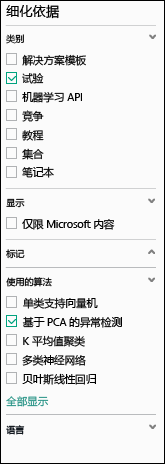
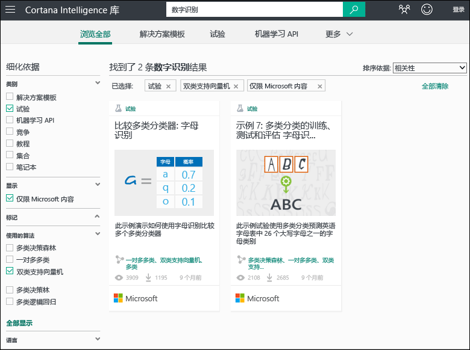
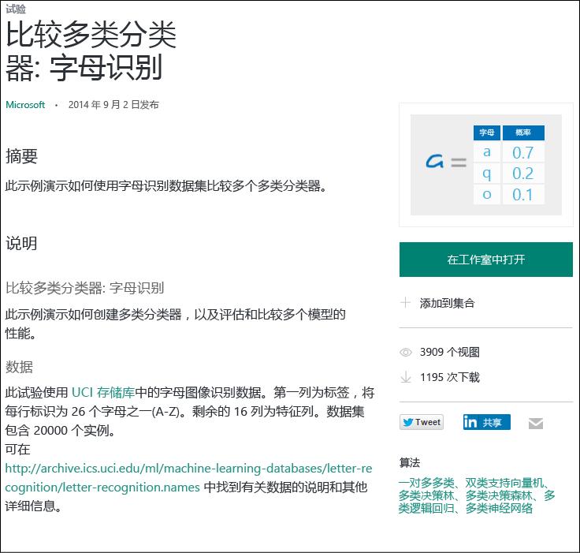

# 复制示例试验以创建新的机器学习试验
了解如何从“ [Cortana Intelligence 库](https://gallery.cortanaintelligence.com/) ”启动示例试验，而不是从头开始创建机器学习试验。 你可以使用这些示例构建自己的机器学习解决方案。

在这个库中，存有 Microsoft Azure 机器学习团队提供的示例试验，以及由机器学习社区共享的示例。 此外，你还可以提出问题或发布有关试验的评论。

若要了解如何使用此库，请观看[适合初学者的数据科学](machine-learning-data-science-for-beginners-the-5-questions-data-science-answers.md)系列中 3 分钟的视频[复制其他人的工作来进行数据科学](machine-learning-data-science-for-beginners-copy-other-peoples-work-to-do-data-science.md)。

[!INCLUDE [machine-learning-free-trial](../../includes/machine-learning-free-trial.md)]

## 在 Cortana Intelligence 库中查找要复制的试验
若要查看哪些试验可用，请转到“ [库](https://gallery.cortanaintelligence.com/) ”，然后单击页面顶部的“ **试验** ”。

### 查找最新或最受欢迎的试验
在此页上，可以查看**最近添加**的试验，或向下滚动查看**热门**或最新的**热门 Microsoft 试验**。

### 查找满足特定要求的试验
若要浏览所有试验︰

1. 请单击页面顶部的“ **浏览全部** ”。
2. 在“类别”部分的“优化依据”下，选择“试验”以查看库中的所有试验。
3. 你可以通过多种方式找到满足要求的试验︰
   * **选择左侧的筛选器。** 例如，若要浏览使用基于 PCA 的异常情况检测算法的试验，可选择“类别”下的“试验”，以及“使用的算法”下的“基于 PCA 的异常情况检测”。 （如果看不到该算法，请单击列表底部的“全部显示”。）  
     
   * **使用搜索框。** 例如，若要查找由 Microsoft 提供且与使用双类支持向量机算法的数字识别相关的试验，请在搜索框中输入“数字识别”。 然后，选择筛选器“试验”、“仅限 Microsoft 内容”和“双类支持向量机”：  
     
4. 单击一个试验以了解其更多相关信息。
5. 若要运行和/或修改试验，请在试验的页面上单击“ **在工作室中打开** ”。   

    

    > [!NOTE]
    > 首次在机器学习工作室中打开一个试验时，可以免费尝试，也可以购买 Azure 订阅。 [了解机器学习工作室免费试用版和付费服务版](https://azure.microsoft.com/pricing/details/machine-learning/)
    >
    >

## 在机器学习工作室中使用模板
你还可以使用库中的示例作为模板在机器学习工作室中创建新试验。

1. 使用 Microsoft 帐户凭据登录到[工作室](https://studio.azureml.net)，然后单击“新建”以创建新试验。
2. 浏览示例内容并单击其中一个。

使用该示例试验作为模板，在工作区中创建一个新试验。

## 后续步骤
* [从各种源导入数据](machine-learning-data-science-import-data.md)
* [适用于机器学习的 R 语言快速入门教程](machine-learning-r-quickstart.md)
* [部署机器学习 Web 服务](machine-learning-publish-a-machine-learning-web-service.md)

