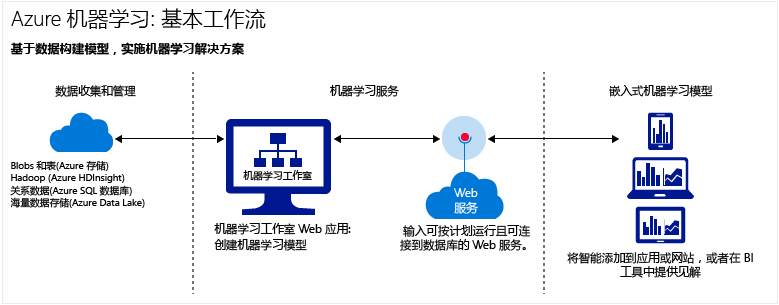

# 云中的机器学习简介
## 什么是机器学习？
机器学习是一项数据科研技术，可帮助计算机从现有的数据中学习，预测将来的行为、结果和趋势。  

机器学习的这种预测可让应用和设备变得更聪明。 在网上购物时，机器学习可根据购买的产品帮助推荐其他产品。 刷信用卡时，机器学习可将这笔交易与交易数据库进行比较，帮助检测诈骗。 当吸尘器机器人打扫房间时，机器学习可帮助它确定作业是否已完成。

有关简短概述，请观看 [Data Science for Beginners](machine-learning-data-science-for-beginners-the-5-questions-data-science-answers.md)（适合初学者的数据科研）系列视频。 “Data Science for Beginners”（适合初学者的数据科学）介绍了机器学习，并逐步讲解了一个简单的预测模型，整篇文章未使用行语或数学理论。

## 什么是 Microsoft Azure 云中的机器学习？
Azure 机器学习是基于云的强大预测分析服务，使用它可以快速创建预测模型，并将其部署为分析解决方案。 使用 Azure 云运行机器学习试验或构建解决方案时，不需要购买昂贵的硬件或基础结构。

Azure 机器学习不仅提供预测分析建模工具，还提供完全托管的服务，可以通过此服务将预测模型部署为随时可用的 Web 服务。 Azure 机器学习提供可在云中创建完整预测分析解决方案的工具：可以快速创建、测试、操作和管理预测模型。

[!INCLUDE [machine-learning-free-trial](../../includes/machine-learning-free-trial.md)]

## 什么是预测分析？
预测分析使用称为算法的各种数学公式分析以往或当前的数据，找到模式或趋势，以便预测将来的事件。

Azure 机器学习是特别强大的预测分析方式：可以使用现成的算法库，在连接到 Internet 的电脑上使用算法创建模型，快速部署预测解决方案。 若要快速入门，可以从 [Cortana Intelligence 库](http://gallery.cortanaintelligence.com/)中的现成示例和解决方案着手。

## 在云中构建完整的机器学习解决方案
Azure 机器学习具有在云中创建预测分析解决方案所需的一切功能，从大型算法库、用于构建模型的 Studio，到可将模型部署为 Web 服务的简单方法。

### 机器学习工作室：创建预测模型
在 [机器学习工作室](machine-learning-what-is-ml-studio.md)中，可以通过拖放和连接模块快速创建预测模型。 可以轻松试验不同的组合，并且这种试验都是 [免费](https://studio.azureml.net/?selectAccess=true&o=2)的。

* 在 [Cortana Intelligence 库](machine-learning-gallery-how-to-use-contribute-publish.md)中，可以尝试其他人编写的分析解决方案，或者提供自己的解决方案。 在社区发表关于试验的问题或看法，或者通过 LinkedIn 和 Twitter 等社交网络分享试验的链接。
  
  
* 在机器学习工作室中使用 [机器学习算法和模块](https://msdn.microsoft.com/library/azure/f5c746fd-dcea-4929-ba50-2a79c4c067d7) 大型库立即开始创建预测模型。 从示例试验、R 和 Python 包，以及 Xbox 和 Bing 等 Microsoft 业务的一流算法中选择。 使用自定义的 [R](machine-learning-r-quickstart.md) 和 [Python](machine-learning-execute-python-scripts.md) 脚本扩展工作室模块。
  
  

### 操作预测分析解决方案：购买 Web 服务或发布自己的服务
* 从 [Microsoft Azure 应用商店](https://datamarket.azure.com/browse?query=machine+learning)购买现成的 Web 服务，例如推荐、文本分析和异常检测。
* 操作预测分析模型：
  
  * [部署 Web 服务](machine-learning-publish-a-machine-learning-web-service.md)
  * [通过 API 训练和重新训练模型](machine-learning-retrain-models-programmatically.md)
  * [管理 Web 服务终结点](machine-learning-create-endpoint.md)
  * [缩放 Web 服务](machine-learning-scaling-webservice.md)
  * [使用 Web 服务](machine-learning-consume-web-services.md)

## 机器学习的重要术语和概念
机器学习的术语有点难懂。 下面提供了重要术语的定义。 可以使用下面的“意见”部分告诉我们还要阐释哪些术语。

### 数据探索、描述性分析和预测分析
**数据探索** 是收集大量的、通常是非结构化的数据集的相关信息，找到要重点分析的特征的过程。 **数据挖掘** 指自动化的数据探索。

**描述性分析** 是分析数据集以汇总事件的过程。 大多数商业分析（例如销售报表、Web 指标和社交网络分析）都具有描述性。

**预测分析** 是从历史数据或当前数据构建模型，以预测将来结果的过程。

### 监督式和非监督式学习
 **监督式学习** 算法使用带有标签的数据（即，包含所需示例答案的数据）进行训练。 例如，识别信用卡盗用的模型，是通过包含已知诈骗收费和有效收费标记数据点的数据集训练的。 大多数机器学习都是监督式的。

 **非监督式学习** 用于不带标签的数据，目标是查找数据中的关系。 例如，可以查找具有类似消费习惯的客户人口统计信息。

### 模型训练和评估
机器学习模型将尝试回答的问题或要预测的结果抽象化。 模型是通过现有数据训练和评估的。

#### 训练数据
通过数据训练模型时，将使用已知数据集，基于数据特征进行模型调整，以求获得最准确的结果。 在 Azure 机器学习中，模型是通过处理训练数据和功能模块（例如评分模块）的算法模块构建的。

在监督式学习中，如果要训练诈骗检测模型，可以使用一组标记为诈骗或有效的交易。 随机拆分数据集，然后使用一部分数据训练模型，使用另一部分测试或评估模型。

#### 评估数据
训练模型后，使用剩余测试数据来评估模型。 使用已经知道结果的数据，判断模型的预测是否准确。

## 其他常见的机器学习术语
* **算法**：通过数据处理、数学计算或自动推理来解决问题的一组独立规则。
* **异常检测**：标记异常的事件或值，帮助发现问题的模型。 例如，信用卡诈骗检测可以查找异常的购买活动。
* **分类数据**：按类别组织的、可分组的数据。 例如，汽车的分类数据集可以指定年份、制造商、车型和价格。
* **分类**：根据类别分组已知的数据集，将数据点组织成不同类别的模型。
* **特征工程**：提取或选择与数据集相关的特征，以便增强数据集并改善结果的过程。 例如，机票价格数据可通过星期几和假日来增强。 请参阅 [Feature selection and engineering in Azure Machine Learning](machine-learning-feature-selection-and-engineering.md)（Azure 机器学习中的特征选择和工程）。
* **模块**：机器学习工作室模型中的功能组件，例如，用于输入和编辑小型数据集的“输入数据”模块。 算法也是机器学习工作室中的一种模块。
* **模型**：监督式学习模型是机器学习试验的产物，其中包含训练数据、算法模块，以及功能模块（例如“评分模型”模块）。
* **数值数据**：表示度量值（连续数据）或计数（离散数据）的数据。 也名为 *量化数据*。
* **分区**：将数据拆分成多个样本的方法。 有关详细信息，请参阅 [Partition and Sample](https://msdn.microsoft.com/library/azure/dn905960.aspx) （分区和采样）。
* **预测**：预测是来自机器学习模型的一个或多个预测值。 有时称为“预测评分”。 但是，预测评分不是模型的最终输出。 评分之后还要评估模型。
* **回归**：根据独立变量预测值的模型，例如根据汽车的年份和制造商预测汽车价格。
* **评分**：使用机器学习工作室中的 [“评分模型”模块](https://msdn.microsoft.com/library/azure/dn905995.aspx) ，从训练分类或回归模型生成的预测值。 分类模型也返回预测值的机率评分。 从模型生成分数之后，即可使用 [“评估模型”模块](https://msdn.microsoft.com/library/azure/dn905915.aspx)来评估模型的准确性。
* **样本**：用于代表整体的一部分数据集。 可以随机采样，或根据数据集的具体特征采样。

## 后续步骤
可以使用[分步指南](machine-learning-create-experiment.md)和[基于样本的构建](machine-learning-sample-experiments.md)了解预测分析和机器学习的基础知识。  

<!-- Module References -->
[learning-with-counts]: https://msdn.microsoft.com/library/azure/81c457af-f5c0-4b2d-922c-fdef2274413c/

<!--HONumber=Nov16_HO2-->

