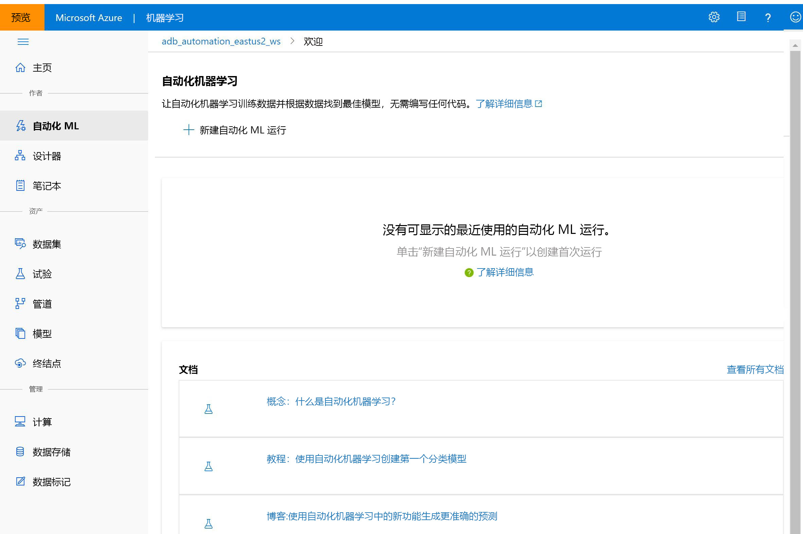

# 什么是 Azure 机器学习？

在本文中，你将了解 Azure 机器学习，这是一种基于云的环境，你可以使用它来训练、部署、自动化、管理和跟踪 ML 模型。 

Azure 机器学习可用于任何类型的机器学习，从传统 ml 到深度学习、监督式和非监督式学习。 无论你是否希望编写 Python 或 R 代码或零代码/低代码选项（如[设计器](tutorial-designer-automobile-price-train-score.md)），你都可以在 Azure 机器学习工作区中构建、训练和跟踪非常准确的机器学习和深度学习模型。 

开始在本地计算机上训练，然后横向扩展到云。 

此服务还与常用的深度学习和强化学习开放源代码工具（如 PyTorch、TensorFlow、scikit-learn 和 Ray RLlib）进行互操作。 

> [!VIDEO https://channel9.msdn.com/Events/Connect/Microsoft-Connect--2018/D240/player]

> [!Tip]
> **免费试用！**  如果没有 Azure 订阅，请在开始之前创建一个免费帐户。 立即试用[免费版或付费版 Azure 机器学习](https://aka.ms/AMLFree)。 你将获得可用于 Azure 服务的赠送额度。 额度用完后，可以保留该帐户并继续使用[免费的 Azure 服务](https://azure.microsoft.com/free/)。 除非显式更改设置并要求付费，否则不会对信用卡收取任何费用。

## 什么是机器学习？

机器学习是一项数据科研技术，可以让计算机根据现有的数据来预测将来的行为、结果和趋势。 使用机器学习，计算机可以在不需显式编程的情况下进行学习。

机器学习的预测可让应用和设备变得更聪明。 例如，在网上购物时，机器学习可根据购买的产品帮助推荐其他产品。 或者，在刷信用卡时，机器学习可将这笔交易与交易数据库进行比较，帮助检测诈骗。 当吸尘器机器人打扫房间时，机器学习可帮助它确定作业是否已完成。

## 适用于每个任务的机器学习工具 

Azure 机器学习为其机器学习工作流提供了开发人员和数据科学家所需的所有工具，包括：
+ [Azure 机器学习设计器](tutorial-designer-automobile-price-train-score.md)（预览版）：拖放模块以生成实验，然后部署管道。

+ Jupyter 笔记本：使用我们的[示例笔记本](https://aka.ms/aml-notebooks)或创建自己的笔记本，以利用<a href="https://docs.microsoft.com/python/api/overview/azure/ml/intro?view=azure-ml-py" target="_blank">适用于 Python 的 SDK</a> 示例进行机器学习。 

+ R 脚本或笔记本，其中你使用<a href="https://azure.github.io/azureml-sdk-for-r/reference/index.html" target="_blank">适用于 R 的 SDK</a> 编写自己的代码，或使用设计器中的 R 模块。

+ [Visual Studio Code 扩展](tutorial-setup-vscode-extension.md)

+ [机器学习 CLI](reference-azure-machine-learning-cli.md)

+ 使用开放源代码框架，如 PyTorch、TensorFlow 和 scikit-learn 等

+ 与 Ray RLlib 互操作的[强化学习](how-to-use-reinforcement-learning.md)

甚至可以使用 [MLflow 跟踪指标并部署模型](how-to-use-mlflow.md)或使用 Kubeflow [生成端到端工作流管道](https://www.kubeflow.org/docs/azure/)。

## 在 Python 或 R 中生成 ML 模型

开始使用 Azure 机器学习 <a href="https://docs.microsoft.com/python/api/overview/azure/ml/intro?view=azure-ml-py" target="_blank">Python SDK</a> 或 <a href="https://azure.github.io/azureml-sdk-for-r/reference/index.html" target="_blank">R SDK</a> 在本地计算机上训练。 然后，横向扩展到云。 

借助许多可用的[计算目标](how-to-set-up-training-targets.md)（例如 Azure 机器学习计算和 [Azure Databricks](/azure/azure-databricks/what-is-azure-databricks)）以及[高级超参数优化服务](how-to-tune-hyperparameters.md)，可以利用云的强大功能更快地生成更好的模型。

也可使用 SDK [自动完成模型训练和优化](tutorial-auto-train-models.md)。

## 使用无代码工具生成 ML 模型

对于无代码或低代码训练和部署，请尝试：

+ **Azure 机器学习设计器（预览版）**

  使用设计器可在不编写任何代码的情况下准备数据、训练、测试、部署、管理和跟踪机器学习模型。 不需要编程，只需以可视方式连接数据集和模块即可构建模型。 尝试[设计器教程](tutorial-designer-automobile-price-train-score.md)。

  有关详细信息，请参阅 [Azure 机器学习设计器概述文章](concept-designer.md)。 

  

+ **自动化机器学习 UI**

  了解如何在易于使用的界面中创建[自动化 ML 试验](tutorial-first-experiment-automated-ml.md)。 

  

## MLOps：部署和生命周期管理
有了正确的模型以后，即可轻松地将其用在 Web 服务中、IoT 设备上或 Power BI 中。 有关详细信息，请参阅有关[部署方式及位置](how-to-deploy-and-where.md)的文章。

然后，可以使用[适用于 Python 的 Azure 机器学习 SDK](https://aka.ms/aml-sdk)、[Azure 机器学习工作室](https://ml.azure.com)或[机器学习 CLI](reference-azure-machine-learning-cli.md) 来管理已部署的模型。

可以使用这些模型[实时](how-to-consume-web-service.md)返回预测，或者在有大量数据的情况下[异步](how-to-use-parallel-run-step.md)返回预测。

使用高级[机器学习管道](concept-ml-pipelines.md)，可以在每一步（从数据准备、模型训练和评估一直到部署）进行协作。 使用 Pipelines 可以：

* 自动完成云中的端到端机器学习过程
* 重用组件并仅在需要时重新运行步骤
* 在每个步骤中使用不同的计算资源
* 运行批量评分任务

如果要使用脚本自动执行机器学习工作流，[机器学习 CLI](reference-azure-machine-learning-cli.md) 提供了执行常见任务（如提交训练运行或部署模型）的命令行工具。

若要开始使用 Azure 机器学习，请参阅[后续步骤](#next-steps)。

## 与其他服务集成

Azure 机器学习可与 Azure 平台上的其他服务配合使用，还能与诸如 Git 和 MLFlow 之类的开源工具集成。

+ 如 __Azure Kubernetes 服务__、__Azure 容器实例__、__Azure Databricks__、__Azure Data Lake Analytics__和 __Azure HDInsight__ 这样的计算目标。 有关计算目标的详细信息，请参阅[什么是计算目标？](concept-compute-target.md)。
+ __Azure 事件网格__。 有关详细信息，请参阅[使用 Azure 机器学习事件](concept-event-grid-integration.md)。
+ __Azure Monitor__。 有关详细信息，请参阅[监视 Azure 机器学习](monitor-azure-machine-learning.md)。
+ 如 __Azure 存储帐户__、__Azure Data Lake Storage__、__Azure SQL 数据库__、__Azure Database for PostgreSQL__ 和 __Azure 开放数据集__ 这样的数据存储。 有关详细信息，请参阅[访问 Azure 存储服务中的数据](how-to-access-data.md)和[使用 Azure 开放数据集创建数据集](how-to-create-register-datasets.md#create-datasets-with-azure-open-datasets)。
+ __Azure 虚拟网络__。 有关详细信息，请参阅[虚拟网络中的安全试验和推理](how-to-enable-virtual-network.md)。
+ __Azure Pipelines__。 有关详细信息，请参阅[定型和部署机器学习模型](/azure/devops/pipelines/targets/azure-machine-learning)。
+ __Git 存储库日志__。 有关详细信息，请参阅 [Git 集成](concept-train-model-git-integration.md)。
+ __MLFlow__。 有关详细信息，请参阅[使用 MLflow 跟踪指标并部署模型](how-to-use-mlflow.md) 
+ __Kubeflow__。 有关详细信息，请参阅[构建端到端工作流管道](https://www.kubeflow.org/docs/azure/)。

### 安全通信

Azure 存储帐户、计算目标和其他资源可在虚拟网络内安全地用于定型模型并执行推理。 有关详细信息，请参阅[虚拟网络中的安全试验和推理](how-to-enable-virtual-network.md)。

## Basic 和 Enterprise Edition

Azure 机器学习提供了两个版本，专为你的机器学习需求提供：
+ Basic（正式版）
+ Enterprise（预览版）

这些版本确定开发人员和数据科学家的工作区中可用的机器学习工具。   

Basic 工作区允许继续使用 Azure 机器学习，并只为在机器学习过程中使用的 Azure 资源付费。 Enterprise Edition 工作区只对其 Azure 使用情况收费，它是预览版。 若要详细了解 Azure 机器学习中提供的内容，请参阅[版本概述和定价页](https://azure.microsoft.com/pricing/details/machine-learning/)。 

你始终可以在创建工作区时分配版本。 而且，预先存在的工作区已转换为 Basic Edition。 Basic Edition 包括已于 2019 年 10 月公开发布的所有功能。 使用 Enterprise Edition 功能构建的工作区中的任何试验都将以只读模式继续供你使用，直至升级到 Enterprise。 了解如何[将 Basic 工作区升级到 Enterprise Edition](how-to-manage-workspace.md#upgrade)。 

客户负责在此期间因计算和其他 Azure 资源产生的成本。

## 后续步骤

- 通过首选方法创建首个试验：
  + [使用 Python 笔记本训练和部署 ML 模型](tutorial-1st-experiment-sdk-setup.md)
  + [使用 R Markdown 训练和部署 ML 模型](tutorial-1st-r-experiment.md) 
  + [使用自动化机器学习训练和部署 ML 模型](tutorial-first-experiment-automated-ml.md) 
  + [使用设计器的拖放功能进行训练和部署](tutorial-designer-automobile-price-train-score.md) 
  + [使用机器学习 CLI 训练和部署模型](tutorial-train-deploy-model-cli.md)

- 了解[机器学习管道](concept-ml-pipelines.md)，以便生成、优化和管理机器学习方案。

- 阅读深入的 [Azure 机器学习体系结构和概念](concept-azure-machine-learning-architecture.md)文章。
